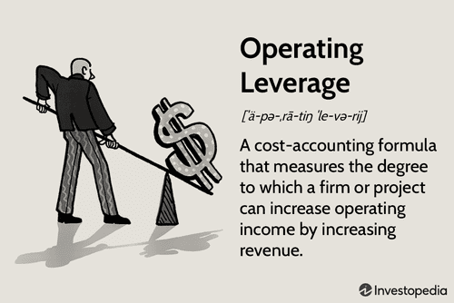

Leverage plays a pivotal role in financial analysis, serving as a critical tool that allows businesses and investors to amplify their potential returns. At its core, leverage involves the use of various financial instruments or borrowed capital to increase the potential return on investment. Understanding leverage is essential for comprehending how firms structure their capital and operations to optimize outcomes and manage risks.

Leverage can be broadly categorized into two types: financial leverage and operating leverage. Financial leverage pertains to the use of debt to acquire additional assets, with the fundamental goal of increasing a company's return on equity (ROE). It influences a company's capital structure by showing how much of the company's assets are financed by debt versus equity. While higher financial leverage can lead to significantly enhanced returns when the firm performs well, it also introduces the risk of exacerbated losses if the investment does not yield the expected returns.

Operating leverage, on the other hand, relates to the proportion of fixed costs in a company's operational structure. Companies with high operating leverage have a large proportion of fixed costs, which means that a change in sales volume can lead to a relatively larger change in operating income. This magnification effect can be advantageous in good times by boosting profitability; however, during downturns, it can also result in steeper declines in earnings.

Algorithmic trading, a practice where computers execute orders based on pre-set instructions or algorithms, has become increasingly prevalent in financial markets. Leverage is integral to this domain, as traders use borrowed capital to enhance potential gains from their trading strategies. By leveraging their equity, traders can establish larger positions than would be possible with only their own funds, thereby magnifying both potential returns and the associated risks.

This article aims to explore the complexities and applications of leverage, offering insights into both financial and operating leverage, as well as examining the interplay between leverage and algorithmic trading. By dissecting these topics, readers will gain a deeper understanding of how leverage functions within financial markets and how it can be strategically utilized to optimize investments and trading strategies.

## Table of Contents

## Understanding Financial Leverage

Financial leverage is a critical concept in financial analysis, referring to the use of borrowed funds to amplify potential returns on investment. By employing financial leverage, companies aim to increase shareholder value, although it also introduces heightened risk due to the obligation to meet debt repayments. Essentially, financial leverage involves the strategic use of debt in a company’s capital structure, allowing a business to invest in operations without immediately sacrificing equity. 

Mathematically, financial leverage can be quantified using the formula:

$$

\text{Financial Leverage Ratio} = \frac{\text{Total Debt}}{\text{Total Equity}} 
$$

### Impact on Capital Structure

Financial leverage significantly impacts a company’s capital structure, which is the mix of equity and debt a firm uses to fund its operations and growth. A more leveraged capital structure implies a higher proportion of debt relative to equity. This can lead to increased earnings per share (EPS) under profitable conditions because the company's earnings are spread across a smaller equity base. However, during periods of lower profitability, the fixed cost of debt can exert pressure on the company, magnifying losses and potentially jeopardizing financial stability.

### Benefits and Risks of High Financial Leverage

The primary benefit of high financial leverage is the potential for enhanced returns on equity. When a company earns more on investments financed with borrowed capital than the cost of the debt, the additional earnings improve shareholder value. This concept is known as a positive leverage effect.

However, high financial leverage carries significant risks. The reliance on borrowed capital increases the company's financial obligations, making it susceptible to [interest rate](/wiki/interest-rate-trading-strategies) changes and increasing the risk of insolvency during economic downturns. Firms must manage the risk of over-leveraging, which can lead to financial distress if debt-servicing capabilities are compromised.

### Industry Examples

Certain industries naturally exhibit higher levels of financial leverage due to their capital-intensive nature. 

1. **Utilities**: The utility sector often employs high leverage, largely because of the significant upfront capital expenditures required for infrastructure. The stability and predictability of cash flows in this sector can support higher debt levels.

2. **Telecommunications**: Similar to utilities, telecommunications firms require substantial investment in infrastructure. They often use debt financing to fund expansion or technological upgrades.

3. **Real Estate**: Real estate companies typically operate with high leverage by using debt to finance property acquisitions. The rationale is that the appreciation of properties and rental income can cover the cost of debt, enhancing returns.

These examples underscore the strategic considerations firms must make when incorporating financial leverage into their capital structures. While leverage can amplify returns, companies must judiciously manage the associated risks to avoid financial distress.

## Delving into Operating Leverage

Operating leverage is a financial concept that measures the proportion of fixed costs in a company's cost structure. It reflects how a company's operating income, also known as EBIT (Earnings Before Interest and Taxes), is affected by changes in sales [volume](/wiki/volume-trading-strategy). The degree of operating leverage (DOL) quantifies this sensitivity and can be expressed mathematically as:

$$

DOL = \frac{\% \text{ change in EBIT}}{\% \text{ change in sales}}
$$

A company with high operating leverage will experience a more significant change in operating income as sales increase or decrease. This is due to the presence of substantial fixed costs, which do not change with the level of production or sales, meaning that any increase in sales translates directly to the bottom line after covering these fixed costs.

The impact of operating leverage on a company’s cost structure is primarily determined by the ratio of fixed to variable costs. Businesses with higher fixed costs relative to variable costs will exhibit higher operating leverage. This means that once fixed costs are covered by sales revenue, each additional unit of sales contributes more significantly to profit, given that variable costs per unit are lower.

There are advantages and disadvantages to high operating leverage. On the positive side, it allows companies to benefit more from increases in sales because of the cost coverage provided by fixed costs. This leads to higher profitability during periods of strong demand. However, the downside is that in times of low sales, the burden of these fixed costs can lead to substantial losses, as fixed costs remain unchanged even when revenue decreases.

Operating leverage varies significantly across different sectors. Industries such as manufacturing and telecommunications often exhibit high operating leverage due to substantial investments in fixed assets and infrastructure, which need to be amortized over significant volumes. Conversely, sectors like retail and services may have lower operating leverage because they tend to have higher variable costs, such as direct labor and inventory, that fluctuate with sales volumes.

In summary, operating leverage is a critical determinant of a company's profitability and risk profile. High operating leverage can maximize returns during periods of increasing sales but can be risky during downturns. Understanding the level of operating leverage present in a business can inform strategic decisions, such as pricing strategies and risk management.

## Financial Leverage vs. Operating Leverage

Financial leverage and operating leverage are two crucial concepts in financial analysis that impact a company's performance and financial strategy. While both types of leverage involve the use of resources to amplify potential returns, they do so in distinct ways, affecting different aspects of a company's financial health.

### Key Differences between Financial and Operating Leverage

**Financial Leverage** refers to the use of borrowed funds (debt) in a company’s capital structure. By employing debt, a company aims to increase its return on equity, assuming that the investment financed by the debt generates a higher return than the cost of the debt itself. Financial leverage is quantified by metrics such as the debt-to-equity ratio or interest coverage ratio.

**Operating Leverage**, on the other hand, deals with the fixed versus variable costs within a company. High operating leverage means that a company has a larger proportion of fixed costs compared to variable costs. As sales volume increases, the fixed costs are spread over more units, lowering the per-unit cost and potentially increasing operating income significantly.

### Impact on Financial Health

**Financial Leverage** can significantly affect a company’s financial health by influencing its risk and return profile. High financial leverage magnifies returns on equity during profitable periods but also increases the risk of bankruptcy during downturns due to higher debt obligations. For example, a company with high financial leverage might experience financial strain if interest rates rise or if it encounters cash flow issues.

**Operating Leverage**, depending on the sales volume, can greatly affect profitability. Companies with high operating leverage benefit more from increased sales as fixed costs remain constant, thus increasing profit margins. However, in times of declining sales, these companies suffer greater percentage drops in earnings, as they cannot easily adjust fixed costs in the short term.

### Scenarios Advantageous for One Type of Leverage

Financial leverage is often more advantageous in stable or growing economic environments where the cost of debt is low, and the company can confidently project adequate cash flows to service the debt. Industries such as utilities and real estate commonly utilize financial leverage due to their predictable cash flows.

Operating leverage is beneficial in industries where high fixed costs are required to maintain competitive advantage, such as technology and manufacturing. In such sectors, increases in production volume or sales can result in substantial profit increases due to the spreading of fixed costs over more units.

### Strategies for Balancing Both

Balancing financial and operating leverage involves a strategic approach to mitigate risks while optimizing potential returns. Companies can adopt several strategies:

1. **Diversification of Revenue Streams**: By diversifying products and services, a company reduces its dependency on specific revenue sources, thereby managing the risks associated with both operating and financial leverage.

2. **Flexible Cost Structures**: Implementing a mix of fixed and variable costs allows companies to adapt more rapidly to changes in demand, thus optimizing operating leverage.

3. **Prudent Debt Management**: Maintaining a healthy balance between debt and equity helps in keeping financial leverage at an optimal level. Companies often aim for a debt ratio that supports their growth prospects while maintaining buffer against economic downturns.

4. **Scenario Planning and Stress Testing**: Regular analysis of different financial scenarios allows companies to predict how changes in sales volume or interest rates might impact their financial health, enabling proactive management of leverage-related risks.

In conclusion, understanding the distinct roles and impacts of financial and operating leverage is vital for sound financial strategy and risk management. By carefully assessing the external economic environment and internal financial health, businesses can tailor their leverage strategies to enhance performance and sustain growth over the long term.

## Role of Leverage in Algorithmic Trading

Algorithmic trading, an integral part of modern financial markets, utilizes computer programs to execute trading strategies at high speeds and volumes, often surpassing human capabilities. By leveraging advanced mathematical models and algorithms, traders can exploit minute price discrepancies across various markets. The main mechanisms of [algorithmic trading](/wiki/algorithmic-trading) involve identifying trading opportunities, executing orders, and managing risk, all with minimal human intervention. 

Leverage plays a crucial role in algorithmic trading, primarily serving to amplify returns. By using borrowed capital, traders can control larger positions than their original investment would allow. This increased exposure can potentially lead to significant profits from small market movements. For example, if a trading algorithm spots a price inefficiency in the market, leverage enables the algorithm to maximize its position, thus amplifying the potential return.

However, there are inherent risks with deploying leverage, especially within algorithmic trading. The primary concern is the potential for losses to be magnified just as much as gains. This necessitates rigorous risk management practices to mitigate adverse outcomes. Key strategies include the use of stop-loss orders, which automatically close out positions at predetermined loss levels, and employing diversified trading strategies to spread risk across various assets or markets.

Moreover, financial institutions often implement leverage limits to reduce the risk of catastrophic losses. Algorithms are designed to adjust leverage dynamically based on the current market [volatility](/wiki/volatility-trading-strategies), ensuring that positions are unwound in a controlled manner during downturns. Backtesting and stress testing are also essential components of a robust risk management framework, allowing traders to evaluate how trading strategies and leverage levels would have performed under different historical market conditions.

Several case studies highlight the successful use of leverage in algorithmic trading. For instance, high-frequency trading firms often rely on leverage to capitalize on fleeting price discrepancies, executing thousands of trades per second. Such firms have demonstrated the potential for substantial profits by combining leverage with state-of-the-art trading algorithms and technology infrastructure.

In summary, leverage is a powerful tool in algorithmic trading that, when used prudently, can significantly amplify returns. Nonetheless, it requires sophisticated risk management practices to safeguard against the enhancement of potential losses. The blending of leverage with cutting-edge algorithms and stringent control measures allows for optimized trading performance in the fast-paced world of financial markets.

## Integrating Leverage into Investment Strategies

Leverage is a powerful tool that investors can utilize to maximize returns on investment strategies. Leverage involves using borrowed funds to increase the potential returns on investment, allowing investors to control a larger amount of money than they personally have available. This approach can amplify gains if investments perform well, but it also magnifies losses if they do not, necessitating a thorough understanding of the associated risks and rewards.

### How Investors Can Use Leverage to Maximize Returns

Investors typically use leverage through instruments such as margin trading, options, and futures contracts. Margin trading involves borrowing funds from a broker to purchase securities, using the investor's existing portfolio as collateral. This allows investors to increase their purchasing power and, consequently, their potential returns.

Options and futures contracts offer another form of leverage, providing investors with the right, but not the obligation, to buy or sell an asset at a predetermined price. These derivatives can significantly amplify the returns on an investment with a relatively small initial outlay.

#### Evaluating Risk versus Reward in Leveraging Investments

The potential for higher returns through leverage comes with proportionate risks. Assessing the risk-reward ratio becomes crucial in leveraged investments. Investors need to evaluate market volatility, [liquidity](/wiki/liquidity-risk-premium) of the leveraged asset, and their own risk tolerance. For example, while leverage can lead to substantial gains in a bullish market, it can also cause significant losses in a bearish environment.

To effectively evaluate risk, investors can employ financial metrics such as the Sharpe Ratio, which measures the return of an investment compared to its risk. Implementing stop-loss orders and diversifying the investment portfolio are additional risk management strategies that can mitigate potential downsides.

### Common Pitfalls and Best Practices for Using Leverage

One of the common pitfalls in leveraging is over-leveraging, which occurs when an investor takes on more debt than they can manage. This can lead to catastrophic losses if the investment does not perform as expected. Market fluctuations can also negatively impact leveraged positions, potentially resulting in margin calls, where brokers demand additional funds or the sale of assets to cover the borrowed amount.

Best practices for leveraging include setting strict borrowing limits, maintaining a diversified portfolio to spread risk, and closely monitoring market conditions. Investors should also consider economic indicators that might affect market stability, such as interest rates and inflation rates, to better anticipate potential risks.

### Case Study: Successful Leverage in Investment

A notable example of leveraging success is George Soros's Quantum Fund. In 1992, Soros famously capitalized on a market opportunity during the Black Wednesday currency crisis in the UK. By leveraging a combination of futures contracts and options, Soros's fund sold short over $10 billion worth of British pounds, betting that the currency was overvalued and would have to devalue. When the UK exited the European Exchange Rate Mechanism and the pound depreciated, the Quantum Fund reaped extraordinary profits, reportedly [earning](/wiki/earning-announcement) over $1 billion in gains.

This case study exemplifies how a well-timed and calculated use of leverage, combined with market insights, can result in substantial financial success. 

In summary, while leverage offers opportunities to enhance investment returns, it requires a strategic approach and careful risk management to avoid potential pitfalls. By adhering to best practices and evaluating the risk-reward balance, investors can effectively integrate leverage into their investment strategies to achieve their financial goals.

## Conclusion

In this article, we explored the multifaceted concept of leverage in financial analysis, focusing on both financial and operating leverage, and their critical roles in shaping a company's financial strategy. Understanding financial leverage is essential as it reveals the degree to which a company is using borrowed funds to finance its operations, thereby affecting its capital structure and risk profile. While it can lead to amplified returns, high financial leverage may also increase vulnerability to market fluctuations, especially in industries where capital expenditures are significant.

Meanwhile, operating leverage highlights how fixed and variable costs impact a company’s profitability. High operating leverage indicates a larger proportion of fixed costs, which can lead to greater profit variability but also higher potential returns when sales volume increases. Each type of leverage offers distinct advantages and challenges, and it is crucial to recognize their impacts across different sectors and economic conditions.

The article also examined the strategic application of leverage in algorithmic trading, where it is a tool to amplify potential returns while emphasizing the need for robust risk management practices to mitigate associated risks. Algorithmic trading showcases how leverage can be purposefully integrated into sophisticated financial strategies.

Looking ahead, leverage will continue to play a pivotal role in trading and investments, especially as financial technologies evolve and markets become more integrated globally. For investors and businesses, mastering the use of leverage is not just about maximizing potential gains but also involves a diligent assessment of associated risks to ensure sustainable financial health.

As a call to action, readers are encouraged to deepen their understanding of both financial and operating leverage, assessing their potential impact and integration into their unique financial strategies. By doing so, they can make informed decisions that align with their risk tolerance and investment goals, thereby optimizing their financial outcomes.

## References & Further Reading

[1]: ["Financial Leverage in the Corporate Capital Structure"](https://www.investopedia.com/articles/investing/111813/optimal-use-financial-leverage-corporate-capital-structure.asp) by Modigliani, F., & Miller, M. H. (1977). The Journal of Finance, 32(1), 261-275.

[2]: ["Corporate Finance: Theory and Practice"](https://www.amazon.com/Corporate-Finance-Practice-Pierre-Vernimmen/dp/1119424488) by Aswath Damodaran

[3]: ["Operating Leverage"](https://www.investopedia.com/terms/o/operatingleverage.asp) from Management Science by Horne, J. C. V., & Wachowicz, J. M. (1992).

[4]: ["Market Volatility"](https://blog.ffreedom.com/market-volatility-explained-key-factors-every-investor-must-know/) by Robert J. Shiller

[5]: ["Algorithmic Trading and DMA: An Introduction to Direct Access Trading Strategies"](https://www.amazon.com/Algorithmic-Trading-DMA-introduction-strategies/dp/0956399207) by Barry Johnson

[6]: ["The Leverage Cycle"](https://en.wikipedia.org/wiki/Leverage_cycle) by John Geanakoplos, National Bureau of Economic Research Working Paper No. 15531

[7]: ["Dynamic Portfolio Choice with Proportional Transaction Costs: The Foreign Exchange Market"](https://papers.ssrn.com/sol3/papers.cfm?abstract_id=4522752) by Steven E. Shreve and Jacqueline G. Scott, Management Science, 1996.

[8]: ["Risk Management and Financial Institutions"](https://www.amazon.com/Management-Financial-Institutions-Wiley-Finance/dp/1119448115) by John C. Hull

[9]: ["The Alchemy of Finance"](https://moneystreetsmart.com/alchemy-of-finance-summary/) by George Soros