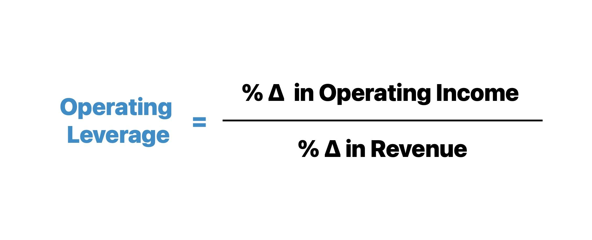

## Table of Contents

## What is operating leverage?

Operating leverage is a measure of how much a company's operating income changes when its sales change. It shows how sensitive a company's profits are to its sales volume. A company with high operating leverage has a large portion of fixed costs in its total costs. This means that if sales increase, the company's profits can grow quickly because the fixed costs stay the same while the revenue increases.

On the other hand, if sales decrease, a company with high operating leverage can see its profits drop sharply because the fixed costs remain the same, but there is less revenue to cover them. Companies with low operating leverage have more variable costs, so their profits are less sensitive to changes in sales volume. Understanding operating leverage helps businesses plan and predict how changes in sales will affect their profits.

## How does operating leverage affect a business?

Operating leverage affects a business by making its profits more sensitive to changes in sales. When a business has high operating leverage, it means a lot of its costs do not change, no matter how much it sells. These are called fixed costs, like rent or salaries. If the business can sell more products, its profits can grow quickly because the extra sales money goes straight to profit after covering the fixed costs. But, if sales go down, the business can lose money fast because it still has to pay those fixed costs even if it is selling less.

On the flip side, a business with low operating leverage has more costs that change with how much it sells. These are called variable costs, like the cost of materials needed to make more products. If sales go up or down, the profits of a business with low operating leverage won't change as much because the costs go up or down with sales. This makes the business's profits more stable but also means that profits won't grow as quickly when sales increase.

Understanding operating leverage is important for a business because it helps them plan for the future. If a business knows it has high operating leverage, it might be more careful about taking risks that could lead to lower sales. If it has low operating leverage, it might be more willing to try new things because its profits are less likely to drop sharply if things don't work out.

## What are the components of operating leverage?

Operating leverage is made up of two main parts: fixed costs and variable costs. Fixed costs are expenses that stay the same no matter how much a business sells. These can include things like rent for a building, salaries for employees, and insurance. When a business has a lot of fixed costs, it has high operating leverage. This means that if the business can sell more, its profits can grow quickly because the extra money from sales goes straight to profit after covering the fixed costs.

Variable costs, on the other hand, are expenses that change based on how much a business sells. These can include the cost of materials needed to make products or the cost of shipping goods to customers. A business with a lot of variable costs has low operating leverage. This means that its profits won't grow as quickly when sales increase, but they also won't drop as fast if sales decrease. Understanding the balance between fixed and variable costs helps a business know how sensitive its profits are to changes in sales.

## How is operating leverage calculated?

Operating leverage is calculated using a formula that shows how much a company's profits can change when its sales change. The formula is: Operating Leverage = Contribution Margin / Net Operating Income. The contribution margin is the money left from sales after paying the variable costs. Net operating income is the profit after all costs, both fixed and variable, have been paid.

To use this formula, you first find the contribution margin by subtracting the total variable costs from the total sales. Then, you find the net operating income by subtracting both the fixed costs and the variable costs from the total sales. Once you have these numbers, you divide the contribution margin by the net operating income. The result tells you how much the company's profits will change for every percent change in sales. A higher number means the company has high operating leverage, and its profits are more sensitive to changes in sales.

## What is the degree of operating leverage (DOL)?

The degree of operating leverage (DOL) is a way to see how much a company's profits can change when its sales change. It's like a measure that tells you how sensitive the company's earnings are to its sales. To find the DOL, you use a formula: DOL = Contribution Margin / Net Operating Income. The contribution margin is what's left from sales after paying the costs that change with how much you sell, like materials. The net operating income is the profit after all costs, both the ones that stay the same and the ones that change, have been paid.

When a company has a high DOL, it means a small change in sales can lead to a big change in profits. This is because the company has a lot of costs that don't change, no matter how much it sells. These fixed costs could be things like rent or salaries. If sales go up, the profits can grow quickly because these fixed costs stay the same, and the extra money from sales goes straight to profit. But if sales go down, the profits can drop fast because the company still has to pay those fixed costs. A low DOL means the company's profits are less sensitive to changes in sales, which can make the business more stable but also means profits won't grow as quickly when sales increase.

## Can you provide an example of how to calculate operating leverage?

Let's say a company sells T-shirts. Last month, they sold 1,000 T-shirts for $10 each, making $10,000 in total sales. The cost to make each T-shirt is $6, so the variable costs were $6,000. The company also has fixed costs of $2,000 for things like rent and salaries. To find the operating leverage, we first calculate the contribution margin. The contribution margin is what's left after paying the variable costs, so it's $10,000 in sales minus $6,000 in variable costs, which equals $4,000. Then, we find the net operating income by subtracting both the fixed costs and the variable costs from the total sales. So, it's $10,000 in sales minus $6,000 in variable costs minus $2,000 in fixed costs, which equals $2,000.

Now, we can calculate the operating leverage by dividing the contribution margin by the net operating income. So, it's $4,000 divided by $2,000, which equals 2. This means the company's operating leverage is 2. This number tells us that if the company's sales increase by 10%, the profits will increase by 20% because of the high operating leverage. If the sales decrease by 10%, the profits will decrease by 20%. This example shows how operating leverage can make a company's profits very sensitive to changes in sales.

## What are the advantages of high operating leverage?

High operating leverage can be good for a business because it means the company can make more profit if it sells more products. When a business has high operating leverage, it has a lot of costs that stay the same no matter how much it sells, like rent or salaries. If the business can sell more, the extra money from those sales goes straight to profit after covering those fixed costs. This can make profits grow quickly. For example, if a company sells more T-shirts, the profit from each extra T-shirt sold is almost all profit because the cost to make the T-shirt is the same, but the money from selling it goes up.

Another advantage of high operating leverage is that it can help a business plan for the future. If a company knows it has high operating leverage, it can focus on increasing sales to make more profit. This might mean spending more on marketing or trying to reach new customers. Knowing that a small increase in sales can lead to a big increase in profit can make a business more willing to take steps to grow. It's like having a powerful tool that can help the business make more money if it uses it right.

## What are the risks associated with high operating leverage?

High operating leverage can be risky for a business because it makes profits very sensitive to changes in sales. If sales go down, even a little bit, the company's profits can drop a lot. This is because the business still has to pay the same amount for things like rent and salaries, no matter how much it sells. When sales decrease, there's less money coming in to cover these costs, so the profits can fall quickly. This can be a big problem if the market changes or if there's less demand for what the company is selling.

Another risk is that high operating leverage can make a business more vulnerable to economic downturns. If the economy slows down and people start buying less, a company with high operating leverage can see its profits shrink fast. This might make it hard for the business to keep paying its bills or to invest in new projects. In tough times, a company with high operating leverage might need to make big changes, like cutting costs or finding new ways to sell more, just to stay afloat.

## How does operating leverage differ from financial leverage?

Operating leverage and financial leverage are two different ways to measure how much a company's profits can change. Operating leverage is about the company's costs and how sensitive its profits are to changes in sales. If a company has high operating leverage, it means it has a lot of costs that don't change, like rent or salaries. When sales go up, the profits can grow quickly because these fixed costs stay the same, and the extra money from sales goes straight to profit. But if sales go down, the profits can drop fast because the company still has to pay those fixed costs.

Financial leverage, on the other hand, is about how a company uses debt to make more money. When a company borrows money to grow its business, it's using financial leverage. If the company can make more money with the borrowed money than it has to pay in interest, it can increase its profits. But if the company can't make enough money to pay back the debt, it can get into trouble. So, financial leverage is about the risks and rewards of using debt to try to make more money, while operating leverage is about how the company's costs affect its profits when sales change.

## How can a company manage its operating leverage?

A company can manage its operating leverage by carefully looking at its costs and sales. If a company has high operating leverage, it means it has a lot of costs that don't change, like rent or salaries. To manage this, the company can try to increase its sales. When sales go up, the extra money from sales goes straight to profit after covering those fixed costs. This can make profits grow quickly. The company might spend more on marketing or try to reach new customers to boost sales. By focusing on increasing sales, a company can take advantage of high operating leverage to make more profit.

Another way to manage operating leverage is by changing the mix of fixed and variable costs. If a company wants to lower its operating leverage, it can try to have more costs that change with how much it sells, like the cost of materials. This can make the company's profits less sensitive to changes in sales. If sales go down, the costs go down too, so the profits won't drop as fast. A company might decide to do this if it wants to be more stable and less risky. By adjusting the balance between fixed and variable costs, a company can control its operating leverage and plan for the future.

## What industries typically have high operating leverage?

Some industries that usually have high operating leverage are manufacturing and airlines. In manufacturing, companies often have big costs for things like factories and machines. These costs don't change much no matter how many products they make. So, if they can sell more, their profits can grow a lot because the extra money from sales goes straight to profit after covering those big fixed costs. But if they sell less, their profits can drop quickly because they still have to pay for the factories and machines.

Airlines also have high operating leverage because they have big costs for planes and staff that stay the same no matter how many tickets they sell. If an airline can fill more seats, the extra money from those tickets can make their profits grow fast. But if fewer people fly, the airline's profits can fall fast because the costs for planes and staff don't go down. Both manufacturing and airlines need to be careful with their sales because high operating leverage can make their profits very sensitive to changes.

## How does operating leverage impact profitability during economic cycles?

Operating leverage can make a big difference in how a company's profits change during good and bad economic times. When the economy is doing well, and people are buying more, a company with high operating leverage can see its profits grow quickly. This is because the company has a lot of costs that don't change, like rent or salaries. When sales go up, the extra money from those sales goes straight to profit after covering those fixed costs. So, in good times, high operating leverage can help a company make a lot more money.

But when the economy slows down, and people are buying less, high operating leverage can be a big problem. If sales go down, the company's profits can drop fast because it still has to pay those fixed costs. This can make it hard for the company to stay profitable during tough times. So, companies with high operating leverage need to be careful and plan well to handle the ups and downs of economic cycles.

## What is Financial Leverage and How is it Defined?

Financial leverage is an essential concept in finance, referring to the use of borrowed funds to amplify potential returns on investments. Businesses and individuals leverage debt capital to increase their asset base, potentially leading to greater profitability. By intelligently managing the capital structure—specifically the balance between debt and equity—entities can enhance their return on equity (ROE), thereby achieving higher financial performance.

The financial leverage ratio is a crucial metric in assessing the extent of an entity's use of debt to fund its assets. It's commonly represented by the formula:

$$
\text{Financial Leverage Ratio} = \frac{\text{Total Debt}}{\text{Total Equity}}
$$

This ratio highlights the proportion of debt in the capital structure. A higher ratio indicates more debt relative to equity, suggesting higher financial leverage. While a higher level of financial leverage can enhance returns, it concurrently increases the risk of financial distress, especially if the firm experiences revenue [volatility](/wiki/volatility-trading-strategies).

The implications of financial leverage on business strategy are significant. Companies may adopt higher leverage to fund expansion projects, acquire assets, or improve market competitiveness. By doing so, they aim to generate returns that exceed the cost of debt, thereby raising shareholder value. However, increased leverage necessitates careful risk management. Firms must ensure that their earnings are sufficient to cover interest payments and principal repayments; otherwise, they risk insolvency.

In summary, financial leverage serves as a double-edged sword—it can magnify returns in favorable conditions but also escalate the risk of losses in adverse scenarios. Businesses should judiciously employ leverage as part of a broader strategic approach to maximize profitability while managing exposure to financial risk.

## What are the concepts and calculations involved in operating leverage?

Operating leverage is a financial concept used to assess how sensitive a company's operating income is to a change in sales. It measures the proportion of fixed costs to variable costs in a business's cost structure. A company with high operating leverage will experience a more significant impact on its operating income from changes in sales [volume](/wiki/volume-trading-strategy) due to its higher fixed costs.

### Understanding Operating Leverage

Operating leverage arises from the presence of fixed costs in a company's cost structure. Fixed costs, such as rent, salaries, and machinery depreciation, do not change with the level of production or sales. On the other hand, variable costs fluctuate with production levels, including raw materials and direct labor costs.

A business with high operating leverage has a high ratio of fixed to variable costs. This scenario means that once the break-even point is surpassed, any additional sales will contribute significantly to profit, as the fixed costs have already been covered. However, this also means that during periods of low sales, the company will still incur the same fixed costs, leading to potential losses.

### Calculating the Degree of Operating Leverage

The Degree of Operating Leverage (DOL) is a measure that quantifies the sensitivity of a company's operating income to changes in sales volume. It is calculated as:

$$
\text{DOL} = \frac{\% \text{ change in operating income}}{\% \text{ change in sales volume}}
$$

A higher DOL indicates that a company's operating income is more sensitive to changes in sales volume. DOL can also be calculated using the following formula:

$$
\text{DOL} = \frac{\text{Contribution Margin}}{\text{Operating Income}}
$$

The contribution margin is the difference between sales and variable costs, representing the amount available to cover fixed costs and generate profit.

### Practical Example

Consider a company that sells product A for $100 each, with variable costs of $40 per unit and fixed costs amounting to $30,000 annually. The contribution margin per unit would be $60 ($100 - $40).

- At 1,000 units sold, the total contribution margin is $60,000 ($60 × 1,000 units).
- The operating income would be $30,000 ($60,000 - $30,000 fixed costs).

Using the DOL formula:

$$
\text{DOL} = \frac{60,000}{30,000} = 2
$$

This means that for every 1% change in sales volume, the operating income will change by 2%.

In scenarios where high sales volume is expected, companies might prefer using high operating leverage to capitalize on fixed costs, thus maximizing profit. Conversely, businesses with fluctuating sales might opt for a lower operating leverage to mitigate risk. Understanding these dynamics is crucial for strategic business planning and financial management.

## What is the difference between Financial and Operating Leverage?

Financial leverage and operating leverage are two distinct concepts that collectively influence a company's financial strategy and performance. Understanding the nuances between them is essential for investors and managers aiming to optimize financial outcomes.

**Financial Leverage** refers to the use of borrowed funds (debt) to amplify potential returns on investment. It involves structuring a company’s capital by incorporating debt along with equity. Financial leverage is mainly measured by the financial leverage ratio, often calculated as:

$$
\text{Financial Leverage Ratio} = \frac{\text{Total Debt}}{\text{Equity}}
$$

The strategic use of financial leverage allows companies to potentially increase their return on equity, provided the return from investment exceeds the cost of debt. However, high financial leverage also increases the risk of insolvency, especially if the company faces downturns and cannot meet its debt obligations.

**Operating Leverage** involves the proportion of fixed costs in a company's cost structure relative to its variable costs. Companies with high operating leverage have a greater proportion of fixed costs. This means that a small change in sales volume can lead to a substantial change in operating income due to the fixed nature of costs. The degree of operating leverage (DOL) is calculated as follows:

$$
\text{DOL} = \frac{\%\ \text{Change in EBIT (Earnings Before Interest and Taxes)}}{\%\ \text{Change in Sales}}
$$

A high degree of operating leverage indicates that a company can potentially increase its operating income from a relatively small increase in sales. However, it also poses a risk when sales decline, as the fixed costs remain unchanged, leading to steeper declines in profit.

**Examples and Industry Differences**

Companies often use a combination of both leverages to balance risk and return. For instance, a manufacturing company with significant investments in machinery may exhibit high operating leverage due to high fixed costs. They may use financial leverage to invest in new technology to maintain a competitive edge. Conversely, a technology firm might have lower fixed costs but could utilize financial leverage extensively to fund research and development, aiming to capture larger market shares rapidly.

Industry sectors like utilities and telecommunications, which have stable cash flows and substantial fixed assets, typically utilize higher levels of financial leverage. Conversely, service-based industries with a focus on human resources might exhibit higher operating leverage due to lower dependency on debt financing, relying instead on optimizing operational efficiencies.

Strategically employing financial and operating leverage is integral for companies to enhance financial performance while carefully managing the associated risks. Understanding industry-specific factors is crucial, as they dictate the optimal mix of leverage types that can be effectively employed.

## References & Further Reading

[1]: Damodaran, A. (2012). ["Investment Valuation: Tools and Techniques for Determining the Value of Any Asset"](https://books.google.com/books/about/Investment_Valuation.html?id=5SRHAAAAQBAJ). Wiley.

[2]: Bodie, Z., Kane, A., & Marcus, A. J. (2014). ["Investments"](https://www.mheducation.com/highered/product/investments-bodie-kane/M9781264412662.html). McGraw Hill Education.

[3]: Brealey, R. A., Myers, S. C., & Allen, F. (2020). ["Principles of Corporate Finance"](https://www.mheducation.com/highered/product/Principles-of-Corporate-Finance-Brealey.html). McGraw Hill Education.

[4]: Hull, J. C. (2017). ["Options, Futures, and Other Derivatives"](https://www.semanticscholar.org/paper/Options%2C-Futures%2C-and-Other-Derivatives-Hull/89bdee500c8623864fc9eb7a471546aa713acc44). Pearson Education.

[5]: Fabozzi, F. J. (2015). ["Handbook of Fixed Income Securities"](https://www.amazon.com/Handbook-Fixed-Income-Securities-Ninth/dp/1260473899). Wiley.

