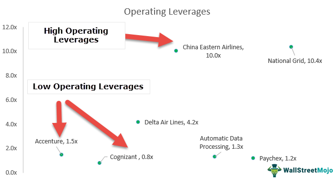

Leverage is a fundamental concept in finance that can significantly influence the outcomes of investment and trading activities. It refers to the use of borrowed capital or debt to amplify the potential return on investment. By utilizing leverage, investors and traders can control larger positions with a relatively smaller amount of actual capital. This ability to enhance one's investment capacity makes leverage an attractive tool, yet it also introduces additional risks.

Financial leverage is often discussed in the context of companies and their capital structures. It involves the strategic use of debt financing to acquire new assets or increase operational capacity, thereby potentially boosting profitability. The financial leverage ratio, which is calculated as the ratio of total debt to total equity, provides insight into a company’s reliance on borrowed funds. A higher ratio indicates more debt relative to equity, suggesting aggressive leverage practices that could lead to higher returns but at the cost of increased financial risk.



Operating leverage, on the other hand, relates to a firm’s cost structure—specifically, the balance between fixed and variable costs. A business with high operating leverage has a higher proportion of fixed costs, meaning that an increase in sales can lead to disproportionately larger increases in operating income. However, this also implies that during periods of declining sales, the company might struggle to cover its fixed expenses, resulting in financial instability.

In modern financial markets, leverage is not only pertinent to businesses but also to algorithmic trading, where traders employ complex algorithms to execute trades at high speeds. Leveraged algorithmic trading can maximize potential gains by enabling traders to take larger positions than would be possible with their own capital alone. However, this approach necessitates sophisticated risk management techniques to mitigate the inherent risks, such as volatility and potential market misalignments.

Understanding the nuances of financial and operating leverage, along with their implementation in algorithmic trading, is crucial for investors and traders seeking to enhance returns while managing associated risks effectively. This article aims to provide a comprehensive overview of leverage, its applications, and strategies for optimizing its use in various financial scenarios.

## Table of Contents

## Defining Financial Leverage

Financial leverage is an essential concept in finance, referring to the use of borrowed funds to amplify potential returns on investments. Businesses and individuals leverage debt capital to increase their asset base, potentially leading to greater profitability. By intelligently managing the capital structure—specifically the balance between debt and equity—entities can enhance their return on equity (ROE), thereby achieving higher financial performance.

The financial leverage ratio is a crucial metric in assessing the extent of an entity's use of debt to fund its assets. It's commonly represented by the formula:

$$
\text{Financial Leverage Ratio} = \frac{\text{Total Debt}}{\text{Total Equity}}
$$

This ratio highlights the proportion of debt in the capital structure. A higher ratio indicates more debt relative to equity, suggesting higher financial leverage. While a higher level of financial leverage can enhance returns, it concurrently increases the risk of financial distress, especially if the firm experiences revenue [volatility](/wiki/volatility-trading-strategies).

The implications of financial leverage on business strategy are significant. Companies may adopt higher leverage to fund expansion projects, acquire assets, or improve market competitiveness. By doing so, they aim to generate returns that exceed the cost of debt, thereby raising shareholder value. However, increased leverage necessitates careful risk management. Firms must ensure that their earnings are sufficient to cover interest payments and principal repayments; otherwise, they risk insolvency.

In summary, financial leverage serves as a double-edged sword—it can magnify returns in favorable conditions but also escalate the risk of losses in adverse scenarios. Businesses should judiciously employ leverage as part of a broader strategic approach to maximize profitability while managing exposure to financial risk.

## Operating Leverage: Concepts and Calculation

Operating leverage is a financial concept used to assess how sensitive a company's operating income is to a change in sales. It measures the proportion of fixed costs to variable costs in a business's cost structure. A company with high operating leverage will experience a more significant impact on its operating income from changes in sales [volume](/wiki/volume-trading-strategy) due to its higher fixed costs.

### Understanding Operating Leverage

Operating leverage arises from the presence of fixed costs in a company's cost structure. Fixed costs, such as rent, salaries, and machinery depreciation, do not change with the level of production or sales. On the other hand, variable costs fluctuate with production levels, including raw materials and direct labor costs.

A business with high operating leverage has a high ratio of fixed to variable costs. This scenario means that once the break-even point is surpassed, any additional sales will contribute significantly to profit, as the fixed costs have already been covered. However, this also means that during periods of low sales, the company will still incur the same fixed costs, leading to potential losses.

### Calculating the Degree of Operating Leverage

The Degree of Operating Leverage (DOL) is a measure that quantifies the sensitivity of a company's operating income to changes in sales volume. It is calculated as:

$$
\text{DOL} = \frac{\% \text{ change in operating income}}{\% \text{ change in sales volume}}
$$

A higher DOL indicates that a company's operating income is more sensitive to changes in sales volume. DOL can also be calculated using the following formula:

$$
\text{DOL} = \frac{\text{Contribution Margin}}{\text{Operating Income}}
$$

The contribution margin is the difference between sales and variable costs, representing the amount available to cover fixed costs and generate profit.

### Practical Example

Consider a company that sells product A for $100 each, with variable costs of $40 per unit and fixed costs amounting to $30,000 annually. The contribution margin per unit would be $60 ($100 - $40).

- At 1,000 units sold, the total contribution margin is $60,000 ($60 × 1,000 units).
- The operating income would be $30,000 ($60,000 - $30,000 fixed costs).

Using the DOL formula:

$$
\text{DOL} = \frac{60,000}{30,000} = 2
$$

This means that for every 1% change in sales volume, the operating income will change by 2%.

In scenarios where high sales volume is expected, companies might prefer using high operating leverage to capitalize on fixed costs, thus maximizing profit. Conversely, businesses with fluctuating sales might opt for a lower operating leverage to mitigate risk. Understanding these dynamics is crucial for strategic business planning and financial management.

## Financial vs. Operating Leverage

Financial leverage and operating leverage are two distinct concepts that collectively influence a company's financial strategy and performance. Understanding the nuances between them is essential for investors and managers aiming to optimize financial outcomes.

**Financial Leverage** refers to the use of borrowed funds (debt) to amplify potential returns on investment. It involves structuring a company’s capital by incorporating debt along with equity. Financial leverage is mainly measured by the financial leverage ratio, often calculated as:

$$
\text{Financial Leverage Ratio} = \frac{\text{Total Debt}}{\text{Equity}}
$$

The strategic use of financial leverage allows companies to potentially increase their return on equity, provided the return from investment exceeds the cost of debt. However, high financial leverage also increases the risk of insolvency, especially if the company faces downturns and cannot meet its debt obligations.

**Operating Leverage** involves the proportion of fixed costs in a company's cost structure relative to its variable costs. Companies with high operating leverage have a greater proportion of fixed costs. This means that a small change in sales volume can lead to a substantial change in operating income due to the fixed nature of costs. The degree of operating leverage (DOL) is calculated as follows:

$$
\text{DOL} = \frac{\%\ \text{Change in EBIT (Earnings Before Interest and Taxes)}}{\%\ \text{Change in Sales}}
$$

A high degree of operating leverage indicates that a company can potentially increase its operating income from a relatively small increase in sales. However, it also poses a risk when sales decline, as the fixed costs remain unchanged, leading to steeper declines in profit.

**Examples and Industry Differences**

Companies often use a combination of both leverages to balance risk and return. For instance, a manufacturing company with significant investments in machinery may exhibit high operating leverage due to high fixed costs. They may use financial leverage to invest in new technology to maintain a competitive edge. Conversely, a technology firm might have lower fixed costs but could utilize financial leverage extensively to fund research and development, aiming to capture larger market shares rapidly.

Industry sectors like utilities and telecommunications, which have stable cash flows and substantial fixed assets, typically utilize higher levels of financial leverage. Conversely, service-based industries with a focus on human resources might exhibit higher operating leverage due to lower dependency on debt financing, relying instead on optimizing operational efficiencies.

Strategically employing financial and operating leverage is integral for companies to enhance financial performance while carefully managing the associated risks. Understanding industry-specific factors is crucial, as they dictate the optimal mix of leverage types that can be effectively employed.

## Leverage in Algorithmic Trading

Algorithmic trading primarily involves the use of computer programs to automate trading decisions, allowing traders to execute orders at speeds and frequencies impractical for human traders. Leverage is a significant component in [algorithmic trading](/wiki/algorithmic-trading), enabling traders to amplify their returns by using borrowed funds or derivatives to control a larger position than the cash balance would ordinarily allow.

**Benefits of Leverage in Algorithmic Trading**

1. **Increased Market Exposure**: By utilizing leverage, traders can control larger positions with a relatively small amount of capital. This allows for a greater degree of exposure to market movements without the need for an equivalently large initial capital investment.

2. **Capital Efficiency**: Leverage facilitates the efficient use of capital, allowing traders to allocate resources across multiple strategies or asset classes, potentially enhancing diversification and returns across a portfolio.

3. **Enhanced Returns**: When used effectively, leverage can significantly enhance the returns of profitable strategies. Traders can take advantage of small price movements in the market magnified by the leverage factor.

**Challenges of Using Leverage in Algorithmic Trading**

1. **Increased Risk**: Leverage also amplifies potential losses. A strategy that involves high leverage can lead to substantial losses if the market moves against the position. Therefore, risk management becomes even more critical.

2. **Market Volatility**: High volatility can lead to rapid changes in market conditions, affecting the performance of leveraged strategies. The inability to quickly adapt to these changes can result in heightened financial risks.

3. **Margin Calls**: Trading on leverage may require maintenance of certain equity levels. If market movements cause the account's equity to drop below the required threshold, a margin call might be triggered, forcing the liquidation of positions at potentially unfavorable prices.

**Role of Algorithmic Models**

Algorithmic models play a pivotal role in mitigating the risks associated with leveraged trading. By analyzing historical data, these models can predict potential market movements and identify optimal entry and [exit](/wiki/exit-strategy) points, thereby reducing human error and emotional decision-making. Additionally, complex algorithms can be employed to dynamically adjust leverage levels based on real-time risk assessments.

```python
# Example of a simple leverage calculation in Python
def calculate_leverage(position_value, equity):
    """
    Calculate the leverage ratio.

    :param position_value: Total value of the positions
    :param equity: Total equity in the account
    :return: Leverage ratio
    """
    return position_value / equity

# Example usage
position_value = 1000000  # Total value of positions in dollars
equity = 50000  # Total equity in dollars
leverage_ratio = calculate_leverage(position_value, equity)
print(f"Leverage Ratio: {leverage_ratio:.2f}")
```

**Strategies for Risk Management**

Effective risk management in a leveraged trading environment is indispensable. Some key strategies include:

- **Diversification**: By spreading investments across different instruments or asset classes, a trader can minimize the impact of adverse price movements in any single position.

- **Stop-Loss Orders**: Implementing stop-loss orders can help limit potential downsides by automatically closing out losing positions when they hit predefined levels.

- **Regular Optimization of Algorithms**: Continuously refining and testing algorithmic models ensures they adapt to changing market conditions, maintaining their efficacy in managing risk while leveraging trades.

- **Regulatory Compliance**: Adhering to market regulations and maintaining adequate risk disclosures is crucial. Regulations often set limits on the amount of leverage that can be employed, intending to safeguard the financial system from systemic risks.

In conclusion, while leverage can significantly magnify the potential returns in algorithmic trading, it comes with equally significant risks. Successful leverage use relies on robust algorithmic strategies, comprehensive risk management, and regulatory compliance to protect against adverse market movements and maintain financial stability.

## Risks and Management Strategies

Leverage in finance is inherently risky, as it amplifies both potential gains and losses. Understanding and managing these risks is pivotal for traders and investors utilizing leveraged positions. The promise of greater returns can be appealing; however, it necessitates meticulous risk management strategies to safeguard against potential downsides.

One foundational strategy involves diversification. By spreading investments across various assets or asset classes, the overall risk is mitigated since the performance of different investments can offset losses. For leveraged portfolios, diversification can buffer against significant losses in any single position, thus maintaining more stable overall performance.

Another critical tool in managing leveraged risks is the use of stop-loss orders. These orders automatically sell a security when it reaches a predetermined price, limiting potential losses. For example, if an asset is bought at $100 with a stop-loss order set at $90, it ensures that the maximum loss on that asset will be $10 per share. Such orders are crucial in volatile markets, where rapid price movements can quickly erode the value of a leveraged position.

Regulatory considerations also play an essential role in managing risks associated with leverage. Financial authorities impose various regulations to ensure that leverage is used responsibly. These may include limits on the amount of leverage available, margin requirements, and reporting obligations. Compliance with these regulations is critical, as it not only helps in managing risks but also in avoiding legal repercussions. Traders must stay informed about the latest regulatory changes and how they impact their leveraged strategies.

Furthermore, risk management strategies are not just limited to diversification and stop-loss orders. Advanced techniques employ algorithmic and quantitative models to predict market movements and adjust leveraged positions accordingly. These models often use complex mathematical formulas and computational algorithms to assess risks and potential returns dynamically.

In Python, such models can be implemented using libraries like NumPy and pandas for numerical computation and data manipulation, respectively. Here is a simple example of a stop-loss mechanism using Python:

```python
# Simple stop-loss implementation
import numpy as np

def evaluate_position(current_price, purchase_price, stop_loss_percentage):
    stop_loss_price = purchase_price * (1 - stop_loss_percentage / 100)
    if current_price <= stop_loss_price:
        return "Sell"
    return "Hold"

# Example usage
purchase_price = 100  # purchase price per share
current_price = 89  # current market price per share
stop_loss_percentage = 10  # 10% stop-loss threshold

decision = evaluate_position(current_price, purchase_price, stop_loss_percentage)
print(decision)  # Output: Sell
```

In summary, while leverage can magnify returns, it equally increases risk. Effective risk management—combining strategies like diversification, stop-loss orders, and adherence to regulatory standards—is essential in successfully navigating the complexities of leveraged finance. Continuously updating and adapting these strategies in accordance with market conditions and regulatory requirements is crucial for optimizing leverage while minimizing risks.

## Conclusion

Leverage is a critical instrument in finance, enabling individuals and businesses to amplify their investment capacity and potentially escalate their returns. However, its application is double-edged, presenting both opportunities for enhanced profits and risks of substantial losses. To effectively harness the power of leverage, it is imperative to thoroughly understand its various forms—financial and operating leverage, as well as its application in algorithmic trading.

Financial leverage, achieved by employing debt, allows businesses to expand their operational scope and increase potential profitability. However, it inherently augments the financial risk, tying the firm's performance to the cost of borrowed capital. Operating leverage, conversely, examines the balance between fixed and variable costs, impacting a company's break-even point and profit elasticity. A high degree of operating leverage signifies that a small change in sales could lead to a significant alteration in operating income, demanding meticulous risk assessment and management.

Algorithmic trading utilizes leverage to optimize returns by executing trades at high speeds and frequencies. While this leverages capital efficiently, it also requires comprehensive strategies to manage associated risks and adhere to regulatory frameworks. Effective risk management strategies are indispensable when engaging in leveraged trading<. Techniques such as diversification and the use of stop-loss orders play a pivotal role in safeguarding against financial pitfalls and ensuring compliance with industry regulations.

Staying informed and adaptable forms the cornerstone of leveraging benefits and mitigating risks in the financial landscape. Continuous learning and adaptation to changing market conditions and financial regulations are essential. Ultimately, while leverage endows the potential for superior financial performance, its risks necessitate strategic diligence and disciplined management to achieve long-term success.

## References & Further Reading

[1]: Damodaran, A. (2012). ["Investment Valuation: Tools and Techniques for Determining the Value of Any Asset"](https://books.google.com/books/about/Investment_Valuation.html?id=5SRHAAAAQBAJ). Wiley.

[2]: Bodie, Z., Kane, A., & Marcus, A. J. (2014). ["Investments"](https://www.mheducation.com/highered/product/investments-bodie-kane/M9781264412662.html). McGraw Hill Education.

[3]: Brealey, R. A., Myers, S. C., & Allen, F. (2020). ["Principles of Corporate Finance"](https://www.mheducation.com/highered/product/Principles-of-Corporate-Finance-Brealey.html). McGraw Hill Education.

[4]: Hull, J. C. (2017). ["Options, Futures, and Other Derivatives"](https://www.semanticscholar.org/paper/Options%2C-Futures%2C-and-Other-Derivatives-Hull/89bdee500c8623864fc9eb7a471546aa713acc44). Pearson Education.

[5]: Fabozzi, F. J. (2015). ["Handbook of Fixed Income Securities"](https://www.amazon.com/Handbook-Fixed-Income-Securities-Ninth/dp/1260473899). Wiley.