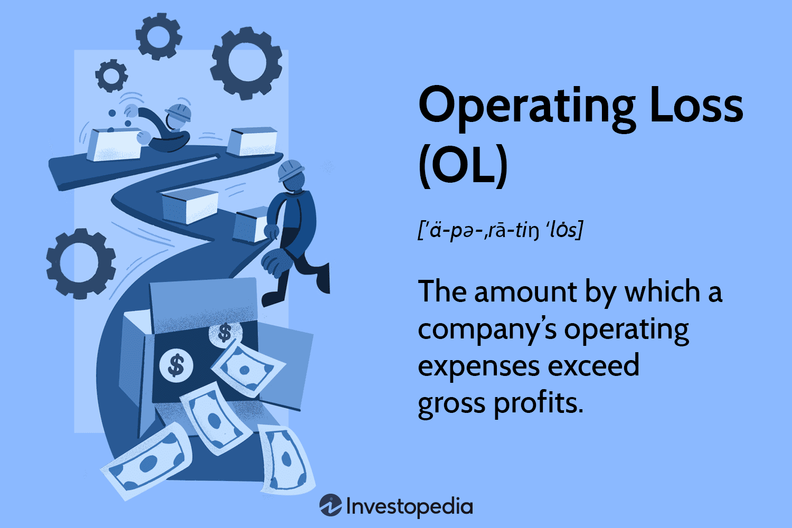

## Table of Contents

## What is an operating loss?

An operating loss happens when a company spends more money to run its business than it earns from its main activities. This means that the costs of things like making products, paying employees, and other day-to-day expenses are higher than the money coming in from selling goods or services. It's like when you spend more money than you make, and it can be a sign that a business needs to find ways to cut costs or increase sales.

If a company keeps having operating losses, it might have trouble staying open. It could need to borrow money or find investors to keep going. On the other hand, a one-time operating loss might not be a big problem if the company can fix what went wrong and start making a profit again. It's important for businesses to watch their operating losses closely and make changes to avoid bigger problems in the future.

## How is operating loss calculated?

Operating loss is figured out by taking away the money a company spends to run its business from the money it makes from selling its products or services. This money spent is called operating expenses and includes costs like rent, salaries, and the cost of making the products. The money made is called operating revenue. If the operating expenses are more than the operating revenue, the company has an operating loss.

To put it simply, you start with the operating revenue and then subtract the operating expenses. If the number you get is negative, that's your operating loss. For example, if a company makes $100,000 from sales but spends $120,000 to keep the business running, the operating loss would be $20,000. It's important for businesses to know this number because it shows if they're spending too much or not making enough money from what they sell.

## What are the common causes of operating losses?

Operating losses can happen for many reasons. One common cause is when a company's costs go up faster than its income. This can happen if the price of materials they need to make their products goes up, or if they have to pay their workers more. Sometimes, a business might spend a lot of money on new things like machines or buildings, which can make their costs higher than their income for a while.

Another reason for operating losses is when a company doesn't make enough money from selling its products or services. This can happen if fewer people want to buy what the company is selling, maybe because there's a new competitor or because people's tastes have changed. If a company can't sell enough to cover its costs, it will have an operating loss.

Sometimes, operating losses can also come from things the company can't control, like a big economic downturn or a natural disaster. These events can make it hard for a company to keep making money, leading to operating losses even if the company is doing everything right. It's important for businesses to understand these causes so they can try to fix the problems and avoid losses in the future.

## Can operating losses be beneficial in any way?

Yes, operating losses can sometimes be good for a business. If a company is trying to grow, it might spend a lot of money on new things like machines or buildings. This can lead to operating losses at first, but if the company can use these new things to make more money later, it can be worth it. It's like planting a seed that will grow into a big tree - it costs money now, but it can bring a lot of benefits in the future.

Also, operating losses can help a company save on taxes. In many places, if a company loses money, it doesn't have to pay as much in taxes. This can give the company more money to use for other important things, like paying its workers or investing in new projects. So, even though operating losses might sound bad, they can sometimes be part of a smart plan to make the business stronger and more successful in the long run.

## How does operating loss affect a company's financial health?

Operating losses can make a company's financial health worse. When a company loses money from its main business activities, it means it's spending more than it's [earning](/wiki/earning-announcement). This can make it hard for the company to pay its bills, like rent or salaries. If the losses keep happening, the company might need to borrow money or find investors to keep going. This can lead to more problems, like having to pay back loans with interest or giving up control to investors.

On the other hand, a short-term operating loss might not be too bad if the company can fix the problem and start making money again. Sometimes, a company might choose to lose money for a while to invest in new things that will help it grow. If these investments pay off, the company can become stronger and more successful in the long run. But if the losses keep happening and the company can't turn things around, it could face bigger problems, like going out of business.

## What is the difference between operating loss and net loss?

Operating loss and net loss are both ways to measure how much money a company is losing, but they look at different things. Operating loss is the money a company loses just from running its main business. It's the difference between the money the company makes from selling its products or services and the money it spends to make those products or services. If a company spends more on things like making products, paying employees, and rent than it makes from sales, it has an operating loss.

Net loss, on the other hand, looks at the total money a company loses after considering everything, not just the main business activities. To find the net loss, you start with the operating loss and then add or subtract other things like taxes, interest on loans, and any other income or expenses that aren't part of the main business. So, net loss gives you a fuller picture of a company's financial health because it includes all the money coming in and going out, not just what's related to the main business.

## How can a company recover from an operating loss?

A company can recover from an operating loss by finding ways to cut costs and increase income. They might look at all the money they spend and see if they can spend less on things like rent, supplies, or salaries. Sometimes, they can find cheaper ways to do things or negotiate better deals with suppliers. They might also try to sell more by offering discounts, starting new marketing campaigns, or finding new customers. If they can make more money than they spend, they can start to recover from the operating loss.

Another way to recover is by making smart investments. Even though it might cost money now, investing in new machines, technology, or training for employees can help the company make more money later. It's like planting a seed that will grow into a big tree - it costs money now, but it can bring a lot of benefits in the future. Sometimes, a company might need to borrow money or find investors to help with these investments. If the investments pay off, the company can turn its operating loss into a profit.

It's also important for a company to keep a close eye on its finances and make changes quickly if it sees problems coming. This means regularly checking how much money is coming in and going out, and being ready to adjust plans if things aren't working. By staying on top of things and making smart decisions, a company can recover from an operating loss and get back on track to being financially healthy.

## What are the tax implications of operating losses?

Operating losses can help a company save money on taxes. In many places, if a company loses money, it can use that loss to lower its taxes. This is called a tax deduction. If a company has an operating loss one year, it can use that loss to reduce the taxes it owes on its profits in future years. This can give the company more money to use for other important things, like paying its workers or investing in new projects.

Sometimes, a company can even [carry](/wiki/carry-trading) back an operating loss to get a refund on taxes it paid in past years. This means if the company made money and paid taxes in the past, but then had an operating loss, it can use that loss to get some of its old taxes back. This can be a big help for a company that's struggling with money, because it can give them more cash to keep the business running. So, even though operating losses might sound bad, they can sometimes help a company save money on taxes and stay afloat.

## How do operating losses impact a company's stock price?

When a company has an operating loss, it can make its stock price go down. This happens because investors might worry that the company is not doing well and might lose more money in the future. If people think a company is risky, they might sell their stocks, which makes the price drop. Operating losses can make investors lose trust in the company's ability to make money, so they might decide to put their money somewhere else.

However, sometimes an operating loss might not hurt the stock price too much. If investors believe the loss is just a short-term problem and the company has a good plan to fix it, they might keep their stocks or even buy more. They might see the loss as a chance to invest in a company that could do better later. So, whether an operating loss affects the stock price a lot depends on what investors think about the company's future.

## What strategies can be implemented to prevent operating losses?

To prevent operating losses, a company can start by keeping a close eye on its costs and finding ways to spend less money. This might mean looking for cheaper suppliers, using less expensive materials, or cutting back on things like rent and utilities. Sometimes, it can also mean making tough choices like letting go of some workers or closing down parts of the business that aren't making money. By making these changes, a company can lower its expenses and have a better chance of making more money than it spends.

Another strategy is to focus on bringing in more money. A company can do this by selling more of its products or services. They might try new ways to reach customers, like using social media or running special sales. Sometimes, it can help to add new products or services that people want to buy. By finding ways to increase their income, a company can make sure it has enough money coming in to cover its costs and avoid operating losses.

## How do industry-specific factors contribute to operating losses?

Industry-specific factors can make it hard for companies to avoid operating losses. In some industries, like farming, the weather can be a big problem. If there's too much rain or not enough, it can ruin crops and make it hard for farmers to make money. In other industries, like tech, things can change really fast. New technology can make old products less popular, so companies have to spend a lot of money to keep up. If they can't sell enough of their new products, they might lose money.

Also, some industries have rules and laws that can make it expensive to run a business. For example, in the healthcare industry, there are a lot of rules about how to take care of patients and what medicine to use. Following these rules can cost a lot of money, and if a healthcare company can't charge enough to cover these costs, it might have an operating loss. Each industry has its own challenges, and companies need to understand these to avoid losing money.

## What are some real-world examples of companies experiencing significant operating losses and their outcomes?

Uber, a ride-sharing company, had big operating losses for a long time. In 2019, Uber lost over $8 billion. They spent a lot of money to grow fast and compete with other companies. But they were also spending more money than they were making from rides. Eventually, Uber started to focus on making money instead of just growing. They raised prices and cut costs. By 2023, Uber was making a profit, showing that they could turn things around after big losses.

Another example is WeWork, a company that rents out office spaces. In 2019, WeWork was losing a lot of money, with operating losses over $2 billion. They were spending too much on things like fancy offices and parties. When people found out about the losses, they didn't want to invest in WeWork anymore. The company had to change its plans and cut costs a lot. WeWork is still around, but it's much smaller than before and still working to make a profit.

## What is Understanding Operating Losses?

An operating loss occurs when a company's operating expenses exceed its gross profits. This situation places financial pressure on businesses, as it indicates that the expenditures necessary to maintain and grow the operation are not being sufficiently covered by the revenues generated from sales. Operating losses are calculated using the equation:

$$
\text{Operating Loss} = \text{Gross Profit} - \text{Operating Expenses}
$$

Where gross profit is the revenue minus the cost of goods sold (COGS), and operating expenses include selling, general and administrative (SG&A) expenses, and research and development (R&D) costs. These expenses represent the ongoing costs of running a business but do not include capital expenses or tax payments.

In start-up and rapidly growing companies, operating losses are common. Such companies often invest heavily in expansion activities such as hiring staff, increasing production capabilities, and entering new markets before achieving operational efficiencies or substantial revenue streams. This phase is often considered a part of a strategic approach aiming for long-term market presence or dominance.

However, persistent operating losses can be a red flag, hinting at inefficiencies within the company's operations or potentially a declining demand for the company's core products or services. This persistence demands close scrutiny and action to mitigate financial strain and prevent exacerbation into more severe financial health issues.

Strategies to manage operating losses may include cost-cutting measures and restructuring efforts aimed at achieving leaner operations. Cost-cutting can involve reducing unnecessary expenses, optimizing supply chain operations, and potentially downsizing staff. Restructuring might require re-evaluating business processes to improve efficiency, such as adopting new technologies or altering production methods.

Moreover, revenue enhancement measures can provide a solution to operating losses. These could involve refining marketing strategies to increase sales, diversifying product offerings, or entering new customer segments or geographical markets to boost revenues.

Overall, effectively handling operating losses involves a mix of tactical short-term interventions and strategic long-term planning to ensure that the business not only survives but prospers. Companies may achieve better outcomes by embracing data-driven decision-making processes and integrating advanced financial tools to analyze and manage their expenses and revenue streams efficiently.

## References & Further Reading

[1]: Bergstra, J., Bardenet, R., Bengio, Y., & Kégl, B. (2011). ["Algorithms for Hyper-Parameter Optimization."](https://dl.acm.org/doi/10.5555/2986459.2986743) Advances in Neural Information Processing Systems 24.

[2]: ["Advances in Financial Machine Learning"](https://www.amazon.com/Advances-Financial-Machine-Learning-Marcos/dp/1119482089) by Marcos Lopez de Prado

[3]: ["Evidence-Based Technical Analysis: Applying the Scientific Method and Statistical Inference to Trading Signals"](https://www.amazon.com/Evidence-Based-Technical-Analysis-Scientific-Statistical/dp/0470008741) by David Aronson

[4]: ["Machine Learning for Algorithmic Trading"](https://github.com/stefan-jansen/machine-learning-for-trading) by Stefan Jansen

[5]: ["Quantitative Trading: How to Build Your Own Algorithmic Trading Business"](https://www.amazon.com/Quantitative-Trading-Build-Algorithmic-Business/dp/1119800064) by Ernest P. Chan