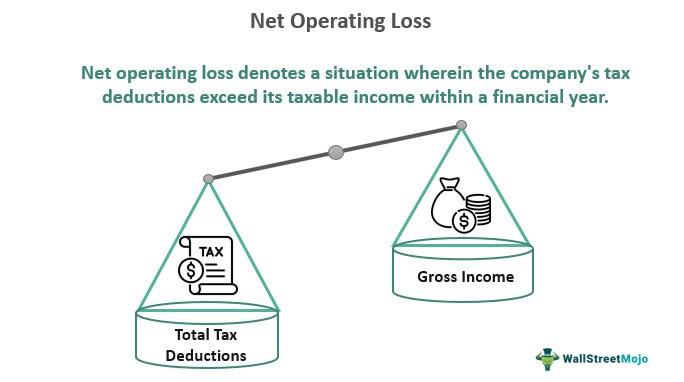

In today's rapidly evolving financial landscape, businesses are increasingly adopting algorithmic trading to maintain a competitive edge. This form of trading, which employs automated and pre-programmed systems to execute trades based on market data and financial indicators, offers several advantages, including improved trading efficiency and reduced human error. Despite these benefits, companies still face significant challenges in dealing with operating losses and other financial setbacks.

Operating losses occur when a company's operational expenses exceed its gross profits, creating financial strain. These losses can arise from several factors, such as high costs of goods sold, administrative expenses, and substantial investment in research and development. Start-ups and rapidly growing firms, which often prioritize market expansion and innovation, frequently encounter operating losses. However, persistent losses may indicate deeper inefficiencies or waning demand for core products or services. To cope, businesses typically resort to cost-cutting measures, restructuring, or strategies aimed at enhancing revenue.



Algorithmic trading plays an essential role in managing these financial dynamics. By analyzing financial statements like profit and loss (P&L) records, algorithmic systems can devise strategies that optimize profitability and mitigate risks. Historical data is used to identify profitable trading patterns, while algorithms are refined to respond adeptly to market conditions. In doing so, these systems help minimize potential losses and capitalize on trading opportunities by understanding market volatility, liquidity, and financial metrics.

This article explores the relationship between business finance and operating losses, highlighting real-world examples and strategies that demonstrate effective management of financial challenges. Notably, Tesla and Uber serve as prime examples of companies that navigated operating losses during high-growth phases, showing the importance of strategic planning and innovative approaches. Such case studies provide valuable insights into how the integration of algorithmic trading with business strategies can yield resilience and profitability.

By examining these aspects, the article aims to equip companies with the knowledge to refine their financial strategies, leveraging algorithmic trading to minimize losses and maximize profitability in an increasingly competitive environment.

## Table of Contents

## Understanding Operating Losses

An operating loss occurs when a company's operating expenses exceed its gross profits. This situation places financial pressure on businesses, as it indicates that the expenditures necessary to maintain and grow the operation are not being sufficiently covered by the revenues generated from sales. Operating losses are calculated using the equation:

$$
\text{Operating Loss} = \text{Gross Profit} - \text{Operating Expenses}
$$

Where gross profit is the revenue minus the cost of goods sold (COGS), and operating expenses include selling, general and administrative (SG&A) expenses, and research and development (R&D) costs. These expenses represent the ongoing costs of running a business but do not include capital expenses or tax payments.

In start-up and rapidly growing companies, operating losses are common. Such companies often invest heavily in expansion activities such as hiring staff, increasing production capabilities, and entering new markets before achieving operational efficiencies or substantial revenue streams. This phase is often considered a part of a strategic approach aiming for long-term market presence or dominance.

However, persistent operating losses can be a red flag, hinting at inefficiencies within the company's operations or potentially a declining demand for the company's core products or services. This persistence demands close scrutiny and action to mitigate financial strain and prevent exacerbation into more severe financial health issues.

Strategies to manage operating losses may include cost-cutting measures and restructuring efforts aimed at achieving leaner operations. Cost-cutting can involve reducing unnecessary expenses, optimizing supply chain operations, and potentially downsizing staff. Restructuring might require re-evaluating business processes to improve efficiency, such as adopting new technologies or altering production methods.

Moreover, revenue enhancement measures can provide a solution to operating losses. These could involve refining marketing strategies to increase sales, diversifying product offerings, or entering new customer segments or geographical markets to boost revenues.

Overall, effectively handling operating losses involves a mix of tactical short-term interventions and strategic long-term planning to ensure that the business not only survives but prospers. Companies may achieve better outcomes by embracing data-driven decision-making processes and integrating advanced financial tools to analyze and manage their expenses and revenue streams efficiently.

## The Role of Algorithmic Trading in Financial Management

Algorithmic trading uses advanced algorithms and pre-programmed systems to automate market transactions, thereby enhancing efficiency and effectiveness in trading operations. The primary objective is to execute trades at optimal prices by analyzing market data and financial indicators.

This approach has gained substantial traction among businesses as they seek to improve trading efficiency. By automating the trading process, companies can reduce human errors that are often associated with manual trading and enhance the speed at which decisions are made. This quick decision-making capability is critical in fast-moving markets where rapid execution can make a substantial difference.

A significant advantage of [algorithmic trading](/wiki/algorithmic-trading) is its ability to leverage financial statements, particularly profit and loss (P&L) statements. These statements provide crucial insights into a company's financial health and are pivotal for devising trading strategies that aim to optimize profitability while managing risk. By analyzing historical P&L data, algorithmic systems can identify profitable trading patterns, learning from past performance to adjust their parameters accordingly.

Understanding market [volatility](/wiki/volatility-trading-strategies) and [liquidity](/wiki/liquidity-risk-premium) is essential for minimizing trading losses and maximizing opportunities. Algorithmic trading achieves this by continuously monitoring market conditions and adjusting strategies in real-time. For instance, an algorithm might be designed to recognize a specific pattern of price movements indicative of high volatility, prompting the execution of trades that could capitalize on short-term market fluctuations.

Moreover, algorithmic traders make use of sophisticated models that incorporate statistical and mathematical tools to predict market movements. Python, given its rich libraries like NumPy, pandas, and scikit-learn, is often used to develop these models. Here is a simple example of how one might use Python to identify a trading pattern:

```python
import pandas as pd
import numpy as np

# Load historical price data
data = pd.read_csv('historical_prices.csv')

# Simple moving average
data['SMA_50'] = data['Close'].rolling(window=50).mean()
data['SMA_200'] = data['Close'].rolling(window=200).mean()

# Trading signal
data['Signal'] = np.where(data['SMA_50'] > data['SMA_200'], 1, 0)

# Generate trading orders: Buy when the shorter moving average crosses above the longer one
data['Position'] = data['Signal'].diff()
data.dropna(inplace=True)

# Display trading signals
print(data[['Close', 'SMA_50', 'SMA_200', 'Signal', 'Position']])
```

In this example, a Simple Moving Average (SMA) strategy is used to generate buy signals whenever the 50-day SMA crosses above the 200-day SMA. This is a basic demonstrative approach but illustrates how algorithms can be leveraged to automate decision-making.

Ultimately, by integrating insights from financial statements and market data, algorithmic trading can significantly enhance a business's ability to manage risks and exploit trading opportunities. The continuous evolution and adaptability of these systems are crucial as markets change, ensuring that businesses remain competitive and profitable.

## Common Causes of Financial Losses in Businesses

Financial losses in businesses can be attributed to various internal and external factors that disrupt operational and strategic functions. Economic downturns are a primary external [factor](/wiki/factor-investing), wherein reduced consumer spending and investment result in lower revenues and increased financial stress on businesses. Such downturns often lead to decreased demand for products and services, compelling businesses to operate under tighter budgets and explore cost-reduction measures.

Internally, increasing operational costs significantly contribute to financial losses. Rising costs of raw materials, labor, and utilities inflate expenses, diminishing profit margins. Businesses also face competitive pressures which necessitate continuous investment in innovation and marketing to maintain or increase market share, often leading to increased expenditure.

Poor financial management within a company can exacerbate these challenges. Strategic errors, such as misallocation of resources, over-investment in unprofitable ventures, or inefficient cost structures, further strain financial stability. Additionally, failure to innovate leads to stagnation, making it difficult for companies to adapt to changing market dynamics and consumer preferences.

Global events, such as financial crises or pandemics, act as significant disruptors, altering financial landscapes overnight. These events can lead to abrupt shifts in consumer behavior, supply chain disruptions, and broader economic instability, making it difficult for businesses to maintain steady profitability during such turbulent periods. 

To mitigate these issues, algorithmic trading has been employed by businesses to optimize trading decisions. By processing vast amounts of market data and adjusting to real-time changes, algorithmic trading facilitates timely decision-making, helping businesses avoid substantial financial losses. It enables companies to strategically adjust their trading positions, optimize risk-reward ratios, and capitalize on short-term opportunities, ensuring a buffer against unforeseen financial fluctuations.

Understanding these causes of financial losses is crucial for businesses that aim to enhance their robustness and minimize potential downturns in profitability. Leveraging tools like algorithmic trading, alongside robust financial strategies, helps businesses navigate these challenges, reduce exposure to financial risks, and create more sustainable operational models.

## Real-World Examples of Managing Operating Losses

Companies like Tesla and Uber have faced significant operating losses during periods of rapid growth and market expansion. These companies provide illustrative examples of how strategic planning and adaptation can address financial challenges and operating losses effectively.

Tesla, under the leadership of Elon Musk, focused on innovation and scaling operations to address its financial challenges. During its formative years and the early phase of manufacturing, Tesla reported consistent operating losses due to high research and development expenses, substantial capital investments, and the costs associated with scaling production facilities. However, Tesla's strategy of prioritizing technological innovation and increasing production capacity eventually enabled the company to achieve economies of scale and improved operational efficiencies. By focusing on launching new product lines like the Model 3, which targeted a broader market, Tesla managed to increase its revenue base substantially. This strategy, paired with advancements in its manufacturing processes and supply chain management, significantly contributed to Tesla turning its financial performance around, ultimately achieving profitability in recent years.

Uber, another example, has encountered operating losses primarily due to its aggressive expansion and market penetration costs. The company's strategy has involved entering new markets rapidly, which resulted in high marketing expenses, regulatory costs, and subsidies offered to drivers and customers. To mitigate these financial pressures, Uber has optimized its operational expenditure by implementing cost-control measures such as downsizing non-profitable ventures. Moreover, Uber has diversified its revenue streams by expanding into new areas like Uber Eats, freight, and autonomous vehicles, reducing reliance on its core ride-hailing business. By optimizing its expenditure and expanding into related markets, Uber aims to stabilize its financial position while maintaining growth [momentum](/wiki/momentum).

Both Tesla and Uber highlight the importance of long-term strategic planning in overcoming short-term financial challenges. These cases emphasize the role of innovation, operational efficiency, and diversification in achieving financial stability. Furthermore, with the incorporation of algorithmic trading and data analysis, companies can refine their financial strategies to navigate through periods of operating losses more adeptly. Combining business strategy with algorithmic insights offers a comprehensive approach to steering through and ultimately overcoming operational financial challenges.

## Strategies to Mitigate Financial Losses

To combat financial losses, businesses need a mix of effective strategies, including cost optimization, risk management, and diversification. Algorithmic trading, a powerful tool in this effort, can aid in precise implementation of stop loss and take profit orders. These trading algorithms ensure that transactions occur automatically at specified price thresholds, thereby preventing excessive losses and securing profits when market conditions turn favorable. This approach is integral to establishing a robust risk management framework that mitigates the unpredictability of financial markets.

Regular analysis of profit and loss (P&L) statements is indispensable for refining trading algorithms. This analysis allows companies to assess historical performance and adjust trading parameters accordingly, optimizing the risk-reward ratios of future trades. By utilizing P&L insights, companies can develop algorithms that better predict profitable trading patterns and efficiently allocate their resources.

Investment in technology and human resources is vital for enhancing productivity and reducing operational costs. Advanced trading systems require infrastructure capable of quick data processing and analysis, as well as professional expertise to manage and interpret algorithmic trading models. By investing in both areas, companies can ensure that their trading operations remain competitive and adaptive to evolving market conditions.

Continuous improvement and adaptation of algorithms based on market conditions ensure that companies capitalize on available opportunities while minimizing potential losses. This dynamic approach to algorithm development involves regularly updating algorithms to reflect the latest market dynamics. Python, a popular language for quantitative finance, can be used to model these adaptive trading algorithms. Here is a simple example of a Python function designed to adapt trading parameters based on market volatility:

```python
def adjust_trading_parameters(volatility):
    base_stop_loss = 0.02  # 2% base stop loss
    base_take_profit = 0.05  # 5% base take profit

    # Adjust stop loss and take profit based on current market volatility
    adjusted_stop_loss = base_stop_loss * (1 + volatility)
    adjusted_take_profit = base_take_profit * (1 + volatility)

    return adjusted_stop_loss, adjusted_take_profit
```

This function, `adjust_trading_parameters`, modifies stop loss and take profit levels by factoring in market volatility, thus providing a dynamic risk management strategy. By continuously refining their trading strategies with such adaptive models, businesses can maximize their opportunities for profitability amidst the inherent uncertainties of financial markets.

## Conclusion

Operating losses and financial challenges are intrinsic to the business environment, yet deploying proactive strategies can significantly mitigate their effects. Companies are increasingly turning to algorithmic trading as a sophisticated tool in navigating these challenges. By utilizing automated systems, businesses can efficiently analyze vast amounts of financial data, optimize trading strategies, and enhance decision-making processes, thus steering towards financial stability.

Algorithmic trading's ability to process financial information swiftly offers companies the means to integrate insights derived from operating loss assessments into their trading strategies. This integration is crucial as it provides a data-driven approach to identifying inefficiencies, optimizing cost structures, and improving overall profitability.

The mastery of financial tools and strategies plays a pivotal role in ensuring long-term growth and profitability. Businesses must maintain command over these instruments to adapt and respond to the ever-changing economic landscape effectively. Continuously evaluating and updating trading strategies based on Profit and Loss (P&L) insights is essential. This iterative process allows companies to refine their approaches, maximize trading opportunities, and minimize potential losses. By adhering to such disciplined practices, businesses can strategically position themselves to navigate uncertainties and achieve sustainable financial success.

## References & Further Reading

[1]: Bergstra, J., Bardenet, R., Bengio, Y., & Kégl, B. (2011). ["Algorithms for Hyper-Parameter Optimization."](https://dl.acm.org/doi/10.5555/2986459.2986743) Advances in Neural Information Processing Systems 24.

[2]: ["Advances in Financial Machine Learning"](https://www.amazon.com/Advances-Financial-Machine-Learning-Marcos/dp/1119482089) by Marcos Lopez de Prado

[3]: ["Evidence-Based Technical Analysis: Applying the Scientific Method and Statistical Inference to Trading Signals"](https://www.amazon.com/Evidence-Based-Technical-Analysis-Scientific-Statistical/dp/0470008741) by David Aronson

[4]: ["Machine Learning for Algorithmic Trading"](https://github.com/stefan-jansen/machine-learning-for-trading) by Stefan Jansen

[5]: ["Quantitative Trading: How to Build Your Own Algorithmic Trading Business"](https://www.amazon.com/Quantitative-Trading-Build-Algorithmic-Business/dp/1119800064) by Ernest P. Chan