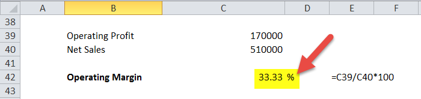

The world of financial analysis is vast, and fundamental metrics such as profitability ratios are integral for evaluating a company's financial health. These ratios offer essential insights into how well a company can convert its operations into profits. Financial metrics are vital for investors, analysts, and traders who aim to gauge a firm's efficiency and make informed decisions. Among these metrics, the operating margin stands out as a key indicator of operational efficiency, demonstrating the proportion of revenue remaining after covering the variable costs of production.

In this article, we focus on profitability ratios with particular emphasis on the operating margin, exploring its importance in finance. This metric not only helps in evaluating a company's performance within its industry but also serves as a tool for investment analysis, offering a clearer picture of a company's cost management and pricing strategies. Understanding these nuances aids investors in making strategic decisions, especially when employing algorithmic trading.



Algorithmic trading, which relies on algorithms to make trading decisions, increasingly depends on financial metrics such as the operating margin to develop robust strategies. By analyzing a company’s ability to generate sustainable profits, traders can enhance their algorithms to optimize trading performance and seize profitable opportunities. Through this exploration, we highlight how a solid grasp of these metrics can contribute to more effective trading strategies and superior financial analysis.

## Table of Contents

## Understanding Profitability Ratios

Profitability ratios are essential financial metrics that evaluate a company's ability to generate profit relative to various financial elements such as sales, assets, and equity. These ratios offer critical insights into different aspects of a company's financial health, including managerial efficiency, cost control, and the ability to translate sales into earnings.

Key profitability ratios include Return on Assets (ROA), Return on Equity (ROE), and Operating Margin. Each of these ratios serves a distinct purpose in financial analysis. 

Return on Assets (ROA) measures how effectively a company utilizes its assets to generate profit. It is calculated using the formula:

$$

\text{ROA} = \left( \frac{\text{Net Income}}{\text{Total Assets}} \right) \times 100 
$$

A higher ROA indicates that the company is efficient in using its assets to produce earnings, reflecting positively on its operational effectiveness.

Return on Equity (ROE) is another crucial profitability ratio that assesses a company's ability to generate profits from its shareholders' equity. The formula for ROE is:

$$

\text{ROE} = \left( \frac{\text{Net Income}}{\text{Shareholders' Equity}} \right) \times 100 
$$

ROE serves as a barometer of financial performance from the perspective of equity investors, providing insight into how well the company is deploying its equity base to generate growth.

Operating Margin evaluates the proportion of revenue that remains after covering variable costs of production like wages and raw materials. It is calculated using the formula:

$$

\text{Operating Margin} = \left( \frac{\text{Operating Earnings}}{\text{Revenue}} \right) \times 100 
$$

This ratio is a key indicator of operational efficiency. A higher operating margin implies better cost management and indicates that a company retains more profit per dollar of sales, enhancing its financial resilience.

These profitability ratios collectively offer a comprehensive understanding of a company's financial dynamics. They help stakeholders assess the company's effectiveness in generating profit, identify areas of improvement, and benchmark performance against industry peers. By analyzing these ratios, investors and managers can make informed decisions aimed at enhancing profitability and ensuring sustainable growth.

## The Significance of Operating Margin

Operating margin is a key financial metric that quantifies the efficiency of a company’s core operations. By measuring the proportion of revenue remaining after the deduction of variable production costs such as wages and raw materials, it provides a clear lens through which to evaluate a firm's operational success. This metric is computed using the formula:

$$
\text{Operating Margin} = \left( \frac{\text{Operating Income}}{\text{Revenue}} \right) \times 100
$$

Operating margin serves as a crucial indicator of operational efficiency, enabling investors and analysts to juxtapose the performance of companies within the same industry. Given that similar industries generally have parallel cost structures and revenue models, comparing the operating margins of companies within the same sector can yield insights into which companies are managing their resources more proficiently.

A higher operating margin suggests that a company has superior control over its operational costs, resulting in a greater proportion of its revenue being retained as profit. This typically indicates effective management, competitive advantages, or economies of scale, which are often indicative of a strong competitive position within the industry. For instance, a firm with a 20% operating margin retains $0.20 as operating profit for every dollar of revenue, compared to another with a 10% operating margin, which retains only $0.10.

Investors consider a high operating margin as a positive signal of financial health, implying that the company can withstand economic downturns more robustly due to its ability to maintain profitability despite fluctuations in revenue. Consequently, a comprehensive analysis of operating margins—alongside other profitability metrics—can offer invaluable insights for making informed investment decisions.

## Calculating and Interpreting Operating Margin

The operating margin, a key profitability ratio, is an essential financial metric used to assess a company's operational efficiency. It measures the percentage of revenue that remains as operating income after accounting for the costs of goods sold and operating expenses. The formula for calculating the operating margin is straightforward: 

$$
\text{Operating Margin} = \left( \frac{\text{Operating Earnings}}{\text{Revenue}} \right) \times 100
$$

Analyzing operating margin provides insights into how effectively a company is managing its core operations. A higher operating margin indicates that a company retains more revenue as operating profit, signifying better control over its operational costs.

To illustrate the application of this calculation, consider a company with an operating income of $800,000 and total revenue of $2 million. Applying the operating margin formula, we have:

$$
\text{Operating Margin} = \left( \frac{800,000}{2,000,000} \right) \times 100 = 40\%
$$

This result indicates that 40% of the company's revenue is retained as operating profit after covering variable costs such as wages, materials, and other operating expenses. Operating margin is a crucial indicator for stakeholders as it highlights the efficiency with which a company converts sales into profits.

Assessing operating margins can facilitate comparisons between companies within the same industry, aiding investors in evaluating which companies manage their resources more proficiently. However, it is important to interpret operating margins considering the company's specific context and industry standards to ensure a comprehensive evaluation.

## Limitations of Operating Margin

While the operating margin is a useful metric for assessing a company's operational efficiency, it comes with certain limitations. One of the primary constraints is that it is most effective when used to compare companies within the same industry. This is because companies operating in different industries often have distinct business models, cost structures, and operational processes, which can significantly affect their operating margins.

Comparative margin analysis across industries can be misleading. For instance, technology companies frequently report higher operating margins than manufacturing companies due to their relatively lower capital expenditures and cost structures. A direct comparison between such disparate industries might suggest that the technology company is inherently more efficient, but this ignores intrinsic differences like economies of scale, capital intensity, and market dynamics.

Understanding the context of such variations is crucial when evaluating a company's performance. Within an industry, a higher operating margin typically indicates better control over operating costs and higher profitability per dollar of sales. However, when looking across different industries, a higher margin does not necessarily equate to superior performance or efficiency. For example, service-based industries often have higher operating margins because they incur fewer material costs compared to goods-producing industries.

To effectively use operating margin as a comparative tool, it is essential to consider other financial metrics and qualitative factors that can provide deeper insights into a company's specific operational context. Such factors might include market position, competitive advantage, and industry-specific challenges. Furthermore, external conditions such as economic cycles, regulatory changes, and technological advancements can also impact operating margins differently across various sectors.

Therefore, while the operating margin offers valuable insights into operational efficiency, analysts and investors should employ a more comprehensive approach that includes various financial metrics and contextual understanding to draw meaningful conclusions about a company's performance.

## Profitability Metrics in Algorithmic Trading

In [algorithmic trading](/wiki/algorithmic-trading), profitability metrics serve as crucial tools for the design and optimization of trading algorithms. These metrics, such as the operating margin, Return on Assets (ROA), and Return on Equity (ROE), enable traders to evaluate a company's financial health and its ability to generate consistent profits. Understanding these metrics allows traders to make informed decisions by assessing a company's efficiency and profitability.

Algorithmic trading systems can integrate profitability metrics to enhance the decision-making process. For instance, algorithms can be programmed to filter stocks based on a minimum threshold for the operating margin. This ensures that trades are executed on companies that demonstrate effective cost management and retain a significant portion of their revenue as operating profit. This aspect is critical when focusing on companies that are more likely to offer sustainable investment opportunities.

Moreover, profitability metrics can be employed in the construction of multi-[factor](/wiki/factor-investing) models, where each factor corresponds to a specific profitability ratio, such as ROA or ROE. The relative weighting of these factors can be adjusted based on [backtesting](/wiki/backtesting) to identify historically profitable configurations. For example, a Python script can be used to create a trading algorithm that compares ROE across different companies and prioritizes those with a higher ratio, indicating better management effectiveness in generating returns on equity.

```python
import pandas as pd

# Sample dataset of companies with profitability metrics
data = {
    'Company': ['A', 'B', 'C'],
    'Operating Margin': [0.25, 0.15, 0.30],
    'ROA': [0.10, 0.07, 0.12],
    'ROE': [0.18, 0.12, 0.20]
}

df = pd.DataFrame(data)

# Filter companies based on operating margin greater than 0.20
selected_companies = df[df['Operating Margin'] > 0.20]

print(selected_companies)
```

The use of profitability metrics also extends to risk management within trading algorithms. By focusing on financially healthy companies, traders can mitigate risks associated with financial instability. Such an approach leads to more robust trade execution, as companies with strong profitability ratios are less likely to experience sudden financial downturns.

In conclusion, integrating profitability metrics into algorithmic trading not only optimizes trade performance but also enhances the ability to execute strategies based on solid financial indicators. These insights subsequently lead to more strategic and informed trading, maximizing the potential for profitable outcomes.

## Conclusion

Profitability ratios such as the operating margin are integral to comprehensive financial analysis and the development of trading strategies. These metrics allow traders and investors to accurately assess a company's financial standing by examining its ability to generate profits relative to its operating activities. For instance, a consistently high operating margin indicates efficient management of operational expenses, translating into a stronger capacity to retain profits from sales revenue. This insight is crucial when making informed investment decisions or developing algorithmic trading strategies that rely on the financial health of firms as an indicator of future performance.

Understanding profitability ratios goes beyond surface-level analysis, offering a nuanced view of how well a company converts its operating revenue into net earnings. Such knowledge provides a competitive edge, enabling traders and investors to identify undervalued stocks or potential high-performance assets. Moreover, it aids in constructing robust trading algorithms that integrate financial metrics to predict market movements and optimize trade execution.

Ultimately, leveraging profitability ratios for financial insights not only enhances investment strategies but also opens up more informed trading opportunities, ensuring that decisions are based on a thorough and accurate evaluation of a company’s financial dynamics.

## References & Further Reading

[1]: ["Advances in Financial Machine Learning"](https://www.amazon.com/Advances-Financial-Machine-Learning-Marcos/dp/1119482089) by Marcos Lopez de Prado

[2]: ["Evidence-Based Technical Analysis: Applying the Scientific Method and Statistical Inference to Trading Signals"](https://www.amazon.com/Evidence-Based-Technical-Analysis-Scientific-Statistical/dp/0470008741) by David Aronson

[3]: ["Machine Learning for Algorithmic Trading"](https://github.com/stefan-jansen/machine-learning-for-trading) by Stefan Jansen

[4]: ["Quantitative Trading: How to Build Your Own Algorithmic Trading Business"](https://www.amazon.com/Quantitative-Trading-Build-Algorithmic-Business/dp/1119800064) by Ernest P. Chan

[5]: Penman, S. H. (2012). ["Financial Statement Analysis and Security Valuation"](https://www.chegg.com/textbooks/financial-statement-analysis-and-security-valuation-5th-edition-9780078025310-0078025311) McGraw-Hill/Irwin.

[6]: Lev, B. (2002). ["Operating Margin and Its Impact on Stock Prices."](https://www.cambridge.org/core/journals/journal-of-financial-and-quantitative-analysis/article/abs/on-the-association-between-operating-leverage-and-risk/5D96C9717E5090AC352925FAFBBBCEC4) Financial Analysts Journal.

[7]: Koller, T., Goedhart, M., & Wessels, D. (2010). ["Valuation: Measuring and Managing the Value of Companies"](https://www.wiley.com/en-us/Valuation%3A+Measuring+and+Managing+the+Value+of+Companies%2C+7th+Edition-p-9781119610885) (5th ed.). John Wiley & Sons.