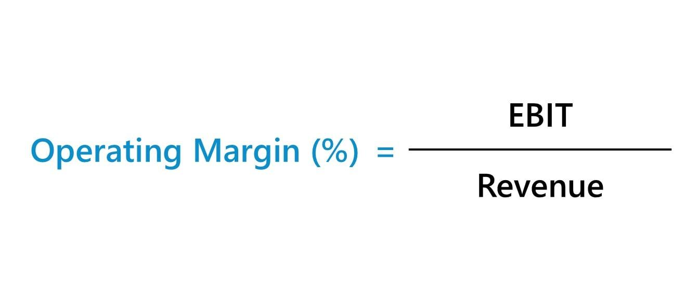

## Table of Contents

## What is operating margin?

Operating margin is a way to measure how much profit a company makes from its main business activities. It shows the percentage of revenue left after paying for the costs of running the business, like salaries, rent, and supplies. A higher operating margin means the company is good at turning its revenue into profit.

This number is important because it helps investors and managers see how well a company is doing at controlling its costs. If the operating margin is going up over time, it usually means the company is getting better at making money from what it does every day. If it's going down, it might mean the company needs to find ways to spend less or make more money.

## Why is operating margin important for a business?

Operating margin is important for a business because it shows how much money the business makes after paying for the costs of running it. This number tells the business owners and investors if the company is good at making money from what it does every day. If the operating margin is high, it means the business is doing well at keeping costs low and making a good profit from its sales.

It's also a useful tool for comparing how well a business is doing compared to other businesses in the same industry. If a company has a higher operating margin than its competitors, it might mean that it's better at managing its costs or that it can charge more for its products or services. This can help the business stand out and attract more investors who want to put their money into a company that's doing well.

Over time, watching the operating margin can help a business see if it's getting better or worse at making money. If the operating margin is going up, it's a good sign that the business is improving. But if it's going down, it might be a warning that the business needs to find ways to cut costs or increase sales to stay healthy.

## How is operating margin different from gross margin?

Operating margin and gross margin are both ways to measure how much money a business makes, but they look at different parts of the business. Gross margin is what's left after a business subtracts the cost of making its products or services from its sales. This is called the cost of goods sold, and it includes things like raw materials and labor directly used to make the product. Gross margin shows how much money a business makes just from selling its products before paying for other costs like rent, salaries, and utilities.

Operating margin goes a step further. After finding the gross margin, operating margin subtracts all the other costs of running the business, like rent, salaries, and utilities. These are called operating expenses. Operating margin shows how much money the business makes after paying for everything needed to keep it running day to day. It's a better way to see if the business is good at making money from its main activities, not just from selling its products.

In simple terms, gross margin looks at the profit from sales before other costs, while operating margin looks at the profit after all the costs of running the business are taken out. Both are important, but operating margin gives a clearer picture of how well the business is doing overall.

## What are the components needed to calculate operating margin?

To calculate operating margin, you need to know two main things: the company's operating income and its revenue. Operating income is what's left after you subtract the cost of goods sold and all the operating expenses from the revenue. Revenue is the total amount of money the company makes from selling its products or services. Operating expenses include things like rent, salaries, and utilities, which are the costs of running the business day to day.

Once you have these numbers, you can find the operating margin by dividing the operating income by the revenue and then multiplying by 100 to get a percentage. This percentage shows how much of each dollar of revenue is left as profit after paying for all the costs of running the business. A higher percentage means the company is good at turning its sales into profit, while a lower percentage might mean it needs to find ways to cut costs or increase sales.

## Can you provide the basic formula for calculating operating margin?

The basic formula for calculating operating margin is simple. You take the operating income and divide it by the revenue. Then, you multiply the result by 100 to get a percentage. Operating income is what's left after you subtract the cost of goods sold and all the operating expenses from the revenue. Revenue is just the total money the company makes from selling its products or services.

For example, if a company has an operating income of $50,000 and its revenue is $200,000, you would divide $50,000 by $200,000 to get 0.25. Then, you multiply 0.25 by 100 to find that the operating margin is 25%. This means that for every dollar of revenue, the company keeps 25 cents as profit after paying for all the costs of running the business.

## How do you interpret the operating margin percentage?

The operating margin percentage tells you how much money a company makes from its main business activities after paying for all the costs of running the business. If the percentage is high, it means the company is good at turning its sales into profit. For example, if a company has an operating margin of 20%, it means that for every dollar the company makes in sales, it keeps 20 cents as profit after paying for everything needed to keep the business going.

On the other hand, if the operating margin percentage is low, it might mean the company needs to find ways to cut costs or increase sales. A low operating margin could also show that the company is in a tough industry where it's hard to make a lot of profit. By looking at the operating margin over time, you can see if the company is getting better or worse at making money. If the percentage is going up, it's a good sign that the business is improving. If it's going down, it might be a warning that the business needs to make some changes.

## What are considered good or bad operating margin percentages in different industries?

What's considered a good or bad operating margin can be different for each industry. Some industries, like tech companies or software businesses, often have high operating margins because they don't need to spend as much on things like raw materials. For these kinds of businesses, an operating margin of 20% to 30% or even higher can be seen as good. On the other hand, industries like retail or restaurants, where costs are higher because they need a lot of stuff to run the business, might think an operating margin of 5% to 10% is good.

A bad operating margin would be one that's much lower than what's normal for the industry. For example, if a tech company only has an operating margin of 5%, that would be seen as bad because other tech companies usually do better. In retail, if a company's operating margin is less than 2%, that might be seen as bad because it's hard to make enough money to keep the business going. It's important to compare a company's operating margin to others in the same industry to see if it's doing well or if it needs to make changes.

## How can operating margin be used to compare companies within the same industry?

Operating margin can be used to compare companies within the same industry by showing how well each company turns its sales into profit after paying for all the costs of running the business. If one company has a higher operating margin than another, it means that it's better at making money from what it does every day. For example, if Company A has an operating margin of 15% and Company B has an operating margin of 10%, Company A is keeping more of its sales as profit after paying for things like rent, salaries, and utilities.

This comparison can help investors and business owners see which companies are doing a better job at managing their costs and making money. If a company has a much higher operating margin than others in its industry, it might be because it's better at keeping costs low or because it can charge more for its products or services. But if a company's operating margin is a lot lower than the industry average, it might mean that it's struggling and needs to find ways to cut costs or increase sales to stay competitive.

## What factors can affect a company's operating margin?

A company's operating margin can be affected by many things. One big thing is how much it costs to run the business. If a company can find ways to spend less on things like rent, salaries, and supplies, its operating margin might go up. But if these costs go up, like if the price of materials goes up or if the company needs to pay its workers more, the operating margin might go down. Another thing that can affect operating margin is how much the company can charge for its products or services. If the company can charge more because people want its products a lot, the operating margin might go up. But if it has to lower its prices because of competition, the operating margin might go down.

Another [factor](/wiki/factor-investing) is how well the company is managing its business. If the company is good at making its products or delivering its services without wasting time or money, its operating margin can be higher. But if the company is not good at managing its business and ends up wasting a lot, the operating margin can be lower. Changes in the economy can also affect operating margin. If the economy is doing well and people are buying more, a company's sales might go up, which can help its operating margin. But if the economy is not doing well and people are buying less, the company's sales might go down, which can hurt its operating margin.

## How can a company improve its operating margin?

A company can improve its operating margin by finding ways to spend less money on running the business. This might mean looking for cheaper suppliers for materials, negotiating better deals on rent, or finding ways to use less electricity or other resources. Another way to save money is by making the business run more smoothly, like using technology to do things faster or training workers to be more efficient. If a company can lower its costs without losing quality, it can keep more of the money it makes from sales as profit.

Another way to boost the operating margin is by making more money from sales. A company can do this by raising prices if customers are willing to pay more, or by selling more products or services. This might mean coming up with new products that people want, or finding new ways to reach more customers, like selling online or in new markets. If a company can increase its sales while keeping costs the same, its operating margin will go up because it's making more money from each dollar it spends on running the business.

## What are the limitations of using operating margin as a performance metric?

Using operating margin as a way to measure how well a business is doing has some problems. One big problem is that it doesn't show everything about a business. For example, it doesn't include the money a business spends on things like paying back loans or taxes. These costs can be really important, but they don't show up in the operating margin. So, a business might look like it's doing well because it has a high operating margin, but it could still have other big costs that make it hard to keep going.

Another problem is that operating margin can be different depending on the industry. What's a good operating margin in one industry might be bad in another. So, it's hard to compare businesses in different industries just by looking at their operating margins. Also, businesses can sometimes make their operating margin look better by doing things like cutting costs in a way that hurts the business in the long run, like not spending enough on fixing things or training workers. So, while operating margin is a useful number, it's important to look at other things too to really understand how well a business is doing.

## How does operating margin relate to other financial metrics like EBITDA and net profit margin?

Operating margin, EBITDA (Earnings Before Interest, Taxes, Depreciation, and Amortization), and net profit margin are all ways to measure how much money a business makes, but they look at different parts of the business's finances. Operating margin shows how much profit a business makes from its main activities after paying for the costs of running the business, like salaries and rent. It's a good way to see if a business is good at turning its sales into profit, but it doesn't include other costs like interest on loans or taxes. EBITDA goes a bit further by adding back in the costs of depreciation and amortization, which are ways to spread out the cost of big purchases over time. This can give a clearer picture of the cash a business is making from its operations, but it still doesn't include interest or taxes.

Net profit margin is the most complete measure because it looks at all the money a business makes after paying for everything, including the cost of goods sold, operating expenses, interest, taxes, and any other costs. It shows the final profit a business makes from every dollar of sales. While operating margin and EBITDA are good for understanding how well a business is doing at its core activities, net profit margin gives the full picture of the business's profitability. Each of these metrics is important and can be used together to get a better understanding of a business's financial health.

## What are Profitability Ratios and How Can We Understand Them?

Profitability ratios are essential financial metrics that evaluate a company's ability to generate profit relative to various financial elements such as sales, assets, and equity. These ratios offer critical insights into different aspects of a company's financial health, including managerial efficiency, cost control, and the ability to translate sales into earnings.

Key profitability ratios include Return on Assets (ROA), Return on Equity (ROE), and Operating Margin. Each of these ratios serves a distinct purpose in financial analysis. 

Return on Assets (ROA) measures how effectively a company utilizes its assets to generate profit. It is calculated using the formula:

$$

\text{ROA} = \left( \frac{\text{Net Income}}{\text{Total Assets}} \right) \times 100 
$$

A higher ROA indicates that the company is efficient in using its assets to produce earnings, reflecting positively on its operational effectiveness.

Return on Equity (ROE) is another crucial profitability ratio that assesses a company's ability to generate profits from its shareholders' equity. The formula for ROE is:

$$

\text{ROE} = \left( \frac{\text{Net Income}}{\text{Shareholders' Equity}} \right) \times 100 
$$

ROE serves as a barometer of financial performance from the perspective of equity investors, providing insight into how well the company is deploying its equity base to generate growth.

Operating Margin evaluates the proportion of revenue that remains after covering variable costs of production like wages and raw materials. It is calculated using the formula:

$$

\text{Operating Margin} = \left( \frac{\text{Operating Earnings}}{\text{Revenue}} \right) \times 100 
$$

This ratio is a key indicator of operational efficiency. A higher operating margin implies better cost management and indicates that a company retains more profit per dollar of sales, enhancing its financial resilience.

These profitability ratios collectively offer a comprehensive understanding of a company's financial dynamics. They help stakeholders assess the company's effectiveness in generating profit, identify areas of improvement, and benchmark performance against industry peers. By analyzing these ratios, investors and managers can make informed decisions aimed at enhancing profitability and ensuring sustainable growth.

## What is the Significance of Operating Margin?

Operating margin is a key financial metric that quantifies the efficiency of a company’s core operations. By measuring the proportion of revenue remaining after the deduction of variable production costs such as wages and raw materials, it provides a clear lens through which to evaluate a firm's operational success. This metric is computed using the formula:

$$
\text{Operating Margin} = \left( \frac{\text{Operating Income}}{\text{Revenue}} \right) \times 100
$$

Operating margin serves as a crucial indicator of operational efficiency, enabling investors and analysts to juxtapose the performance of companies within the same industry. Given that similar industries generally have parallel cost structures and revenue models, comparing the operating margins of companies within the same sector can yield insights into which companies are managing their resources more proficiently.

A higher operating margin suggests that a company has superior control over its operational costs, resulting in a greater proportion of its revenue being retained as profit. This typically indicates effective management, competitive advantages, or economies of scale, which are often indicative of a strong competitive position within the industry. For instance, a firm with a 20% operating margin retains $0.20 as operating profit for every dollar of revenue, compared to another with a 10% operating margin, which retains only $0.10.

Investors consider a high operating margin as a positive signal of financial health, implying that the company can withstand economic downturns more robustly due to its ability to maintain profitability despite fluctuations in revenue. Consequently, a comprehensive analysis of operating margins—alongside other profitability metrics—can offer invaluable insights for making informed investment decisions.

## How do you calculate and interpret operating margin?

The operating margin, a key profitability ratio, is an essential financial metric used to assess a company's operational efficiency. It measures the percentage of revenue that remains as operating income after accounting for the costs of goods sold and operating expenses. The formula for calculating the operating margin is straightforward: 

$$
\text{Operating Margin} = \left( \frac{\text{Operating Earnings}}{\text{Revenue}} \right) \times 100
$$

Analyzing operating margin provides insights into how effectively a company is managing its core operations. A higher operating margin indicates that a company retains more revenue as operating profit, signifying better control over its operational costs.

To illustrate the application of this calculation, consider a company with an operating income of $800,000 and total revenue of $2 million. Applying the operating margin formula, we have:

$$
\text{Operating Margin} = \left( \frac{800,000}{2,000,000} \right) \times 100 = 40\%
$$

This result indicates that 40% of the company's revenue is retained as operating profit after covering variable costs such as wages, materials, and other operating expenses. Operating margin is a crucial indicator for stakeholders as it highlights the efficiency with which a company converts sales into profits.

Assessing operating margins can facilitate comparisons between companies within the same industry, aiding investors in evaluating which companies manage their resources more proficiently. However, it is important to interpret operating margins considering the company's specific context and industry standards to ensure a comprehensive evaluation.

## References & Further Reading

[1]: ["Advances in Financial Machine Learning"](https://www.amazon.com/Advances-Financial-Machine-Learning-Marcos/dp/1119482089) by Marcos Lopez de Prado

[2]: ["Evidence-Based Technical Analysis: Applying the Scientific Method and Statistical Inference to Trading Signals"](https://www.amazon.com/Evidence-Based-Technical-Analysis-Scientific-Statistical/dp/0470008741) by David Aronson

[3]: ["Machine Learning for Algorithmic Trading"](https://github.com/stefan-jansen/machine-learning-for-trading) by Stefan Jansen

[4]: ["Quantitative Trading: How to Build Your Own Algorithmic Trading Business"](https://www.amazon.com/Quantitative-Trading-Build-Algorithmic-Business/dp/1119800064) by Ernest P. Chan

[5]: Penman, S. H. (2012). ["Financial Statement Analysis and Security Valuation"](https://www.chegg.com/textbooks/financial-statement-analysis-and-security-valuation-5th-edition-9780078025310-0078025311) McGraw-Hill/Irwin.

[6]: Lev, B. (2002). ["Operating Margin and Its Impact on Stock Prices."](https://www.cambridge.org/core/journals/journal-of-financial-and-quantitative-analysis/article/abs/on-the-association-between-operating-leverage-and-risk/5D96C9717E5090AC352925FAFBBBCEC4) Financial Analysts Journal.

[7]: Koller, T., Goedhart, M., & Wessels, D. (2010). ["Valuation: Measuring and Managing the Value of Companies"](https://www.wiley.com/en-us/Valuation%3A+Measuring+and+Managing+the+Value+of+Companies%2C+7th+Edition-p-9781119610885) (5th ed.). John Wiley & Sons.