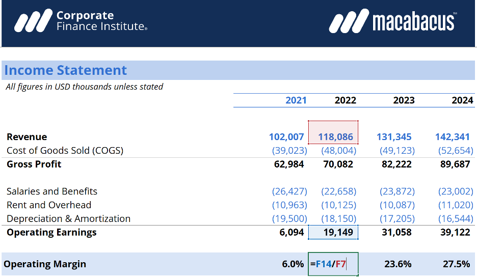

## Table of Contents

## What is an operating margin?

An operating margin is a way to measure how much profit a company makes from its main business activities. It shows the percentage of revenue that remains after paying for the costs of running the business, like salaries, rent, and materials. This number is important because it tells investors and managers how well the company is doing at making money from its core operations, without considering other income or expenses like taxes and interest.

To calculate the operating margin, you take the operating income and divide it by the total revenue, then multiply by 100 to get a percentage. For example, if a company has an operating income of $50,000 and total revenue of $200,000, the operating margin would be 25%. A higher operating margin means the company is more efficient at turning its revenue into profit. This can be useful for comparing different companies or tracking a company's performance over time.

## Why is operating margin important for businesses?

Operating margin is important for businesses because it shows how well they are doing at making money from their main work. It tells business owners and investors if the company is good at controlling costs and making a profit from what it sells or the services it provides. A high operating margin means the business is doing a good job at turning what it earns into profit, which is a sign of a healthy and efficient company.

This number is also useful for comparing how different companies are doing, even if they are in the same industry. If one company has a higher operating margin than another, it might mean that the first company is better at managing its costs or getting more money for its products or services. Over time, businesses can use the operating margin to see if they are getting better or worse at making money, which helps them make smart decisions about how to run the business.

## How is operating margin calculated?

To find out a company's operating margin, you take the operating income and divide it by the total revenue. Then, you multiply the result by 100 to turn it into a percentage. Operating income is what's left after you subtract the costs of running the business, like salaries, rent, and materials, from the total revenue. So, if a company makes $200,000 in revenue and has $50,000 left after paying for everything, the operating margin would be 25%.

This number is important because it shows how good a company is at making money from its main work. A higher operating margin means the company is better at turning what it earns into profit. This helps business owners and investors see if the company is doing well and managing its costs properly. It's also useful for comparing different companies or seeing if a company's performance is getting better or worse over time.

## What is considered a good operating margin?

A good operating margin depends a lot on the industry a company is in. Some industries, like software or technology, usually have higher operating margins because they don't need to spend as much on things like materials or factories. In these industries, a good operating margin might be around 20% to 30% or even higher. On the other hand, industries like retail or restaurants, which have higher costs for things like inventory and labor, might consider an operating margin of 5% to 10% to be good.

It's also important to compare a company's operating margin to other companies in the same industry. If a company's operating margin is higher than most of its competitors, it's probably doing a good job at managing costs and making a profit. But if it's lower, it might need to find ways to cut costs or make more money from what it sells. Over time, a company can use its operating margin to see if it's getting better or worse at making money, which helps with making smart business decisions.

## How do operating margins vary by industry?

Operating margins can be very different depending on the industry a company is in. Some industries have higher operating margins because they don't need to spend as much money on things like materials or factories. For example, software and technology companies often have high operating margins, sometimes around 20% to 30% or even more. This is because once they create their software, it doesn't cost much to sell it to more customers. On the other hand, industries like retail or restaurants usually have lower operating margins, often between 5% to 10%. These businesses have to spend a lot on inventory, labor, and other costs, which eats into their profits.

It's important to compare a company's operating margin to others in the same industry to see if it's doing well. If a company has a higher operating margin than most of its competitors, it's probably good at managing costs and making a profit. But if its operating margin is lower, it might need to find ways to save money or charge more for its products or services. Over time, a company can use its operating margin to see if it's getting better or worse at making money, which helps with making smart business decisions.

## What factors can affect a business's operating margin?

Many things can change a business's operating margin. One big [factor](/wiki/factor-investing) is how much it costs to make or sell the products or services. If the price of materials goes up, or if the business has to pay more for things like rent or salaries, the operating margin can go down. On the other hand, if the business finds ways to save money, like using cheaper materials or making things more efficiently, the operating margin can go up. Another factor is how much the business can charge for its products or services. If it can raise prices without losing customers, the operating margin can improve.

Competition can also affect the operating margin. If there are a lot of other businesses selling similar things, they might have to lower their prices to keep customers, which can hurt the operating margin. But if the business has something special that others don't, it might be able to charge more and have a better operating margin. Changes in the economy can also play a role. If people have less money to spend, they might buy less, which can lower the operating margin. But if the economy is doing well, people might buy more, helping the operating margin.

Overall, a business's operating margin can go up or down based on many things. It's important for the business to keep an eye on these factors and find ways to manage them well. By doing this, they can keep their operating margin healthy and make sure they are making a good profit from their main work.

## How can a business improve its operating margin?

A business can improve its operating margin by finding ways to cut costs and make more money from what it sells. One way to cut costs is by looking at all the things the business spends money on, like materials, rent, and salaries, and seeing if there are cheaper options. For example, they might find a new supplier that charges less for materials, or they might move to a smaller office to save on rent. Another way to save money is by making things more efficiently, like using machines or technology to do work faster and with fewer mistakes. By spending less, the business can keep more of the money it makes as profit.

Another way to improve the operating margin is by making more money from what the business sells. This can be done by raising prices if customers are willing to pay more, or by selling more products or services. The business might also find new ways to make money, like adding new products or services that customers want. It's important to keep an eye on what competitors are doing, because if they are charging less, the business might need to find other ways to stand out and keep customers coming back. By focusing on both cutting costs and making more money, a business can improve its operating margin and be more successful.

## What are the limitations of using operating margin as a performance metric?

Using operating margin as a performance metric has some limitations. One big problem is that it doesn't show the whole picture of a company's financial health. Operating margin only looks at the money made from the main business activities, but it doesn't include other important things like taxes, interest on loans, or one-time costs. So, a company might have a good operating margin but still be in trouble because of high debt or other expenses that aren't included in the calculation.

Another limitation is that operating margins can be different in different industries. What's considered a good operating margin in one industry might be bad in another. This makes it hard to compare companies that are in different types of businesses. Also, companies can sometimes make their operating margins look better by changing how they report their costs or by not including certain expenses. This means that the operating margin might not always give a true and fair view of how well a company is really doing.

## How do operating margins impact investment decisions?

Operating margins are important for people who want to invest in a company because they show how well the business is doing at making money from its main work. A high operating margin means the company is good at controlling costs and turning what it earns into profit. This can make investors feel more confident about putting their money into the company because it seems like a healthy and efficient business. On the other hand, if a company has a low operating margin, it might make investors think twice because it could mean the company is struggling to make a profit or is not managing its costs well.

But, operating margins are just one part of the story. Investors also need to look at other things like how much debt the company has, what the overall economy is doing, and how the company compares to others in the same industry. A company might have a good operating margin but still be risky if it has a lot of debt or if the industry is going through tough times. So, while operating margins can help investors make decisions, they should use them along with other information to get a full picture of a company's health and potential for growth.

## What are some common strategies to maintain a healthy operating margin?

To keep a healthy operating margin, businesses need to focus on both making more money and spending less. One way to make more money is by raising prices if customers are willing to pay more, or by finding new ways to sell more products or services. For example, a business might add new products that customers want, or they might find new markets to sell in. It's also important to keep an eye on what competitors are doing. If other businesses are charging less, the company might need to find other ways to stand out and keep customers coming back, like offering better service or a special feature.

Spending less is another key part of maintaining a healthy operating margin. Businesses can do this by looking at all their costs, like materials, rent, and salaries, and seeing if there are cheaper options. For example, they might switch to a new supplier that charges less for materials, or they might move to a smaller office to save on rent. Another way to save money is by making things more efficiently, like using machines or technology to do work faster and with fewer mistakes. By focusing on both making more money and spending less, a business can keep its operating margin healthy and stay successful.

## How does operating margin relate to other financial metrics like EBITDA and net profit margin?

Operating margin, EBITDA (Earnings Before Interest, Taxes, Depreciation, and Amortization), and net profit margin are all important numbers that show how well a business is doing, but they each tell a different part of the story. Operating margin looks at the profit a company makes from its main work, after paying for things like materials, salaries, and rent. It's a good way to see how efficient the business is at making money from what it sells or the services it provides. EBITDA is similar, but it goes a step further by adding back in costs like depreciation and amortization, which are non-cash expenses. This gives investors a better idea of the company's cash flow and operating performance without the impact of these accounting adjustments.

Net profit margin, on the other hand, takes everything into account, including taxes, interest on loans, and any one-time costs or gains. It shows the final profit after all expenses have been paid. While operating margin and EBITDA focus more on the core business operations, net profit margin gives a complete picture of the company's overall profitability. Investors often look at all three metrics together to get a full understanding of a company's financial health. Operating margin can be seen as a middle ground between EBITDA and net profit margin, helping to bridge the gap between operational efficiency and final profitability.

## What advanced analytical techniques can be used to forecast future operating margins?

To forecast future operating margins, businesses can use advanced analytical techniques like regression analysis and time series analysis. Regression analysis helps by looking at past data to find patterns and relationships between different factors that affect the operating margin, like sales [volume](/wiki/volume-trading-strategy), cost of goods sold, and operating expenses. By understanding these relationships, businesses can predict how changes in these factors might affect their future operating margins. For example, if a company knows that a 10% increase in sales volume usually leads to a 2% increase in operating margin, they can use this information to forecast future margins based on expected sales growth.

Another useful technique is time series analysis, which looks at how the operating margin has changed over time to predict future trends. This method can help businesses see if their operating margins are getting better or worse and can account for seasonal changes or other patterns. By using historical data, time series analysis can create models that forecast future operating margins, helping businesses plan and make decisions. Both regression analysis and time series analysis need good data and careful analysis, but they can give businesses a clearer picture of what their operating margins might look like in the future.

## What is Understanding Business Profitability?

Profitability is a key indicator of a company's success, reflecting its ability to generate profits from its operations. It is a critical metric for stakeholders, including investors, analysts, and company management, as it provides insight into the financial health and performance of a business. Assessing profitability involves analyzing various financial metrics that highlight different aspects of a company's operations.

One of the primary metrics used to gauge profitability is the operating margin. This metric evaluates the proportion of a company’s revenue that remains after deducting operating expenses, which include costs associated with the day-to-day functioning of the business, such as wages, materials, and overhead. Mathematically, operating margin is calculated as:

$$

\text{Operating Margin} = \left( \frac{\text{Operating Income}}{\text{Revenue}} \right) \times 100 
$$

Operating margin serves as a measure of how efficiently a company is managing its resources and controlling its costs to maximize profits. It is particularly valuable for comparing companies within the same industry, as it highlights those that are leaders in operational efficiency.

Alongside the operating margin, other key metrics like net profit margin and gross profit margin are essential for a comprehensive evaluation of profitability. The net profit margin is an all-encompassing measure that considers all expenses, including taxes and interest, to determine what percentage of total revenue is actual profit. It is calculated as:

$$

\text{Net Profit Margin} = \left( \frac{\text{Net Income}}{\text{Revenue}} \right) \times 100 
$$

The gross profit margin focuses on the cost of goods sold (COGS) and excludes other operating expenses. It indicates the efficiency with which a company uses its materials and labor to produce goods. The formula for gross profit margin is:

$$

\text{Gross Profit Margin} = \left( \frac{\text{Revenue} - \text{COGS}}{\text{Revenue}} \right) \times 100 
$$

These financial metrics collectively provide a detailed view of a company's profitability. For investors, understanding these metrics is crucial for identifying companies with robust business models that are capable of delivering long-term growth and returns on investment. Companies that consistently maintain strong profitability metrics are often seen as viable investment opportunities, reflecting their ability to manage costs effectively, sustain operations, and generate stable earnings.

By analyzing these key metrics, investors and analysts can better assess a company's operational efficacy and its potential for future success. This analysis is pivotal for making informed investment decisions and strategically allocating resources to maximize returns.

## What is the Role of Operating Margin?

Operating margin is a vital financial metric that evaluates a company's operational efficiency by representing the percentage of revenue remaining after the deduction of operating expenses. It reflects a firm's ability to manage its core business operations without accounting for interest and tax expenses. The operating margin is calculated using the formula:

$$
\text{Operating Margin} = \left( \frac{\text{Operating Income}}{\text{Revenue}} \right) \times 100
$$

Where operating income refers to the profit realized from a business's operations after deducting the operational costs such as wages, raw materials, and other overheads, yet before subtracting interest and taxes.

A primary advantage of analyzing operating margin is its role in assessing how well a company controls its expenses relative to its income. Investors and analysts often use this metric to evaluate if a company is efficiently managing its cost structure. A higher operating margin indicates a greater proportion of revenue is converted into profit, suggesting better cost control and operational efficiency. For example, a consistently high operating margin implies that a company is effectively minimizing operating expenses while maintaining steady revenue inflows.

Comparative analysis of operating margins within an industry allows stakeholders to identify leaders in operational efficiency and cost management. Companies with sustainable and superior operating margins often have a competitive advantage, signifying the ability to generate higher profit from their sales relative to peers. This is particularly important in industries with narrow economic margins, where marginal improvements in operating efficiency can lead to significant competitive advantages.

Using operating margin as a benchmarking tool, businesses can compare their efficiency against competitors within the same sector. This comparison helps to ascertain competitive strengths and weaknesses, enabling companies to strategize effectively. In industries characterized by high competition and thin margins, operating margin serves as a crucial indicator for stakeholders to differentiate between companies that excel in managing their resources and those that do not.

In summary, the operating margin functions as a critical measure of a company's operational success, encapsulating the efficiency of its inherent business model and its competence in controlling costs. It provides investors and analysts with invaluable insights that aid in distinguishing well-managed companies, thereby guiding investment and strategic decisions.

## What is the impact of operating margin in algo trading?

In [algorithmic trading](/wiki/algorithmic-trading), the use of operating margins plays a pivotal role in refining trading strategies based on the operational performance of companies. By integrating operating margin analysis into trading algorithms, traders gain valuable insights into the economic viability and operational efficiency of businesses before actions are executed on the market. This financial metric serves as a robust indicator of a company's financial resilience and stability, making it an essential tool in risk reduction strategies.

Operating margins reflect the proportion of revenue that remains after deducting operating expenses, which includes costs associated with core business operations but excludes interest and taxes. This metric is calculated as follows:

$$
\text{Operating Margin} = \left( \frac{\text{Operating Income}}{\text{Net Sales}} \right) \times 100
$$

Here, operating income is determined by subtracting total operating expenses from gross income, while net sales denote the total revenue generated from operations.

Traders leverage companies' operating margins to identify potential opportunities for scaling operations or penetrating new markets. High operating margins are indicative of businesses that effectively manage their expenses relative to sales, thereby suggesting the potential for growth and expansion without significant additional costs. Consequently, algorithmic trading programs, which incorporate operating margin analysis, can pinpoint firms that are likely to be stable and strong performers, allowing traders to make informed decisions that enhance the prospects for returns.

In practical trading strategy development, algorithms might be designed to prioritize stocks of companies exhibiting sustained or improving operating margins over a specific period. For example, a Python-based trading algorithm could utilize libraries such as Pandas or NumPy to perform data analysis, identifying companies meeting predefined operating margin criteria:

```python
import pandas as pd

# Sample dataframe with company data
data = {'Company': ['A Corp', 'B Inc', 'C LLC'],
        'Operating Income': [150000, 200000, 120000],
        'Net Sales': [500000, 1000000, 400000]}

df = pd.DataFrame(data)

# Calculate Operating Margin
df['Operating Margin'] = (df['Operating Income'] / df['Net Sales']) * 100

# Filter companies with Operating Margin above 20%
filtered_df = df[df['Operating Margin'] > 20]

print(filtered_df)
```

The above example illustrates a simple process of calculating operating margins and filtering companies that exceed a defined threshold, providing traders with a list of potentially profitable investment targets.

Ultimately, the incorporation of operating margin analysis into algorithmic trading frameworks contributes to the creation of more optimized and profitable trading programs. By focusing on companies demonstrating strong operational efficiencies, traders can achieve a competitive advantage, resulting in enhanced portfolio performance and effective risk management strategies. As such, operating margin analysis remains a critical component within the sophisticated world of automated trading.

## References & Further Reading

[1]: ["Financial Statement Analysis and Security Valuation"](https://www.amazon.com/Financial-Statement-Analysis-Security-Valuation/dp/0073379662) by Stephen Penman

[2]: "The Interaction between Operating Efficiency and Financial Leverage on Firm Performance: Evidence from Taiwan" by Hsiang-Lin Chen. (Research paper available on academic databases)

[3]: ["Algorithmic Trading and DMA: An Introduction to Direct Access Trading Strategies"](https://www.amazon.com/Algorithmic-Trading-DMA-introduction-strategies/dp/0956399207) by Barry Johnson

[4]: ["Principles of Corporate Finance"](https://en.wikipedia.org/wiki/Principles_of_Corporate_Finance) by Richard A. Brealey, Stewart C. Myers, and Franklin Allen

[5]: "The Role of Operating Margin in Business Valuation and Financial Modeling" by John R. Graham. (Published in reputable finance journals)

[6]: ["Trading and Exchanges: Market Microstructure for Practitioners"](https://www.amazon.com/Trading-Exchanges-Market-Microstructure-Practitioners/dp/0195144708) by Larry Harris