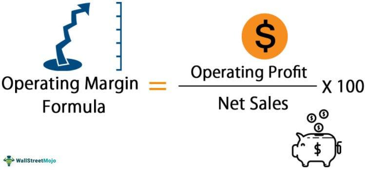

In the world of finance, business profitability and financial metrics are fundamental in determining the success and sustainability of business operations. Among these metrics, the operating margin stands out as a key indicator of a company's efficiency in converting sales into profits after covering its operating expenses. The operating margin is calculated using the formula:

$$
\text{Operating Margin} = \left( \frac{\text{Operating Income}}{\text{Net Sales}} \right) \times 100
$$



This percentage reflects how much profit a company retains on each dollar of sales, after paying for variable costs of production, such as wages and raw materials, but before paying interest or tax.

Algorithmic trading, often called algo trading, harnesses mathematical models and statistical analysis to execute trades with precision and speed. This approach underscores the importance of understanding financial metrics like operating margins, as these figures are pivotal in crafting successful trading strategies. Algo trading models can incorporate operating margins to assess a company's profit-generating efficiency before executing trades.

This article examines the importance of operating margins in assessing business profitability and their influence on algorithmic trading strategies. By integrating operating margin analysis, traders and investors can enhance trading strategies and improve overall business performance, ensuring long-term success in the financial markets.

## Table of Contents

## Understanding Business Profitability

Profitability is a key indicator of a company's success, reflecting its ability to generate profits from its operations. It is a critical metric for stakeholders, including investors, analysts, and company management, as it provides insight into the financial health and performance of a business. Assessing profitability involves analyzing various financial metrics that highlight different aspects of a company's operations.

One of the primary metrics used to gauge profitability is the operating margin. This metric evaluates the proportion of a company’s revenue that remains after deducting operating expenses, which include costs associated with the day-to-day functioning of the business, such as wages, materials, and overhead. Mathematically, operating margin is calculated as:

$$

\text{Operating Margin} = \left( \frac{\text{Operating Income}}{\text{Revenue}} \right) \times 100 
$$

Operating margin serves as a measure of how efficiently a company is managing its resources and controlling its costs to maximize profits. It is particularly valuable for comparing companies within the same industry, as it highlights those that are leaders in operational efficiency.

Alongside the operating margin, other key metrics like net profit margin and gross profit margin are essential for a comprehensive evaluation of profitability. The net profit margin is an all-encompassing measure that considers all expenses, including taxes and interest, to determine what percentage of total revenue is actual profit. It is calculated as:

$$

\text{Net Profit Margin} = \left( \frac{\text{Net Income}}{\text{Revenue}} \right) \times 100 
$$

The gross profit margin focuses on the cost of goods sold (COGS) and excludes other operating expenses. It indicates the efficiency with which a company uses its materials and labor to produce goods. The formula for gross profit margin is:

$$

\text{Gross Profit Margin} = \left( \frac{\text{Revenue} - \text{COGS}}{\text{Revenue}} \right) \times 100 
$$

These financial metrics collectively provide a detailed view of a company's profitability. For investors, understanding these metrics is crucial for identifying companies with robust business models that are capable of delivering long-term growth and returns on investment. Companies that consistently maintain strong profitability metrics are often seen as viable investment opportunities, reflecting their ability to manage costs effectively, sustain operations, and generate stable earnings.

By analyzing these key metrics, investors and analysts can better assess a company's operational efficacy and its potential for future success. This analysis is pivotal for making informed investment decisions and strategically allocating resources to maximize returns.

## The Role of Operating Margin

Operating margin is a vital financial metric that evaluates a company's operational efficiency by representing the percentage of revenue remaining after the deduction of operating expenses. It reflects a firm's ability to manage its core business operations without accounting for interest and tax expenses. The operating margin is calculated using the formula:

$$
\text{Operating Margin} = \left( \frac{\text{Operating Income}}{\text{Revenue}} \right) \times 100
$$

Where operating income refers to the profit realized from a business's operations after deducting the operational costs such as wages, raw materials, and other overheads, yet before subtracting interest and taxes.

A primary advantage of analyzing operating margin is its role in assessing how well a company controls its expenses relative to its income. Investors and analysts often use this metric to evaluate if a company is efficiently managing its cost structure. A higher operating margin indicates a greater proportion of revenue is converted into profit, suggesting better cost control and operational efficiency. For example, a consistently high operating margin implies that a company is effectively minimizing operating expenses while maintaining steady revenue inflows.

Comparative analysis of operating margins within an industry allows stakeholders to identify leaders in operational efficiency and cost management. Companies with sustainable and superior operating margins often have a competitive advantage, signifying the ability to generate higher profit from their sales relative to peers. This is particularly important in industries with narrow economic margins, where marginal improvements in operating efficiency can lead to significant competitive advantages.

Using operating margin as a benchmarking tool, businesses can compare their efficiency against competitors within the same sector. This comparison helps to ascertain competitive strengths and weaknesses, enabling companies to strategize effectively. In industries characterized by high competition and thin margins, operating margin serves as a crucial indicator for stakeholders to differentiate between companies that excel in managing their resources and those that do not.

In summary, the operating margin functions as a critical measure of a company's operational success, encapsulating the efficiency of its inherent business model and its competence in controlling costs. It provides investors and analysts with invaluable insights that aid in distinguishing well-managed companies, thereby guiding investment and strategic decisions.

## Incorporating Financial Metrics in Algorithmic Trading

Algorithmic trading leverages computer algorithms to efficiently execute trading strategies, utilizing financial metrics to enhance decision-making. Among these metrics, operating and profit margins are instrumental in guiding algorithmic decisions by allowing traders to select financially robust companies with consistent returns. Operating margin, which measures the proportion of revenue left after covering operating expenses, is particularly useful in assessing a company's core operational efficiency.

Financial metrics are integrated into algorithmic models to refine portfolio optimization through automated, data-driven processes. These models evaluate numerous data points rapidly, such as historical price patterns, [volume](/wiki/volume-trading-strategy), and various financial ratios, including operating margins. By incorporating such metrics, algorithms can automate the identification of companies that exhibit strong operational performance and efficiency.

The implementation of operating margin analysis in algorithms provides traders with a competitive advantage by pinpointing firms with superior operational efficiencies. This identification process is particularly valuable in selecting stocks or other financial instruments that are likely to outperform in both stable and volatile market conditions. The systematic nature of algorithms allows them to continuously adapt and adjust to varying market data, honing in on the most promising investment opportunities.

For instance, a simplified Python code snippet for evaluating operating margin within an [algorithmic trading](/wiki/algorithmic-trading) strategy might look as follows:

```python
def compute_operating_margin(revenue, operating_expenses):
    return (revenue - operating_expenses) / revenue

# Example calculations for a hypothetical company
revenue = 500000.0
operating_expenses = 350000.0

operating_margin = compute_operating_margin(revenue, operating_expenses)

print(f"Operating Margin: {operating_margin:.2%}")
```

Such computational approaches, by enabling traders to make informed selections of investment targets, contribute to the robustness and effectiveness of trading strategies. These methodologies ensure that trading algorithms prioritize companies with consistent profitability, thereby optimizing portfolio performance and capitalizing on the strengths of financial metrics.

## Impact of Operating Margin in Algo Trading

In algorithmic trading, the use of operating margins plays a pivotal role in refining trading strategies based on the operational performance of companies. By integrating operating margin analysis into trading algorithms, traders gain valuable insights into the economic viability and operational efficiency of businesses before actions are executed on the market. This financial metric serves as a robust indicator of a company's financial resilience and stability, making it an essential tool in risk reduction strategies.

Operating margins reflect the proportion of revenue that remains after deducting operating expenses, which includes costs associated with core business operations but excludes interest and taxes. This metric is calculated as follows:

$$
\text{Operating Margin} = \left( \frac{\text{Operating Income}}{\text{Net Sales}} \right) \times 100
$$

Here, operating income is determined by subtracting total operating expenses from gross income, while net sales denote the total revenue generated from operations.

Traders leverage companies' operating margins to identify potential opportunities for scaling operations or penetrating new markets. High operating margins are indicative of businesses that effectively manage their expenses relative to sales, thereby suggesting the potential for growth and expansion without significant additional costs. Consequently, algorithmic trading programs, which incorporate operating margin analysis, can pinpoint firms that are likely to be stable and strong performers, allowing traders to make informed decisions that enhance the prospects for returns.

In practical trading strategy development, algorithms might be designed to prioritize stocks of companies exhibiting sustained or improving operating margins over a specific period. For example, a Python-based trading algorithm could utilize libraries such as Pandas or NumPy to perform data analysis, identifying companies meeting predefined operating margin criteria:

```python
import pandas as pd

# Sample dataframe with company data
data = {'Company': ['A Corp', 'B Inc', 'C LLC'],
        'Operating Income': [150000, 200000, 120000],
        'Net Sales': [500000, 1000000, 400000]}

df = pd.DataFrame(data)

# Calculate Operating Margin
df['Operating Margin'] = (df['Operating Income'] / df['Net Sales']) * 100

# Filter companies with Operating Margin above 20%
filtered_df = df[df['Operating Margin'] > 20]

print(filtered_df)
```

The above example illustrates a simple process of calculating operating margins and filtering companies that exceed a defined threshold, providing traders with a list of potentially profitable investment targets.

Ultimately, the incorporation of operating margin analysis into algorithmic trading frameworks contributes to the creation of more optimized and profitable trading programs. By focusing on companies demonstrating strong operational efficiencies, traders can achieve a competitive advantage, resulting in enhanced portfolio performance and effective risk management strategies. As such, operating margin analysis remains a critical component within the sophisticated world of automated trading.

## Conclusion

Understanding and utilizing financial metrics like operating margins is crucial for evaluating business profitability and making informed investment decisions. The operating margin, calculated as the ratio of operating income to revenue, is a fundamental measure for both [fundamental analysis](/wiki/fundamental-analysis) and algorithmic trading. This metric provides valuable insights into a company's operational efficiency and its competitiveness within the market. A higher operating margin indicates a company is adept at converting revenue into profit after covering its operational costs, which can be a benchmark for investors seeking stable investment opportunities.

Integrating operating margins into trading algorithms enhances the strategic, data-driven approaches necessary for successful trading. Algorithms that incorporate operating margin analysis can better identify financially resilient companies, thus optimizing investment portfolios. For instance, a basic Python function to calculate operating margin might look like this:

```python
def calculate_operating_margin(operating_income, revenue):
    if revenue == 0:
        return 0
    return (operating_income / revenue) * 100
```

As financial markets continuously evolve, it is imperative for traders and investors to maintain a comprehensive understanding of these metrics. A deep grasp of operating margins and their implications will equip traders with a robust foundation to navigate market changes and capitalize on emerging opportunities. Continuous evaluation of operating margins and other financial metrics enables the optimization of trading algorithms, thereby achieving enduring financial success.

In conclusion, leveraging financial metrics like operating margins not only aids in evaluating business efficacy but also fortifies trading strategies against market [volatility](/wiki/volatility-trading-strategies). As such, these insights play a pivotal role in crafting more refined and profitable trading algorithms.

## References & Further Reading

[1]: ["Financial Statement Analysis and Security Valuation"](https://www.amazon.com/Financial-Statement-Analysis-Security-Valuation/dp/0073379662) by Stephen Penman

[2]: "The Interaction between Operating Efficiency and Financial Leverage on Firm Performance: Evidence from Taiwan" by Hsiang-Lin Chen. (Research paper available on academic databases)

[3]: ["Algorithmic Trading and DMA: An Introduction to Direct Access Trading Strategies"](https://www.amazon.com/Algorithmic-Trading-DMA-introduction-strategies/dp/0956399207) by Barry Johnson

[4]: ["Principles of Corporate Finance"](https://en.wikipedia.org/wiki/Principles_of_Corporate_Finance) by Richard A. Brealey, Stewart C. Myers, and Franklin Allen

[5]: "The Role of Operating Margin in Business Valuation and Financial Modeling" by John R. Graham. (Published in reputable finance journals)

[6]: ["Trading and Exchanges: Market Microstructure for Practitioners"](https://www.amazon.com/Trading-Exchanges-Market-Microstructure-Practitioners/dp/0195144708) by Larry Harris