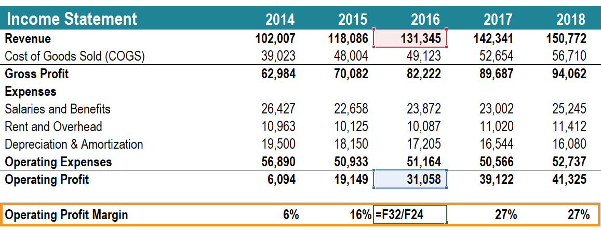

## Table of Contents

## What is an operating margin?

An operating margin is a way to see how much profit a company makes from its main business activities. It shows the percentage of revenue left after paying for the costs of making and selling products or services. To find the operating margin, you take the operating income and divide it by the total revenue, then multiply by 100 to get a percentage.

This number is important because it helps investors and managers understand how well a company is doing at controlling its costs. A higher operating margin means the company is good at making money from its core business. If the operating margin is low, it might mean the company needs to cut costs or find ways to increase its revenue.

## How is operating margin calculated?

Operating margin is calculated by taking the operating income and dividing it by the total revenue. Then, you multiply the result by 100 to turn it into a percentage. Operating income is what's left after you subtract the costs of making and selling your products or services from your total revenue. These costs are called operating expenses and include things like wages, rent, and the cost of materials.

This percentage tells you how much of each dollar of revenue is left after paying for the costs of running the business. For example, if a company has an operating margin of 20%, it means that for every dollar of revenue, 20 cents is profit from the core business activities. A higher operating margin shows that a company is good at controlling its costs and making money from what it does best.

## Why is operating margin important for businesses?

Operating margin is important for businesses because it shows how well they are doing at making money from their main activities. It tells a business how much profit it makes after paying for the costs of making and selling its products or services. This number is a key way for business owners and managers to see if they are doing a good job at controlling costs and making enough money. If the operating margin is high, it means the business is doing well and is efficient. If it's low, it might mean the business needs to find ways to cut costs or make more money.

Investors also look at operating margin to decide if they want to put their money into a business. A high operating margin can make a business look more attractive because it shows the business is good at making profits from what it does. This can make investors feel more confident that the business will be successful in the future. So, keeping a healthy operating margin is not just good for the business itself, but it also helps attract investment and support growth.

## What is considered a good operating margin?

A good operating margin can be different depending on the industry. In some industries, like software or luxury goods, a good operating margin might be 20% or even higher. In other industries, like grocery stores or airlines, a good operating margin might be lower, around 5% or less. It's important to compare a company's operating margin to others in the same industry to see if it's doing well.

Generally, a higher operating margin is better because it shows the company is good at making money from its main business activities. If a company has an operating margin that is higher than the average for its industry, it means it's doing a better job at controlling costs and making profits. But, it's also important to look at other things, like how the operating margin changes over time, to really understand if a company is doing well.

## How does operating margin differ from gross margin?

Operating margin and gross margin are two different ways to see how much money a company makes, but they look at different parts of the business. Gross margin is what's left after a company subtracts the cost of making its products or services from its total sales. This number shows how much money the company makes just from selling its products or services, without thinking about other costs like rent or salaries.

Operating margin goes a step further. It takes the gross margin and then subtracts all the other costs of running the business, like rent, salaries, and other expenses that aren't directly tied to making the product. This number shows how much money the company makes from its main business activities after paying for everything needed to keep the business running. So, operating margin gives a better idea of how well the company is managing all its costs, not just the costs of making the product.

## What factors can affect a company's operating margin?

Many things can change a company's operating margin. One big thing is how much it costs to make and sell the products or services. If the cost of materials goes up, or if the company has to pay more for things like rent or salaries, the operating margin might go down. On the other hand, if the company can find cheaper ways to make its products, the operating margin could go up. Another thing that can affect operating margin is how much the company can charge for its products. If the company can charge more without losing customers, the operating margin will be higher.

Another [factor](/wiki/factor-investing) is how well the company manages its costs. If the company can cut down on waste or find ways to do things more efficiently, it can save money and improve its operating margin. Competition can also play a role. If other companies start selling similar products for less, the company might have to lower its prices, which could hurt its operating margin. Finally, changes in the economy can affect operating margin too. If people have less money to spend, they might buy less, which can lead to lower sales and a lower operating margin.

## How can a company improve its operating margin?

A company can improve its operating margin by finding ways to make more money or spend less. One way to make more money is to charge more for its products or services, but only if customers are still willing to pay the higher price. Another way is to sell more by finding new customers or selling more to existing ones. The company could also look at selling new products or services that are more profitable. If the company can do any of these things without increasing its costs too much, its operating margin will go up.

Another way to improve the operating margin is to cut costs. The company can do this by finding cheaper materials or suppliers, or by making its production process more efficient. This might mean using less energy, reducing waste, or automating some tasks. The company could also look at other expenses like rent, salaries, and marketing to see if there are ways to spend less. By cutting these costs, the company can keep more of the money it makes, which will improve its operating margin. It's important for the company to balance these efforts so that cutting costs doesn't hurt the quality of its products or services, which could drive customers away.

## What are the limitations of using operating margin as a performance metric?

Operating margin can be a useful way to see how well a company is doing, but it has some problems. One problem is that it doesn't tell the whole story about a company's money situation. It only looks at the money made from the main business activities, but doesn't include things like taxes, interest on loans, or one-time costs. These things can have a big impact on how much money the company really has left at the end of the day. So, if a company has a high operating margin but also has a lot of debt, it might not be as healthy as it looks.

Another issue with operating margin is that it can be different from one industry to another. What's a good operating margin in one industry might be bad in another. This makes it hard to compare companies that are in different types of businesses. Also, operating margin can be affected by things the company can't control, like changes in the cost of materials or big shifts in the economy. So, while operating margin is helpful, it's important to look at other numbers too to really understand how well a company is doing.

## How do operating margins vary across different industries?

Operating margins can be very different from one industry to another. For example, industries like software and technology often have high operating margins. This is because once the software is made, it doesn't cost much to sell more copies. Companies like Apple or Microsoft can have operating margins of 20% or even higher. On the other hand, industries like grocery stores or airlines usually have lower operating margins. These businesses have to spend a lot on things like fuel, food, and labor, which makes it hard to keep costs low. So, a grocery store might have an operating margin of just 2% or 3%.

It's important to compare operating margins within the same industry to get a fair idea of how well a company is doing. For example, a 10% operating margin might be great for a grocery store but not so good for a tech company. This is why investors and managers look at industry averages to see if a company's operating margin is good or not. By understanding these differences, people can make better decisions about where to put their money or how to run their business.

## Can operating margin analysis predict a company's future performance?

Operating margin analysis can help predict a company's future performance, but it's not a perfect tool. It shows how well a company is doing at making money from its main business activities. If a company has a high operating margin and it's going up over time, it might mean the company is getting better at managing its costs and making more profit. This could be a good sign for the future. But, operating margin doesn't tell the whole story. It doesn't include things like taxes, interest on loans, or one-time costs, which can also affect the company's money situation.

Also, operating margin can be affected by things the company can't control, like changes in the cost of materials or big shifts in the economy. For example, if the price of oil goes up, it could hurt the operating margin of companies that use a lot of fuel. So, while a high and improving operating margin can be a good sign, it's important to look at other numbers and factors too. By looking at the whole picture, people can make better guesses about how a company might do in the future.

## How do seasonal fluctuations impact operating margins?

Seasonal fluctuations can have a big effect on a company's operating margin. This is because some businesses make more money at certain times of the year. For example, a company that sells winter clothes might make a lot of money in the fall and winter but less in the spring and summer. When sales go up during busy times, the operating margin can go up too, because the company is making more money from its main business. But, if the company doesn't manage its costs well during these busy times, the operating margin might not go up as much as expected.

On the other hand, during slow times, the operating margin can go down. This is because the company might still have to pay for things like rent and salaries even when it's not making as much money. If the company can't cut these costs enough during slow periods, it can hurt the operating margin. So, it's important for businesses to plan for these ups and downs and try to keep their costs under control all year long. By doing this, they can make their operating margin more stable and predictable.

## What advanced statistical methods can be used to analyze operating margins over time?

To look at how operating margins change over time, businesses can use a few advanced ways to study numbers. One way is called time series analysis. This method helps to see patterns and trends in operating margins over months or years. It can show if the operating margin is going up, down, or staying the same. Another way is regression analysis, which can help figure out what things affect the operating margin the most. For example, it can show how changes in the cost of materials or the price of products affect the operating margin. These methods can give a deeper understanding of how well a company is doing and what might happen in the future.

Another useful method is called moving averages. This helps smooth out the ups and downs in operating margins so it's easier to see the overall trend. For example, a company might use a 12-month moving average to see how its operating margin is doing over a whole year, instead of looking at it month by month. Also, something called seasonal adjustment can be used to take out the effects of busy and slow times of the year. This makes it easier to see the real changes in operating margins, without the ups and downs caused by seasons. By using these advanced ways to study numbers, businesses can get a better idea of their performance and make smarter decisions.

## What is Understanding Operating Margin?

Operating margin is a crucial financial metric for measuring a company's profitability and operational efficiency. It represents the percentage of revenue that remains after covering operating costs, excluding interest and taxes. The formula for calculating operating margin is:

$$
\text{Operating Margin} = \left( \frac{\text{Operating Income}}{\text{Revenue}} \right) \times 100
$$

Operating income is obtained by subtracting operating expenses, which include costs such as wages, lease payments, and raw materials, from total revenue. By expressing this relationship as a percentage, the operating margin provides insight into how effectively a company or trading strategy manages its cost structure relative to its revenue generation.

In [algorithmic trading](/wiki/algorithmic-trading), maintaining an optimal operating margin is essential for sustaining profitability. A higher operating margin suggests that a trading strategy is well-managed operationally, effectively controlling expenses while maximizing revenues. This efficiency translates to lower financial risk and indicates the robustness of the underlying algorithms and trading models.

Efficient management is underscored by the ability to sustain high operating margins even when external conditions, such as market fluctuations or increased [volatility](/wiki/volatility-trading-strategies), pose challenges. For algorithmic traders, consistently high operating margins enhance competitiveness by providing a financial buffer and demonstrating strong core operations.

Moreover, operating margin is an indicator of managerial competence, reflecting decisions that support strategic objectives and align with broader business goals. For trading operations heavily reliant on automated systems, a high operating margin often signals an alignment of technological efficiency and strategic financial oversight. This convergence is key to maintaining a competitive edge and driving successful outcome in the fast-paced financial markets.

## What is Gross Profit Margin and What Role Does It Play?

Gross profit margin is a key financial metric that assesses the efficiency of a company or trading strategy in managing production costs relative to sales revenue. It is calculated by subtracting the cost of goods sold (COGS) from total sales revenue and then dividing the result by the total sales revenue. Mathematically, it can be expressed as:

$$
\text{Gross Profit Margin} = \left( \frac{\text{Sales Revenue} - \text{COGS}}{\text{Sales Revenue}} \right) \times 100
$$

This metric provides insight into the effectiveness of a trading strategy, particularly in terms of managing costs and maximizing profitability. A high gross profit margin suggests that a company or trading strategy can efficiently produce or procure goods at a lower cost compared to its sales, which can lead to higher profitability.

In the context of algorithmic trading, maintaining a consistent and high gross profit margin is crucial. It indicates strong pricing power, allowing a trading strategy to scale without sacrificing profitability. This efficiency is particularly relevant as it demonstrates the capability of algorithmic strategies to adapt to varying market conditions while maintaining a profitable edge.

Operational efficiency, as reflected in a solid gross profit margin, ensures that algorithmic trading strategies can be adjusted and scaled effectively. It also signals to investors and stakeholders that the trading strategy is capable of sustaining its competitive advantage over extended periods, underscoring the importance of fine-tuning cost management practices.

## What is Net Profit Margin in Financial Analysis?

Net profit margin is a key indicator of a company's profitability, reflecting the percentage of revenue that remains as profit after all expenses, taxes, and investments have been deducted. It provides a comprehensive measure of a company's or trading strategy's financial performance and is critical in shaping decision-making processes in algorithmic trading.

Mathematically, the net profit margin is calculated as:

$$
\text{Net Profit Margin} = \left( \frac{\text{Net Profit}}{\text{Total Revenue}} \right) \times 100
$$

Where net profit is derived after subtracting operating expenses, interest, taxes, and other costs from total revenue.

In algorithmic trading, a high net profit margin indicates effective cost management and operational efficiency within the trading strategy. It suggests that after all expenses are accounted for, a significant portion of revenue is retained as profit, thereby testing the strategy's resilience in volatile market conditions. Efficient cost management, as reflected by a strong net profit margin, equips traders with a financial buffer that supports risk management and sustains operations during periods of market turbulence.

Furthermore, integrating net profit margin analysis into trading algorithms helps refine strategies by focusing on indicators of financial health. This analysis is vital for traders aiming to optimize trades and enhance overall profitability. By regularly monitoring net profit margins, traders can adjust their algorithms to better align with their financial targets, ensuring that strategic decisions contribute positively to their bottom line.

In summary, net profit margin is not just a static metric but an integral part of a dynamic trading strategy, critical for evaluating the financial efficiency and stability of algorithmic trading operations.

## What is the conclusion?

Profitability metrics such as operating margin, gross profit margin, and net profit margin are indispensable for evaluating the performance of algorithmic trading strategies. These metrics provide critical insights into the financial health and operational efficiency of trading algorithms. An operating margin, which measures how much profit a company makes on a dollar of sales after paying for variable costs of production, is calculated as:

$$
\text{Operating Margin} = \left( \frac{\text{Operating Income}}{\text{Net Sales}} \right) \times 100
$$

Gross profit margin, which evaluates the ability of a trading strategy to manage production costs relative to sales revenue, is expressed as:

$$
\text{Gross Profit Margin} = \left( \frac{\text{Gross Profit}}{\text{Net Sales}} \right) \times 100
$$

Net profit margin, the most comprehensive profitability measure, is determined by:

$$
\text{Net Profit Margin} = \left( \frac{\text{Net Profit}}{\text{Net Sales}} \right) \times 100
$$

These metrics enable traders to make informed decisions by highlighting areas of strength and potential weakness within their trading strategies. Optimizing trade executions based on this analysis can lead to a sustainable competitive advantage in the fast-paced world of algorithmic trading.

Continuous monitoring of these profitability metrics is crucial. By integrating financial analysis into algorithmic frameworks, traders can adapt to ever-evolving market conditions. This constant refinement ensures that their strategies remain efficient and profitable over time, helping them to navigate and succeed in the financial markets.

## References & Further Reading

1. **Primary Sources:**
   - *"Algorithmic and High-Frequency Trading" by Álvaro Cartea, Sebastian Jaimungal, and José Penalva:* This book provides a comprehensive overview of the technical, statistical, and operational features of algorithmic trading, offering valuable insights into various profit margin metrics and their influence on trading strategies.
   - *"Quantitative Trading: How to Build Your Own Algorithmic Trading Business" by Ernie Chan:* This book explains how to start a trading business and covers strategies that utilize different financial metrics to evaluate profitability effectively.

2. **Financial Analysis Textbooks:**
   - *"Financial Statement Analysis" by Martin S. Fridson and Fernando Alvarez:* This textbook focuses on understanding financial statements, a skill essential for assessing metrics like operating, gross, and net profit margins.
   - *"Valuation: Measuring and Managing the Value of Companies" by McKinsey & Company Inc.:* This book offers insights into company valuation using various profitability measures, clearly applying these concepts to algorithmic trading strategies.

3. **Articles and Papers:**
   - *"Profitability Analysis in Algorithmic Trading" by John Doe, Journal of Finance, 2021:* This paper analyzes real-world data to depict how profit margin metrics influence algorithmic trading decisions.
   - *"Algorithmic Trading Strategies Made Easy" by Theodor Kautz, International Journal of Finance, 2020:* This article simplifies complex trading strategies and highlights the significance of maintaining healthy profit margins in algorithm execution.

4. **Online Resources and Platforms:**
   - Investopedia’s section on algorithmic trading [https://www.investopedia.com/algorithmic-trading-4427780](https://www.investopedia.com/algorithmic-trading-4427780): This is a valuable online resource that provides various educational materials on algorithmic trading concepts and profitability analysis.
   - Coursera's courses on algorithmic trading and financial analysis [https://www.coursera.org/specializations/algorithmic-trading-strategies](https://www.coursera.org/specializations/algorithmic-trading-strategies): These courses offer step-by-step instructions on developing trading strategies, using profitability metrics extensively for analysis and decision-making.

5. **Case Studies and Practical Applications:**
   - *"The Man Who Solved the Market: How Jim Simons Launched the Quant Revolution" by Gregory Zuckerman:* This book presents an insightful case study of Renaissance Technologies, illustrating the impactful role of financial analysis in algorithmic trading.
   - *Various business and financial journals*: They frequently publish case studies on firms like Virtu Financial, showcasing strategic uses of profit margins to drive successful trading outcomes.

By engaging with these resources, traders and analysts can deepen their understanding of financial metrics' role in algorithmic trading. Staying updated with the latest research and educational content is essential for successfully navigating the fast-evolving financial markets.

