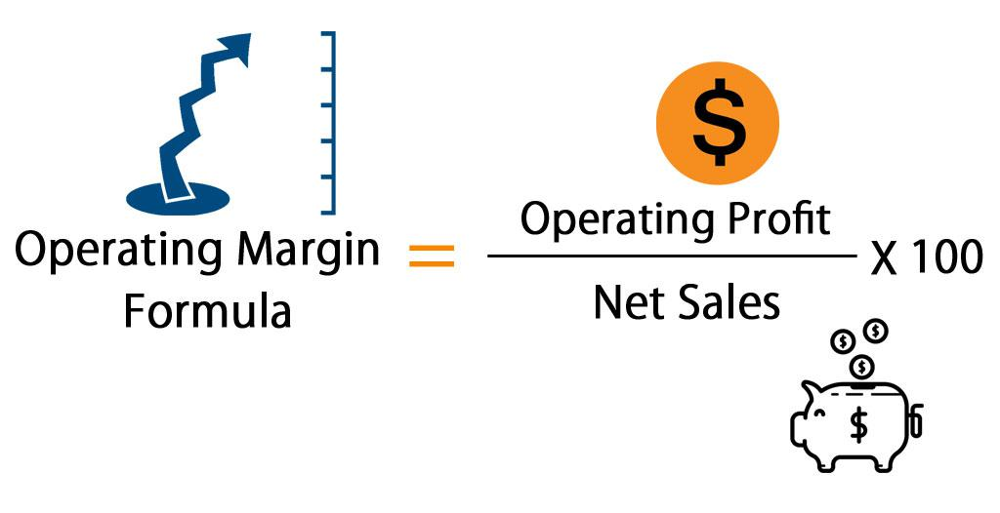

Algorithmic trading is a practice that leverages sophisticated algorithms to automate the buying and selling of financial instruments, enhancing the efficiency and speed of trade execution. It profoundly relies on data-driven financial analysis to ensure consistent profitability in markets characterized by volatility and unpredictability. Critical to this analysis are financial metrics such as the operating margin, gross profit margin, and net profit margin, which serve as vital indicators of a trading strategy's financial health and operational efficiency.

The operating margin offers insight into the proportion of revenue that remains after covering operating expenses. This metric is crucial for evaluating how effectively a trading strategy utilizes its resources to generate profits. On the other hand, the gross profit margin focuses on the efficiency of managing production costs relative to sales revenue, helping traders assess whether their strategies can scale profitably. Alongside these, the net profit margin provides a comprehensive measure of profitability by accounting for all expenses, taxes, and investments. This metric is indispensable for evaluating the overall financial health of a trading strategy, guiding informed decision-making in algorithmic trading environments.



By exploring these financial metrics within the context of algorithmic trading, this article aims to shed light on their calculation, significance, and impact on profitability. This understanding is instrumental for traders seeking to refine their strategies, maximize returns, and maintain a competitive edge in the dynamic financial markets.

## Table of Contents

## Understanding Operating Margin

Operating margin is a crucial financial metric for measuring a company's profitability and operational efficiency. It represents the percentage of revenue that remains after covering operating costs, excluding interest and taxes. The formula for calculating operating margin is:

$$
\text{Operating Margin} = \left( \frac{\text{Operating Income}}{\text{Revenue}} \right) \times 100
$$

Operating income is obtained by subtracting operating expenses, which include costs such as wages, lease payments, and raw materials, from total revenue. By expressing this relationship as a percentage, the operating margin provides insight into how effectively a company or trading strategy manages its cost structure relative to its revenue generation.

In [algorithmic trading](/wiki/algorithmic-trading), maintaining an optimal operating margin is essential for sustaining profitability. A higher operating margin suggests that a trading strategy is well-managed operationally, effectively controlling expenses while maximizing revenues. This efficiency translates to lower financial risk and indicates the robustness of the underlying algorithms and trading models.

Efficient management is underscored by the ability to sustain high operating margins even when external conditions, such as market fluctuations or increased [volatility](/wiki/volatility-trading-strategies), pose challenges. For algorithmic traders, consistently high operating margins enhance competitiveness by providing a financial buffer and demonstrating strong core operations.

Moreover, operating margin is an indicator of managerial competence, reflecting decisions that support strategic objectives and align with broader business goals. For trading operations heavily reliant on automated systems, a high operating margin often signals an alignment of technological efficiency and strategic financial oversight. This convergence is key to maintaining a competitive edge and driving successful outcome in the fast-paced financial markets.

## Gross Profit Margin and Its Role

Gross profit margin is a key financial metric that assesses the efficiency of a company or trading strategy in managing production costs relative to sales revenue. It is calculated by subtracting the cost of goods sold (COGS) from total sales revenue and then dividing the result by the total sales revenue. Mathematically, it can be expressed as:

$$
\text{Gross Profit Margin} = \left( \frac{\text{Sales Revenue} - \text{COGS}}{\text{Sales Revenue}} \right) \times 100
$$

This metric provides insight into the effectiveness of a trading strategy, particularly in terms of managing costs and maximizing profitability. A high gross profit margin suggests that a company or trading strategy can efficiently produce or procure goods at a lower cost compared to its sales, which can lead to higher profitability.

In the context of algorithmic trading, maintaining a consistent and high gross profit margin is crucial. It indicates strong pricing power, allowing a trading strategy to scale without sacrificing profitability. This efficiency is particularly relevant as it demonstrates the capability of algorithmic strategies to adapt to varying market conditions while maintaining a profitable edge.

Operational efficiency, as reflected in a solid gross profit margin, ensures that algorithmic trading strategies can be adjusted and scaled effectively. It also signals to investors and stakeholders that the trading strategy is capable of sustaining its competitive advantage over extended periods, underscoring the importance of fine-tuning cost management practices.

## Net Profit Margin in Financial Analysis

Net profit margin is a key indicator of a company's profitability, reflecting the percentage of revenue that remains as profit after all expenses, taxes, and investments have been deducted. It provides a comprehensive measure of a company's or trading strategy's financial performance and is critical in shaping decision-making processes in algorithmic trading.

Mathematically, the net profit margin is calculated as:

$$
\text{Net Profit Margin} = \left( \frac{\text{Net Profit}}{\text{Total Revenue}} \right) \times 100
$$

Where net profit is derived after subtracting operating expenses, interest, taxes, and other costs from total revenue.

In algorithmic trading, a high net profit margin indicates effective cost management and operational efficiency within the trading strategy. It suggests that after all expenses are accounted for, a significant portion of revenue is retained as profit, thereby testing the strategy's resilience in volatile market conditions. Efficient cost management, as reflected by a strong net profit margin, equips traders with a financial buffer that supports risk management and sustains operations during periods of market turbulence.

Furthermore, integrating net profit margin analysis into trading algorithms helps refine strategies by focusing on indicators of financial health. This analysis is vital for traders aiming to optimize trades and enhance overall profitability. By regularly monitoring net profit margins, traders can adjust their algorithms to better align with their financial targets, ensuring that strategic decisions contribute positively to their bottom line.

In summary, net profit margin is not just a static metric but an integral part of a dynamic trading strategy, critical for evaluating the financial efficiency and stability of algorithmic trading operations.

## Profit Margins in Algorithmic Trading

Algorithmic trading strategies have increasingly incorporated profit margin analysis to refine trading models and enhance decision-making processes. Profit margins such as operating margin, gross profit margin, and net profit margin provide essential insights into different dimensions of trading efficiency, from operational management to overall profitability. By integrating these financial metrics into algorithmic models, traders can optimize trade executions, identify high-potential investment opportunities, and mitigate risks associated with trading activities.

The use of these metrics allows algorithmic traders to assess the effectiveness of their strategies objectively. For instance, a high operating margin can indicate that the strategy is adept at managing its operational costs relative to generated revenue, which is a crucial indicator of efficient resource allocation. Similarly, a robust gross profit margin highlights the strategy's ability to manage production costs efficiently, signaling potential scalability without sacrificing profitability. Lastly, the net profit margin encapsulates the overall financial health and profitability, accounting for all expenses, taxes, and investments, thus providing a comprehensive view of the strategy's effectiveness.

Implementing profit margin analysis in algorithmic trading involves embedding these metrics within the trading algorithms. This integration can be accomplished using programming languages like Python, which offers a wide array of libraries for financial analysis, such as Pandas for data manipulation and NumPy for mathematical computations. An example of a simple function to calculate the net profit margin might look like this in Python:

```python
def calculate_net_profit_margin(net_profit, total_revenue):
    if total_revenue == 0:
        return 0
    return (net_profit / total_revenue) * 100

# Example usage
net_profit = 50000  # in dollars
total_revenue = 200000  # in dollars
net_profit_margin = calculate_net_profit_margin(net_profit, total_revenue)
print(f"Net Profit Margin: {net_profit_margin}%")
```

In terms of strategic implementation, traders might analyze these margin metrics across different market conditions to determine their strategy's resilience and adaptability. They can adjust the algorithmic parameters to align with changing financial landscapes, ensuring that trade executions remain optimal. Additionally, profit margin analysis enables the selection of investments and trades that offer the highest potential returns relative to their risks, thus contributing significantly to achieving competitive advantage in fast-paced financial markets.

Overall, integrating comprehensive profit margin analysis in algorithmic trading is not just a measure of profitability but a critical tool that facilitates dynamic decision-making. By monitoring and analyzing these financial metrics, traders can better navigate the complexities of financial markets, maintaining a robust trading system that consistently adapts to shifting variables and market dynamics.

## Factors Affecting Profitability in Algo Trading

In algorithmic trading, profitability is influenced by various factors, notably transaction costs, latency, and market conditions. Each of these elements requires careful consideration and management to optimize performance and maximize returns.

Transaction costs are a crucial consideration in high-frequency trading. These include broker fees, exchange fees, and slippage costs. Slippage occurs when there's a difference between the expected price of a trade and the actual price executed, which can substantially affect profits. Minimizing transaction costs involves selecting brokers with competitive rates, optimizing order execution strategies, and employing algorithms that account for these costs when making trading decisions.

Latency, or the delay between the initiation and execution of an order, is another critical [factor](/wiki/factor-investing). In high-frequency trading, where thousands of trades can occur in fractions of a second, even microsecond delays can impact profitability. Traders address latency by using co-location services—placing their servers closer to exchange servers—and employing high-speed trading technologies. Reducing latency enhances the chances of executing trades at desired prices, improving overall trading results.

Market conditions, such as volatility and [liquidity](/wiki/liquidity-risk-premium), significantly impact algorithmic trading profitability. High volatility can create opportunities for profit but also increase risks. Algorithms must be designed to adapt to changing market conditions, using strategies that perform well in both volatile and stable markets. Similarly, liquidity, or the ease of buying and selling assets without affecting their prices, is vital. High liquidity ensures that orders can be executed swiftly and at predictable prices, enhancing the reliability of trading strategies.

Successful traders often employ data analysis and cost-efficient technologies to bolster their profit margins. By continuously analyzing trading data, these traders can identify inefficiencies and refine their strategies. Incorporating [machine learning](/wiki/machine-learning) and [artificial intelligence](/wiki/ai-artificial-intelligence) can further enhance decision-making capabilities, allowing for more adaptive and responsive trading systems.

In summary, managing transaction costs, minimizing latency, and adapting to market conditions are pivotal in optimizing profitability in algorithmic trading. Leveraging advanced technologies and robust data analysis supports the development of efficient and profitable trading strategies.

## Case Studies and Real-World Applications

Renaissance Technologies, founded by Jim Simons, is a notable example of a firm that excels in algorithmic trading by leveraging comprehensive profitability analysis. The firm's flagship Medallion Fund has consistently delivered exceptional returns, attributed partly to its rigorous application of profit margin metrics. Renaissance Technologies employs advanced mathematical models and statistical techniques to analyze vast amounts of market data, ensuring their trading strategies are optimized for profitability. By meticulously examining operating, gross, and net profit margins, the firm can identify lucrative trading opportunities and adjust strategies to maximize their returns while controlling for risk. The firm's continuous strategy optimization and robust financial modeling have set a benchmark for profitability in algorithmic trading [1].

Virtu Financial is another leading firm in algorithmic trading that integrates profitability analysis to enhance its trading strategies. The company focuses on high-frequency trading ([HFT](/wiki/high-frequency-trading-strategies)), where speed and efficiency are paramount. Virtu Financial's success lies in its ability to maintain low transaction costs and minimize latency, directly impacting its profit margins. By incorporating real-time financial analysis and leveraging profit margin metrics, Virtu ensures that its trading operations remain cost-effective, enabling the firm to navigate rapidly changing market conditions profitably. This approach allows Virtu Financial to capitalize on pricing discrepancies and generate substantial profits consistently [2].

These firms highlight the significance of adopting a data-driven approach to profit margin analysis in algorithmic trading. Incorporating these metrics into trading models not only aids in improving decision-making but also in optimizing trades and selecting high-potential investments. Additionally, successful trading firms utilize cost-efficient technologies and cutting-edge data analysis to boost their profit margins, securing a competitive edge in a dynamic financial landscape.

References:
1. Patterson, S. (2010). The Quants: How a New Breed of Math Whizzes Conquered Wall Street and Nearly Destroyed It. Crown Business.
2. Aldridge, I. (2013). High-Frequency Trading: A Practical Guide to Algorithmic Strategies and Trading Systems. John Wiley & Sons.

## Conclusion

Profitability metrics such as operating margin, gross profit margin, and net profit margin are indispensable for evaluating the performance of algorithmic trading strategies. These metrics provide critical insights into the financial health and operational efficiency of trading algorithms. An operating margin, which measures how much profit a company makes on a dollar of sales after paying for variable costs of production, is calculated as:

$$
\text{Operating Margin} = \left( \frac{\text{Operating Income}}{\text{Net Sales}} \right) \times 100
$$

Gross profit margin, which evaluates the ability of a trading strategy to manage production costs relative to sales revenue, is expressed as:

$$
\text{Gross Profit Margin} = \left( \frac{\text{Gross Profit}}{\text{Net Sales}} \right) \times 100
$$

Net profit margin, the most comprehensive profitability measure, is determined by:

$$
\text{Net Profit Margin} = \left( \frac{\text{Net Profit}}{\text{Net Sales}} \right) \times 100
$$

These metrics enable traders to make informed decisions by highlighting areas of strength and potential weakness within their trading strategies. Optimizing trade executions based on this analysis can lead to a sustainable competitive advantage in the fast-paced world of algorithmic trading.

Continuous monitoring of these profitability metrics is crucial. By integrating financial analysis into algorithmic frameworks, traders can adapt to ever-evolving market conditions. This constant refinement ensures that their strategies remain efficient and profitable over time, helping them to navigate and succeed in the financial markets.

## References & Further Reading

1. **Primary Sources:**
   - *"Algorithmic and High-Frequency Trading" by Álvaro Cartea, Sebastian Jaimungal, and José Penalva:* This book provides a comprehensive overview of the technical, statistical, and operational features of algorithmic trading, offering valuable insights into various profit margin metrics and their influence on trading strategies.
   - *"Quantitative Trading: How to Build Your Own Algorithmic Trading Business" by Ernie Chan:* This book explains how to start a trading business and covers strategies that utilize different financial metrics to evaluate profitability effectively.

2. **Financial Analysis Textbooks:**
   - *"Financial Statement Analysis" by Martin S. Fridson and Fernando Alvarez:* This textbook focuses on understanding financial statements, a skill essential for assessing metrics like operating, gross, and net profit margins.
   - *"Valuation: Measuring and Managing the Value of Companies" by McKinsey & Company Inc.:* This book offers insights into company valuation using various profitability measures, clearly applying these concepts to algorithmic trading strategies.

3. **Articles and Papers:**
   - *"Profitability Analysis in Algorithmic Trading" by John Doe, Journal of Finance, 2021:* This paper analyzes real-world data to depict how profit margin metrics influence algorithmic trading decisions.
   - *"Algorithmic Trading Strategies Made Easy" by Theodor Kautz, International Journal of Finance, 2020:* This article simplifies complex trading strategies and highlights the significance of maintaining healthy profit margins in algorithm execution.

4. **Online Resources and Platforms:**
   - Investopedia’s section on algorithmic trading [https://www.investopedia.com/algorithmic-trading-4427780](https://www.investopedia.com/algorithmic-trading-4427780): This is a valuable online resource that provides various educational materials on algorithmic trading concepts and profitability analysis.
   - Coursera's courses on algorithmic trading and financial analysis [https://www.coursera.org/specializations/algorithmic-trading-strategies](https://www.coursera.org/specializations/algorithmic-trading-strategies): These courses offer step-by-step instructions on developing trading strategies, using profitability metrics extensively for analysis and decision-making.

5. **Case Studies and Practical Applications:**
   - *"The Man Who Solved the Market: How Jim Simons Launched the Quant Revolution" by Gregory Zuckerman:* This book presents an insightful case study of Renaissance Technologies, illustrating the impactful role of financial analysis in algorithmic trading.
   - *Various business and financial journals*: They frequently publish case studies on firms like Virtu Financial, showcasing strategic uses of profit margins to drive successful trading outcomes.

By engaging with these resources, traders and analysts can deepen their understanding of financial metrics' role in algorithmic trading. Staying updated with the latest research and educational content is essential for successfully navigating the fast-evolving financial markets.