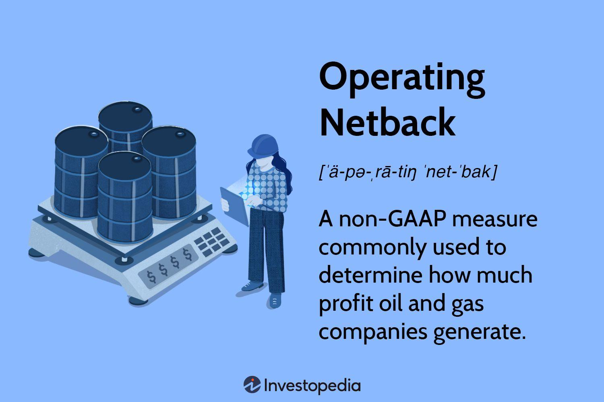

The global energy landscape is undergoing significant transformations driven by economic factors and technological innovations. These developments are particularly influential in the oil and gas sectors, where companies are continually adapting their operations to remain competitive and profitable. The integration of economic and financial metrics, such as operating netback, is paramount for enhancing efficiency and maximizing profits. Operating netback serves as a critical indicator of financial performance in oil and gas production, offering insights into the operational effectiveness by measuring profit margins after deducting the costs associated with bringing hydrocarbons to market.

Additionally, the energy market is witnessing a paradigm shift with the advent of algorithmic trading. These advanced computational techniques analyze large data sets to predict market trends, thereby optimizing trading decisions. Algorithmic trading offers benefits such as faster response times to market changes and improved trading accuracy, crucial for managing the inherent volatility of energy markets.



This article examines the crucial aspects at the intersection of energy and finance, providing a comprehensive understanding of how these elements can be leveraged to refine operational and trading strategies in the oil and gas industry. We will explore the methodologies and practices that enhance operational performance through the effective use of operating netback and explore the role of algorithmic models in shaping trading strategies. Through this analysis, energy companies can gain a competitive edge by integrating innovative approaches with traditional financial metrics, ultimately driving sustainable growth and operational excellence in the fast-evolving energy market.

## Table of Contents

## Understanding Operating Netback

Operating netback is a crucial financial performance metric applied extensively within the energy sector, providing insights into the profitability of gas and oil production operations. It is calculated by determining the net profit from oil and gas extraction, subtracting the costs involved in bringing hydrocarbons to market. The primary components considered in operating netback calculations include the selling price of the oil or gas, royalties, and both production and transportation costs.

The formula to compute operating netback is typically expressed as:

$$
\text{Operating Netback} = \text{Selling Price} - \text{Royalties} - \text{Production Costs} - \text{Transportation Costs}
$$

1. **Selling Price**: This is the revenue earned from selling the oil or gas produced. It varies based on market conditions, contracts, and types of hydrocarbons.

2. **Royalties**: As a requirement in many jurisdictions, oil and gas operators must pay royalties as a form of compensation to the mineral rights owner, which could be a government entity or private individuals. These are usually a percentage of the revenues or production quantities.

3. **Production Costs**: These are the expenses incurred during the extraction of oil and gas, including drilling, labor, and equipment maintenance. 

4. **Transportation Costs**: After extraction, hydrocarbons need to be transported, whether by pipeline, ship, or truck to the marketplace for sale. These costs can vary significantly based on distance and method of transport.

Operating netback serves as a benchmark for assessing operational efficiency across different projects and companies. It provides a standardized measure that companies can use to compare the cost efficiency and profitability of their oil and gas operations. By analyzing netback values, companies can identify the most profitable projects and make informed strategic decisions regarding ongoing or future extraction endeavors.

Using operating netback effectively enables stakeholders to gauge the financial performance of oil and gas operations, supporting strategic planning and investment decisions. This metric is invaluable in determining which ventures are likely to be prosperous, helping to guide the resource allocation and outlining developmental priorities within the sector. Consequently, it plays an important role in shaping the direction and strategies of businesses operating in the competitive environment of oil and gas production.

## Significance in Energy Economics

Operating netback plays a pivotal role in energy economics as it offers profound insights into the profitability and efficiency of energy assets. This metric calculates the margin between the selling price of oil and gas and the costs associated with their production and delivery to the market. The higher the netback, the more profitable an asset or operation is considered to be.

From an investor's perspective, analyzing and comparing netback values across various projects provides a clear picture of potential returns and associated risks. Higher netback values generally suggest more efficient operations and better cost management, reducing risk profiles for investors. Thus, operating netback becomes a crucial tool in determining which projects may yield the most favorable financial outcomes.

For oil and gas companies, operating netback is a reliable indicator of financial health and can forecast future performance. Companies can benchmark their netback against industry standards or competitors, identifying areas for improvement in their operations and making informed strategic decisions. By focusing on maximizing netback, firms can enhance their operational efficiency, maintain competitive advantages, and secure long-term profitability.

Moreover, netback assists organizations in strategic decision-making related to investments and development projects. By projecting netback outcomes, companies can prioritize investments with higher expected returns and allocate resources more effectively. This approach facilitates better planning and investment strategies, ensuring sustainable growth and development within the energy sector.

Overall, the utility of operating netback extends beyond a mere financial metric, serving as a cornerstone for evaluating energy economics, optimizing investment strategies, and securing the future of oil and gas ventures.

## Oil and Gas Finance Dynamics

The oil and gas sectors face distinctive financial challenges shaped by intrinsic market [volatility](/wiki/volatility-trading-strategies) and evolving regulatory frameworks. This volatility is driven by fluctuating oil prices, geopolitical tensions, and shifting global demand patterns. In response, companies in this industry must develop robust financial strategies designed to manage costs and maximize revenue. Operational efficiency is critical; thus, practices that reduce production and transportation costs without compromising output quality are highly valued.

A fundamental financial metric in this regard is operating netback. Netback offers insights into the financial viability of projects by calculating the profit margin after deducing royalties, production, and transportation costs from the sale price of oil or gas. Mathematically, netback can be expressed as:

$$
\text{Netback} = \text{Selling Price} - (\text{Royalties} + \text{Production Costs} + \text{Transportation Costs})
$$

Investment decisions heavily rely on the financial modeling of returns and cost efficiencies. These models help estimate cash flows and project future returns, allowing firms to assess the risk and potential profitability of ventures. By aligning financial strategies with operational metrics like operating netback, companies can ensure sustainability and growth in a competitive landscape.

An illustrative Python snippet for calculating netback could be:

```python
def calculate_netback(selling_price, royalties, production_costs, transportation_costs):
    return selling_price - (royalties + production_costs + transportation_costs)

# Example usage
selling_price = 50  # e.g., $50 per barrel
royalties = 5
production_costs = 20
transportation_costs = 10

netback = calculate_netback(selling_price, royalties, production_costs, transportation_costs)
print(f"The operating netback is ${netback} per barrel")
```

Through strategic financial management and the application of analytical tools, oil and gas companies can better navigate the complexities of market dynamics, ensuring stable growth and operational efficiency.

## Algorithmic Trading in Energy Markets

Algorithmic trading has significantly impacted energy markets, harnessing sophisticated computational techniques to improve trading decisions. At its core, [algorithmic trading](/wiki/algorithmic-trading) involves the use of algorithms to process and analyze extensive datasets, identifying patterns and generating actionable insights to predict price movements. This automation allows traders to execute large orders with minimal human intervention, ensuring efficiency and accuracy.

One of the primary advantages of algorithmic trading is enhanced performance. By leveraging real-time data, algorithms can swiftly respond to market fluctuations, making split-second decisions that would be impossible for human traders. This capability is particularly beneficial in the volatile oil and gas markets where prices are subject to sudden shifts due to geopolitical events, supply disruptions, or changes in regulations.

Algorithms in energy trading are crafted using various techniques, including statistical analysis, [machine learning](/wiki/machine-learning), and [artificial intelligence](/wiki/ai-artificial-intelligence). For example, predictive models are built to forecast future price trends based on historical data and market indicators. A basic example of such a model could involve a regression analysis where past prices and volumes serve as independent variables to predict future prices. In Python, a simple linear regression model can be implemented as:

```python
from sklearn.linear_model import LinearRegression
import numpy as np

# Sample data: past prices and volumes
prices = np.array([50, 52, 53, 56, 59])
volumes = np.array([200, 210, 250, 270, 290])

# Reshape the data for linear regression
X = volumes.reshape(-1, 1)
y = prices

# Create the model and fit it
model = LinearRegression()
model.fit(X, y)

# Predict a future price
future_volume = np.array([[300]])
predicted_price = model.predict(future_volume)
print(f"Predicted future price: {predicted_price[0]}")
```

This simplified model exemplifies how algorithms can predict outcomes based on input variables, which in real-world scenarios would incorporate more complex datasets and features.

Furthermore, algorithmic trading strategies are tailored with risk management techniques to mitigate potential losses. By incorporating stop-loss orders and other risk limits, these strategies can protect investments from adverse market movements. This disciplined approach to trading helps in managing the inherent volatility of energy markets more effectively than traditional methods.

Finally, the automation of trading not only reduces the time taken to execute trades but also lowers transaction costs. By operating at high speeds and volumes, automated trading can take advantage of fleeting opportunities in the market, achieving better pricing and ultimately higher returns on investment.

In summary, algorithmic trading is reshaping the energy sector by ensuring more informed and rapid trading decisions, managing market volatility efficiently, and optimizing returns, making it an essential component of modern-[day trading](/wiki/day-trading-spy) operations.

## Integrating Algorithmic Models with Netback Analysis

The integration of algorithmic models with operating netback analysis can significantly enhance profitability within energy trading. Predictive algorithms, which utilize advanced computational techniques, can incorporate netback outcomes to inform decision-making across various trading scenarios. These algorithms analyze historical and real-time market data, empowering traders to make data-driven decisions that [factor](/wiki/factor-investing) in fluctuations in netback values. By aligning trading strategies with netback analysis, companies can optimize the timing and execution of trades to maximize returns.

Through real-time processing of market data, algorithmic models adjust strategies based on minute-to-minute changes in netback values, enabling better anticipation of market trends. For instance, an algorithm could dynamically recalibrate trading positions if netback calculations predict a significant shift in profitability due to changes in production costs, transportation fees, or commodity prices.

Machine learning models further enhance this integration by providing robust tools for risk management and opportunity identification. These models learn from vast datasets to predict potential outcomes and guide strategic asset allocations. By quantifying risk exposure and identifying profitable opportunities, machine learning enhances the trader's ability to mitigate losses while also maximizing gains.

In a Python implementation, models such as gradient boosting trees or neural networks could be trained to predict netback fluctuations. These models use historical dataset inputs, such as historical netback values, market indicators, and economic variables. An integration example might involve using an algorithmic trading platform:

```python
import numpy as np
from sklearn.model_selection import train_test_split
from sklearn.ensemble import GradientBoostingRegressor

# Example dataset
X = np.array([[...]])  # Predictor variables (e.g., market indicators, production data)
y = np.array([...])    # Target variable (netback values)

# Train-test split
X_train, X_test, y_train, y_test = train_test_split(X, y, test_size=0.2, random_state=42)

# Train Gradient Boosting Regressor
model = GradientBoostingRegressor(n_estimators=100)
model.fit(X_train, y_train)

# Predict netback values and incorporate in trading strategy
predictions = model.predict(X_test)
```

This example demonstrates how predictive algorithms can model netback fluctuations and inform trading decisions. By continually updating based on new data inputs, the model guides trader actions such as when to buy or sell specific energy assets, based on predicted profitability metrics.

Integrating algorithmic models with netback analysis provides a competitive advantage, equipping energy companies to navigate complex and rapidly changing markets. As the energy landscape becomes more data-intensive, such synergies between financial metrics and algorithmic trading will be essential for strategic success.

## Conclusion

Understanding and effectively utilizing operating netback and algorithmic trading are crucial for success in the energy market. These models and approaches provide a robust framework for making informed financial and operational decisions, allowing companies to optimize resource allocation and improve profit margins. Operating netback offers a granular view of the profitability of oil and gas production by accounting for key variables like selling price, royalties, and associated costs. This metric aids in identifying the most profitable ventures and streams, directly influencing strategic planning and investment choices.

As the energy sector advances, integrating innovative technologies with traditional financial metrics will be pivotal. The introduction of algorithmic trading represents a significant technological advancement, enabling the processing of large datasets and offering predictive insights into market dynamics. This integration is particularly beneficial for enhancing the decision-making process, as algorithms can assess netback fluctuations and recommend optimal trading strategies. Algorithmic models, when combined with netback analysis, provide a comprehensive view of market positions, helping companies navigate the complexities of energy trading and maintain a competitive edge.

Efficiently managing and analyzing financial data can lead to enhanced performance and sustainable growth in oil and gas finance. By leveraging tools like machine learning models and predictive analytics, energy companies can better manage risks and identify market opportunities. These insights support more agile operational adjustments and more accurate forecasts of future market conditions.

Continued research and development in these areas will remain a priority for stakeholders in the global energy environment. As regulatory landscapes and environmental concerns continue to shape the industry, adapting these advanced methodologies will be essential to meet evolving demands. Stakeholders who invest in understanding and applying these tools are likely to drive better economic outcomes and contribute to a more resilient energy infrastructure worldwide.

## References & Further Reading

[1]: Achour, H., & Bruce, C. W. (2012). ["An Introduction to Royalties in the Oil and Gas Industry."](https://onepetro.org/NACECORR/proceedings/CORR12/All-CORR12/NACE-2012-1379/120016) Journal of Petroleum Technology.

[2]: Day, J. J., & James, F. (2020). ["Operating Netback Breakthrough: Optimization in Petroleum Company Finances."](https://www.sciencedirect.com/science/article/pii/S0306261920303603).

[3]: Lopez de Prado, M. (2018). ["Advances in Financial Machine Learning."](https://www.amazon.com/Advances-Financial-Machine-Learning-Marcos/dp/1119482089) Wiley.

[4]: Chan, E. P. (2009). ["Quantitative Trading: How to Build Your Own Algorithmic Trading Business."](https://github.com/ftvision/quant_trading_echan_book) Wiley.

[5]: Elder, A. (2014). ["Algorithmic Trading in Energy Markets."](https://www.acm.nl/en/publications/acm-use-algorithmic-trading-energy-market-has-increased-strongly) Journal of Algorithmic & Computational Finance.