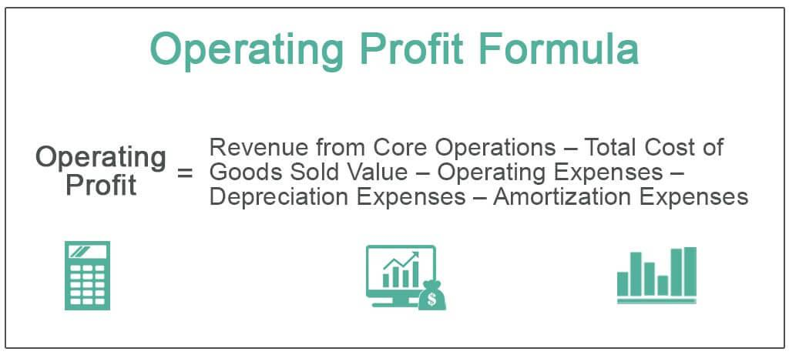

Algorithmic trading, commonly referred to as algo trading, has gained significant traction in the financial markets due to its capability to perform trades at high speed and with a quantitative foundation. This type of trading leverages complex algorithms that can analyze vast amounts of data and execute trades based on predefined criteria without human intervention. The precision and speed of algo trading provide traders with the means to capitalize on even minute market movements, often leading to improved profitability and reduced transaction costs.

A fundamental aspect of financial analysis in trading is understanding various profit metrics, among which operating profit holds paramount importance. Operating profit is a critical measure of a company’s financial performance, focusing on earnings generated from its principal activities. Unlike net income, operating profit is not skewed by external factors such as taxes and interest, providing a purer assessment of a company’s operational efficiency. It reflects the core profitability of a business, encapsulating the revenues and costs associated with regular business operations but excluding any income from extraneous investments or expenses related to debt and taxation. This metric is invaluable for stakeholders seeking to evaluate a company's core operational health and performance.



In this article, we will examine how operating profit is calculated, considering its core components and exclusions. Understanding these calculations is vital for accurate financial analysis and provides insights crucial for evaluating and developing effective algorithmic trading strategies. By integrating operating profit into financial evaluations, traders and analysts can better understand the underlying health of a business, enabling more informed decision-making.

## Table of Contents

## Understanding Operating Profit

Operating profit, often referred to as earnings before interest and taxes (EBIT), represents a company's profitability obtained strictly from its core business operations. This measure excludes income and expenses that fall outside the regular activities of the company, thereby providing a clearer picture of operational efficiency. By isolating earnings from primary business activities, operating profit serves as a valuable metric for stakeholders looking to assess a company's performance without external influences such as financing costs or one-time gains and losses.

The calculation of operating profit begins with deriving gross profit, which is the difference between total revenue and the cost of goods sold (COGS). From this gross profit figure, operating expenses, including salaries, rent, and utilities, are subtracted, alongside depreciation and amortization costs. These deductions isolate the operational profit, ensuring that only the expenses directly related to the company's main operational areas are considered. This exclusion of non-operating incomes and expenses is vital because it prevents the distortion of the company's operational health by irregular factors such as investment returns or interest payments.

The focus on operating profit allows analysts and investors to evaluate whether a company's core operations are generating sufficient profit independent of its capital structure or investment results. This metric becomes essential in comparing companies within the same industry, as it removes the biases introduced by different financing strategies and tax environments that could skew the perception of profitability. Understanding this measure gives a more consistent basis for evaluating efficiency and decision-making effectiveness, particularly where operational excellence is a primary driver of business success.

## Formula and Calculation of Operating Profit

The operating profit is a crucial financial metric that provides insights into a company's profitability from its core business functions. The formula for operating profit is expressed as:

$$
\text{Operating Profit} = \text{Gross Profit} - \text{Operating Expenses} - \text{Depreciation} - \text{Amortization}
$$

Each component of this formula plays a distinct role in determining the operating profit, and it is vital to understand these roles and how they affect financial statements.

**Gross Profit**

Gross profit is the initial level of profitability considering only the costs directly associated with the production of goods or services, excluding other operational expenses. It is calculated as follows:

$$
\text{Gross Profit} = \text{Revenue} - \text{Cost of Goods Sold (COGS)}
$$

Revenue represents the total income generated from sales during a specific period, while COGS includes all direct costs attributable to the production of the goods sold by a company. Computing gross profit is critical as it lays the groundwork for further analysis of operational efficiency by stripping away non-essential financial factors.

**Operating Expenses**

Operating expenses encompass all costs associated with running the main business operations, excluding the COGS. These expenses typically include selling, general and administrative expenses (SG&A), such as salaries, rent, marketing, and utilities. These represent recurring expenses necessary for maintaining business operations but aren't directly tied to the production process. Deducting operating expenses from gross profit offers a refined view of the financial resources available for depreciation and amortization.

**Depreciation and Amortization**

Depreciation and amortization are accounting methodologies used to allocate the cost of tangible and intangible assets over their useful lives, respectively. 

- **Depreciation** refers to the expense associated with the reduction in value of tangible fixed assets, such as machinery, vehicles, and buildings, due to wear and tear over time.

- **Amortization** applies to intangible assets, such as patents or goodwill, representing a systematic reduction over time.

These non-cash expenses influence the operating profit by providing an estimate of asset-value reduction over time, allowing businesses to assess operational profitability with a consideration for asset-related costs.

**Implication on Financial Statements**

Incorporating operating profit into financial statements provides stakeholders with a clear metric for evaluating a company's operational efficiency, independent of its financing or investment activities. It isolates core business profitability, enabling investors and analysts to understand how effective the business is in generating profit from its operations alone.

Understanding the calculation of operating profit is indispensable for both internal assessments and external valuations, as it signifies how well a company can sustain its primary activities without support from financial, investment, or extraordinary gains. This metric is a fundamental element in determining a company's capacity to generate sustainable earnings from its core business operations.

## Significance of Operating Profit in Financial Analysis

Operating profit is a vital metric for assessing a company's profitability derived from its core business activities. Unlike net profit, which encompasses tax and interest, operating profit is a more focused indicator of operational efficiency, providing a clear view of how well a company can generate earnings from its primary business operations before the effects of financial structuring and taxation are considered.

The significance of operating profit in financial analysis stems from its ability to isolate the operating performance from external factors such as financing and investment decisions. For stakeholders, this metric clarifies the business's operational capabilities and efficiency in generating profits. It removes the noise introduced by leveraging or differing tax environments, allowing for a more standardized assessment across different companies or industries.

By concentrating on revenues and costs directly arising from core business activities, operating profit emphasizes efficiency and management effectiveness in using resources. It serves as a critical benchmark that investors and analysts use to perform comparative analyses, evaluate trends over time, and make informed decisions. Companies with consistently high operating profits are often viewed as having durable competitive advantages and effective management teams, making them attractive investments.

In addition, operating profit can uncover potential areas for operational improvement. Since it excludes non-operating income and expenses, any reduction or increase in operating profit usually points directly to changes within the operational structure of the business, such as cost management or changes in sales [volume](/wiki/volume-trading-strategy) and pricing strategies.

For example, consider a hypothetical company with a net profit of $5 million and an operating profit of $10 million. The disparity suggests significant interest and tax expenses. Analyzing operating profit allows us to understand that the core business is generating solid returns, which may indicate different management strategies, primarily financial structuring or external factors influencing net profit.

In conclusion, the focus on operating profit provides a purer lens through which to assess a company's inherent profitability. It allows stakeholders to scrutinize the business's operational strength, ensuring more precise strategic decisions and investment evaluations.

## Algorithmic Trading and Profit Analysis

In [algorithmic trading](/wiki/algorithmic-trading), profit analysis is central to evaluating the effectiveness and risk levels of various trading strategies. This analysis involves using quantitative metrics to assess how well a trading algorithm performs over time. Three primary metrics commonly used in algo trading are the Sharpe Ratio, Maximum Drawdown, and Win Rate.

The Sharpe Ratio is a measure of risk-adjusted return. It is calculated by subtracting the risk-free rate from the average return of the strategy and then dividing the result by the standard deviation of the returns. A higher Sharpe Ratio indicates a more favorable risk-reward balance. Mathematically, it can be expressed as:

$$

\text{Sharpe Ratio} = \frac{R_p - R_f}{\sigma_p}
$$

where $R_p$ is the expected portfolio return, $R_f$ is the risk-free rate, and $\sigma_p$ is the standard deviation of the portfolio's excess return.

Maximum Drawdown measures the largest single drop from peak to trough in the value of a portfolio before a new peak is achieved. This metric is crucial for understanding the potential risk and [volatility](/wiki/volatility-trading-strategies) of a trading strategy. A smaller maximum drawdown suggests that a strategy has lower risk of significant losses.

Win Rate is the percentage of profitable trades out of the total trades executed. It is a straightforward metric that provides insight into the consistency of an algorithm. However, a high win rate does not necessarily imply profitability; it must be considered alongside other metrics like risk and return ratios.

Understanding operating profit can enhance the financial analysis of algorithmic trading strategies by providing a clearer picture of profitability derived from core activities. In the context of trading, this involves isolating the performance of the algorithm from non-trading related factors that might skew results. For algorithmic traders, calculating a form of operating profit might involve excluding extraneous earnings from the algorithm's overall performance.

Incorporating operating profit analysis helps refine the evaluation of algorithms by ensuring that profitability assessments reflect the algorithm's true trading capabilities and not other influencing factors. Integrating this approach with metrics like the Sharpe Ratio and Maximum Drawdown enables traders to make more informed decisions and manage risk more effectively.

## Tools and Techniques for Analyzing Algorithmic Trading Strategies

Backtesting platforms and statistical analysis tools are integral components for assessing the performance of algorithmic trading strategies. Backtesting involves simulating a trading strategy using historical data to evaluate its effectiveness and profitability before deploying it in live markets. Popular platforms for [backtesting](/wiki/backtesting) include QuantConnect, Backtrader, and Zipline, which offer extensive libraries for testing trading algorithms with past market data. These platforms enable traders to adjust parameters and assess the strategy's robustness across different market conditions.

Statistical analysis tools help in understanding the underlying data patterns and relationships that could affect the strategy's outcomes. Python libraries such as NumPy, Pandas, and SciPy offer capabilities to conduct descriptive [statistics](/wiki/bayesian-statistics), hypothesis testing, and regression analysis, providing deep insights into the performance metrics of trading strategies.

Visualization tools offer significant advantages for traders by transforming complex datasets into comprehensible visual formats. Matplotlib, Seaborn, and Plotly are widely used Python libraries that allow traders to visualize time series, drawdown charts, and performance distributions. These visualizations aid in quick decision-making by highlighting trends and anomalies that are not immediately visible in raw data.

Addressing challenges such as overfitting and transaction costs is crucial for ensuring the robustness of algorithmic trading strategies. Overfitting occurs when a model is overly complex and captures noise in the training data instead of the actual underlying pattern. This can lead to poor performance in live trading environments. Regularization techniques, cross-validation, and out-of-sample testing are common methods to mitigate overfitting. Python's scikit-learn library offers tools to apply these techniques effectively.

Transaction costs are another critical consideration, as they can significantly affect the profitability of trading strategies. Slippage, commissions, and fees must be incorporated into the backtesting phase to produce realistic performance estimates. Adjusting strategy parameters to minimize these costs, such as optimizing order sizes and execution times, helps enhance the overall efficiency of the trading strategy.

By leveraging these tools and techniques, traders can analyze and refine their algorithmic trading strategies to achieve a balance between risk and return. These methodologies ensure that strategies are rigorously evaluated, making them more likely to succeed in dynamic market environments.

## Special Considerations in Profit Analysis for Algo Trading

In the evaluation of algorithmic trading strategies, special considerations must be taken into account, particularly when assessing profits that deviate from conventional business income metrics like operating profit. Operating profit calculations traditionally exclude revenue derived from ancillary asset sales. This exclusion reflects a focus on core business operations, which, in the context of algorithmic trading, may manifest differently since trading activities inherently involve transactions in financial assets. Therefore, when analyzing algo trading strategies, distinguishing between core and ancillary revenues becomes crucial for an accurate representation of strategy performance.

The impact of asset sales on algorithmic profit analysis can distort performance assessments if not properly segregated. For instance, profits stemming from the liquidation of non-core assets might temporarily inflate the apparent profitability of a trading strategy without contributing to its sustainable operational capacity. In this scenario, these revenues should be separately accounted to provide clarity on actual trading performance.

Interest income presents another layer of complexity in profit analysis for algorithmic trading. Unlike traditional corporate contexts where interest income on excess cash is often peripheral, in algorithmic trading, interest income from financial assets can be integral to strategic operations. For example, the returns on margin accounts or interest from securities lending may form a vital component of a strategy's profitability. It is imperative to accurately account for such income to gauge the true efficiency of the trading strategy.

Incorporating these special considerations into profit analysis necessitates a refined approach that aligns financial metrics closely with trading operations. Advanced algorithmic analysis can benefit from Python scripts that parse and separate various revenue streams, ensuring a clear distinction between operating profits and other income sources. For example:

```python
def separate_revenue(revenue_transactions):
    core_revenue = 0
    ancillary_revenue = 0
    interest_income = 0

    for transaction in revenue_transactions:
        if transaction['type'] == 'core':
            core_revenue += transaction['amount']
        elif transaction['type'] == 'ancillary':
            ancillary_revenue += transaction['amount']
        elif transaction['type'] == 'interest':
            interest_income += transaction['amount']

    return core_revenue, ancillary_revenue, interest_income

# Example usage
transactions = [
    {'type': 'core', 'amount': 1000},
    {'type': 'ancillary', 'amount': 200},
    {'type': 'interest', 'amount': 50}
]

core_rev, ancillary_rev, int_inc = separate_revenue(transactions)
```

This separation allows the algorithmic strategy's results to be more transparently assessed, offering stakeholders a clearer picture of where value creation is occurring. Overall, discerning these differences is vital for drawing accurate conclusions about the financial health and efficiency of algorithmic trading strategies.

## Case Studies and Examples

The evaluation of operating profit through real financial statements provides valuable insights into the financial analysis pertinent to both corporate finance and trading strategies. The calculation of operating profit typically involves subtracting operating expenses, depreciation, and amortization from gross profit. This precise calculation can often reveal inefficiencies or strengths within a company's primary business operations.

### Example 1: Corporate Financial Statement

Consider a hypothetical company, ABC Corp, with the following financial data extracted from its income statement:

- **Revenue**: $1,000,000
- **Cost of Goods Sold (COGS)**: $400,000
- **Operating Expenses**: $150,000
- **Depreciation and Amortization**: $50,000

The calculation for gross profit is as follows:

$$
\text{Gross Profit} = \text{Revenue} - \text{COGS} = \$1,000,000 - \$400,000 = \$600,000
$$

The operating profit can then be calculated:

$$
\text{Operating Profit} = \text{Gross Profit} - \text{Operating Expenses} - \text{Depreciation and Amortization}
$$

$$
\text{Operating Profit} = \$600,000 - \$150,000 - \$50,000 = \$400,000
$$

In this example, the operating profit indicates how effectively ABC Corp manages its core operations and controls operational costs.

### Example 2: Integration in Algorithmic Trading Strategies

In algorithmic trading, understanding the operating profit of a company can influence trading decisions. Let's consider a scenario where an algorithm uses financial performance indicators to assess potential investments in publicly traded companies.

For a trading algorithm analyzing Company XYZ, it might consider high operating profit margins as a criterion for predicting the company's future stock performance. By integrating financial metrics such as operating profit within its evaluation scope, the algorithm aims to identify companies with strong operational efficiency.

Here is a simplified example of how a Python script might calculate the operating profit based on a set of financial data for a portfolio analysis:

```python
def calculate_operating_profit(revenue, cogs, operating_expenses, depreciation_amortization):
    gross_profit = revenue - cogs
    operating_profit = gross_profit - operating_expenses - depreciation_amortization
    return operating_profit

# Example financial data
revenue_xyz = 850000
cogs_xyz = 300000
operating_expenses_xyz = 120000
depreciation_amortization_xyz = 30000

operating_profit_xyz = calculate_operating_profit(revenue_xyz, cogs_xyz, operating_expenses_xyz, depreciation_amortization_xyz)
print(f"Operating Profit for Company XYZ: ${operating_profit_xyz}")
```

Both examples demonstrate how operating profit calculations can provide a snapshot of a company's financial efficacy and serve as fundamental data points for both strategic corporate evaluations and sophisticated trading algorithms. Understanding these metrics ensures that trading strategies and corporate finance decisions are grounded in core operational performance analysis.

## Conclusion

Understanding operating profit is essential for anyone engaged in financial analysis or algorithmic trading. This metric serves as a reliable gauge of a company's profitability from its main business activities, providing an unfiltered view of its core operational health. By focusing solely on operational efficiency and excluding other variables such as taxes and interest, operating profit offers critical insights that are meaningful to stakeholders and traders alike. 

For algorithmic trading strategies, incorporating robust financial analysis, including a deep understanding of operating profit, is vital. Such an approach allows for informed decision-making and effective risk management. This ensures that traders can accurately assess and refine their strategies, thereby enhancing performance and sustainability in an ever-evolving financial landscape. Overall, grasping the nuances of operating profit is not only beneficial but also necessary for those aiming to achieve expertise in financial analysis and superior results in algorithmic trading.

## References & Further Reading

[1]: Bergstra, J., Bardenet, R., Bengio, Y., & Kégl, B. (2011). ["Algorithms for Hyper-Parameter Optimization."](https://papers.nips.cc/paper/4443-algorithms-for-hyper-parameter-optimization) Advances in Neural Information Processing Systems 24.

[2]: ["Advances in Financial Machine Learning"](https://www.amazon.com/Advances-Financial-Machine-Learning-Marcos/dp/1119482089) by Marcos Lopez de Prado

[3]: ["Evidence-Based Technical Analysis: Applying the Scientific Method and Statistical Inference to Trading Signals"](https://www.amazon.com/Evidence-Based-Technical-Analysis-Scientific-Statistical/dp/0470008741) by David Aronson

[4]: ["Machine Learning for Algorithmic Trading"](https://github.com/stefan-jansen/machine-learning-for-trading) by Stefan Jansen

[5]: ["Quantitative Trading: How to Build Your Own Algorithmic Trading Business"](https://www.amazon.com/Quantitative-Trading-Build-Algorithmic-Business/dp/1119800064) by Ernest P. Chan