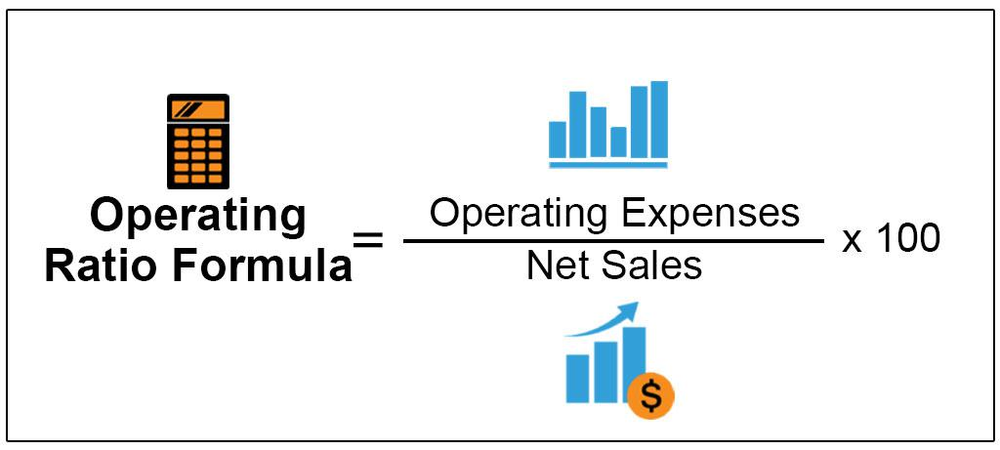

Understanding financial performance is essential for any business, particularly in algorithmic trading where efficiency and precision are paramount. Financial metrics serve as indicators to evaluate a company's financial health, with the operating ratio standing out as a crucial metric offering insights into operational efficiency. This article explores how financial metrics, especially the operating ratio, can be employed for business analysis in algorithmic trading. Additionally, the article highlights the importance of different performance metrics in assessing trading strategies to ensure robust algorithmic trading performance. By concentrating on these metrics, businesses can achieve a deeper understanding of their financial status and enhance their operational strategies.

## Table of Contents



## Understanding Financial Metrics

Financial metrics are quantitative indicators essential for evaluating different aspects of a business's financial performance. These metrics serve as tools for businesses to analyze and interpret their financial conditions, aiding in strategic planning and informed decision-making. They encompass a wide range of categories, including profitability ratios, liquidity ratios, and operational efficiency ratios, such as the operating ratio.

Profitability ratios, for instance, measure a company's ability to generate earnings relative to its expenses and other costs. Common examples include the net profit margin, return on assets (ROA), and return on equity (ROE). These ratios help assess how well a company utilizes its resources to generate profit. Liquidity ratios, such as the current ratio and quick ratio, evaluate a company's capacity to meet its short-term obligations, indicating financial stability and risk management.

Operational efficiency ratios, including the operating ratio, are particularly valuable in providing insights into a company's cost management practices. The operating ratio is defined as:

$$
\text{Operating Ratio} = \left( \frac{\text{Operating Expenses}}{\text{Net Sales}} \right) \times 100
$$

This metric reflects the relationship between operating expenses and net sales, highlighting how effectively a company is managing its operational costs relative to its revenue. A lower operating ratio is typically preferred, as it suggests that a company is efficiently controlling its operating expenses, resulting in higher profitability.

Analyzing these financial metrics collectively enables businesses to identify strengths and weaknesses in their operations. By doing so, companies can make more informed decisions, enhancing their financial health and optimizing their strategies for better outcomes. This quantitative analysis is crucial for maintaining competitiveness and ensuring sustainable growth in a continuously evolving economic environment.

## The Operating Ratio in Business Analysis

The operating ratio is a fundamental financial metric that assesses a company's management efficiency by measuring the proportion of its operating expenses to its net sales. Mathematically, the operating ratio is expressed as:

$$
\text{Operating Ratio} = \left( \frac{\text{Operating Expenses}}{\text{Net Sales}} \right) \times 100
$$

A lower operating ratio signifies superior management efficiency as it indicates that the company is generating more revenue relative to its operating expenses, thus suggesting higher profitability. Companies strive for a lower operating ratio as it typically reflects effective cost management and operational efficiency.

The components of the operating ratio include a wide range of operating expenses, encompassing overhead costs, cost of goods sold (COGS), and administrative expenses. Each of these components plays a critical role in determining the overall efficiency of business operations:

- **Overhead Costs**: These are the ongoing expenses incurred by the company that do not directly link to the production of goods or services, such as rent, utilities, and insurance.
- **Cost of Goods Sold (COGS)**: This includes the direct costs attributable to the production of the goods sold by a company. It forms a substantial part of the operating expenses and is crucial in assessing profitability.
- **Administrative Expenses**: These are costs related to the general administration of the business, including salaries of administrative staff, office supplies, and other costs not directly tied to sales.

Evaluating the operating ratio against industry standards or historical performance data can provide valuable insights into a company's operational efficiency. For instance, if the operating ratio is higher than the industry average, it may indicate potential inefficiencies that require corrective measures. Conversely, a steady decline in this ratio over time could suggest improving efficiencies, potentially rendering the company more competitive in its market.

In strategic business analysis, the operating ratio serves as a pivotal tool for identifying areas of improvement, enabling businesses to allocate resources effectively and enhance management practices. By continually monitoring and analyzing this ratio, companies can implement tailored strategies that bolster their operational performance and financial health.

## Algorithmic Trading: Key Performance Metrics

Algorithmic trading relies on automated strategies that use predefined rules or models to execute trades. These strategies are designed to capitalize on market opportunities with speed and precision, reducing the manual intervention required in traditional trading. Evaluating the performance of these algorithms is critical to ensuring they are both efficient and profitable. Key performance metrics used in assessing [algorithmic trading](/wiki/algorithmic-trading) strategies include the Sharpe Ratio, Maximum Drawdown, Win Rate, Profit Factor, and Average Trade. Each of these metrics provides unique insights into the strategy's risk, return, [volatility](/wiki/volatility-trading-strategies), and overall effectiveness.

The Sharpe Ratio is one of the most widely used metrics to measure the risk-adjusted return of an investment strategy. It is calculated by subtracting the risk-free rate from the expected return of the strategy and then dividing the result by the standard deviation of the strategy's returns. Formally, it can be expressed as:

$$
\text{Sharpe Ratio} = \frac{E[R] - R_f}{\sigma}
$$

where $E[R]$ is the expected return, $R_f$ is the risk-free rate, and $\sigma$ is the standard deviation of the strategy's returns. A higher Sharpe Ratio indicates a more favorable risk-adjusted return, making it a crucial indicator of a strategy's performance.

Maximum Drawdown measures the largest peak-to-trough decline in the value of a trading account, providing insight into the potential losses an investor might experience. It is expressed as a percentage of the peak value and is valuable for understanding the volatility and risk associated with the strategy.

The Win Rate is the ratio of profitable trades to total trades, expressed as a percentage. While an important metric, it should not be used in isolation, as a high win rate does not necessarily mean a strategy is profitable if the losing trades are significantly larger than the winning ones.

Profit Factor is calculated by dividing the gross profit of a strategy by its gross loss. This metric helps in assessing whether a strategy generates more profit than loss over time. A Profit Factor greater than 1 indicates a profitable strategy, while a value less than 1 suggests a loss-making strategy.

Average Trade measures the average gain or loss per trade over a certain period. It provides a straightforward view of how much, on average, each trade contributes to the strategy's overall performance. This can help in assessing the effectiveness of a strategy over time.

By continuously monitoring these key performance metrics, traders can refine their algorithmic strategies to enhance profitability and maintain a competitive edge in the market. These metrics collectively offer a comprehensive view of an algorithm's effectiveness, enabling informed decision-making and strategy optimization.

## Integrating Operating Ratio in Algo Trading Analysis

Incorporating the operating ratio into algorithmic trading analysis offers a valuable perspective on the financial efficiency of trading operations. Typically used by businesses to evaluate day-to-day operations, the operating ratio can similarly be employed by algo trading platforms to assess the cost-effectiveness of their strategies. In essence, this ratio offers a quantitative measure of how efficiently a trading strategy is managing its operational costs relative to the revenue it generates.

The operating ratio is calculated as follows:

$$
\text{Operating Ratio} = \frac{\text{Operating Expenses}}{\text{Net Sales}}
$$

In the context of algorithmic trading, these components can be understood as:

- **Operating Expenses**: This includes all costs associated with executing trades, such as data fees, brokerage fees, maintenance of trading systems, and any other costs directly related to the trading strategy.
- **Net Sales**: In trading, this would refer to the net profit generated by the trading strategies after deducting any trading losses.

A lower operating ratio indicates greater efficiency, as it suggests that the trading strategy is generating higher profits relative to its associated costs. For algo traders, consistently monitoring changes in this ratio over time is crucial. Such monitoring can unveil inefficiencies in the trading strategy or changes in market conditions that necessitate adjustments. For instance, an increasing operating ratio might indicate rising execution costs or reduced profitability, signaling the need for strategy optimization.

Integrating this metric into regular performance reviews of trading algorithms can help identify when re-optimization or parameter adjustments are necessary, ensuring that the strategies remain profitable and aligned with financial objectives. This focus on cost-efficiency and profitability positions trading strategies for better financial outcomes.

Moreover, advanced data analytics can be deployed to automate this monitoring process. Python, a popular language in algorithmic trading, offers numerous libraries for data analytics and visualization that can simplify tracking the operating ratio:

```python
import pandas as pd

# Sample data
data = pd.DataFrame({
    'operating_expenses': [500, 600, 550],
    'net_sales': [1500, 1600, 1550]
})

# Calculate Operating Ratio
data['operating_ratio'] = data['operating_expenses'] / data['net_sales']

# Identify trends
print(data)

# Output plot for visualization if needed
import matplotlib.pyplot as plt

plt.plot(data['operating_ratio'], marker='o')
plt.title('Operating Ratio Over Time')
plt.xlabel('Time Period')
plt.ylabel('Operating Ratio')
plt.grid(True)
plt.show()
```

In conclusion, by incorporating the operating ratio into the assessment of algorithmic trading strategies, trading platforms can enhance their financial efficiency, optimize their strategies effectively, and ultimately achieve more favorable financial outcomes. This strategic use of financial metrics reinforces the importance of continual evaluation in maintaining robust trading performances.

## Conclusion

Financial metrics such as the operating ratio are essential tools for evaluating and enhancing a company's operational efficiency. They provide a quantitative basis for understanding how well a company is managing its resources, which is vital for informed decision-making. In algorithmic trading, these metrics are invaluable, as they can offer detailed insights into the performance and viability of trading strategies. By analyzing financial metrics, traders and businesses can gain clarity on areas that require improvement, leading to more effective and profitable trading activities.

The continual monitoring and adjustment of strategies based on these metrics can yield significant competitive advantages. As market conditions fluctuate, a responsive approach that leverages financial metrics ensures traders can adapt swiftly to maintain or improve their outcomes. This agility is crucial for sustained success in the fast-paced and constantly evolving financial markets.

In an era where data drives decisions, the role of financial metrics in strategic planning cannot be overemphasized. They provide a foundation for measuring performance and risk, enabling businesses and traders to refine their approaches systematically. The ability to leverage these metrics proficiently often distinguishes successful entities from their less effective counterparts, underscoring their significance in achieving long-term strategic goals.

## References & Further Reading

[1]: Bergstra, J., Bardenet, R., Bengio, Y., & Kégl, B. (2011). ["Algorithms for Hyper-Parameter Optimization."](https://papers.nips.cc/paper/4443-algorithms-for-hyper-parameter-optimization) Advances in Neural Information Processing Systems 24.

[2]: ["Advances in Financial Machine Learning"](https://www.amazon.com/Advances-Financial-Machine-Learning-Marcos/dp/1119482089) by Marcos Lopez de Prado.

[3]: ["Evidence-Based Technical Analysis: Applying the Scientific Method and Statistical Inference to Trading Signals"](https://www.amazon.com/Evidence-Based-Technical-Analysis-Scientific-Statistical/dp/0470008741) by David Aronson.

[4]: ["Machine Learning for Algorithmic Trading"](https://github.com/stefan-jansen/machine-learning-for-trading) by Stefan Jansen.

[5]: ["Quantitative Trading: How to Build Your Own Algorithmic Trading Business"](https://github.com/LucindaYa/quant-resources/blob/master/Quantitative%20Trading%20How%20to%20Build%20Your%20Own%20Algorithmic%20Trading%20Business.pdf) by Ernest P. Chan.