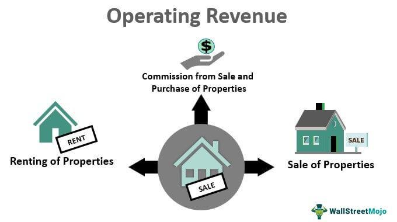

The evolving landscape of business finance has seen a significant shift towards automated and algorithmic solutions. This transformation is characterized by a growing dependence on technology to streamline operations, enhance decision-making, and optimize revenue streams. As companies increasingly leverage these innovations, operating revenue remains a crucial key performance indicator. It reflects the effectiveness of a company's core business functions by measuring the income generated from primary business activities, providing a clear picture of operational success and financial health.

Algorithmic trading, commonly referred to as algo trading, has emerged as an essential tool in revenue generation for businesses engaged in financial markets. By employing advanced algorithms and high-speed data processing, companies can execute trades with precision and efficiency, mitigating human error and capitalizing on favorable market conditions. This approach not only maximizes potential profits but also minimizes risks associated with traditional trading methods.



Exploring the intersection of operating revenue, business finance, and algorithmic trading reveals a dynamic relationship that fuels growth opportunities within today's financial ecosystem. As businesses strive to enhance their core functions, the integration of automated solutions and algorithmic strategies offers a pathway to improved operational efficiency and increased profitability. Through an understanding of these interconnected concepts, companies can better position themselves to navigate the complexities of modern financial markets and achieve sustained success.

## Table of Contents

## Understanding Operating Revenue

Operating revenue is the income a company generates from its primary business activities, representing a fundamental aspect of its financial performance. This metric is critical for assessing the overall health and operational success of a business. By focusing on operating revenue, stakeholders can gain insights into how effectively a company is executing its core business functions without the influence of peripheral or non-recurring events.

Industries vary widely in how they generate operating revenue, reflecting their distinct business models and activities. For instance, in the retail industry, operating revenue predominantly originates from the sales of goods to consumers. The calculation for a retailer's operating revenue can be simply depicted as:

$$
\text{Operating Revenue}_{\text{Retailer}} = \text{Units Sold} \times \text{Price per Unit}
$$

In contrast, a physician or medical practice generates operating revenue through the provision of medical services. This might include consultations, procedures, or treatment plans, where operating revenue equals the sum of all billable medical services provided:

$$
\text{Operating Revenue}_{\text{Physician}} = \sum(\text{Service Fees})
$$

Understanding the difference between operating and non-operating revenue is crucial for thorough financial analysis. Non-operating revenue arises from secondary activities that are not part of the core business operations. Examples include interest income from investments or income from the sale of assets. These revenues can introduce variability and may not reflect the sustainable performance of the business. For a clear depiction of a company's operational efficiency, separating these elements is essential:

- **Operating Revenue**: Derived from main business activities (e.g., sales, services).
- **Non-Operating Revenue**: Generated from activities not related to core operations (e.g., asset sales, dividends).

By distinguishing these categories, analysts and investors can better understand a company's profitability from its primary activities and make informed decisions based on the sustainable aspects of its revenue stream. This differentiation is pivotal for processes such as valuation, forecasting, and strategic planning, ensuring that stakeholders accurately interpret financial statements and the company's long-term viability.

## The Role of Business Finance in Revenue Generation

Business finance encompasses strategies and tools essential for managing and reporting a company's financial health, ultimately influencing operating revenue and profitability. Effective financial management focuses on optimizing cost structures and capital allocation. By carefully analyzing and adjusting these elements, companies can improve their financial outcomes. For instance, cost structure optimization involves reducing unnecessary expenses and increasing cost efficiency, while capital allocation ensures that resources are directed towards the most profitable areas of the business.

Revenue generation strategies are crafted to maximize both operational efficiency and market reach. Companies often employ various tactics to achieve these goals, such as enhancing supply chain management, implementing lean operations, and expanding into new markets. These strategies are designed to boost productivity and revenue, thereby ensuring a company remains competitive and profitable.

An integral part of modern business finance is the utilization of financial technology, particularly automated tools and algorithms. These technologies play a crucial role in streamlining processes and enabling more accurate financial analysis. For instance, enterprise resource planning (ERP) systems integrate various business functions, providing real-time insights and facilitating better decision-making. Moreover, algorithms can analyze large data sets to predict trends and inform strategic decisions.

Automation in finance not only reduces human error but also speeds up routine processes, freeing up resources for more strategic initiatives. By leveraging these technologies, companies can enhance their revenue generation capabilities, optimizing everything from transaction processing to customer relationship management.

In summary, business finance is fundamental to enhancing operating revenue through strategic financial management, optimization of costs, and employment of financial technology. By adopting these practices, companies can achieve greater operational efficiency and market penetration, leading to sustained financial success.

 to Algorithmic Trading

Algorithmic trading involves utilizing computer programs to automate the process of trading financial instruments by following a predefined set of instructions. This approach allows for the execution of orders with high speed and frequency, thereby minimizing the impact of human emotions and errors which can skew decision-making processes. Algorithmic trading is sometimes referred to as black-box trading or automated trading, and it finds applications across various sectors within financial markets, such as equities, commodities, and foreign exchanges.

Key to [algorithmic trading](/wiki/algorithmic-trading) is the deployment of sophisticated algorithms designed to identify profitable trading opportunities by analyzing vast datasets in real time. These algorithms are typically tailored to perform specific tasks, ranging from identifying [arbitrage](/wiki/arbitrage) opportunities to executing trades for high-frequency strategies. The component of real-time data analysis is crucial, as it provides a competitive edge by rapidly adapting to market movements, thus optimizing trading strategies for better outcomes.

The growth of algorithmic trading is largely attributed to its capability to enhance accuracy and efficiency in trading operations. The algorithms are capable of implementing complex mathematical models and strategies with precision. For instance, a trader using algorithmic trading can execute trades based on specific criteria such as timing, price, quantity, or any other mathematical model. A simple Python example to illustrate a basic decision-making process in an algorithmic trading model could be:

```python
import requests

def get_stock_price(stock_symbol):
    response = requests.get(f'https://api.example.com/stocks/{stock_symbol}')
    data = response.json()
    return data['price']

def trading_strategy(stock):
    buy_threshold = 100
    sell_threshold = 120
    current_price = get_stock_price(stock)

    if current_price < buy_threshold:
        print("Buy signal generated")
    elif current_price > sell_threshold:
        print("Sell signal generated")
    else:
        print("Hold position")

trading_strategy('AAPL')
```

In this example, the algorithm checks the current price of a stock and decides whether to generate a buy or sell signal based on predefined thresholds.

The proliferation of algorithmic trading corresponds with advancements in computational power, data analytics, and [artificial intelligence](/wiki/ai-artificial-intelligence). These advances not only improve the speed and accuracy of trades but also manage large volumes of data more effectively. Consequently, algorithmic trading systems can process thousands of trades on a microsecond basis, executing the trades faster than any human could.

Moreover, algorithmic trading is instrumental in providing [liquidity](/wiki/liquidity-risk-premium) to markets and reducing transaction costs, which is beneficial for both institutional and retail investors. The continuous improvement and integration of artificial intelligence into trading algorithms are expected to further revolutionize trading strategies, making algorithmic trading an indispensable part of modern financial markets.

## The Impact of Algo Trading on Revenue Generation

Algorithmic trading significantly impacts a company's operating revenue by enhancing trade execution and strategic deployment. Using complex algorithms, firms can execute trades with precision, optimizing market timing and price execution. This precision is achieved by analyzing large datasets in real-time, which minimizes the latency and errors associated with human-driven trading. As a result, trading profits are often increased due to more effective entry and [exit](/wiki/exit-strategy) strategies in the market.

Moreover, algorithmic trading attracts more investors by showcasing a firm's robust operational capabilities and competent financial management. Investors often view companies utilizing advanced trading technologies as more innovative and reliable. This reputation can lead to increased capital investments and partnerships, thereby further contributing to revenue generation.

The global algorithmic trading market has shown significant growth and is projected to continue expanding. This trend highlights the increasing reliance on automated systems in financial markets, driven by the demand for trading efficiency and reduced transaction costs. As these systems become more prevalent, companies not employing such technologies risk falling behind competitors who leverage these advanced strategies.

Innovations in artificial intelligence (AI) and [machine learning](/wiki/machine-learning) are pivotal in enhancing the revenue-generating capabilities of algorithmic trading. These technologies allow for the development of more sophisticated algorithms that can adapt to changing market conditions. For example, machine learning models can detect patterns and predict market movements, enabling firms to adjust their trading strategies proactively. This adaptability can lead to sustained profitability even amidst volatile market conditions.

In conclusion, algorithmic trading is a critical component in optimizing operating revenue for businesses engaged in financial markets. Its ability to improve trade execution and attract investment positions it as a powerful tool in the modern financial ecosystem. As advancements in technology continue, the role of algorithmic trading is expected to expand, offering even greater opportunities for revenue growth and competitive advantage.

## Challenges and Considerations

Algorithmic trading, while highly beneficial, presents several challenges that firms must navigate to ensure its successful implementation. One of the primary concerns is the necessity for advanced risk management systems. These systems identify, assess, and mitigate potential risks associated with rapid and high-frequency trade executions. Without robust risk management, firms may expose themselves to large financial losses, especially during periods of market [volatility](/wiki/volatility-trading-strategies) or system malfunctions.

Market volatility is another significant challenge, as it can lead to erratic price movements, impacting the effectiveness of trading algorithms. In such an environment, algorithms programmed without adaptive capabilities may execute trades based on outdated or unsuitable strategies, leading to suboptimal outcomes. System failures, including software bugs or hardware malfunctions, pose additional risks. For instance, a failure in the trading infrastructure can disrupt market operations and prevent timely order execution, resulting in financial setbacks.

To operate effectively in algorithmic trading, companies must integrate technology, expertise, and regulatory awareness. This integration requires teams proficient in both financial markets and software engineering to develop and maintain sophisticated algorithms that can react to real-time market changes. Equally crucial is compliance with an ever-evolving regulatory landscape. Regulatory bodies continually update frameworks to address emerging technological and financial challenges, mandating that firms consistently adapt their practices to remain compliant. Non-compliance can result in penalties and reputational damage, further underscoring the importance of staying updated with regulations.

Moreover, companies need to carefully weigh the advantages of automated trading against its potential risks. While algorithmic strategies offer increased efficiency and profit potential, they also come with inherent complexities and uncertainties. Striking the right balance implies implementing effective monitoring systems, continuous algorithm testing, and regular strategy evaluations to navigate the competitive and dynamic trading environment successfully. These considerations are crucial in leveraging algorithmic trading's full potential while safeguarding against its inherent risks.

## Conclusion

Operating revenue, business finance, and algorithmic trading are pivotal components that play a crucial role in shaping the dynamics of modern financial markets. The effective management of these elements can significantly enhance a company's ability to generate revenue and improve its overall financial performance. Operating revenue is a reliable measure of a company's success in conducting its core activities, which, when managed effectively through intelligent financial strategies, can lead to sustainable growth. 

Incorporating algorithmic trading provides firms with a competitive edge by optimizing trade execution processes and capitalizing on real-time market data. This method not only reduces the latency in transactions but also minimizes human errors, thus increasing profitability. As technology evolves, the landscape of finance continues to be reshaped, with businesses facing the imperative to adapt and innovate to remain relevant. The half-life of technological advancements mandates continuous improvement, fostering an environment where agility is a key determinant of success.

Algorithmic trading is projected to remain a significant growth driver within the financial sector. Its ability to align with burgeoning technologies such as artificial intelligence and machine learning further enhances its potential to contribute to revenue generation. By comprehending and harnessing these financial mechanisms, companies can strategically position themselves for enduring success in a progressively competitive market. Understanding the synergies between operating revenue, business finance, and algorithmic trading allows firms to create more resilient and agile business models, driving long-term prosperity and stability.

## References & Further Reading

[1]: Bergstra, J., Bardenet, R., Bengio, Y., & Kégl, B. (2011). ["Algorithms for Hyper-Parameter Optimization."](https://dl.acm.org/doi/10.5555/2986459.2986743) Advances in Neural Information Processing Systems 24.

[2]: ["Advances in Financial Machine Learning"](https://www.amazon.com/Advances-Financial-Machine-Learning-Marcos/dp/1119482089) by Marcos Lopez de Prado

[3]: ["Evidence-Based Technical Analysis: Applying the Scientific Method and Statistical Inference to Trading Signals"](https://www.amazon.com/Evidence-Based-Technical-Analysis-Scientific-Statistical/dp/0470008741) by David Aronson

[4]: ["Machine Learning for Algorithmic Trading"](https://github.com/PacktPublishing/Machine-Learning-for-Algorithmic-Trading-Second-Edition) by Stefan Jansen

[5]: ["Quantitative Trading: How to Build Your Own Algorithmic Trading Business"](https://www.amazon.com/Quantitative-Trading-Build-Algorithmic-Business/dp/0470284889) by Ernest P. Chan