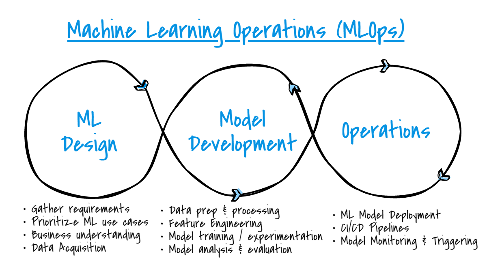

## Table of Contents

## What is an Operation (Op) in the context of machine learning?

In the context of machine learning, an Operation (Op) refers to a specific computation or transformation that is applied to data within a model. Think of an Op as a building block that performs a simple task, like adding two numbers or applying an activation function to a neuron's output. These operations are combined to create complex neural networks and machine learning models. For example, in a neural network, an Op might be responsible for calculating the weighted sum of inputs to a neuron, which is then passed through an activation function to produce the neuron's output.

Ops are crucial because they allow machine learning frameworks to break down complex models into manageable pieces. This modular approach makes it easier to understand, build, and optimize models. For instance, popular frameworks like TensorFlow and PyTorch use Ops to represent computations in their computational graphs. Each Op in these graphs can be executed on different hardware, such as CPUs or GPUs, which helps in speeding up the training and inference processes. By using Ops, developers can focus on designing the architecture of their models without worrying about the low-level details of how each computation is performed.

## How do Operations (Ops) function within a neural network?

In a neural network, Operations (Ops) are the small steps that help the network do its job. Think of them as the basic actions that the network uses to process information. For example, an Op might take the numbers coming into a neuron, multiply each by a weight, add them up, and then use an activation function to decide if the neuron should "fire" or not. This process can be shown with a simple formula like $$output = activation(\sum_{i} weight_i \cdot input_i)$$. Each Op does a specific job, and when you put a lot of these Ops together, they form the whole neural network.

Ops are important because they let the neural network break down big tasks into smaller, easier parts. This makes it easier to build and understand the network. For example, in a framework like TensorFlow, you might write code like ```python
import tensorflow as tf
x = tf.constant([1.0, 2.0])
w = tf.constant([0.5, 0.3])
b = tf.constant([0.1])
y = tf.add(tf.reduce_sum(tf.multiply(x, w)), b)
``` to create Ops that do the math needed for a single neuron. By using Ops, the network can run on different types of hardware, like CPUs or GPUs, which makes it faster and more efficient.

## Can you explain the difference between basic and advanced Ops in machine learning?

Basic Ops in machine learning are the simple building blocks that perform fundamental tasks. These include operations like addition, multiplication, and applying activation functions. For example, in a neural network, a basic Op might be responsible for calculating the weighted sum of inputs to a neuron, which can be expressed as $$output = \sum_{i} weight_i \cdot input_i$$. These Ops are essential because they form the core of more complex computations. In a framework like TensorFlow, you might use code like ```python
import tensorflow as tf
x = tf.constant([1.0, 2.0])
w = tf.constant([0.5, 0.3])
y = tf.reduce_sum(tf.multiply(x, w))
``` to create a basic Op that multiplies inputs by weights and sums them up.

Advanced Ops, on the other hand, are more complex and often built on top of basic Ops. They perform higher-level tasks that might involve multiple steps or more sophisticated algorithms. For example, an advanced Op might implement a convolutional layer in a convolutional neural network (CNN), which involves sliding a filter over the input data, applying weights, and then summing the results. This can be more complex and might require multiple basic Ops working together. In TensorFlow, you might use code like ```python
import tensorflow as tf
input_data = tf.random.normal([1, 28, 28, 1])
filter_weights = tf.random.normal([5, 5, 1, 32])
conv_layer = tf.nn.conv2d(input_data, filter_weights, strides=[1, 1, 1, 1], padding='SAME')
``` to create an advanced Op that performs a convolution. These advanced Ops make it easier to build and understand complex models by abstracting away the details of the underlying basic Ops.

## What are some common types of Ops used in machine learning models?

In machine learning models, some common types of Ops include basic arithmetic operations like addition and multiplication, which are used to combine inputs and weights. For example, in a neural network, an Op might calculate the weighted sum of inputs to a neuron, which can be expressed as $$output = \sum_{i} weight_i \cdot input_i$$. Another common basic Op is the application of activation functions, such as the ReLU (Rectified Linear Unit) function, which helps introduce non-linearity into the model. In TensorFlow, you might use code like ```python
import tensorflow as tf
x = tf.constant([1.0, 2.0])
w = tf.constant([0.5, 0.3])
y = tf.nn.relu(tf.reduce_sum(tf.multiply(x, w)))
``` to create these basic Ops.

Advanced Ops are also widely used and include operations like convolution, which is essential for convolutional neural networks (CNNs). A convolution Op slides a filter over the input data, applies weights, and sums the results to create feature maps. In TensorFlow, you might use code like ```python
import tensorflow as tf
input_data = tf.random.normal([1, 28, 28, 1])
filter_weights = tf.random.normal([5, 5, 1, 32])
conv_layer = tf.nn.conv2d(input_data, filter_weights, strides=[1, 1, 1, 1], padding='SAME')
``` to create a convolution Op. Another advanced Op is the pooling operation, which reduces the dimensionality of the data while retaining important features. These advanced Ops help build more complex and powerful models by combining multiple basic Ops into higher-level tasks.

## How are custom Ops created and implemented in machine learning frameworks?

Custom Ops in machine learning frameworks like TensorFlow or PyTorch are created when you need to perform a specific operation that isn't already available. To create a custom Op, you usually write code in C++ or CUDA for the low-level computation part, and then use Python to wrap this code so it can be easily used in your models. For example, in TensorFlow, you might write a C++ function for your custom Op and then use the TensorFlow C++ API to register it. After that, you create a Python wrapper that makes it simple to use your custom Op in your model. This process lets you add new operations that are tailored to your specific needs, making your models more flexible and powerful.

Implementing a custom Op involves a few steps. First, you define the operation in C++ or CUDA, which gives you direct control over how the computation is done. For instance, if you want to create an Op that performs a unique mathematical function, like $$output = \sqrt{\sum_{i} input_i^2}$$, you would write the C++ code to do this. Then, you register this Op with the framework so it can be used. After the C++ part is done, you write a Python wrapper to make it easy to use in your model. In TensorFlow, this might look like ```python
import tensorflow as tf
from tensorflow.python.framework import ops
from tensorflow.python.ops import gen_custom_ops

custom_op_module = tf.load_op_library('./custom_ops.so')
@tf.RegisterGradient("CustomOp")
def _custom_op_grad(op, grad):
    return gen_custom_ops.custom_op_grad(op.inputs[0], grad)

x = tf.constant([1.0, 2.0, 3.0])
y = custom_op_module.custom_op(x)
```. This way, you can use your custom Op just like any other operation in your machine learning models.

## What role do Ops play in the optimization and training of machine learning models?

Ops are key building blocks in machine learning models that help with optimization and training. When you train a model, you want to find the best weights that make your model work well. Ops help by breaking down the big task of training into smaller steps. For example, an Op might calculate how wrong the model's guess is compared to the right answer, which is called the loss. This loss is then used to tweak the weights to make the model better. By using Ops, the model can figure out how to change the weights in a way that reduces the loss, which is what optimization is all about.

During training, Ops also help in calculating gradients, which tell you how to change the weights to improve the model. For instance, an Op might use a formula like $$gradient = \frac{\partial loss}{\partial weight}$$ to find out how the loss changes when you change a weight. These gradients are then used by an optimizer, like gradient descent, to update the weights. In a framework like TensorFlow, you might write code like ```python
import tensorflow as tf
x = tf.Variable(1.0)
with tf.GradientTape() as tape:
    y = x**2
grad = tape.gradient(y, x)
``` to calculate gradients. By using Ops to handle these calculations, the training process becomes more efficient and easier to manage.

## How do Ops affect the performance and efficiency of machine learning models?

Ops have a big impact on how fast and efficient machine learning models are. When you use Ops, you can break down big tasks into smaller ones that can be done quickly on different types of hardware like CPUs or GPUs. For example, an Op might do a simple job like adding two numbers or applying a function like $$output = \text{ReLU}(input)$$. By using many small Ops, the model can process data faster because these small tasks can be done at the same time on different parts of the hardware. This makes training and using the model quicker.

Ops also help make models more efficient by letting developers focus on the big picture of how the model works, without worrying about the tiny details of each calculation. For instance, in a framework like TensorFlow, you might write code like ```python
import tensorflow as tf
x = tf.constant([1.0, 2.0])
w = tf.constant([0.5, 0.3])
y = tf.nn.relu(tf.reduce_sum(tf.multiply(x, w)))
``` to use Ops that do the math needed for a neuron. This way, the model can be optimized and fine-tuned easily, which means it can learn better and use less time and resources. By using Ops, machine learning models become faster, use less memory, and can be improved more easily.

## What are the challenges associated with scaling Ops in large machine learning models?

Scaling Ops in large machine learning models can be tricky because as the model gets bigger, it needs more and more Ops to do its job. When you have lots of Ops, it can take a long time to run them all, and they might need a lot of memory. For example, if you have a big neural network with many layers, each layer might need its own set of Ops to process the data. This can slow down the training and make it hard to fit everything into the computer's memory. Also, when you use a lot of Ops, it can be harder to keep track of how they all work together, which makes it tough to find and fix problems in the model.

Another challenge is making sure that all the Ops can work well together on different types of hardware. For instance, GPUs are great for running many Ops at the same time, but not all Ops are easy to run on a GPU. Some Ops might need to be changed or rewritten to work better on different hardware, which takes time and effort. In a framework like TensorFlow, you might use code like ```python
import tensorflow as tf
x = tf.random.normal([1000, 1000])
y = tf.matmul(x, x)
``` to do a big matrix multiplication, but making sure this runs fast on a GPU can be tricky. By thinking carefully about how to scale Ops, you can make sure your big machine learning models run smoothly and efficiently.

## Can you discuss the impact of Ops on model interpretability and debugging?

Ops play a big role in making machine learning models easier to understand and debug. When you break down a big model into smaller Ops, it's easier to see what each part is doing. For example, if an Op is doing something like $$output = \text{ReLU}(input)$$, you can look at that Op to understand how it's affecting the model's output. This makes it simpler to figure out why the model is making certain predictions or where things might be going wrong. By looking at individual Ops, you can trace back through the model to find errors or unexpected behavior, which helps in debugging.

However, using a lot of Ops can also make things more complicated. When you have a large model with many Ops, it can be hard to keep track of how they all work together. For instance, if you have a big neural network, each layer might have its own set of Ops, and understanding how these Ops interact can be challenging. In a framework like TensorFlow, you might use code like ```python
import tensorflow as tf
x = tf.constant([1.0, 2.0])
w = tf.constant([0.5, 0.3])
y = tf.nn.relu(tf.reduce_sum(tf.multiply(x, w)))
``` to create Ops for a neuron. While this helps in debugging specific parts of the model, it can also make the overall model harder to interpret because there are so many pieces to consider. Balancing the use of Ops to improve interpretability while managing their complexity is a key challenge in machine learning.

## How do different machine learning frameworks handle the management and execution of Ops?

Different machine learning frameworks handle the management and execution of Ops in their own ways, but they all aim to make it easy to build and run models. For example, TensorFlow uses a graph structure to manage Ops. In TensorFlow, you create a graph where each node represents an Op, and the edges show how data flows between them. When you run the model, TensorFlow can optimize this graph to run faster on different types of hardware like CPUs or GPUs. This makes it easier to manage and execute complex models with many Ops. For instance, you might write code like ```python
import tensorflow as tf
x = tf.constant([1.0, 2.0])
w = tf.constant([0.5, 0.3])
y = tf.nn.relu(tf.reduce_sum(tf.multiply(x, w)))
``` to create and run Ops in TensorFlow.

PyTorch, on the other hand, uses a more dynamic approach with its autograd system. In PyTorch, Ops are managed through a dynamic computational graph that is built on-the-fly as the model runs. This makes it easier to debug and understand the model because you can see how the Ops are working together in real-time. PyTorch also makes it simple to move Ops between different hardware, like from a CPU to a GPU, with just a few lines of code. For example, you might write code like ```python
import torch
x = torch.tensor([1.0, 2.0])
w = torch.tensor([0.5, 0.3])
y = torch.relu(torch.sum(x * w))
``` to create and run Ops in PyTorch. Both frameworks help make machine learning models more efficient and easier to work with, but they do it in different ways.

## What are the latest advancements in Ops design and their implications for future machine learning models?

The latest advancements in Ops design are making machine learning models faster and more flexible. One big change is the use of more specialized Ops that can run better on different types of hardware like GPUs and TPUs. For example, frameworks like TensorFlow and PyTorch now have better support for custom Ops written in C++ or CUDA, which lets developers create operations that are tailored to their specific needs. This means models can run more efficiently and use less memory. Another advancement is the use of automatic differentiation, which makes it easier to calculate gradients for training. In PyTorch, you might write code like ```python
import torch
x = torch.tensor([1.0, 2.0], requires_grad=True)
y = x**2
y.backward()
print(x.grad)
``` to use automatic differentiation and see how it helps with training.

These advancements have big implications for future machine learning models. With more specialized and efficient Ops, models can be bigger and more complex without slowing down too much. This means they can learn more and do better at tasks like understanding language or recognizing images. Also, the ability to create custom Ops makes it easier for researchers to try new ideas and improve models quickly. As hardware keeps getting better, these new Ops will help machine learning models take advantage of that, making them even more powerful and useful in the future.

## How can one evaluate the effectiveness of different Ops in improving model accuracy and generalization?

To evaluate the effectiveness of different Ops in improving model accuracy and generalization, you can start by comparing the performance of models with and without the new Ops. For example, if you add a new Op to your model, you can train both versions and see how they do on a test set. The model with the new Op should have better accuracy if the Op is helping. You can also look at how well the model generalizes by testing it on different kinds of data it hasn't seen before. If the model with the new Op does better on these new datasets, it means the Op is helping the model learn more useful patterns.

Another way to evaluate Ops is by looking at the loss function during training. If the new Op helps the model learn faster or reach a lower loss, like $$loss = \frac{1}{n} \sum_{i=1}^{n} (y_i - \hat{y}_i)^2$$, it's a good sign that the Op is effective. You can also use techniques like cross-validation to make sure the Op is not just helping on one specific dataset but works well in general. In a framework like TensorFlow, you might write code like ```python
import tensorflow as tf
from sklearn.model_selection import cross_val_score

# Define your model with and without the new Op
model_with_op = tf.keras.Sequential([...])
model_without_op = tf.keras.Sequential([...])

# Train and evaluate both models
model_with_op.compile(optimizer='adam', loss='mse')
model_without_op.compile(optimizer='adam', loss='mse')

# Use cross-validation to compare generalization
scores_with_op = cross_val_score(model_with_op, X, y, cv=5)
scores_without_op = cross_val_score(model_without_op, X, y, cv=5)

print("Model with Op:", scores_with_op.mean())
print("Model without Op:", scores_without_op.mean())
``` to compare the effectiveness of the new Op across different subsets of your data.