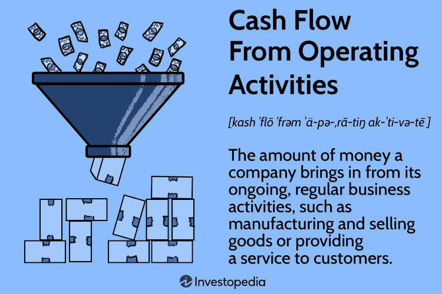

Monetary policy instruments are pivotal in directing economic activity and ensuring financial stability. Among such tools, Operation Twist stands out as a strategic initiative by the Federal Reserve, targeting interest rate manipulation to encourage economic expansion. First introduced in the 1960s and revisited during periods of economic duress, such as the 2008 financial crisis, Operation Twist involves the simultaneous purchasing of long-term Treasury securities while selling short-term ones. This tactical adjustment in the composition of the Fed's balance sheet seeks to influence the yield curve, primarily aiming to lower long-term interest rates without altering the total size of the Federal Reserve's holdings.

The initiative's impact on the yield curve is of particular interest because the yield curve serves as a critical indicator of economic expectations. A flattening yield curve—where the gap between short-term and long-term interest rates narrows—can reduce borrowing costs for businesses and consumers alike, theoretically spurring investment and consumption.



In recent years, the role of algorithmic trading in financial markets has become increasingly prominent, prompting a complex interplay between advanced trading systems and monetary policy actions like Operation Twist. Algorithmic trading facilitates high-speed, data-driven investment strategies that can significantly influence market dynamics. These systems swiftly interpret policy changes, adapting trading strategies to leverage shifts in interest rate trajectories resulting from initiatives such as Operation Twist.

This article investigates the sophisticated nature of Operation Twist, analyzing its purpose, execution, and resultant economic effects. Additionally, the interaction between the policy initiative and algorithmic trading is explored, providing insights into how such technologically advanced trading can react to and even amplify the effects of monetary policy decisions. This analysis aims to illuminate the profound complexities of implementing monetary policy tools and their implications for economic and market stability.

## Table of Contents

## Understanding Operation Twist

Operation Twist is a monetary policy strategy employed by the Federal Reserve that involves the concurrent buying of long-term Treasury securities and selling of short-term Treasury securities. The primary objective of this approach is to influence the yield curve by lowering long-term interest rates while maintaining stable short-term rates. This maneuver helps create a more favorable economic environment for investment and borrowing, contributing to economic growth.

This strategy was first introduced in the 1960s. However, its resurgence during the 2008-2009 financial crisis highlighted its potential effectiveness as a non-traditional monetary policy tool. By lowering long-term rates, Operation Twist aims to make borrowing more affordable for consumers and businesses, encouraging spending and investment which can stimulate the economy.

One of the distinguishing characteristics of Operation Twist is its impact on the Federal Reserve's balance sheet. Unlike quantitative easing, which involves the outright purchase of securities and thus expands the balance sheet, Operation Twist operates through the reallocation of existing assets. In quantitative easing, the central bank buys financial assets to inject [liquidity](/wiki/liquidity-risk-premium) directly into the economy, increasing the overall size of its balance sheet. In contrast, Operation Twist focuses on the composition of the holdings, selling short-term securities to fund the purchase of long-term securities, thereby not increasing the overall size of the balance sheet.

Mathematically, the yield curve can be described as a function $Y(t)$, representing yields at different maturities $t$. The goal of Operation Twist is to achieve a flatter yield curve, where the gradient $\frac{dY}{dt}$ is reduced, particularly at the longer end of the curve, $t_{long}$, compared to the short end, $t_{short}$. This flattening indicates a reduction in the spread between long-term and short-term interest rates, aimed at stimulating long-term economic investment while avoiding inflationary pressures that might accompany broad-based liquidity expansion.

Overall, Operation Twist represents a strategic approach to monetary policy, leveraging the Federal Reserve's existing portfolio to influence long-term interest rates without expanding the monetary base, thereby offering a distinct alternative to other expansive monetary policies like quantitative easing.

## Economic Impact of Operation Twist

Operation Twist is a monetary policy tool designed to adjust interest rates by altering the maturity composition of the Federal Reserve's securities holdings. Its primary goal is to reduce long-term interest rates while maintaining stable short-term rates, thereby encouraging borrowing and investing to stimulate economic growth. By purchasing long-term Treasury bonds and selling short-term Treasury securities, the Federal Reserve aims to flatten the yield curve, which represents the relationship between interest rates and the maturity of debt securities.

A flatter yield curve can have several economic impacts. Firstly, lower long-term interest rates make borrowing more attractive for businesses and consumers. For businesses, this environment can reduce the cost of capital, encouraging investment in new projects, expansion, and hiring. For consumers, lower long-term rates can translate into reduced borrowing costs for significant purchases such as homes and automobiles, potentially leading to increased spending in these sectors. 

The housing market is particularly sensitive to changes in long-term interest rates. Lower mortgage rates, a direct consequence of reduced long-term rates, can stimulate demand for housing by making mortgages more affordable. This increased demand can lead to higher home prices and more construction activities, positively influencing economic growth. Similarly, the automotive industry benefits from reduced financing costs, as consumers find it cheaper to finance vehicle purchases, potentially boosting sales and production.

Despite these potential benefits, the effectiveness of Operation Twist can be influenced by various external factors such as global economic conditions and existing market sentiment. During periods of economic uncertainty, even lower interest rates might not suffice to stimulate borrowing and investment if businesses and consumers remain cautious. Furthermore, the operation's impact on different economic sectors can vary, as not all industries are equally sensitive to changes in interest rates.

In summary, Operation Twist aims to encourage economic activity by flattening the yield curve, reducing long-term interest rates, and supporting borrowing and investment. This policy can have significant implications for sectors like housing and automotive, which are particularly sensitive to financing costs. However, its overall success depends on broader economic conditions and market responses.

## Algorithmic Trading and Monetary Policy

Algorithmic trading deploys complex computer algorithms to execute trades at speeds and frequencies beyond human capability. These algorithms are designed to identify patterns and trends in the financial markets, giving traders a competitive edge. By processing vast amounts of data quickly, [algorithmic trading](/wiki/algorithmic-trading) systems can make informed decisions and execute trades within milliseconds, exploiting market inefficiencies. 

Monetary policy changes, such as Operation Twist, can significantly impact [interest rate](/wiki/interest-rate-trading-strategies) dynamics, which, in turn, affect asset prices. Algorithmic trading systems are particularly sensitive to such policy shifts, rapidly adjusting their strategies to align with the anticipated changes in interest rates. For example, a change in the yield curve due to Operation Twist might prompt algorithms to reallocate assets, shift from short to long-duration bonds, or vice versa. 

The ability of algorithmic trading to anticipate and react to monetary policy modifications enhances market liquidity and operational efficiency. These systems enable trading at lower costs and with greater speed, ensuring that prices reflect all available information. By continually analyzing the market and adapting strategies, algorithmic trading contributes to the price discovery process. 

For instance, consider a scenario where the Federal Reserve announces the implementation of Operation Twist. The algorithms might adjust portfolios by converting some holdings from short-term to long-term bonds to capitalize on the expected decrease in long-term yields. This rebalancing process can be illustrated using a simple algorithmic snippet:

```python
def rebalance_portfolio(portfolio, yield_curve):
    threshold = 0.5  # Example yield target
    for bond in portfolio:
        if bond.duration < 5 and yield_curve.long_term < threshold:
            # Convert short-term to long-term
            sell(bond)
            buy_long_term_bond()
```

In this pseudo-code, the algorithm monitors the yield curve and executes trades based on predefined thresholds, exemplifying how algorithmic trading adapts to monetary policy maneuvers. As central banks implement policies like Operation Twist, algorithmic trading's responsive nature continues to shape the dynamics of modern financial markets.

## Analyzing Financial Markets

Financial markets' reactions to Operation Twist stem primarily from changes in bond prices and yields, which can significantly influence investment strategies. When the Federal Reserve employs Operation Twist, it sells short-term Treasury bonds and purchases long-term bonds. This action decreases long-term interest rates while keeping short-term rates stable. The immediate impact is on the yield curve, which is a graphical representation of interest rates across different contract lengths for bonds. 

As Operation Twist flattens the yield curve, the long-term interest rates tend to decrease. Lower long-term interest rates typically make long-term bonds more attractive due to their higher prices and lower yields. This can lead to a shift in investor behavior, as investors may seek more profitable investment opportunities in other asset classes such as equities or alternative fixed-income securities. For instance, reduced borrowing costs can boost corporate profits, making equities more appealing. The shifting demand can drive up stock prices, potentially increasing the equity market's [volatility](/wiki/volatility-trading-strategies) and liquidity.

The flattening of the yield curve also has implications for investment strategies. For fixed-income investors, the decision between short-term and long-term bond investments changes as the yield curve flattens. Some investors may move investments from long-term bonds, now with reduced yields, to short-term bonds for better returns or pursue diversified asset allocations. This strategic reallocation highlights the dynamic interaction between monetary policy and market behavior.

Moreover, these market reactions are further complicated by algorithmic trading. Algorithms can automatically adjust portfolio allocations in response to minute changes in yield spreads, contributing to increased trading volumes and market liquidity. These systems can amplify market movements due to their speed and ability to process vast amounts of financial data in real time.

The interconnectedness of monetary policy and financial market dynamics is evident, as Operation Twist's influence extends beyond immediate yield curve adjustments. The changing bond yields impact borrowing costs for businesses and consumers, which in turn affect economic activities such as consumption and investment. Therefore, understanding these financial market responses is crucial for policymakers and investors alike, underscoring the complexity and systemic nature of Operation Twist within the broader economic ecosystem.

## Criticisms and Challenges

Critics of Operation Twist often point to its limited impact, which can be attributed to various external factors, such as global economic conditions and conflicting monetary policies implemented by other central banks. Although the policy aims to reduce long-term interest rates, its effectiveness may be compromised when other countries engage in divergent monetary strategies. For instance, foreign central banks might pursue policies that boost their currency's value relative to the U.S. dollar, potentially offsetting the intended effects of Operation Twist domestically. 

Another significant concern revolves around the potential distortions in market signals. By artificially flattening the yield curve, Operation Twist may obscure the true state of the economy. The yield curve is a critical indicator used by investors and policymakers to forecast economic activity and inflation. A flattening of the curve might suggest an economic slowdown, even when this is not the reality, leading to misguided investment decisions and policy responses.

The policy's impact on income inequality is another contentious issue. Lower long-term interest rates typically benefit those who own significant financial assets because asset prices tend to rise as yields drop. This can lead to disproportionate benefits for higher-income groups, exacerbating existing income disparities. In contrast, lower-income households, who often do not possess sizeable financial portfolios, may see little direct benefit from the policy. Moreover, these households tend to rely more on wages than on capital income, and the broader economic improvements that might eventually result from such monetary interventions take time to materialize and are often unevenly distributed.

In conclusion, while Operation Twist can influence economic outcomes, its efficacy is subject to various challenges. These include its limited impact due to external factors, the potential for distorting economic signals, and concerns over its contribution to income inequality. As such, the policy must be carefully considered within the broader context of international economic dynamics and domestic socio-economic conditions.

## Conclusion

Operation Twist demonstrates the intricate strategies of monetary policy in shaping economic outcomes. By adjusting the maturity of the Federal Reserve's bond portfolio, this tool has provided a distinct approach to influencing interest rates without expanding the Fed's balance sheet. The dual action of purchasing long-term securities while selling short-term ones aims to lower long-term interest rates and flatten the yield curve, fostering conditions favorable for economic growth. This nuanced approach ensures that while stimulating borrowing and investment, it remains a different approach from more expansive tools like quantitative easing.

When aligned with algorithmic trading, monetary policies like Operation Twist can significantly impact market behavior and economic stability. Algorithmic trading systems, known for their ability to quickly process and react to market data, are particularly sensitive to such policy changes. They can swiftly adjust trading strategies based on anticipated interest rate movements, thereby enhancing market liquidity and efficiency. This interaction between advanced trading technology and monetary policy highlights the increased complexity within modern financial markets.

As central banks continue to face evolving economic challenges, the insights gained from initiatives like Operation Twist can guide the development of future monetary strategies. These lessons are invaluable in crafting responses that account for both traditional economic indicators and the technological advancements in trading mechanisms. Furthermore, understanding the limitations and potential market distortions caused by such policies can aid in designing more balanced and equitable economic interventions.

## References & Further Reading

[1]: ["Operation Twist and the Long-Term Interest Rate"](https://www.investopedia.com/terms/o/operation-twist.asp) Federal Reserve

[2]: Swanson, E. T. (2011). ["Let's Twist Again: A High-Frequency Event-Study Analysis of Operation Twist and Its Implications for QE2"](https://sites.socsci.uci.edu/~swanson2/papers/lta.pdf) American Economic Review

[3]: ["The Influence of ‘Operation Twist’ on Maturities and Monetary Policy"](https://fastercapital.com/content/Navigating-Operation-Twist--The-Impact-of-Monetary-Policy-on-the-Economy.html) The Journal of Finance

[4]: ["Quantitative Systematic Trading"](https://en.wikipedia.org/wiki/Systematic_trading) by Michael L. Halls-Moore

[5]: Campbell, J. Y., & Mankiw, N. G. (1987). ["Are Output Fluctuations Transitory?"](https://scholar.harvard.edu/files/mankiw/files/are_output_fluctuations.pdf) National Bureau of Economic Research

[6]: ["The Relationship Between the Yield Curve and Monetary Policy"](https://www.kansascityfed.org/documents/962/2005-Longer-Term%20Perspective%20on%20the%20Yield%20Curve%20and%20Monetary%20Policy.pdf) by Richard G. Anderson, and Joseph E. Smith. Federal Reserve Bank of St. Louis Review