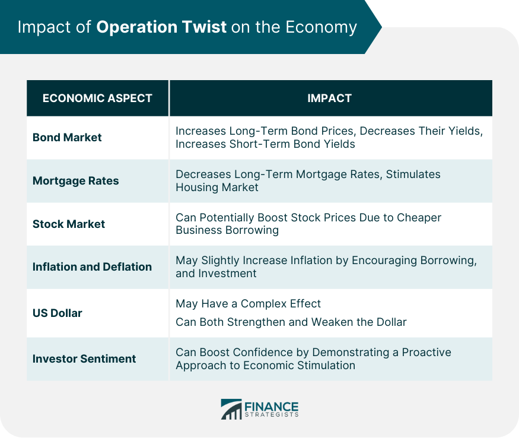

## Table of Contents

## What is Operation Twist?

Operation Twist is a strategy used by the Federal Reserve, the central bank of the United States, to influence interest rates and help the economy. It was first used in the 1960s and then again in 2011. The idea is to sell short-term government bonds and use the money to buy long-term government bonds. This action aims to lower long-term interest rates, making borrowing cheaper for things like mortgages and business loans.

When long-term interest rates go down, people and businesses are more likely to borrow money to buy homes, start new projects, or expand their operations. This can help boost economic activity. By focusing on changing the yield curve – the difference between short-term and long-term interest rates – the Federal Reserve hopes to encourage spending and investment without adding more money into the economy, which could lead to inflation.

## Who implements Operation Twist?

Operation Twist is carried out by the Federal Reserve, which is the central bank of the United States. They are in charge of managing the country's money and making sure the economy is stable. When they decide to use Operation Twist, they sell short-term government bonds and use the money to buy long-term government bonds. This action helps to change the interest rates.

By selling short-term bonds and buying long-term bonds, the Federal Reserve makes long-term interest rates go down. This means that people and businesses can borrow money more cheaply. When borrowing is cheaper, more people might decide to buy homes or start new projects, which can help the economy grow. The Federal Reserve uses this strategy to encourage spending and investment without adding more money into the economy, which could cause prices to rise too quickly.

## When was Operation Twist first used?

Operation Twist was first used in the 1960s. It was a plan by the Federal Reserve to help the economy. They did this by selling short-term government bonds and using the money to buy long-term government bonds. This made long-term interest rates go down, so people and businesses could borrow money more cheaply.

The idea was to make it easier for people to buy homes and for businesses to grow. When borrowing is cheaper, more people might decide to spend money. This can help the economy get better. The Federal Reserve used this strategy to help the economy without adding more money, which could make prices go up too fast.

## What are the main goals of Operation Twist?

Operation Twist is a plan used by the Federal Reserve to help the economy. The main goal is to lower long-term interest rates. When long-term interest rates go down, it becomes cheaper for people and businesses to borrow money. This can make it easier for people to buy homes and for businesses to start new projects or expand.

By making borrowing cheaper, Operation Twist encourages more spending and investment. This can help the economy grow. The Federal Reserve does this by selling short-term government bonds and using the money to buy long-term government bonds. This way, they can influence interest rates without adding more money into the economy, which could cause prices to rise too quickly.

## How does Operation Twist affect interest rates?

Operation Twist is a plan used by the Federal Reserve to change interest rates. They do this by selling short-term government bonds and using the money to buy long-term government bonds. When they buy long-term bonds, it makes the price of these bonds go up. When the price of a bond goes up, the [interest rate](/wiki/interest-rate-trading-strategies) on that bond goes down. So, Operation Twist helps to lower long-term interest rates.

When long-term interest rates go down, it becomes cheaper for people and businesses to borrow money. This can make it easier for people to get loans for things like buying a house. Businesses might also borrow money to start new projects or grow their operations. By making borrowing cheaper, Operation Twist encourages more spending and investment, which can help the economy grow.

## What is the difference between Operation Twist and quantitative easing?

Operation Twist and quantitative easing are both ways the Federal Reserve tries to help the economy, but they work a bit differently. Operation Twist is when the Federal Reserve sells short-term government bonds and uses the money to buy long-term government bonds. This makes long-term interest rates go down, so people and businesses can borrow money more cheaply. The goal is to encourage spending and investment without adding more money into the economy, which could cause prices to rise too quickly.

Quantitative easing, on the other hand, is when the Federal Reserve buys a lot of different kinds of bonds, like government bonds and mortgage-backed securities, to put more money into the economy. By buying these bonds, the Federal Reserve adds more money into the system, which can help lower interest rates across the board. The main difference is that quantitative easing adds more money into the economy, while Operation Twist just changes the balance between short-term and long-term interest rates without adding more money.

## How does Operation Twist influence the yield curve?

Operation Twist is a way the Federal Reserve changes the yield curve, which is the difference between short-term and long-term interest rates. When they do Operation Twist, they sell short-term government bonds and use the money to buy long-term government bonds. This action makes the price of long-term bonds go up. When the price of a bond goes up, the interest rate on that bond goes down. So, by doing Operation Twist, the Federal Reserve makes long-term interest rates lower than short-term interest rates.

When long-term interest rates go down, it becomes cheaper for people and businesses to borrow money for things like buying a house or starting a new project. This can make the yield curve steeper because the difference between short-term and long-term interest rates gets bigger. The Federal Reserve uses Operation Twist to encourage spending and investment without adding more money into the economy, which could make prices rise too quickly.

## What economic conditions typically prompt the use of Operation Twist?

Operation Twist is usually used when the economy is not doing well and needs help to grow. The Federal Reserve might use this plan when they see that people and businesses are not borrowing enough money. When borrowing goes down, it can slow down the economy because people are not spending as much. By lowering long-term interest rates through Operation Twist, the Federal Reserve makes it cheaper for people to get loans for things like buying a house or for businesses to start new projects. This can help get the economy moving again.

The Federal Reserve might also choose Operation Twist when they want to help the economy without adding more money into it. Adding more money can sometimes make prices rise too quickly, which is called inflation. With Operation Twist, the Federal Reserve changes the balance between short-term and long-term interest rates without increasing the total amount of money in the economy. This way, they can encourage spending and investment while keeping inflation under control.

## Can you explain the mechanism of Operation Twist in detail?

Operation Twist is a plan used by the Federal Reserve to help the economy. They do this by selling short-term government bonds and using the money to buy long-term government bonds. When they buy long-term bonds, the price of these bonds goes up. When the price of a bond goes up, the interest rate on that bond goes down. So, Operation Twist makes long-term interest rates lower than short-term interest rates. This makes it cheaper for people and businesses to borrow money for things like buying a house or starting a new project.

When long-term interest rates go down, it encourages more spending and investment. People might decide to buy homes because the loans are cheaper. Businesses might borrow money to start new projects or grow their operations. This can help the economy grow. The Federal Reserve uses Operation Twist when they want to help the economy without adding more money into it. Adding more money can sometimes make prices rise too quickly, which is called inflation. With Operation Twist, the Federal Reserve changes the balance between short-term and long-term interest rates without increasing the total amount of money in the economy. This way, they can encourage spending and investment while keeping inflation under control.

## What were the results of Operation Twist in past implementations?

When the Federal Reserve used Operation Twist in the 1960s, it helped to make long-term interest rates go down. This made it cheaper for people to borrow money for things like buying a house. The economy got a little better because more people were spending money. But, it didn't fix all the problems. The economy still had some issues, and it took more time and other plans to help it grow more.

In 2011, the Federal Reserve used Operation Twist again. They wanted to help the economy after the big financial crisis. It made long-term interest rates go down again, which helped people and businesses borrow money more easily. This time, it seemed to work better than in the 1960s. The economy started to grow more, and more people were able to buy homes and start new projects. But, it was just one part of a bigger plan to help the economy recover.

## How do financial markets react to the announcement of Operation Twist?

When the Federal Reserve announces Operation Twist, it often makes financial markets react in certain ways. People in the markets know that Operation Twist is meant to lower long-term interest rates. So, when they hear about it, they might start buying long-term government bonds because they expect the prices of these bonds to go up. This can make the prices go up even before the Federal Reserve starts buying the bonds. It also makes the difference between short-term and long-term interest rates bigger, which is called the yield curve getting steeper.

The stock market might also react positively to the announcement of Operation Twist. When long-term interest rates go down, it becomes cheaper for businesses to borrow money. This can make investors think that businesses will do better because they can start new projects or grow more easily. So, the stock prices might go up because people think the economy will get better. But, the reactions can be different each time Operation Twist is announced, depending on what else is happening in the economy and the world.

## What are the potential risks and criticisms associated with Operation Twist?

One risk of Operation Twist is that it might not work as well as the Federal Reserve hopes. If people and businesses don't start borrowing more money even when interest rates go down, then the economy might not grow as expected. Also, if the Federal Reserve buys too many long-term bonds, it could make the prices of these bonds go up a lot. This could cause problems if they need to sell these bonds later and the prices have gone down.

Another criticism is that Operation Twist might not be strong enough to help the economy a lot. Some people think that adding more money into the economy, like with quantitative easing, might work better. They worry that Operation Twist only changes the balance between short-term and long-term interest rates without adding more money, so it might not do enough to get the economy moving. Critics also say that if the Federal Reserve keeps using Operation Twist, it might make people expect that interest rates will stay low forever, which could cause other problems in the economy.

## References & Further Reading

[1]: ["Operation Twist and the Long-Term Interest Rate"](https://www.investopedia.com/terms/o/operation-twist.asp) Federal Reserve

[2]: Swanson, E. T. (2011). ["Let's Twist Again: A High-Frequency Event-Study Analysis of Operation Twist and Its Implications for QE2"](https://sites.socsci.uci.edu/~swanson2/papers/lta.pdf) American Economic Review

[3]: ["The Influence of ‘Operation Twist’ on Maturities and Monetary Policy"](https://fastercapital.com/content/Navigating-Operation-Twist--The-Impact-of-Monetary-Policy-on-the-Economy.html) The Journal of Finance

[4]: ["Quantitative Systematic Trading"](https://en.wikipedia.org/wiki/Systematic_trading) by Michael L. Halls-Moore

[5]: Campbell, J. Y., & Mankiw, N. G. (1987). ["Are Output Fluctuations Transitory?"](https://scholar.harvard.edu/files/mankiw/files/are_output_fluctuations.pdf) National Bureau of Economic Research

[6]: ["The Relationship Between the Yield Curve and Monetary Policy"](https://www.kansascityfed.org/documents/962/2005-Longer-Term%20Perspective%20on%20the%20Yield%20Curve%20and%20Monetary%20Policy.pdf) by Richard G. Anderson, and Joseph E. Smith. Federal Reserve Bank of St. Louis Review