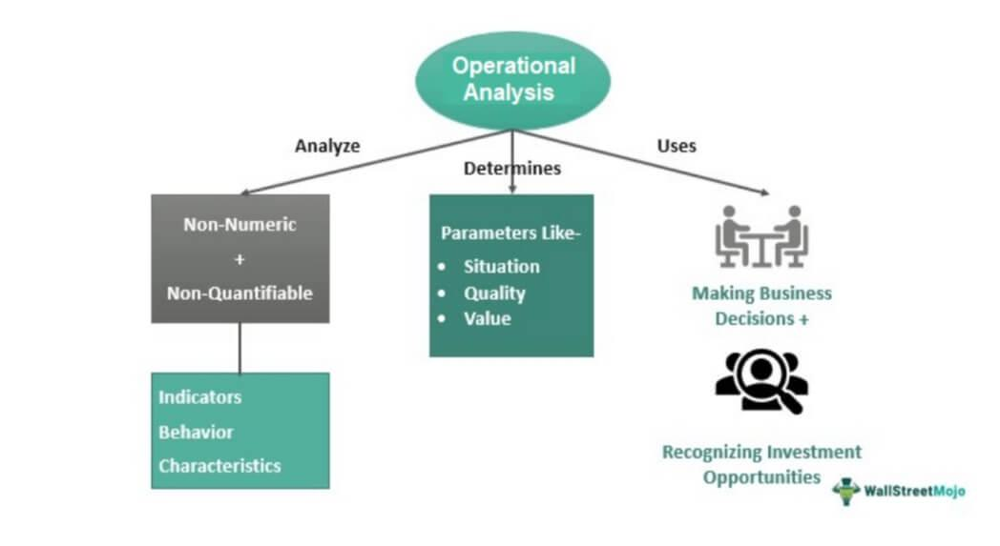

In today's rapidly evolving financial landscape, businesses and traders are placing increasing emphasis on operational efficiency to enhance their performance and productivity. Operational efficiency is especially crucial as financial markets become more complex and competitive, requiring entities to maximize their use of resources and technology.

Algorithmic trading, often referred to as algo trading, is instrumental in achieving such efficiency. This approach involves the use of computer algorithms that execute pre-defined trading strategies based on statistical models. The primary advantage of algorithmic trading is its ability to execute trades with both precision and speed, surpassing human capability and reducing the potential for error.



Operational efficiency in trading not only lowers transaction costs but also allows for a better positioning in the marketplace by optimizing the allocation of capital and human resources. By automating processes, businesses can focus on strategic decision-making rather than routine tasks, thereby reducing overhead and improving profitability.

The interaction between operational efficiency and technological advancements, such as algo trading, enables businesses to streamline their operations, reduce costs, and ultimately achieve greater market success. This symbiotic relationship is essential for maintaining a competitive edge and adapting quickly to market changes. In this article, we explore how these elements work together to drive efficiency and performance in both business and trading environments. Through a deeper understanding of these interactions, businesses can enhance their strategic capabilities to thrive in a fast-paced financial ecosystem.

## Table of Contents

## Understanding Operational Efficiency

Operational efficiency is a critical metric for assessing how well a business utilizes its resources to generate profitable outputs. It is fundamentally concerned with optimizing processes to ensure that every resource—be it time, money, or labor—is being used to achieve maximum effect. In trading, operational efficiency is vital as it pertains to executing trades with minimal costs while maximizing returns. This efficiency is not solely about speed; it involves a comprehensive strategy that incorporates technology, process improvements, and risk management.

In the trading context, achieving high operational efficiency translates to reduced transaction costs, which directly influences profit margins. By optimizing the use of capital and resources, businesses can improve their market position. For instance, traders might focus on optimizing trading algorithms to execute transactions at the most advantageous times, thereby minimizing market impact and slippage costs. This involves setting precise parameters within the algorithm to trigger trades when certain conditions are met, reducing human error and improving consistency in execution.

Automation plays a pivotal role in enhancing operational efficiency. Automating routine tasks allows traders to focus on more strategic decision-making processes and adapt to market changes rapidly. Automation minimizes the likelihood of human error, which can be costly in fast-paced trading environments. Furthermore, automation improves the speed of trade execution, enabling traders to respond to market conditions promptly. 

Businesses aiming to achieve operational efficiency often employ strategies that involve the use of advanced analytics and data processing tools. For example, high-frequency trading relies heavily on real-time data analytics to predict market trends and execute trades in milliseconds. These strategies enhance decision-making capabilities and reduce the latency associated with manual processes, thereby increasing overall profitability.

In Python, a basic algorithm can be implemented to showcase fundamental automation and efficiency in trade execution:

```python
def execute_trade(current_price, target_price, trade_volume):
    """ Simple trade execution function """
    if current_price <= target_price:
        print(f"Executing trade of volume {trade_volume} at price {current_price}.")
        return True
    else:
        print("Target price not reached. No trade executed.")
        return False

# Example usage:
current_market_price = 100.50
desired_target_price = 100.00
volume_to_trade = 10  # number of shares

execute_trade(current_market_price, desired_target_price, volume_to_trade)
```

In this simple code snippet, the function `execute_trade` automates the decision to trade based on pre-set conditions, illustrating the concept of operational efficiency in trade execution.

In sum, businesses focused on honing their operational efficiency can achieve greater profitability and maintain a competitive edge in their industry. By integrating automation and optimizing the use of resources and capital, companies can execute trades more effectively and adapt to the ever-changing financial market landscape.

## The Role of Productivity in Business Performance

Productivity is an essential metric in evaluating business performance, signifying the relationship between the outputs produced and the resources utilized. High productivity levels equip businesses to accomplish more while utilizing the same or even fewer resources, thereby bolstering profitability. In trading, productivity is frequently enhanced through the adoption of automated systems that manage substantial trading volumes at optimal moments. These systems, through swift and accurate execution, maximize trading opportunities and significantly contribute to market competitiveness.

The interplay between productivity and efficiency is paramount, as optimized workflows facilitate the development of more adaptable and dynamic trading strategies. Streamlined processes not only reduce bottlenecks but also enable firms to respond swiftly to market fluctuations, providing a strategic advantage. Consequently, achieving a balance between productivity and efficiency is vital, allowing businesses to leverage technological advancements while maintaining operational flexibility.

To improve productivity, investment in technologies and practices that refine decision-making and execution abilities is crucial. For example, advanced analytics and [machine learning](/wiki/machine-learning) can be leveraged to derive insights from market data, aiding in informed and timely decision-making. Implementing these advanced tools and practices results in enhanced execution of trades and informed strategic planning. Such investment not only augments productivity but also aligns with the goal of optimizing overall business performance. By diligently enhancing productivity, firms position themselves for enduring success in a highly competitive and fast-paced trading environment.

## Algorithmic Trading: A Game-Changer

Algorithmic trading, often referred to as algo trading, is a significant advancement in the world of financial markets, leveraging technology to enhance trading efficiency. It uses pre-programmed instructions to analyze data and execute trades, capitalizing on market efficiencies that were previously unattainable through manual trading. These algorithms can process vast quantities of market data at an extraordinary speed, identifying potential trading opportunities and executing orders far quicker than any human could.

One of the critical advantages of [algorithmic trading](/wiki/algorithmic-trading) is its ability to minimize human error and ensure consistency across trades. The automation of these processes allows traders to react instantly to market changes, capturing opportunities as they arise. This immediacy and precision are particularly beneficial in volatile markets where timing is critical.

Algo trading supports various trading strategies, each aimed at optimizing trade outcomes. Strategies such as trend-following, which attempts to capture gains through the analysis of an asset's [momentum](/wiki/momentum) in a particular direction, and mean reversion, which bets on prices returning to their historical averages, are commonly used. Additionally, [arbitrage](/wiki/arbitrage) strategies exploit price discrepancies across different markets or instruments to generate profits, all executed with the precision and speed only algorithms can offer.

The integration of [artificial intelligence](/wiki/ai-artificial-intelligence) (AI) and machine learning into algorithmic trading systems represents the next frontier in this domain. These technologies enable the development of sophisticated models that can learn from vast data inputs, adapt to new patterns, and optimize strategies with improved accuracy. For example, AI-driven models can constantly update trading algorithms by learning from historical data, enhancing their performance in varying market conditions.

Python, with its extensive libraries such as NumPy, pandas, and scikit-learn, is a preferred language for implementing algorithmic trading strategies. Python's ease of use and the breadth of its data analysis capabilities make it an excellent choice for developing and testing these complex algorithms.

In summary, algorithmic trading has transformed the traditional trading landscape by providing tools that harness speed and precision, statutory consistency, and strategic diversity. The ongoing advancements in AI and machine learning promise even greater enhancements, cementing algorithmic trading as an indispensable component of modern financial operations.

## Enhancing Operational Efficiency in Trading

Operational efficiency in trading is critical for maintaining a competitive edge and achieving profitability. Several strategies and technologies are employed to enhance operational efficiency in this domain, primarily focusing on reducing latency, optimizing data management, and ensuring robust risk management.

Reducing latency is paramount in trading, where speed is a critical differentiator. Latency refers to the time delay between the initiation and execution of a trade. Technologies such as co-location, where trading servers are placed close to exchange servers, help in minimizing latency by reducing the time it takes for data to travel between systems. Additionally, employing high-frequency trading ([HFT](/wiki/high-frequency-trading-strategies)) algorithms can capitalize on minute price discrepancies that exist only for fractions of a second.

Optimizing data management is another crucial aspect of operational efficiency. Advanced trading systems employ big data analytics to process and analyze vast amounts of market data in real time. Cloud computing platforms are increasingly being used to provide the computational power necessary for handling these data-intensive tasks. By utilizing cloud infrastructure, traders can access scalable resources that can adapt to the varying loads of data processing.

Robust risk management frameworks are essential for safeguarding assets and ensuring the stability of trading operations. Risk management solutions, such as Value at Risk (VaR) models, help traders assess the potential losses in their portfolios and make informed decisions. Automation of risk management processes through algorithmic checks and balances ensures rapid identification and mitigation of risks, thus maintaining the reliability of trading operations.

Furthermore, continuous improvement practices, such as regular system audits, software upgrades, and targeted training programs, are vital for sustaining operational efficiency. Regular audits help identify areas of inefficiency or non-compliance within trading systems, allowing firms to make timely adjustments to their strategies and operations. System upgrades ensure that trading platforms leverage the latest technological advancements, enhancing their performance and capabilities. Finally, training programs equip traders and analysts with the knowledge and skills necessary to effectively utilize advanced trading tools and technologies.

In conclusion, enhancing operational efficiency in trading involves a multifaceted approach that integrates technology infrastructure, risk management, and continuous improvement practices. By adopting these strategies, trading firms can significantly improve their operational performance, ensuring they remain competitive in a fast-paced financial environment.

## Strategies for Future Efficiency Trends

Advancements in artificial intelligence (AI) and machine learning are poised to significantly enhance operational efficiency in trading. These technologies enable the analysis of complex datasets to identify patterns and opportunities that are beyond human capability. Machine learning algorithms can adapt to new data, improving decision-making processes and predictive accuracy in trading operations over time. By automating tasks such as pattern recognition and predictive modeling, AI systems can enhance the speed and reliability of trade executions.

Blockchain technology offers significant potential for increasing transparency and security in trading activities. The decentralized nature of blockchain ensures that all transactions are recorded in an immutable and verifiable manner. This capability reduces the risk of fraud and enhances trust among trading partners. Furthermore, smart contracts—self-executing contracts with the terms of the agreement directly coded into the blockchain—allow for automated transaction processing, minimizing operational delays and reducing costs.

Quantum computing is another frontier that promises to revolutionize trade efficiency. With its ability to process information at remarkable speeds, quantum computing can handle more complex calculations than traditional computers, enabling traders to process large volumes of data quickly. This capability is particularly beneficial for real-time decision-making processes and optimizing trading strategies that require extensive computational resources.

The continuous deployment of automated tools is essential for compliance, risk management, and trading operations. These tools streamline processes by automating routine checks and balances, reducing human error, and ensuring adherence to regulatory requirements. Automation in trading strategies allows for systematic and consistent execution, which is crucial for maintaining a competitive edge in rapidly changing markets. 

Investing in these emerging technologies can provide firms with substantial advantages in terms of speed, reliability, and profitability. As these technologies mature and integrate into traditional trading systems, firms that adopt them early are likely to achieve greater gains in operational efficiency. By leveraging AI, blockchain, and quantum computing, businesses can improve their strategic positioning and ultimately enhance their financial outcomes in increasingly competitive environments.

In the coming years, the landscape of trading will likely witness transformative changes driven by technological advances. Therefore, staying ahead of these trends and implementing them effectively will be crucial for any business looking to succeed in the future.

## Conclusion

Operational efficiency, business performance, and productivity are interlinked components essential for success in the financial markets. As businesses seek to optimize these elements, algorithmic trading emerges as a quintessential example, demonstrating how technology can enhance efficiency, profitability, and strategic advantage. Algo trading leverages sophisticated algorithms to execute trades at high speeds and precision, minimizing human error and capitalizing on market opportunities. This marriage of technology and finance ensures more consistent and predictable outcomes, ultimately bolstering profitability.

Embracing technological advancements is critical for businesses aiming to maintain or enhance their competitive edge. Innovations in artificial intelligence and machine learning provide tools that can process vast datasets, recognize patterns, and execute complex trading strategies faster and more accurately than ever before. This technological integration not only improves trading outcomes but also supports better decision-making processes across business operations, ultimately leading to stronger performance metrics.

As trading and business landscapes continue to evolve, staying ahead requires continuous improvements in operational strategies. Firms must invest in cutting-edge tools and infrastructure, such as high-speed networks and secure blockchain systems, to keep pace with the industry's rapid advancements. By continuously adapting and refining their operations, businesses can better manage risks, optimize processes, and enhance their adaptability to market changes.

Understanding and implementing these dynamics will be key for any business looking to thrive in a fast-paced, technology-driven world. Organizations that prioritize operational efficiency, leverage algorithmic trading, and seize technological opportunities are more likely to navigate successfully through the complexities of modern financial markets, ensuring sustained growth and a formidable market presence.

## References & Further Reading

[1]: Bergstra, J., Bardenet, R., Bengio, Y., & Kégl, B. (2011). ["Algorithms for Hyper-Parameter Optimization."](https://dl.acm.org/doi/10.5555/2986459.2986743) Advances in Neural Information Processing Systems 24.

[2]: ["Advances in Financial Machine Learning"](https://www.amazon.com/Advances-Financial-Machine-Learning-Marcos/dp/1119482089) by Marcos Lopez de Prado

[3]: ["Evidence-Based Technical Analysis: Applying the Scientific Method and Statistical Inference to Trading Signals"](https://www.amazon.com/Evidence-Based-Technical-Analysis-Scientific-Statistical/dp/0470008741) by David Aronson

[4]: ["Machine Learning for Algorithmic Trading"](https://github.com/stefan-jansen/machine-learning-for-trading) by Stefan Jansen

[5]: ["Quantitative Trading: How to Build Your Own Algorithmic Trading Business"](https://www.amazon.com/Quantitative-Trading-Build-Algorithmic-Business/dp/1119800064) by Ernest P. Chan