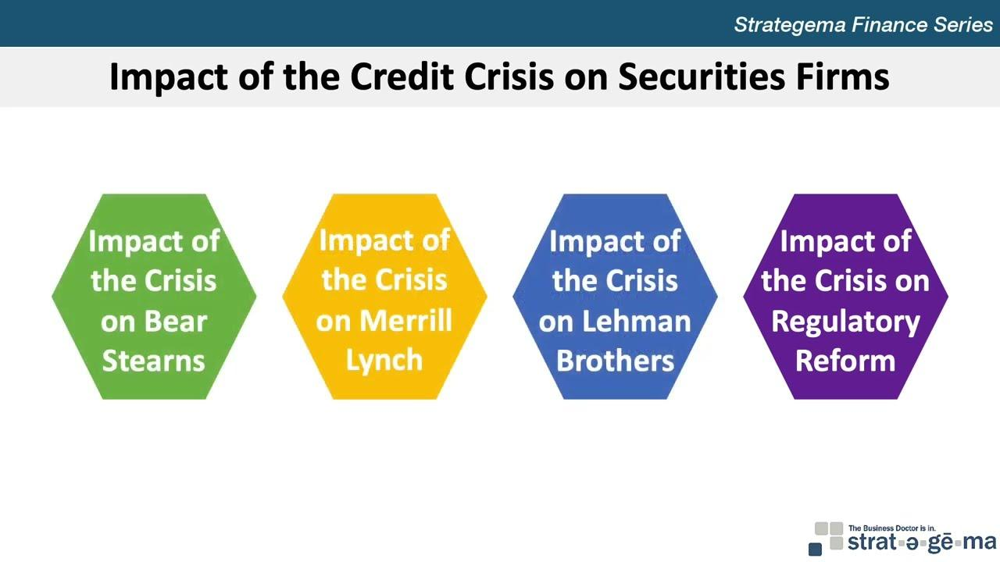

Securities firms, investment banking, and algorithmic trading are pivotal components of the modern financial landscape. These elements are not only integral to the functionality of global financial markets but also to their efficiency and growth.

Securities firms play a critical role in facilitating transactions in financial markets. These organizations are tasked with the buying and selling of financial instruments such as stocks, bonds, and derivatives. Within a typical securities firm, there are several key departments, each with specialized functions. Sales departments focus on client relations and market activities. Underwriting departments are responsible for assisting companies in raising capital, while trading departments execute buy and sell orders. Research divisions analyze market trends to provide insights, and administrative sections ensure regulatory compliance.



Investment banking, an essential segment within securities firms, is indispensable in shaping the financial architecture of corporations and economies. The core functions of investment banks include mergers and acquisitions (M&A), underwriting of new securities, and facilitating capital raising. These processes are vital for corporate restructuring and resource allocation, driving economic development and corporate growth.

Algorithmic trading has brought about a significant transformation in the operation of financial markets. Utilizing pre-programmed trading instructions, often based on variables such as timing, price, and volume, algorithmic trading enables rapid execution of orders, enhancing market efficiency. It reduces transaction costs and minimizes the risks associated with human error. However, it also introduces challenges, such as increased market volatility and potential systemic risks. 

Overall, the presence of securities firms, and the practices of investment banking and algorithmic trading are foundational to the infrastructure of global financial markets. They ensure that markets operate smoothly, enabling the flow of capital and the realization of wealth creation on a global scale. The ongoing advancements in these areas continue to shape the financial landscape, influencing investment strategies, corporate policies, and even regulatory frameworks worldwide.

## Table of Contents

## Understanding Securities Firms

Securities firms are specialized institutions engaged in the creation, trading, and management of financial instruments. Their primary roles include facilitating transactions in securities markets through activities such as brokerage services, market making, asset management, and providing advisory services. These firms act as intermediaries, connecting buyers and sellers, and are essential in ensuring market liquidity and efficiency.

Typical departments within securities firms include Sales, Underwriting, Trading, Research, and Administration. The Sales department focuses on client relations, distributing financial products, and maintaining a robust client base. Underwriting is responsible for assisting corporations in issuing new securities, evaluating the risks associated with such ventures, and setting the initial price of the offerings. The Trading department executes buy and sell orders on behalf of clients, engaging in [market making](/wiki/market-making) to enhance [liquidity](/wiki/liquidity-risk-premium). Research departments analyze market trends, providing insights and recommendations that guide investment decisions. Administrative functions ensure the seamless operation of these activities within the compliance and operational frameworks mandated by regulatory authorities.

The structure and functioning of securities firms vary significantly between large-established firms and boutique firms. Large securities firms, often part of bigger financial conglomerates, usually have vast resources and a global presence, allowing them to engage in diverse financial services and execute large-scale transactions. Conversely, boutique firms specialize in specific market niches, offering tailored services with a concentrated focus, often excelling in areas that require specialized expertise.

Securities firms play a critical role in the larger financial ecosystem by contributing to market liquidity, facilitating capital formation, and driving economic growth. Through underwriting services, they enable companies to raise capital for expansion and development, which is crucial for corporate growth and economic advancement. Additionally, their trading and brokerage activities are integral in maintaining efficient markets, as they ensure that securities are accurately priced and readily available, thereby enhancing investor confidence and market stability.

## Investment Banking: Essential Functions

Investment banking plays a pivotal role in the financial industry, serving as a crucial intermediary in facilitating vast and complex financial transactions. These institutions are integral to the functioning of global capital markets, providing a range of services that are essential for corporate growth and economic development.

At the core of investment banking are three primary operations: mergers and acquisitions (M&A), underwriting, and [capital raising](/wiki/hedge-fund-capital-raising). Mergers and acquisitions involve the consolidation of companies or assets, wherein investment banks provide advisory services to either the buyer or the seller. This process includes valuation, negotiation, and the structuring of transactions to maximize shareholder value. Investment banks leverage their expertise to navigate the complexities of these deals, ensuring that the strategic objectives of the client are met and that the transaction adheres to regulatory requirements.

Underwriting is another critical function, primarily associated with the issuance of new securities. Investment banks act as intermediaries between issuers of securities and the investing public, assuming the risk of distributing security issues. They help set appropriate prices for these new offerings and take on the responsibility of ensuring that the sale of these securities is conducted seamlessly. By underwriting stocks and bonds, investment banks enable companies to access capital required for expansion or other strategic initiatives.

Capital raising encompasses both debt and equity financing, where investment banks assist corporations in securing the necessary funds for operations, expansion, or projects. This is achieved by evaluating the company’s financial health, market conditions, and investor sentiment to recommend the most beneficial funding options. Investment banks possess the analytical prowess and resources to tailor financing solutions that align with the company's long-term goals and risk appetite.

Investment banks facilitate large-scale financial transactions by coordinating and executing these services efficiently. They provide the expertise, infrastructure, and networks necessary to manage the complexities of cross-border transactions and handle vast sums of money. Through their global reach and local insights, investment banks connect investors with opportunities, ensuring that capital flows smoothly across markets. This full-service approach allows companies to focus on executive and operational strategies while relying on investment banks to handle financial structuring and regulatory compliance.

The role of investment banks is not limited to mere transaction facilitation. These entities contribute significantly to economic development by enabling corporations to access capital markets. By supporting corporate growth initiatives, they indirectly contribute to job creation, innovation, and the expansion of industries. Investment banks' strategic advisory services provide companies with insights into market trends, risk management, and optimal capital structures, driving efficiency and competitiveness in the business landscape.

In summary, investment banking's essential functions revolve around fostering the connectivity between capital providers and users, thereby sustaining market vitality. Through mergers and acquisitions, underwriting, and capital raising, these institutions not only facilitate high-stake financial transactions but also contribute to broader economic growth and development.

## Financial Operations within Securities Firms

Financial operations within securities firms play a crucial role in maintaining the efficiency, compliance, and risk management required to support trading and investment activities. These operations are fundamental to the stability and success of securities firms, facilitating the complex processes involved in the buying and selling of financial instruments.

Administrative and regulatory aspects are central to financial operations. These functions include maintaining accurate financial records, preparing reports, and ensuring adherence to the myriad of regulations imposed by financial authorities. Securities firms are subject to rigorous regulatory frameworks designed to protect investors and maintain market integrity. Compliance with regulations such as the Securities Exchange Act or the Dodd-Frank Act is non-negotiable. Financial operations teams must therefore ensure that all activities meet regulatory standards to avoid legal penalties and reputational damage.

Compliance and risk management are intertwined with financial operations. Compliance involves adhering to laws, regulations, and internal policies, while risk management focuses on identifying, assessing, and mitigating potential risks. Financial operations staff develop and enforce compliance policies, perform audits, and conduct regular training to ensure that employees understand and follow regulatory requirements. Additionally, they deploy risk management strategies that involve monitoring market conditions, assessing counterparty risks, and utilizing financial models to forecast potential issues.

Supporting trading and investment activities is another key function of financial operations. These operations ensure that trading desks have the resources they need, such as accurate market data and reliable trading systems. Financial operations manage the firm’s liquidity, ensuring that funds are available to settle trades efficiently. By doing so, they help maintain trust with clients and counterparties. They also contribute to strategic planning by providing analysis on financial performance and market trends, which can guide investment decisions and inform tactical adjustments.

In summary, financial operations within securities firms are essential to sustaining daily activities and long-term strategic goals. They uphold the structural integrity required for compliance, risk management, and smooth execution of trading and investment processes, making them indispensable to the firm's success in the dynamic financial markets.

## Algorithmic Trading: Transforming Financial Markets

Algorithmic trading represents a significant evolution in the financial markets, characterized by the use of computer algorithms to automate trading decisions and transactions. This method leverages advanced mathematical models and statistical analysis to execute orders at speeds and frequencies that human traders cannot match. The origins of [algorithmic trading](/wiki/algorithmic-trading) can be traced back to the 1970s with the advent of electronic trading systems, but it gained [momentum](/wiki/momentum) in the late 20th and early 21st centuries with the increase in computing power and data availability.

**Types of Algorithmic Trading and Their Functionalities**

Algorithmic trading encompasses various strategies, each with specific functionalities designed to optimize trading performance:

1. **Market-Making Algorithms**: These algorithms continuously provide buy and sell quotes for particular securities, aiming to capture the spread between the bid and ask prices. Market-making algorithms are critical in providing liquidity to markets.

2. **Statistical Arbitrage**: This involves complex algorithms that identify and exploit price inefficiencies between related financial instruments. These algorithms rely heavily on statistical models and historical data to forecast price movements.

3. **Trend Following**: Algorithms analyze historical price trends and trading volumes to make trades based on perceived trends. These are typically momentum-based strategies designed to capitalize on ongoing market movements.

4. **High-Frequency Trading (HFT)**: As a subset of algorithmic trading, HFT involves executing a large number of trades at extremely high speeds. It takes advantage of small price discrepancies and requires minimal holding periods, often just seconds or milliseconds.

5. **Sentiment Analysis**: Though newer in the algorithmic trading landscape, sentiment analysis algorithms utilize data from news articles, financial reports, and social media to make trading decisions based on market sentiment.

**Benefits and Risks Associated with Algorithmic Trading**

The adoption of algorithmic trading presents several benefits:

- **Efficiency**: Algorithms can process vast amounts of data and execute trades in real-time, far surpassing human capabilities.

- **Accuracy**: Minimizing human intervention reduces the chances of manual errors, thus increasing trading accuracy.

- **Liquidity**: Algorithmic trading can substantially enhance market liquidity by increasing the number of transactions and reducing bid-ask spreads.

- **Cost Reduction**: Automation can reduce transaction costs by optimizing the timing and quantity of trades.

Despite these benefits, there are inherent risks:

- **System Failures**: Technical glitches in the software can lead to significant financial losses, exemplified by incidents like the Flash Crash of 2010.

- **Market Manipulation**: If exploited improperly, algorithms can facilitate practices that destabilize market integrity, such as spoofing or layering.

- **Over-Optimization**: Excessive reliance on past data can lead to overfitting models that fail to predict future market conditions accurately.

**Impact on Market Liquidity and Volatility**

Algorithmic trading has a profound influence on market liquidity and [volatility](/wiki/volatility-trading-strategies):

- **Liquidity**: By providing continuous buy and sell orders, algorithmic trading has generally enhanced liquidity in markets, making it easier for investors to execute large orders without significant price impacts.

- **Volatility**: While algorithms can smoothen market operations, they also have the potential to exacerbate volatility. During times of market stress, automated sell-offs can accelerate price declines, contributing to market instability.

In conclusion, while algorithmic trading has revolutionized the way modern financial markets operate, it requires robust regulation and oversight to mitigate its potential risks and ensure it continues to deliver liquidity and efficiency without compromising market stability.

## The Future of Securities Firms and Algorithmic Trading

The landscape of securities firms and algorithmic trading is rapidly evolving, driven by technological advancements and changing regulatory environments. This section explores emerging trends, technological impacts, regulatory considerations, and future predictions for these critical components of the financial markets.

### Emerging Trends in Securities Firms and Investment Banking

Securities firms are increasingly leveraging technology to enhance efficiency and meet client demands. Automation, [artificial intelligence](/wiki/ai-artificial-intelligence) (AI), and [machine learning](/wiki/machine-learning) are becoming integral to operations, driving more sophisticated data analysis and risk management strategies. A significant trend is the digitalization of investment banking services, enabling more personalized and timely client interactions through digital platforms. Additionally, the expansion of environmental, social, and governance ([ESG](/wiki/esg-investing)) criteria is influencing investment decisions, as stakeholders prioritize sustainable and responsible investing practices.

### Advancements in Technology Shaping Financial Markets

Technological innovation is at the heart of contemporary financial markets. Distributed ledger technology, such as blockchain, offers opportunities for more secure and transparent transactions, potentially revolutionizing clearing and settlement processes. Meanwhile, AI and machine learning facilitate advanced analytics capabilities, enabling better predictive modeling and fraud detection. High-frequency trading ([HFT](/wiki/high-frequency-trading-strategies)) and increasingly refined algorithms are optimizing trade execution speeds and efficiencies, though they also bring challenges related to market fairness and stability.

```python
# Example: Simulating a simple moving average crossover strategy in algorithmic trading

import pandas as pd
import numpy as np

# Simulated data
data = {
    'Price': np.random.randint(100, 200, size=100)
}

df = pd.DataFrame(data)

# Calculate moving averages
df['SMA_20'] = df['Price'].rolling(window=20).mean()
df['SMA_50'] = df['Price'].rolling(window=50).mean()

# Signal generation
df['Signal'] = 0
df['Signal'][20:] = np.where(df['SMA_20'][20:] > df['SMA_50'][20:], 1, 0)

# Trades
df['Position'] = df['Signal'].diff()

print(df.tail())  # Display last few entries
```

### The Regulatory Landscape for Algorithmic Trading

Regulation plays a crucial role in ensuring the integrity and stability of financial markets, especially with the rise of algorithmic trading. Authorities worldwide are enhancing their regulatory frameworks to address challenges such as market manipulation, cybersecurity risks, and systemic failures triggered by algorithm errors. For instance, the European Union's Markets in Financial Instruments Directive II (MiFID II) imposes rigorous transparency and best execution requirements on financial market participants. In the United States, the Securities and Exchange Commission (SEC) and the Commodity Futures Trading Commission (CFTC) continuously update their guidelines to monitor and regulate high-frequency trading practices.

### Predictions for the Future Interplay Between Technology and Finance

The future of securities firms and algorithmic trading is marked by profound shifts towards greater automation, data-driven decision-making, and increased reliance on technology. Fintech innovations are expected to redefine market access and participation, fostering an era of democratized finance. Quantum computing, though still in developmental stages, promises to transform financial modeling and risk assessment processes significantly. However, with these advancements come heightened regulatory scrutiny and the need for robust cybersecurity measures.

Overall, securities firms and algorithmic trading strategies will continue to be pivotal in driving efficiency and innovation within financial markets, underscoring the critical balance between technological progress and regulatory oversight. Moving forward, collaboration between industry players and regulators will be essential in shaping a secure and equitable financial ecosystem.

## Conclusion

Securities firms play an indispensable role in the financial sector. They serve as intermediaries that facilitate capital creation by connecting investors with entities in need of funding. Through various activities such as underwriting, trading, asset management, and advisory services, these firms drive liquidity and stability in the global markets. Their expertise is crucial in ensuring efficient market operations, helping both individual and institutional clients achieve their financial objectives. As the backbone of financial markets, securities firms instill confidence among market participants, thereby contributing significantly to economic development.

Algorithmic trading stands out as a transformative advancement in the financial industry. By leveraging sophisticated mathematical models and high-speed computational techniques, algorithmic trading enhances market efficiency and liquidity. Its ability to process vast datasets and execute trades at speeds unmatched by human traders allows for significant cost reductions and minimizes market impact. However, while algorithmic trading introduces many benefits, it also poses risks such as increased market volatility and systemic risk when improperly managed. As such, the financial industry must balance innovation with robust regulatory oversight to mitigate potential downsides.

Looking ahead, investment banking and financial operations are poised for further evolution. Emerging technologies such as blockchain, artificial intelligence, and machine learning are set to reshape financial services, driving innovation and operational efficiency. For instance, AI algorithms can enhance decision-making processes, while blockchain offers potential for greater transparency and security in transactions. Additionally, financial institutions are likely to continue adapting to regulatory changes, particularly those related to algorithmic trading, to ensure compliance and foster sustainable market environments.

The sustained robustness of the global economy is heavily reliant on the functionalities provided by securities firms, investment banks, and advanced trading technologies. Their continued adaptation and implementation of cutting-edge solutions will be central to navigating the complexities of modern financial landscapes. In summary, the interaction between technological advancements and financial expertise will define the future trajectory of the global economy, emphasizing the seminal roles of these financial entities.

## References & Further Reading

[1]: Bergstra, J., Bardenet, R., Bengio, Y., & Kégl, B. (2011). ["Algorithms for Hyper-Parameter Optimization."](https://papers.nips.cc/paper/4443-algorithms-for-hyper-parameter-optimization) Advances in Neural Information Processing Systems 24.

[2]: ["Advances in Financial Machine Learning"](https://www.amazon.com/Advances-Financial-Machine-Learning-Marcos/dp/1119482089) by Marcos Lopez de Prado

[3]: ["Evidence-Based Technical Analysis: Applying the Scientific Method and Statistical Inference to Trading Signals"](https://www.amazon.com/Evidence-Based-Technical-Analysis-Scientific-Statistical/dp/0470008741) by David Aronson

[4]: ["Machine Learning for Algorithmic Trading"](https://github.com/PacktPublishing/Machine-Learning-for-Algorithmic-Trading-Second-Edition) by Stefan Jansen

[5]: ["Quantitative Trading: How to Build Your Own Algorithmic Trading Business"](https://books.google.com/books/about/Quantitative_Trading.html?id=j70yEAAAQBAJ) by Ernest P. Chan