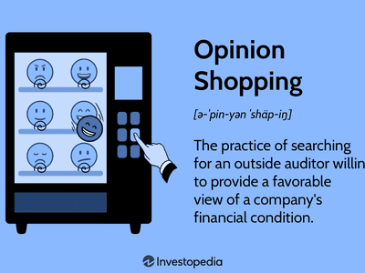

Opinion shopping occurs when a company seeks an auditor who will provide a favorable assessment of its financial statements, often despite the underlying economic realities. This practice is crucial in shaping perceptions of a company's financial health, as it influences the quality and reliability of financial reporting. A favorable audit opinion can significantly affect investor trust and market regulations, potentially leading to skewed investment decisions and misallocated capital. Such opinions reassure investors about a company's compliance with accounting standards, enhancing their confidence in its financial integrity and stability.

However, opinion shopping raises important legal and ethical dilemmas. From a legal standpoint, it may involve misrepresentation or non-disclosure of critical financial information, making it a potentially fraudulent activity. Ethically, it challenges the integrity of the auditing profession, as auditors are expected to remain impartial and provide honest assessments. By participating in opinion shopping, auditors risk compromising their ethical obligations, leading to a conflict of interest that may undermine their independence and objectivity.

Historically, opinion shopping has been associated with significant financial scandals, causing regulators to scrutinize auditing practices more closely. The practice of opinion shopping exposes vulnerabilities in audit processes and necessitates stricter regulatory frameworks and auditing standards. Efforts to prevent opinion shopping emphasize the need for increased transparency, accountability, and ethical conduct within the auditing and financial reporting domains.

As this article explores the history, impacts, and preventative measures associated with opinion shopping, it aims to provide a comprehensive understanding of its implications for the financial auditing landscape. The discussion highlights the crucial role of various stakeholders, including auditors, corporate executives, and regulators, in addressing this pervasive issue to ensure reliable and trustworthy financial information for stakeholders.

## Table of Contents

## Understanding Opinion Shopping in Auditing

Opinion shopping in auditing refers to a strategic practice where companies seek auditors who are more likely to provide a favorable audit opinion, even if the financial statements may not completely adhere to accounting standards or reflect the true financial health of the company. This practice can significantly impact how a business is perceived by investors, creditors, and the market at large, posing substantial risks to financial integrity.

To secure favorable audit opinions, companies may employ a variety of tactics. These could include seeking out audit firms with less stringent audit standards or practices known for yielding more lenient results. Companies might also attempt to exploit relationships by choosing auditors with whom they have had favorable experiences in the past or who depend on the company as a significant client, thereby creating a conflict of interest.

Multiple stakeholders are involved in the opinion shopping process. Primarily, the company’s management is responsible for initiating opinion shopping by selecting auditors who are more likely to agree with their financial reporting decisions. On the other side, auditors, driven by their professional and ethical obligations, face the challenge of maintaining independence and impartiality under pressure from clients. Auditors not only provide assurance on the financial statements but also lend credibility to a company’s financial report. A favorable audit opinion can enhance a company’s perceived creditworthiness and influence investor decisions positively.

Auditors face several challenges in resisting opinion shopping pressures. Maintaining independence is critical, as external auditors must ensure that their audit quality is not compromised by a client’s expectations or financial leverage. The pressure to retain lucrative contracts can tempt auditors to concede to client demands. However, such concessions can lead to regulatory scrutiny, reputational damage, and financial penalties.

In essence, opinion shopping undermines the fundamental objective of an audit: to provide a true and fair view of a company’s financial performance and position. Auditors must uphold stringent ethical standards and adhere to established auditing practices to ensure that their opinions remain unbiased and reliable, thereby safeguarding the interests of all stakeholders involved.

## The History of Opinion Shopping

Opinion shopping in financial auditing has a complex history, closely intertwined with some of the most notable financial scandals, regulatory developments, and ongoing challenges in maintaining audit integrity. This practice involves clients seeking favorable audit opinions by either influencing an auditor's judgment or finding an auditor more likely to provide a desired opinion.

### Historical Background and Scandals

The early 2000s witnessed a series of high-profile corporate scandals where opinion shopping played a crucial role. Two of the most infamous examples are Enron and WorldCom. Enron's collapse in 2001 after its accounting fraud was uncovered highlighted how the company used complex financial structures to generate impressive financial statements, while auditors from Arthur Andersen failed to question the legitimacy of these structures. Similarly, WorldCom's 2002 scandal involved the misstatement of financials through inappropriate capitalization of operating expenses, a practice that went unchallenged by its auditors due to the pressures of retaining a lucrative client relationship.

These cases exposed significant weaknesses in the audit process and the susceptibility of auditors to client pressures, leading to a broader recognition of the need to address opinion shopping within the auditing profession.

### Regulatory Responses

In response to these scandals, regulatory frameworks were strengthened to curb the practice of opinion shopping. A significant development was the enactment of the Sarbanes-Oxley Act (SOX) in 2002 in the United States. SOX aimed to enhance corporate governance and strengthen the independence of auditors by imposing stricter audit regulations, including the requirement for the rotation of lead audit partners and restrictions on non-audit services provided by auditors.[1](https://www.sec.gov/about/laws/soa2002.pdf)

Additionally, SOX established the Public Company Accounting Oversight Board (PCAOB) to oversee the audits of public companies, further separating the auditing process from commercial influences. Similar regulatory initiatives were observed globally, with the European Union and other jurisdictions adopting measures to enhance audit quality and prevent conflicts of interest.

### Evolution of Auditing Standards

Auditing standards have evolved significantly to counteract opinion shopping. The adoption of International Financial Reporting Standards (IFRS) and the International Standards on Auditing (ISA) has set a foundation for consistent and transparent financial reporting and auditing practices worldwide. These standards emphasize the need for auditors to exercise professional skepticism, maintain independence, and ensure that financial statements reflect the true economic position of a company.

In recent years, there has been a move towards increased disclosure requirements and transparency in audit reports, aimed at providing stakeholders with more insights into the audit process and the judgments made by auditors.

### Ongoing Prevalence and Challenges

Despite these advancements, opinion shopping remains a concern. Market competition and the inherent client-pays model of auditing can create pressures on auditors to provide favorable opinions to retain business. Enforcement challenges persist, as regulatory bodies must continually adapt to emerging strategies used by firms to influence auditor opinions.

Moreover, the global nature of business requires cooperation among international regulatory bodies to adequately address opinion shopping practices, given the differing legal and professional frameworks across countries.

In conclusion, while significant strides have been made in reducing opinion shopping through regulatory reforms and the evolution of auditing standards, continuous vigilance and proactive measures are essential to address its ongoing prevalence and safeguard the integrity of financial reporting.

---

[1] U.S. Securities and Exchange Commission. "Sarbanes-Oxley Act of 2002". Available at: https://www.sec.gov/about/laws/soa2002.pdf

## Financial Auditing and Its Role in Preventing Opinion Shopping

Financial auditing plays a crucial role in preventing opinion shopping, a practice where companies seek favorable audit opinions to enhance their perceived financial health. Auditing standards and practices are foundational to maintaining the integrity of financial reporting. They ensure that financial statements are accurate, reliable, and free from bias, providing stakeholders with confidence in a company's financial disclosures.

The role of external auditors is pivotal in upholding financial integrity. External auditors offer an independent assessment of a company's financial statements, ensuring compliance with accounting standards and verifying the accuracy of reported financial data. Their objective and unbiased evaluations are critical in detecting discrepancies or manipulations that could otherwise mislead stakeholders. This independence is crucial; without it, the risk of opinion shopping increases, as companies might exert pressure to obtain desired audit outcomes.

Enhanced due diligence processes further contribute to mitigating opinion shopping. These processes involve thorough and comprehensive evaluations of a company's financial practices, internal controls, and risk management strategies. By implementing enhanced due diligence, auditors can uncover potential red flags or irregularities indicative of opinion shopping. Moreover, such rigorous assessments strengthen the accountability of both the auditing firm and the client, leading to more transparent and trustworthy financial reporting.

In the context of financial audits, unqualified opinions hold significant importance. An unqualified opinion indicates that an auditor has reviewed the financial statements and found them to be fairly presented, in all material respects, according to the applicable financial reporting framework. This type of opinion is often seen as a clean bill of health for a company's financial practices, thereby boosting investor confidence and market trust. It serves as a deterrent to opinion shopping, as companies strive to receive an unqualified opinion to maintain credibility and investor confidence.

Auditors are bound by stringent ethical duties and regulatory guidelines designed to prevent conflicts of interest and maintain audit quality. These guidelines, such as those stipulated by the International Federation of Accountants (IFAC) and national regulatory bodies, emphasize auditor independence, objectivity, and professional skepticism. They mandate auditors to reject undue influences or pressures from clients seeking favorable audit outcomes. Adhering to these ethical standards is essential for auditors to resist opinion shopping attempts and uphold the integrity of their profession.

Regulatory bodies have implemented various measures to bolster the auditing profession's role in preventing opinion shopping. These include mandatory auditor rotation, limits on non-audit services provided by external auditors, and comprehensive disclosure requirements. While these regulations provide a framework for ethical auditing practices, ongoing efforts to strengthen them are necessary to address emerging challenges and ensure that auditors continue to act in the best interest of the public.

In conclusion, financial auditing serves as a cornerstone in the fight against opinion shopping. Through stringent standards, independence, ethical integrity, and robust regulatory frameworks, auditors play a vital role in safeguarding the transparency and reliability of financial reporting, ultimately supporting the stability and trustworthiness of financial markets.

## The Ethical Dilemma of Opinion Shopping

Opinion shopping presents a significant ethical dilemma in the field of financial auditing, posing challenges that threaten the integrity and reliability of financial reports. One key ethical challenge faced by auditors is balancing professional responsibility with external pressures from clients. Companies engaging in opinion shopping often exert pressure on auditors to deliver favorable audit outcomes, which can compromise auditor objectivity and independence. In these scenarios, auditors may face implicit or explicit demands to align with management's financial reporting agendas, resulting in questionable audit opinions that misrepresent the company's financial health.

Corporate pressures arise from various motivations, including the desire for improved financial statements to attract investors, meet regulatory requirements, or achieve performance targets linked to executive compensation. The pressure to deliver improved financial outcomes can lead companies to seek out auditors who are perceived as more compliant or lenient, diminishing the overall integrity of the auditing process.

Corporate governance plays a pivotal role in promoting ethical financial practices and mitigating opinion shopping. Strong corporate governance frameworks support the establishment of clear ethical standards and encourage transparency, accountability, and independent oversight. Effective governance structures involve audit committees that actively oversee the audit process, set ethical expectations, and ensure that external audits are conducted without management interference. These committees serve as a supervisory body to uphold the integrity of financial reporting and foster ethical behavior within the organization.

Conflicts of interest present another ethical hurdle, as auditors may face situations where their personal or financial interests conflict with their professional duties. For instance, auditors may be reluctant to issue unfavorable opinions if maintaining the client relationship is prioritized over delivering impartial assessments. These conflicts can arise from longstanding professional relationships, concerns over auditing fees, or potential future business opportunities, all of which may cloud judgment and compromise audit quality.

To strengthen ethical behavior within the auditing profession, several initiatives have been proposed and implemented. Leadership in audit firms is critical, setting a tone at the top that values ethical conduct and prioritizes independence. Continuous education and training on ethical standards ensure auditors are aware of ethical challenges and equipped to handle them appropriately. Moreover, adhering strictly to professional standards and codes of conduct, such as those delineated by the International Ethics Standards Board for Accountants (IESBA), reinforces ethical decision-making and enhances auditor credibility.

Additionally, regulatory bodies and professional organizations advocate for ethical practices through comprehensive guidelines and by promoting cultures of integrity. These initiatives encourage transparency and accountability and provide auditors with the resources necessary to resist undue client pressures, ultimately reducing the incidence of opinion shopping.

In summary, addressing the ethical challenges posed by opinion shopping requires a multifaceted approach. By fostering a corporate culture anchored in ethical practices, supporting robust governance structures, and enhancing auditor independence and accountability, the auditing profession can better uphold its role in ensuring reliable and transparent financial reporting.

## The Impact of Opinion Shopping on Investor Trust and Market Stability

Opinion shopping has a profound impact on investor trust and market stability, primarily due to the erosion of confidence in financial statements. When companies engage in opinion shopping, they often seek opinions that align with their desired financial portrayal, disregarding the true financial status. This practice leads to unreliable financial reports, thus eroding the confidence investors place in these documents. Trustworthy financial statements are crucial as they guide investment decisions and future planning. When this trust is compromised, investor skepticism rises, leading to hesitance in engaging with potentially lucrative ventures.

Manipulated financial reporting directly affects market stability. Economic stability relies on transparent and accurate disclosure of financial information, which ensures fair competition and market efficiency. When companies present distorted financial data through opinion shopping, they potentially mislead investors about their financial health, operational effectiveness, and growth prospects. This misinformation can lead to inflated asset prices, erroneous risk assessments, and misguided capital allocation. Cumulatively, these effects can destabilize financial markets, leading to increased [volatility](/wiki/volatility-trading-strategies) and potential financial crises.

History provides several examples where fraudulent audits severely damaged investor confidence. The Enron scandal is a classic instance where manipulated financial statements, backed by favorable audit opinions, resulted in catastrophic losses for investors. Such scandals highlight how reliance on fraudulent audits can lead to massive financial setbacks for investors, further damaging their trust in audited financial statements and the auditing process.

For businesses involved in opinion shopping, the long-term financial consequences can be dire. Initially, they might experience temporary gains due to manipulated perceptions of stability and growth. However, once detected, the repercussions can include legal challenges, financial penalties, loss of investor confidence, and a plummeting stock price. Furthermore, reputational damage can result in diminished future capital inflows and limited business opportunities.

Given these impacts, transparency and reliability in financial data are of paramount importance to investors. Investors rely heavily on honest and accurate financial disclosures to assess risks and returns. Transparent reporting fosters an environment of trust that is essential for the efficient functioning of markets. Ensuring that financial statements are free from manipulation and reflective of a company's true financial health stands as a cornerstone for maintaining investor confidence and safeguarding market stability. Effective corporate governance and strict adherence to ethical auditing practices are vital in achieving these goals.

## Regulatory Measures to Combat Opinion Shopping

Regulatory measures have been instrumental in addressing the issue of opinion shopping in financial auditing. One of the cornerstone frameworks is the Sarbanes-Oxley Act of 2002, enacted in response to major financial scandals such as Enron and WorldCom. This legislation introduced strict reforms to enhance corporate governance and the accuracy of financial reporting. Key provisions include the establishment of the Public Company Accounting Oversight Board (PCAOB) to oversee the audits of public companies, increasing auditor independence, enhancing corporate responsibility, and improving financial disclosures.

Mandatory auditor rotation is another regulatory measure implemented to mitigate opinion shopping. By limiting the tenure of audit firms with a single client, this practice aims to reduce the risk of auditor complacency and increase objectivity. While auditor rotation can help refresh perspectives and minimize familiarity threats, its effectiveness remains debated. Some argue that the limited institutional knowledge of new auditors could impact audit quality.

Enhanced audit disclosures also play a role in combating opinion shopping. By requiring auditors to provide more detailed insights into critical audit matters and judgments, stakeholders can better assess the quality and integrity of audits. These disclosures promote transparency and accountability, making it difficult for companies to obscure unfavorable financial conditions.

Despite these regulatory efforts, challenges persist in effectively curbing unethical audit practices. One significant hurdle is the enforcement of regulations. Limited resources and varying international standards can impede consistent monitoring and enforcement. Additionally, the complexity of financial agreements and innovative financial products often outpace regulatory frameworks, making it difficult to address all potential facets of opinion shopping.

To strengthen regulations against opinion shopping, potential reforms need consideration. One approach could involve leveraging technology, such as incorporating advanced data analytics and [machine learning](/wiki/machine-learning) techniques, to identify anomalies in financial statements and audit reports more efficiently. This technology-driven scrutiny can augment human oversight and uncover patterns suggestive of opinion shopping.

Furthermore, enhancing international collaboration among regulatory bodies could facilitate the harmonization of auditing standards globally. By establishing uniform guidelines and sharing best practices, regulators can create a more cohesive and robust framework for preventing opinion shopping.

Overall, while existing regulatory measures have made significant strides in addressing opinion shopping, continuous efforts to adapt and refine these strategies are crucial. Strengthening these frameworks not only safeguards investor trust but also reinforces the integrity and stability of financial markets.

## Best Practices for Auditors to Avoid Opinion Shopping

To maintain independence and objectivity, auditors must adopt a structured approach that prioritizes best practices. A critical step involves adhering to professional standards and codes of conduct, such as those outlined by the International Federation of Accountants (IFAC) and the American Institute of Certified Public Accountants (AICPA). These standards establish frameworks that guide auditors in maintaining impartiality and objectivity, essential in resisting opinion shopping pressures.

Effective communication with client companies is paramount. Auditors should establish clear, open channels of communication to discuss audit findings and expectations transparently. This involves setting up regular meetings and providing detailed reports that explain audit processes and outcomes. Clear communication helps manage client expectations, reducing the likelihood of companies attempting to influence audit opinions.

Continuous education and training in ethical practices are also crucial. Regular workshops, seminars, and courses focused on the latest regulations, ethical dilemmas, and technological advancements can prepare auditors to handle complex auditing challenges ethically. Such training strengthens auditors' ability to identify and resist potential conflicts of interest, which might lead to opinion shopping.

Transparency and accountability are fundamental in deterring opinion shopping. Auditors should document their audit processes meticulously, ensuring that all opinions are supported by evidence. This documentation should be made available for internal and external reviews, reinforcing the auditor's commitment to transparency and reducing opportunities for unethical influence.

By implementing these best practices, auditors can effectively navigate the ethical challenges of the financial auditing landscape and maintain the trust of stakeholders in the accuracy and reliability of financial reports.

## The Role of Corporate Governance in Preventing Opinion Shopping

Corporate governance plays a crucial role in preventing opinion shopping by addressing its root causes through well-structured oversight and accountability mechanisms. A solid corporate governance framework emphasizes the importance of integrity, transparency, and accountability, which are fundamental in preventing fraudulent financial reporting and maintaining investor confidence.

Effective audit committees are integral components of corporate governance that oversee financial integrity. These committees are responsible for selecting auditors, setting audit scopes, and ensuring the independence and objectivity of audit processes. By rigorously evaluating the qualifications, performance, and independence of external auditors, audit committees can diminish the likelihood of opinion shopping. They also have the authority to question management decisions, thereby acting as a check against any attempts to manipulate financial outcomes.

Transparent reporting and ethical management are pivotal in deterring opinion shopping. Transparency ensures that all financial information is fully disclosed and free from manipulation, allowing stakeholders to make informed decisions based on accurate data. Ethical management promotes a culture of integrity where adherence to regulations and ethical norms is prioritized. This alignment not only strengthens the company's reputation but also reduces the temptation for management to engage in opinion shopping to present a more favorable financial picture.

Board members [carry](/wiki/carry-trading) significant responsibilities in promoting ethical financial behavior. They are tasked with setting the organizational tone at the top by establishing and upholding high ethical standards. Boards are responsible for implementing effective internal controls, risk management policies, and compliance programs that detect and prevent unethical practices. Moreover, they must ensure that appropriate disciplinary measures are in place for violations of ethical standards, reinforcing the commitment to ethical conduct.

Case studies have demonstrated that strong corporate governance can effectively prevent opinion shopping. For instance, during the post-Enron era, several companies that implemented robust governance frameworks, including independent audit committees and stringent internal controls, successfully avoided scandals related to opinion shopping. The emphasis on board independence, stakeholder engagement, and comprehensive risk assessment fostered environments where financial manipulation was less likely to occur.

In conclusion, corporate governance is essential in preventing opinion shopping by emphasizing ethical behavior, transparency, and accountability. Through effective audit committees, transparent reporting, ethical management, and proactive board responsibilities, companies can mitigate the risk of opinion shopping and maintain the integrity of their financial reporting.

## Conclusion

Opinion shopping in financial auditing is a complex practice that can significantly impact the integrity of financial reporting. It involves companies seeking out auditors who are more likely to provide favorable opinions, often undermining the trustworthiness of financial statements. As explored throughout this article, maintaining ethical standards in auditing is crucial to prevent the practice. Auditors must adhere strictly to professional codes of conduct, ensuring objectivity and independence in their assessments. 

The prevention of opinion shopping is not solely the responsibility of auditors; various stakeholders play a vital role. Regulatory bodies, corporate governance structures, and investors themselves must work collaboratively to uphold transparency and accountability in financial reporting. This includes implementing strong oversight mechanisms, fostering an ethical corporate culture, and ensuring rigorous enforcement of auditing standards. 

Ongoing efforts to strengthen regulations and corporate governance are essential in curbing opinion shopping. Legislation such as the Sarbanes-Oxley Act has already laid important groundwork, but continuous reform and adaptation are necessary to address emerging challenges and loopholes. Enhancing the transparency of auditing processes and increasing the rotation of audit firms are measures that can further deter unethical practices.

Reliable and transparent financial reporting is fundamental to market stability and economic health. It enhances investor confidence, supports fair market valuations, and ensures efficient capital allocation. By curtailing opinion shopping, the financial industry can protect its integrity and contribute to a more stable and trustworthy financial environment.

## References & Further Reading

[1]: U.S. Securities and Exchange Commission. ["Sarbanes-Oxley Act of 2002"](https://www.sec.gov/rules-regulations/staff-guidance/compliance-disclosure-interpretations/division-corporation-finance-sarbanes-oxley-act-2002-frequently-asked-questions).

[2]: Coffee, J. C. (2002). ["Understanding Enron: It's About the Gatekeepers, Stupid."](https://www.jstor.org/stable/40688097) The Business Lawyer, 57(4), 1403-1420.

[3]: Bazerman, M. H., Loewenstein, G., & Moore, D. A. (2002). ["Why Good Accountants Do Bad Audits."](https://hbr.org/2002/11/why-good-accountants-do-bad-audits) Harvard Business Review.

[4]: Power, M. (1997). ["The Audit Society: Rituals of Verification"](https://archive.org/details/auditsocietyritu0000powe) Oxford University Press.

[5]: DeFond, M. L., & Francis, J. R. (2005). ["Audit Research after Sarbanes-Oxley."](https://publications.aaahq.org/ajpt/article/24/s-1/5/5614/Audit-Research-after-Sarbanes-Oxley) Auditing: A Journal of Practice & Theory, 24(s-1), 5-30.