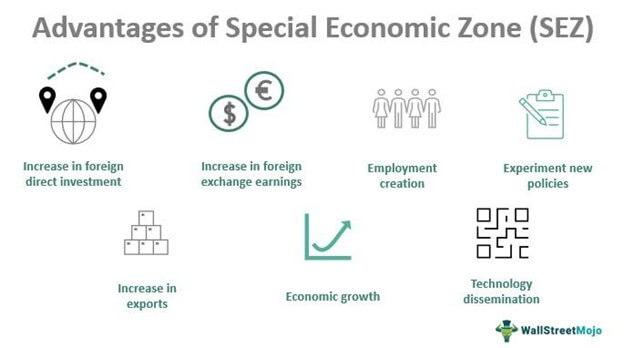

Investment strategies continuously evolve, reflecting the dynamic nature of financial markets and economic environments. Two prominent areas that have garnered substantial interest are Opportunity Zones and Algorithmic Trading. These investment strategies offer distinct advantages and challenges, which require careful consideration to fully understand their impact and potential benefits. Opportunity Zones, established under the Tax Cuts and Jobs Act of 2017, aim to stimulate economic growth in disadvantaged communities through tax incentives. Meanwhile, algorithmic trading leverages computational algorithms to execute trading decisions swiftly and efficiently, thereby capturing emerging opportunities in a fast-paced market setting.

Evaluating the advantages and criticisms associated with these financial areas is crucial for investors seeking to optimize their portfolios and align with ethical investing practices. Opportunity Zones have been praised for their potential to drive substantial development in economically distressed areas, yet they face criticism regarding their actual benefit to local communities versus investors. Algorithmic trading, while enhancing the speed and accuracy of trades, presents challenges related to data requirements, market volatility, and the risk of prioritizing short-term gains.



This article explores the interconnected aspects of these topics, focusing on the policy criticisms, the potential investment benefits within Opportunity Zones, and the role algorithmic trading can play in these investments. By dissecting these components, the article aims to provide a comprehensive understanding of how these financial strategies can be optimized to support both investor objectives and community development, ensuring a balanced and informed approach to modern investment practices.

## Table of Contents

## Understanding Opportunity Zones

Opportunity Zones were established under the Tax Cuts and Jobs Act of 2017, a significant legislative change enacted with the aim of stimulating economic growth and job creation in distressed communities across the United States. These areas, identified by state governors and subsequently certified by the U.S. Department of the Treasury, are designed to attract private investments through strategic tax incentives.

The primary incentive for investors is the deferral of capital gains taxes. By reinvesting realized capital gains into Qualified Opportunity Funds (QOFs) that focus on property or business investments in Opportunity Zones, investors can defer federal taxes on those gains until December 31, 2026, or until the investment is sold or exchanged, whichever is earlier. Furthermore, if the investment is held for at least 10 years, any appreciation on the investment may be exempt from capital gains tax entirely.

These tax incentives aim not only to encourage the influx of capital into underdeveloped areas but also to foster economic revitalization by promoting both real estate development and business growth. The long-term vision of this initiative is to improve the economic infrastructure, thereby enhancing employment opportunities and living standards within these communities.

However, there is ongoing debate about the efficacy of Opportunity Zones in meeting their economic development goals. Critics suggest that the structure of these incentives may prioritize investor profits over community benefits. Concerns have been raised about potential discrepancies in how zones are selected, sometimes allegedly influenced by political motives rather than purely economic need. Additionally, there are worries about the possibility of gentrification and the inadvertent displacement of current residents as a consequence of rising property values and living costs.

The success of Opportunity Zones is dependent on a careful balance between attractive investment conditions and genuine community upliftment, making it a complex yet potentially rewarding investment strategy for the socially-conscious investor.

## Criticism of Opportunity Zones

Opportunity Zones, introduced under the Tax Cuts and Jobs Act of 2017, have been subject to various criticisms, predominantly centering on the notion that their primary utility is for tax benefits rather than the economic revitalization of distressed communities. This perspective is based on the observation that the tax incentives offered could disproportionately benefit wealthy investors without necessarily resulting in significant improvements for the local populace.

A major concern regarding Opportunity Zones is the potential for gentrification. This phenomenon occurs when an influx of investment leads to the improvement of an area, ultimately causing the displacement of long-standing, lower-income residents with wealthier newcomers. As property values rise, local residents may find themselves unable to afford increased rents and living costs, leading to their displacement. The intended benefit of community revitalization, thus, comes hand-in-hand with the adverse effect of altering the socio-economic makeup of the neighborhoods targeted for improvement.

Furthermore, the selection process of these zones has raised questions. Critics argue that some Opportunity Zones may not have been selected purely based on economic need but rather due to political influence. This assertion is supported by analysis indicating that certain designated zones do not match the typical profile of economically distressed areas. The strategic designation of these zones can lead to scenarios where funds are directed towards areas already on an upward economic trajectory, thereby enhancing investor returns without addressing the needs of truly distressed communities.

In summary, while Opportunity Zones provide avenues for investment and growth potential, the criticisms surrounding their implementation highlight the challenges in ensuring that these benefits are equitably distributed and lead to genuine community development. Adjustments to policy frameworks and careful oversight may be necessary to address these issues effectively.

## Investment Benefits of Opportunity Zones

Opportunity Zones present significant investment opportunities by offering notable tax benefits, primarily through tax deferment and exemption options for long-term holdings. Established under the Tax Cuts and Jobs Act of 2017, these zones were designed to stimulate capital investment in underdeveloped and economically distressed areas by providing investors with the potential to defer capital gains taxes. 

A standout feature of Opportunity Zones is their ability to attract investment in real estate and businesses within these designated areas. By doing so, they facilitate the inflow of capital necessary for the growth and development of local economies. Real estate investments, including residential, commercial, and industrial projects, often see an upsurge due to these tax incentives. Businesses in these zones may experience increased funding opportunities, which can enhance their capacity to develop, innovate, and create employment opportunities.

The successful investments encouraged by Opportunity Zones can lead to substantial job creation. By fostering an environment where businesses can thrive, local employment rates may improve, contributing to the economic upliftment of these areas. Moreover, the improvements generated by these investments often extend to infrastructure, with enhancements to transportation, utilities, and public amenities being common outcomes. Enhanced infrastructure not only supports the operational needs of businesses but also improves the quality of life for residents, further bolstering the economic attractiveness of these zones.

Overall, Opportunity Zones offer a dual advantage: they provide investors with tax relief while simultaneously promoting economic revitalization in communities needing development. These intersecting benefits underscore the potential impact of Opportunity Zones as a catalyst for both financial and social improvement.

## Integration with Algorithmic Trading

Algorithmic trading, characterized by using computer algorithms to automate financial markets' trading processes, offers significant benefits in exploiting investment opportunities. By processing large swathes of data more efficiently than humanly possible, algorithms have the ability to enhance decision-making regarding investments in Opportunity Zones.

Opportunity Zones, defined under the Tax Cuts and Jobs Act of 2017, present unique investment conditions where specific tax incentives are offered to investors. This framework is complex, given the varying economic conditions and regulatory implications across different zones. Algorithmic trading systems, equipped with sophisticated data-processing capabilities, can manage this complexity by assessing real-time data to identify and optimize investment strategies.

The efficiency of algorithmic systems lies in their real-time capability to evaluate risk, market potential, and changing conditions across multiple factors. One of the primary methodologies applied is quantitative analysis, which can include statistical models to determine correlations between variables and potential investment outcomes. The use of predictive analytics allows algorithms to forecast future financial scenarios based on historical and currently available data.

To translate this into practical application, consider a Python implementation where algorithms are employed to manage an investment portfolio focusing on Opportunity Zones:

```python
import numpy as np
import pandas as pd
from sklearn.linear_model import LinearRegression

# Sample function to predict potential investment returns in an Opportunity Zone
def predict_returns(data):
    # Assuming 'data' contains historical prices and other economic indicators
    X = data[['economic_indicator_1', 'economic_indicator_2']]
    y = data['historical_returns']

    model = LinearRegression()
    model.fit(X, y)

    predictions = model.predict(X)
    return predictions

# Hypothetical DataFrame containing investment data
data = pd.DataFrame({
    'economic_indicator_1': np.random.rand(100),
    'economic_indicator_2': np.random.rand(100),
    'historical_returns': np.random.rand(100)
})

predictions = predict_returns(data)
print(predictions)
```

In this example, a linear regression model predicts returns based on hypothetical economic indicators, illustrating how algorithmic trades can be structured to evaluate potential investment performance.

Algorithms can dynamically adjust investment strategies based on predefined rules and parameters, offering a structured method to enhance decision-making processes. This adaptability is particularly beneficial when navigating the tax incentives and economic goals associated with Opportunity Zones. However, while algorithms provide a substantial advantage in maximizing investment opportunities, it is crucial that they align with the ethical principles guiding these zones, ensuring that benefits extend to the communities they aim to revitalize.

## Challenges of Algorithmic Trading in Opportunity Zones

Algorithmic trading in Opportunity Zones presents several challenges, primarily concerning the acquisition of accurate data. Opportunity Zones, by definition, are economically distressed areas, and data pertaining to these zones may be less comprehensive or updated compared to more developed regions. This deficiency complicates the creation of precise models and algorithms that rely heavily on historical and real-time data to predict market trends and make investment decisions.

Moreover, market [volatility](/wiki/volatility-trading-strategies) significantly impacts [algorithmic trading](/wiki/algorithmic-trading) strategies. The inherent volatility in markets can lead to substantial fluctuations in asset prices within Opportunity Zones, making the development of robust algorithms challenging. Algorithms designed for stable markets might not perform effectively, leading to potential financial losses. In coding terms, an algorithm might need to dynamically adjust its parameters based on real-time data, which Python can facilitate via tools like NumPy for numerical computations or Scikit-learn for adaptive learning models. For instance:

```python
import numpy as np
from sklearn.model_selection import train_test_split
from sklearn.linear_model import LinearRegression

# Hypothetical function to update algorithm parameters
def update_model(data, target):
    X_train, X_test, y_train, y_test = train_test_split(data, target, test_size=0.2)
    model = LinearRegression().fit(X_train, y_train)
    return model

# Assume 'zone_data' is a dataset specific to an Opportunity Zone
model = update_model(zone_data_features, zone_data_target)
```

Regulatory changes further amplify these challenges. With shifting tax policies and investment incentives specific to Opportunity Zones, algorithms must adapt to maintain compliance and exploit new opportunities. This dynamic environment necessitates frequent algorithm updates, which could be resource-intensive and complex.

Finally, a significant risk associated with algorithmic trading in these zones is the focus on short-term gains, overshadowing potential long-term community benefits. Trading strategies optimized for rapid profit may disregard the primary intention of Opportunity Zones—sustainable development and economic upliftment of underserved areas. Balancing profitability with ethical considerations becomes crucial, requiring intricate algorithm design to incorporate longer-term objectives alongside immediate financial gains.

Hence, while algorithmic trading can enhance investment strategies within Opportunity Zones, addressing these challenges is vital to ensure that such trading aligns with both investor goals and community benefits.

## Conclusion

Opportunity Zones represent a complex intersection of economic, social, and financial strategies. On one hand, they offer the potential for revitalizing economically distressed areas by providing tax incentives that attract investment. However, these benefits must be critically analyzed to ensure that they serve both community and investor interests effectively. The success of Opportunity Zones largely depends on a balanced approach that prioritizes sustainable development and genuine economic revitalization over mere tax advantages.

Algorithmic trading presents an opportunity to enhance investment efficiency by leveraging sophisticated computational techniques. Algorithms can process vast amounts of data to identify optimal investment opportunities in Opportunity Zones. However, integrating algorithmic trading into these investments necessitates a commitment to ethical investing principles. Algorithms must be crafted to prioritize long-term community benefits alongside financial returns. This dual focus ensures that investments contribute positively to local areas without exploiting tax incentives at the expense of community welfare.

Future policy adjustments may address existing criticisms and enhance the effectiveness of Opportunity Zones. Reforms could aim to reduce political influence in zone designation and increase transparency, helping to ensure that genuinely needy areas receive investment. Policies may also focus on mitigating negative social impacts, such as gentrification, to promote more equitable growth. This balanced approach could create an investment landscape where both communities and investors thrive, ensuring that Opportunity Zones fulfill their intended purpose of economic and social betterment.

## References & Further Reading

[1]: Yin, S., and Gonzalez, L. (2019). ["Opportunity Zones: A Year in Review."](https://www.researchgate.net/publication/308385754_Robert_K_Yin_2014_Case_Study_Research_Design_and_Methods_5th_ed_Thousand_Oaks_CA_Sage_282_pages) Journal of Accountancy.

[2]: Rose, A. (2020). ["How Opportunity Zones Benefit Investors and Communities."](https://eig.org/opportunity-zones-research-brief/) Urban Institute.

[3]: Malkiel, B. G. (2016). ["A Random Walk Down Wall Street: The Time-Tested Strategy for Successful Investing."](https://www.amazon.com/Random-Walk-down-Wall-Street/dp/0393352242) W.W. Norton & Company.

[4]: Baker, T., Boice, J., & Tiede, D. (2019). ["The Impact of Opportunity Zones Legislation Across Various States."](https://www.researchgate.net/publication/353886336_Artificial_intelligence_in_education_Bringing_it_all_together) Brookings Institution.

[5]: Aldridge, I. (2013). ["High-Frequency Trading: A Practical Guide to Algorithmic Strategies and Trading Systems."](https://onlinelibrary.wiley.com/doi/pdf/10.1002/9781119203803.fmatter) Wiley.

[6]: Stein, L. (2018). ["Opportunity Zones: An In-Depth Analysis."](http://opportunityzones.stanford.edu/docs/Opportunity-Zones-Analysis-of-Policy-Implications-6_29_18.pdf) Novogradac.