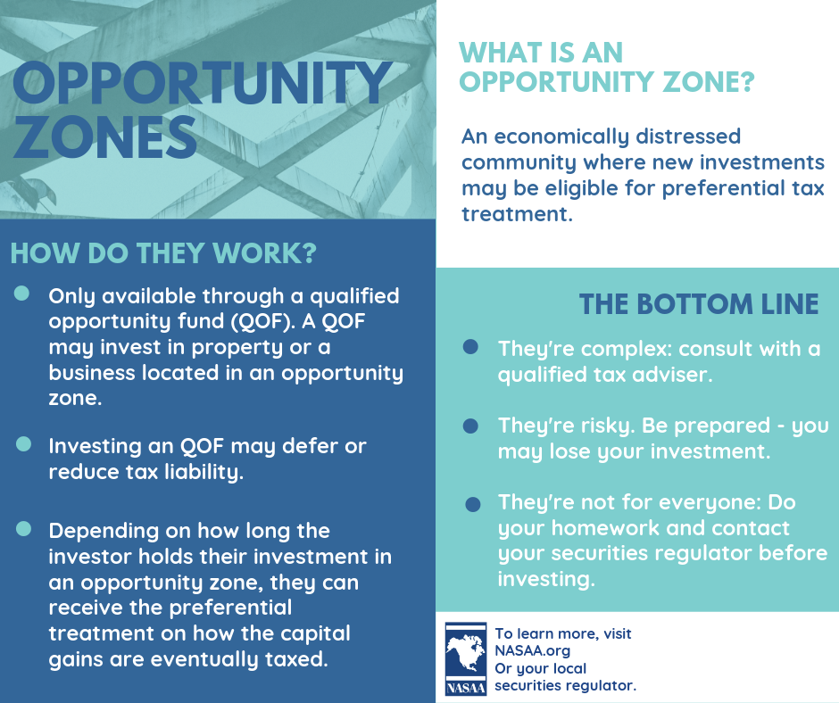

## Table of Contents

## What are Opportunity Zones?

Opportunity Zones are special areas in the United States where the government wants to help grow the economy. These areas were chosen because they are often poor and need more jobs and businesses. People who invest money in these zones can get tax benefits. This means they might pay less in taxes if they start a business or invest in real estate there.

The idea behind Opportunity Zones is to encourage people to invest in places that need it the most. By doing this, the hope is that these areas will see new businesses, more jobs, and better living conditions. The program started in 2017, and it's part of a bigger plan to help communities that have been left behind.

## How were Opportunity Zones established?

Opportunity Zones were created by a law called the Tax Cuts and Jobs Act, which was passed in December 2017. This law let states pick certain poor areas to be Opportunity Zones. Each state could choose up to 25% of their poor areas to be part of this program. The goal was to help these areas grow by bringing in more money and jobs.

After the states picked their areas, they had to send their choices to the U.S. Department of the Treasury. The Treasury then had to approve these choices. By the end of March 2018, all the Opportunity Zones were officially set. This meant that people could start investing in these areas and get tax benefits for doing so.

## What is the purpose of Opportunity Zones?

Opportunity Zones were made to help poor areas in the United States grow. The government wanted to bring more money and jobs to these places. By letting people invest in these zones and giving them tax breaks, the hope was that new businesses would start and more people would find work. This could make life better for people living in these areas.

The idea is to help communities that have been left behind. When people invest in Opportunity Zones, they might pay less in taxes. This encourages them to start businesses or buy property in these places. Over time, the goal is for these areas to become stronger and more prosperous, with better living conditions for everyone who lives there.

## Who qualifies to invest in Opportunity Zones?

Anyone can invest in Opportunity Zones. You don't need to be rich or live in the area. If you have money that you made from selling something like a house or stocks, you can put that money into an Opportunity Zone and get tax benefits.

The main thing is that you need to have what's called "capital gains." This means you made money from selling something. You can then take those gains and invest them in a special fund called an Opportunity Fund. This fund will use your money to invest in businesses or real estate in the Opportunity Zones. By doing this, you can lower the taxes you pay on those gains and help the community grow.

## What types of investments can be made in Opportunity Zones?

In Opportunity Zones, you can invest in businesses or real estate. If you start a new business or buy an old one in these areas, you can get tax benefits. This can help the business grow and create jobs for people in the community. You can also invest in buildings or land. By fixing up old buildings or building new ones, you can help make the area nicer and more valuable.

Another way to invest is through an Opportunity Fund. This is a special kind of investment fund that uses your money to invest in businesses or real estate in Opportunity Zones. When you put your money into an Opportunity Fund, you can get tax breaks on the money you made from selling something else, like a house or stocks. This makes it easier for you to help the community while also saving on taxes.

## What are the tax benefits associated with Opportunity Zone investments?

When you invest in an Opportunity Zone, you can get some tax benefits. If you have money from selling something like a house or stocks, you can put that money into an Opportunity Zone. This can lower the taxes you pay on that money. If you keep your investment in the Opportunity Zone for at least five years, you can cut the taxes you owe on that money by 10%. If you keep it there for seven years, you can cut the taxes by another 5%, so that's 15% off in total.

There's another big benefit if you hold onto your investment for at least ten years. After ten years, you don't have to pay any taxes on the money you made from your investment in the Opportunity Zone. This means if your business or property in the Opportunity Zone goes up in value, you won't have to pay taxes on that increase. These tax breaks are meant to encourage people to invest in these areas and help them grow.

## How do Opportunity Zones impact local communities?

Opportunity Zones can bring a lot of good changes to local communities. When people invest in these areas, they often start new businesses or fix up old buildings. This can create new jobs for people who live there. More jobs mean more money for families, which can help them live better lives. Also, when businesses do well, they might pay more taxes to the local government. This extra money can be used to make the community better, like fixing roads or building parks.

But there can be some challenges too. Sometimes, when a lot of money comes into an area, it can make things more expensive. This is called gentrification. If rents go up, people who have lived in the area for a long time might not be able to afford to stay. This can change the community and make it hard for some people. So, while Opportunity Zones can help bring growth and jobs, it's important to make sure that everyone in the community benefits and not just new people moving in.

## What are the criteria for designating an area as an Opportunity Zone?

Opportunity Zones are chosen based on how poor the area is. The government looks at something called the "poverty rate" and the "median family income" to decide if an area qualifies. If an area has a high poverty rate or if the median family income is low compared to the rest of the state or the country, it might be picked as an Opportunity Zone. Each state can choose up to 25% of their poor areas to be part of this program.

After the states pick their areas, they send their choices to the U.S. Department of the Treasury. The Treasury then checks to make sure the areas meet the rules. If everything looks good, the Treasury approves the areas as Opportunity Zones. This whole process was done by the end of March 2018, and it's meant to help bring money and jobs to places that really need it.

## How do Opportunity Zones differ from other economic development programs?

Opportunity Zones are different from other economic development programs because they focus on bringing private money into poor areas. Many other programs use government money or grants to help areas grow. But with Opportunity Zones, the government gives tax breaks to people who invest their own money in these areas. This means that instead of the government spending money directly, it encourages people to invest by letting them pay less in taxes.

Another way Opportunity Zones are different is that they cover a lot of areas across the whole country. Other programs might focus on just one city or region. Opportunity Zones are spread out so they can help many different communities. Also, the tax benefits from Opportunity Zones can be really big, especially if you keep your investment in the zone for a long time. This is a strong reason for people to invest, which can lead to more jobs and better living conditions in these areas.

## What are the criticisms of Opportunity Zones?

Some people say that Opportunity Zones don't help the poor areas as much as they should. They think that the tax breaks mostly help rich people and big investors. Instead of helping the people who live in these poor areas, the money might go to building fancy new places that the local people can't afford. This can make life harder for them because rents and prices might go up, and they might have to move out. This is called gentrification, and it's a big worry for many people.

Another criticism is that it's hard to know if Opportunity Zones are really working. There's not a lot of clear information about how much the areas are improving. Some people think that the government should check more often to see if the program is helping or not. They want to make sure that the tax breaks are really making a difference in the poor areas and not just making rich people richer.

## How effective have Opportunity Zones been in achieving their goals?

Opportunity Zones have had some success in bringing money into poor areas. People have invested billions of dollars in these zones, which has led to new businesses and jobs. For example, in some places, old buildings have been fixed up and turned into new shops or homes. This has helped to make these areas look better and given people who live there more places to work.

However, it's not clear if Opportunity Zones have helped everyone in these areas. Some people worry that the benefits are mostly going to rich investors, not the local people. In some places, the new investments have made things more expensive, which can push out people who have lived there a long time. This is called gentrification, and it's a big concern. So, while Opportunity Zones have brought in money and some growth, they haven't solved all the problems in these poor areas yet.

## What future policy changes are being considered for Opportunity Zones?

Some people want to change the rules for Opportunity Zones to make sure they help the poor areas more. They think the government should check more often to see if the money is really helping the local people. They also want to make sure that the new businesses and buildings are good for everyone in the area, not just the rich investors. Some ideas include giving more tax breaks for projects that create jobs for local people or help fix up old buildings in a way that keeps rents low.

Another idea is to make the rules clearer so everyone knows what counts as a good investment in an Opportunity Zone. Right now, it's hard to tell if the program is working because there's not a lot of clear information. If the government collects more data and shares it with everyone, it would be easier to see if the Opportunity Zones are helping the poor areas grow or if they need to be changed. These changes could make Opportunity Zones work better for the communities that need help the most.

## References & Further Reading

[1]: Yin, S., and Gonzalez, L. (2019). ["Opportunity Zones: A Year in Review."](https://www.researchgate.net/publication/308385754_Robert_K_Yin_2014_Case_Study_Research_Design_and_Methods_5th_ed_Thousand_Oaks_CA_Sage_282_pages) Journal of Accountancy.

[2]: Rose, A. (2020). ["How Opportunity Zones Benefit Investors and Communities."](https://eig.org/opportunity-zones-research-brief/) Urban Institute.

[3]: Malkiel, B. G. (2016). ["A Random Walk Down Wall Street: The Time-Tested Strategy for Successful Investing."](https://www.amazon.com/Random-Walk-down-Wall-Street/dp/0393352242) W.W. Norton & Company.

[4]: Baker, T., Boice, J., & Tiede, D. (2019). ["The Impact of Opportunity Zones Legislation Across Various States."](https://www.researchgate.net/publication/353886336_Artificial_intelligence_in_education_Bringing_it_all_together) Brookings Institution.

[5]: Aldridge, I. (2013). ["High-Frequency Trading: A Practical Guide to Algorithmic Strategies and Trading Systems."](https://onlinelibrary.wiley.com/doi/pdf/10.1002/9781119203803.fmatter) Wiley.

[6]: Stein, L. (2018). ["Opportunity Zones: An In-Depth Analysis."](http://opportunityzones.stanford.edu/docs/Opportunity-Zones-Analysis-of-Policy-Implications-6_29_18.pdf) Novogradac.