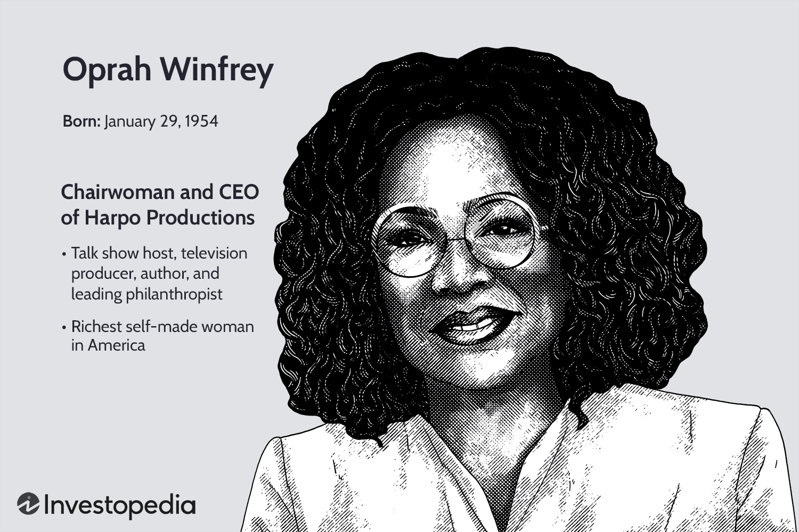

Celebrity endorsements stand as a potent marketing tool, utilized by companies across various industries to influence consumer behavior and enhance brand recognition. The power of a celebrity’s persona in altering public perception and driving sales stems from the social and psychological principles of authority, relatability, and aspirational appeal. When a well-known figure endorses a product, it often suggests that the celebrity shares their values and trusts in the product’s efficacy, thereby encouraging consumers to follow suit.

'The Oprah Effect' epitomizes the profound impact of celebrity endorsements on consumer behavior. This phenomenon refers to the drastic increase in consumer interest and sales that occurs when Oprah Winfrey endorses a product or service. Her unparalleled influence stems from her established credibility, mass appeal, and the emotional connection she maintains with her audience. Products featured on her show, like books in her book club, have often seen exponential sales growth virtually overnight, offering a prime example of the powerful synergy between recognizable personalities and consumer choices.



Introducing an intriguing dimension to celebrity endorsements is the concept of algorithmic trading influenced by celebrity impact. Algorithmic trading, characterized by using automated systems to execute trades based on predefined strategies, can potentially incorporate trends driven by celebrity activities. The intersection between celebrity influence and algorithmic trading entails leveraging celebrity-driven consumer behavior patterns to inform trading decisions. This blends human social behavior with technology, opening pathways for developing trading algorithms equipped to react to endorsements or public appearances by influential figures. The process involves data collection from various sources, including social media, and integrating that information into models predicting market movements, thus revolutionizing the trading landscape.

## Table of Contents

## Decoding the Oprah Effect

The "Oprah Effect" refers to the profound influence television host Oprah Winfrey holds over consumer behavior, particularly when she endorses products or companies. This phenomenon is significant due to the remarkable impact her recommendations have had on boosting sales and brand recognition, often leading to substantial increases in revenue for businesses fortunate enough to receive her endorsement.

The power of the Oprah Effect is rooted in Winfrey's credibility and the trust she has cultivated over decades with her audience. Her endorsements are perceived as genuine and informed, which motivates consumers to follow her recommendations. This effect is not merely anecdotal; it has been observed across various industries, from publishing to beauty products.

Analyzing Oprah's consumer impact requires acknowledging her charismatic authority and the emotional connection she establishes with her audience. Unlike typical celebrity endorsements, Oprah's influence is based on authenticity and the alignment of her personal brand with the products she supports. For instance, when Oprah included a book in her "Oprah's Book Club," it typically skyrocketed to bestseller status, illustrating her unparalleled impact on consumer decisions in the literary market.

Several businesses have thrived due to the Oprah Effect. A notable example is the success of "The Dr. Oz Show," which originated from Oprah's endorsement of Dr. Mehmet Oz as a health expert. Another instance is the skincare company Philosophy, which experienced a significant sales surge after Oprah featured its "Hope in a Jar" cream as one of her favorite things. These endorsements led to increased visibility and credibility, translating into heightened consumer interest and subsequent sales growth.

The Oprah Effect serves as a paradigm of how celebrity endorsements can significantly influence market dynamics, demonstrating the potential for aligning strategic endorsements with consumer psychology to drive business success.

## Celebrity Endorsements: Influence on Consumer Behavior

Celebrity endorsements have a profound impact on consumer behavior, shaping preferences and influencing decisions across various markets. This effect is driven by several psychological factors and is demonstrated through numerous successful endorsement campaigns.

### Overview of How Celebrities Shape Consumer Preferences

Celebrities wield significant power in shaping consumer preferences due to their widespread visibility and ability to instill a sense of aspiration among their audiences. When a celebrity endorses a product, it often leads to increased attention and credibility for that product, as consumers tend to associate the positive attributes of the celebrity with the endorsed item. This association is known as the "halo effect," where the favorable perception of a person extends to their endorsements and preferences.

The effectiveness of celebrity endorsements is grounded in the social identity theory, which suggests that individuals enhance their self-esteem by aligning with groups or people they admire. Consequently, fans and followers of a celebrity often exhibit a predisposition to imitate the celebrity's behaviors and choices, including purchasing decisions. This mimicry reinforces the consumer's sense of belonging to the celebrity’s social group.

### Psychological Factors at Play in Celebrity Influence

Several psychological mechanisms underlie the impact of celebrity endorsements on consumer behavior. These include:

1. **Attractiveness:** Celebrities are often perceived as attractive, which can lead to more favorable evaluations of the products they endorse. This is supported by the source attractiveness model, suggesting that a physically appealing spokesperson enhances the persuasiveness of a message.

2. **Credibility:** The expertise and trustworthiness of a celebrity can significantly influence consumer attitudes. When a celebrity is seen as knowledgeable and reliable, their endorsement can lead to greater consumer trust and increased intention to purchase.

3. **Identification:** Consumers often identify with celebrities who reflect their own ideals and aspirations. This psychological connection can drive consumers to emulate the celebrities' purchasing behaviors as a form of self-expression.

4. **Emotional Attachment:** Celebrities often evoke strong emotional responses from their audiences. This emotional attachment can increase the persuasive power of an endorsement, as consumers may feel a stronger personal connection to the endorsed product.

### Case Studies Highlighting Successful Endorsement Campaigns

Numerous campaigns underscore the significant impact of celebrity endorsements on consumer behavior. For instance, Nike's partnership with Michael Jordan through the Air Jordan line transformed not only the brand but also the broader athletic apparel industry. Jordan's association with high performance and success resonated with consumers, leading to unprecedented sales and establishing a new standard for celebrity brand alignment.

Similarly, the collaboration between Procter & Gamble's Pantene and actress Priyanka Chopra Jonas has been pivotal in expanding the brand's reach in new markets. Chopra Jonas’s global appeal and authentic representation of the brand's values helped Pantene resonate with a diverse consumer base, enhancing brand awareness and loyalty.

These examples illustrate how celebrity endorsements can elevate a brand's market position and effectively influence consumer purchasing decisions. By leveraging the psychological connection between celebrities and their audiences, companies can cultivate brand loyalty and drive long-term growth through strategic endorsement collaborations.

## The Role of Social Media in Celebrity Influence

Celebrity influence through social media has fundamentally reshaped the landscape of marketing, drastically altering how consumers engage with brands. The direct connection between celebrities and their followers on platforms such as Instagram, Twitter, and TikTok provides unprecedented opportunities for brands to amplify consumer engagement. This influence is characterized by a more personal connection, as celebrities share their lifestyles, preferences, and endorsements, allowing followers to feel a direct relationship with both the celebrity and the associated products.

Social media elevates brand visibility and credibility significantly. Brands endorsed by celebrities can reach millions of potential consumers almost instantaneously. This influence is quantifiable, as studies indicate a positive correlation between celebrity endorsements and increased consumer interest and sales. The credibility of a brand is enhanced when a well-respected or popular figure expresses trust or affinity for the product, utilizing their social capital to bolster the brand's reputation.

A striking example of successful celebrity influence on social media is Rihanna's Fenty Beauty. Launched in 2017, Fenty Beauty stood out not just for its product range but for its revolutionary approach to diversity and inclusivity in cosmetics. Rihanna's substantial social media presence, with millions of followers across platforms, allowed her to directly advocate her brand's philosophy and products. Utilizing a strategic social media campaign that highlighted its broad array of skin tones, Fenty Beauty effectively tapped into a widespread demand for more inclusive beauty products.

The case of Fenty Beauty exemplifies how celebrity-driven campaigns on social media can achieve monumental success. Rihanna's active engagement and authentic promotion of her products helped Fenty Beauty generate $100 million in sales within its first few months. This success was not just due to her celebrity status, but also her approachability and the relatability of her brand message, effectively leveraging social media to create a community around the brand.

Social media places immense power in the hands of celebrities to influence consumer behavior. By understanding and maximizing this influence, brands can achieve significant growth and brand loyalty, demonstrating the profound impact of celebrity presence on social platforms in modern marketing strategies.

## Algorithmic Trading and Consumer Behavior

Algorithmic trading, commonly referred to as algo trading, involves the use of computer programs to execute trading strategies at speeds and frequencies that are impossible for human traders. The principles of [algorithmic trading](/wiki/algorithmic-trading) are grounded in the automation of trade execution. By employing pre-defined criteria, such as timing, price, or [volume](/wiki/volume-trading-strategy) conditions, these algorithms facilitate transactions in both equity and foreign exchange markets with remarkable efficiency. Essentially, algo trading exploits mathematical models and complex algorithms to decide the optimal conditions for buying or selling assets.

Consumer behavior significantly impacts algorithmic trading, as the algorithms can be fine-tuned to consider prevailing consumer trends. For instance, social media sentiments, search engine patterns, and purchasing trends are data points that can be integrated into trading models. This integration allows traders to anticipate market movements based on consumer behavior shifts. The growing availability of high-frequency consumer data and advancements in data processing enable quick adjustments to trading strategies, making it possible to capitalize on emerging opportunities.

The Oprah Effect is a phenomenon where endorsements by Oprah Winfrey drastically boost the sales and popularity of products and services. The powerful influence of such endorsements on consumer preferences illustrates how perception-driven demand can alter market dynamics. Translating this effect into algo trading could inspire algorithms to monitor and react to similar endorsement-driven consumer trends. By analyzing real-time data on celebrity endorsements and their immediate effects on sales and public interest, trading algorithms could predict short-term market reactions, potentially leading to profitable trading opportunities.

In practice, constructing an algorithm to respond to a phenomenon like the Oprah Effect would involve the collection and analysis of diverse datasets. For instance, a simple model in Python could use natural language processing (NLP) to evaluate social media mentions of a celebrity and correlate these with spikes in stock prices or product sales. A basic pseudocode example is:

```python
from sklearn.linear_model import LinearRegression
import numpy as np

# Sample data: celebrity mentions vs. stock price changes
mentions = np.array([10, 50, 200, 500, 1000]).reshape(-1, 1)  # Number of mentions
price_changes = np.array([0.5, 2.5, 5.0, 7.5, 10.0])  # Corresponding stock price changes in percentages

# Train a simple linear regression model
model = LinearRegression()
model.fit(mentions, price_changes)

# Predicting stock change for a new set of mentions
new_mentions = np.array([300]).reshape(-1, 1)
predicted_change = model.predict(new_mentions)
print(f"Predicted stock price change: {predicted_change[0]}%")
```

This example highlights a simplistic approach to forecasting market reactions based on celebrity mentions, a proxy for consumer involvement inspired by the Oprah Effect. While it can capture the direct impact of endorsements on asset prices, more sophisticated models could incorporate additional variables like market sentiment and historical price trends. 

The real-world application of such models promises improved prediction accuracy and trading performance, aligning consumer trend data with investment strategies. However, the unpredictable nature of consumer behaviors and market sentiments necessitates ongoing refinement and validation of algorithmic strategies to maintain efficacy and ethical standards.

## Integrating Celebrity Influence with Algo Trading

Integrating celebrity influence with algorithmic trading involves several innovative strategies to leverage the impact of celebrity endorsements on market dynamics. The use of celebrity impact data in trading algorithms requires a multi-faceted approach that includes data collection, technological integration, and predictive modeling.

### Strategies for Incorporating Celebrity Impact Data into Trading Algorithms

To effectively incorporate celebrity impact data, traders must first ensure the proper collection and processing of this information. This involves monitoring social media platforms, news outlets, and other media channels for celebrity endorsements and related consumer responses. Natural Language Processing (NLP) algorithms can then analyze the sentiment and reach of these endorsements, providing quantifiable metrics to influence trading decisions.

An appropriate Python tool that can be utilized is the `vaderSentiment` library, which can assess sentiment from social media text efficiently:

```python
from vaderSentiment.vaderSentiment import SentimentIntensityAnalyzer

def analyze_sentiment(text):
    analyzer = SentimentIntensityAnalyzer()
    sentiment_score = analyzer.polarity_scores(text)
    return sentiment_score

text = "Oprah Winfrey just endorsed this amazing new product!"
print(analyze_sentiment(text))
```

### Technological Advancements Facilitating Integration

Recent technological advancements have significantly facilitated the integration of celebrity influence into algorithmic trading. Machine Learning (ML) algorithms are now capable of ingesting and processing vast amounts of unstructured data at unprecedented speeds. Cloud computing platforms offer scalable solutions to handle these intensive operations, ensuring that trading systems can adapt to volatile market environments influenced by celebrity endorsements.

Moreover, advancements in data analytics and visualization tools have made it easier to interpret complex datasets, allowing analysts to identify trends and patterns that might impact stock prices, driven by public reactions to celebrity endorsements.

### Predictive Modeling: Forecasting Market Trends through Endorsements

Predictive modeling plays a crucial role in forecasting how endorsements will translate into market movements. By building predictive models that incorporate historical data on celebrity endorsements and corresponding market behavior, traders can better anticipate future market trends. Techniques such as time-series analysis and econometric models can provide insights into how specific endorsements might affect stock prices.

For instance, a predictive model using linear regression might look like this:

```python
import numpy as np
from sklearn.linear_model import LinearRegression

# Example data: X is historical consumer engagement index, y is stock return
X = np.array([[3.0], [4.5], [2.5], [5.0], [6.0]])
y = np.array([1.5, 2.0, 1.2, 3.0, 3.5])

model = LinearRegression()
model.fit(X, y)

# Predict stock return for a new consumer engagement level
new_data = np.array([[4.0]])
prediction = model.predict(new_data)
print(prediction)
```

By utilizing these strategies, traders are able to effectively integrate the influence of celebrity endorsements into their trading strategies, potentially leading to improved decision-making and enhanced portfolio performance.

## Ethical Considerations in Celebrity Influences and Trading

Balancing ethical marketing with celebrity endorsements requires a careful examination of both the intent and impact of such promotions. Celebrity endorsements have a powerful effect on consumer behavior, but there are ethical considerations to ensure that they promote consumer trust rather than manipulate consumer psychology unethically. Ensuring transparency in these endorsements is crucial. For instance, celebrities should clearly disclose any financial or material transactions that underpin their endorsements to maintain a level of trust with their audience.

Transparency in celebrity-influenced trading decisions is equally vital. Investors must be able to differentiate between consumer-driven trends endorsed by celebrities and actual investment opportunities. The use of celebrity influence in financial markets, potentially through algorithmic trading systems that capitalize on these trends, can blur these lines. Ensuring that such strategies are openly disclosed to investors helps maintain trust and avoids misleading market participants.

To ensure ethical standards in algorithmic trading, it is essential to implement robust frameworks that consider both consumer protection and market fairness. Technological advancements in these trading systems should include algorithms designed to prevent the misuse of non-public information and the manipulation of market behavior through celebrity influence. It is critical to establish a regulatory environment that enforces these ethical standards by requiring transparency in how algorithms are constructed and how data—particularly consumer data influenced by celebrities—are integrated.

Moreover, ethical algorithmic trading should prioritize avoiding conflicts of interest and unfair advantages that could damage market integrity or investor confidence. This might involve crafting algorithms that include ethical constraints or checks which align with broader financial market regulations. Implementing these controls ensures that trading strategies contribute positively to market operations rather than exploit celebrity influence without accountability or oversight.

In summary, integrating celebrity influence with algorithmic trading demands a strong ethical foundation. By focusing on transparency, promoting ethical standards, and building robust regulatory frameworks, the financial industry can responsibly harness celebrity influence without compromising consumer trust or market integrity.

## Conclusion

Celebrity endorsements have long been a powerful tool in influencing consumer behavior, capable of driving significant market changes. The integration of celebrity influence with trading strategies presents both opportunities and challenges. On the one hand, celebrities like Oprah Winfrey have demonstrated the capacity to sway consumer choices dramatically, with the so-called "Oprah Effect" serving as a prime example of how consumer sentiment can be shaped, leading to increased sales and brand recognition. This kind of influence presents a valuable data source for algorithmic trading, potentially enhancing decision-making with insights drawn from consumer trends shaped by celebrities.

Looking towards the future, the synergy between celebrity influence and trading insights offers promising avenues for innovation in financial markets. By utilizing technology and advanced data analytics, trading algorithms can be developed to incorporate celebrity impact data, enabling traders to predict market trends more accurately. This could involve leveraging social media analytics, search engine trends, and purchasing patterns to gain real-time insights into shifts in consumer behavior influenced by celebrities. 

Yet, the incorporation of celebrity influence into trading strategies does not come without its challenges. Ethical considerations must be addressed to ensure transparency and fairness in marketing and trading practices. The reliance on celebrity impact data should be balanced with ethical marketing standards, avoiding manipulations that could mislead consumers or investors. Moreover, ensuring transparency in algorithmic trading decisions, particularly those influenced by celebrity endorsements, is paramount to maintaining trust and integrity in the markets.

In conclusion, the intersection of celebrity influence and trading represents a transformative potential for businesses willing to leverage these dynamics wisely. The key to business success in this context will lie in responsibly harnessing the power of celebrity endorsements while integrating them with trading insights to capitalize on market opportunities. As technology continues to evolve, the ability to blend consumer behavior data with sophisticated trading algorithms will likely define the next frontier of financial innovation.

## References & Further Reading

[1]: ["The Oprah Effect: An Economic-analysis"](https://marketbusinessnews.com/financial-glossary/oprah-effect-definition-meaning/) by Craig Garthwaite

[2]: ["Celebrity endorsements in marketing: Effectiveness and potential dangers"](https://link.springer.com/article/10.1007/s11747-016-0503-8) by Fleck, Nathalie D., and Zineb Quester

[3]: ["Market Structure and the Profitability of Algorithmic Trading Strategies"](https://algotradinglib.com/en/pedia/m/market_structure_analysis.html) by Narayan Y. Naik and Pradeep K. Yadav

[4]: ["The Role of Social Media in the Development of Algorithmic Trading"](https://www.researchgate.net/publication/376612527_Algorithmic_Trading_and_Social_Trading_Platforms_Navigating_the_Era_of_Connectivity) by Thomas Lindström

[5]: ["Celebrity endorsements: An examination of gender and consumers’ attitudes"](https://www.researchgate.net/publication/46511087_Celebrity_Endorsements_An_Examination_of_Gender_and_Consumers'_Attitudes) by Spry, Amanda, Ravi Pappu, and T. Bettina Cornwell