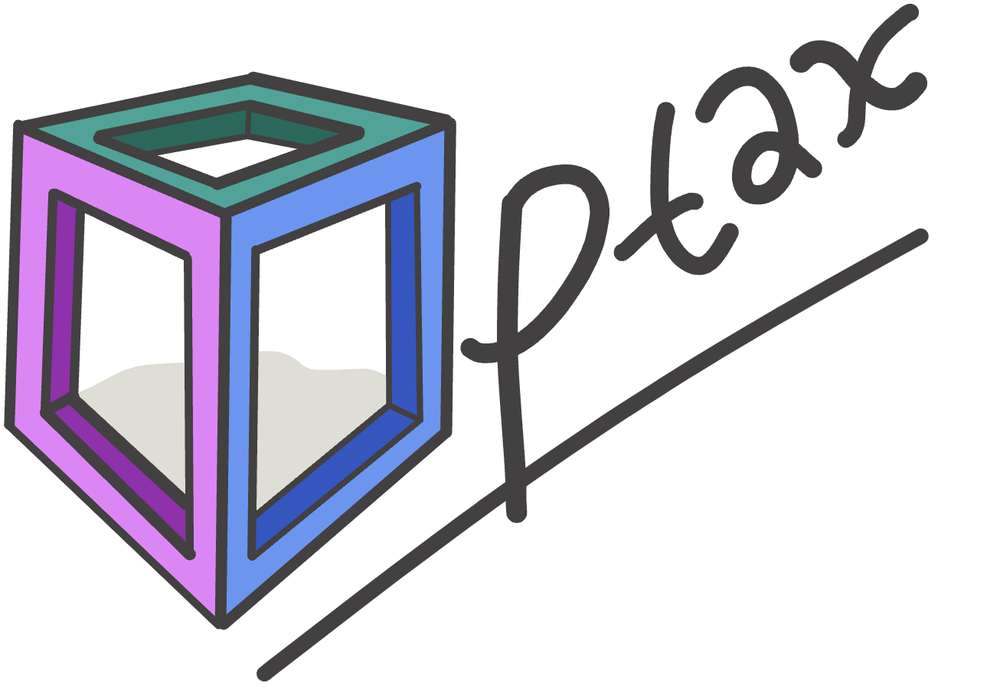

## Table of Contents

## What is Optax and what is its primary purpose in machine learning?

Optax is a library developed by DeepMind that provides a set of optimization algorithms for machine learning. Its primary purpose is to help researchers and developers easily experiment with different optimization techniques to improve the performance of their machine learning models. Optax is designed to be user-friendly and flexible, allowing users to quickly switch between various optimizers and customize them according to their specific needs.

In machine learning, optimization is crucial because it helps in adjusting the parameters of a model to minimize the error between the predicted and actual outcomes. Optax simplifies this process by offering a wide range of optimizers, such as stochastic gradient descent (SGD), Adam, and RMSprop, among others. By using Optax, users can focus more on developing their models and less on the complexities of implementing and tuning optimization algorithms, which can be time-consuming and challenging.

## How does Optax differ from other optimization libraries like PyTorch or TensorFlow?

Optax is different from other optimization libraries like PyTorch or TensorFlow because it focuses specifically on providing a wide range of optimization algorithms in a user-friendly way. While PyTorch and TensorFlow are full machine learning frameworks that include their own optimization modules, Optax is designed to be easily integrated with these frameworks. This means you can use Optax's optimizers with your existing PyTorch or TensorFlow models without having to switch to a new framework. Optax's main advantage is its flexibility and ease of use, allowing you to quickly try out different optimization techniques without getting bogged down in the details of implementation.

Another key difference is that Optax offers a more extensive collection of optimization algorithms compared to the built-in optimizers in PyTorch and TensorFlow. For example, Optax includes advanced techniques like adaptive gradient clipping and learning rate schedules that might require more effort to implement from scratch in other libraries. This makes Optax particularly useful for researchers who want to experiment with cutting-edge optimization methods without having to write complex code. By using Optax, you can focus more on improving your model's performance and less on the technical aspects of optimization.

In summary, while PyTorch and TensorFlow are comprehensive frameworks that include optimization as part of their broader offerings, Optax is a specialized library that excels in providing a diverse set of optimization tools. This specialization allows Optax to offer more advanced and customizable options for those who need them, making it a valuable addition to the machine learning toolkit.

## What are the basic components of an Optax optimizer?

An Optax optimizer is made up of a few key parts that work together to make your machine learning model better. The first part is the update function, which tells the optimizer how to change the model's parameters to reduce the error. This function takes in the current parameters and the gradients (which show how the error changes with the parameters) and decides how to update the parameters. For example, if you're using the Adam optimizer, the update function would use the Adam algorithm to adjust the parameters based on the gradients.

The second part is the state, which keeps track of any extra information the optimizer needs to work properly. For instance, some optimizers like Adam need to remember past gradients and squared gradients. The state helps the optimizer remember these things and use them to make better updates over time. The state is updated along with the parameters during each training step.

The third part is the learning rate schedule, which controls how big the updates to the parameters are. The learning rate can stay the same or change over time, depending on what you want. Optax makes it easy to set up different learning rate schedules, like ones that start big and get smaller as training goes on. By combining these parts, Optax helps you fine-tune your model's performance without getting lost in the details of how optimization works.

## How can a beginner set up and use a simple Optax optimizer in their machine learning project?

To set up and use a simple Optax optimizer in your machine learning project, you first need to install the Optax library. You can do this by running the command `pip install optax` in your terminal. Once installed, you can import Optax into your Python script with `import optax`. Next, choose an optimizer from Optax's collection. For beginners, the Stochastic Gradient Descent (SGD) optimizer is a good starting point. You can create an SGD optimizer with a fixed learning rate like this: ```python
learning_rate = 0.01
optimizer = optax.sgd(learning_rate)
``` This code sets up an SGD optimizer with a learning rate of 0.01.

After setting up the optimizer, you need to use it to update your model's parameters during training. In each training step, you'll compute the gradients of your loss function with respect to your model's parameters. Optax provides a function called `optax.apply_updates` to apply these gradients to update the parameters. Here's a simple example of how to use it: ```python
# Assume 'params' are your model's parameters and 'grads' are the computed gradients
updates, new_opt_state = optimizer.update(grads, opt_state)
new_params = optax.apply_updates(params, updates)
``` In this code, `opt_state` is the optimizer's state, which you initialize with `opt_state = optimizer.init(params)` before starting training. By following these steps, you can easily integrate Optax into your machine learning project and start optimizing your model's performance.

## What are some common optimization algorithms available in Optax?

Optax offers a variety of optimization algorithms that you can use to train your machine learning models. Some of the most common ones include Stochastic Gradient Descent (SGD), which is a basic but effective method. SGD updates the model's parameters by taking small steps in the direction that reduces the error. Another popular choice is the Adam optimizer, which adapts the learning rate for each parameter based on past gradients. This helps the model learn faster and more efficiently. Optax also provides the RMSprop optimizer, which adjusts the learning rate by using a moving average of squared gradients, helping to stabilize the training process.

In addition to these, Optax includes more advanced algorithms like Adagrad, which adapts the learning rate for each parameter based on how frequently it's updated. This can be useful for sparse data. Another option is the Adafactor optimizer, which is memory-efficient and works well for large models. Optax also supports techniques like gradient clipping, which helps prevent the gradients from getting too large and causing the model to behave erratically. By offering such a diverse set of optimizers, Optax makes it easy for you to experiment and find the best approach for your specific machine learning task.

## How does Optax handle gradient transformations and why is this important?

Optax uses gradient transformations to change how gradients are used to update a model's parameters. This is important because it helps make the training process better and more stable. For example, Optax can apply techniques like gradient clipping, which stops gradients from getting too big. This helps prevent the model from making huge updates that could mess up the training. Optax also lets you combine different transformations to create custom optimizers that fit your specific needs.

Gradient transformations are key because they let you control how your model learns. By using transformations like scaling or adding noise to gradients, you can make your model learn faster or avoid getting stuck in bad spots. For instance, if you want to make sure your model doesn't overfit, you can use a transformation that adds a bit of randomness to the gradients. This helps the model explore different solutions and find a better overall fit. With Optax, you can easily try out different transformations and see what works best for your project.

## Can you explain how to implement learning rate schedules with Optax?

Learning rate schedules in Optax help you control how fast your model learns over time. You can set up a schedule that starts with a big learning rate and then slowly makes it smaller. This can help your model learn quickly at first and then fine-tune its performance later on. Optax makes it easy to use different schedules, like ones that drop the learning rate at certain points or ones that change it smoothly over time. For example, you can use a schedule that cuts the learning rate in half every few steps, which is called a step decay schedule.

To set up a learning rate schedule in Optax, you first need to choose the type of schedule you want. Let's say you want to use a linear schedule that starts at 0.1 and goes down to 0.01 over 1000 steps. You can do this with the following code: ```python
import optax

initial_learning_rate = 0.1
final_learning_rate = 0.01
transition_steps = 1000

schedule = optax.linear_schedule(
    init_value=initial_learning_rate,
    end_value=final_learning_rate,
    transition_steps=transition_steps
)

optimizer = optax.sgd(learning_rate=schedule)
``` This code creates a linear schedule and uses it with the SGD optimizer. By using learning rate schedules, you can make your model's training more effective and get better results.

## What advanced features does Optax offer for more experienced users?

Optax provides several advanced features that can help more experienced users fine-tune their machine learning models. One key feature is the ability to create custom optimizers by combining different gradient transformations. For example, you might want to use gradient clipping to stop the gradients from getting too big, and then add a bit of noise to help the model explore different solutions. This can be done easily with Optax by chaining transformations together. Another advanced feature is the support for higher-order optimization techniques, like those that use second-order information to make updates more precise. These methods can be more effective but also more complex to set up.

Another useful feature for experienced users is the ability to implement custom learning rate schedules that change over time in complex ways. Optax lets you create schedules that aren't just simple linear changes but can follow more sophisticated patterns. For instance, you might want a schedule that drops the learning rate at specific points or one that changes based on how well the model is doing. This flexibility can help you find the best way to train your model. Additionally, Optax supports advanced techniques like lookahead optimization, which can help improve the model's performance by looking ahead at future updates before making the current one. By using these advanced features, experienced users can push the boundaries of what's possible with their machine learning projects.

## How can Optax be integrated with popular machine learning frameworks like JAX?

Optax is designed to work well with JAX, a popular machine learning framework. To use Optax with JAX, you first need to install both libraries. You can do this by running `pip install optax jax` in your terminal. Once installed, you can import both libraries into your Python script with `import optax` and `import jax`. To set up an optimizer, you can choose one from Optax's collection, like the Adam optimizer. For example, you can create an Adam optimizer with a learning rate of 0.001 using the code ```python
learning_rate = 0.001
optimizer = optax.adam(learning_rate)
```. Then, you can use this optimizer to update your model's parameters during training. JAX helps you compute the gradients of your loss function, and Optax applies these gradients to update the parameters.

Integrating Optax with JAX is straightforward and allows you to take advantage of JAX's powerful features while using Optax's flexible optimization tools. For instance, you can use JAX's `grad` function to compute the gradients of your loss function, and then use Optax's `update` function to apply these gradients to your model's parameters. Here's a simple example of how you might do this: ```python
import jax
import jax.numpy as jnp
import optax

# Define your model and loss function
def model(params, x):
    return jnp.dot(x, params)

def loss_fn(params, x, y):
    pred = model(params, x)
    return jnp.mean((pred - y) ** 2)

# Initialize parameters and optimizer
params = jnp.array([1.0, 2.0])
opt_state = optimizer.init(params)

# Training loop
for _ in range(100):
    # Compute gradients
    grads = jax.grad(loss_fn)(params, x, y)

    # Update parameters
    updates, opt_state = optimizer.update(grads, opt_state)
    params = optax.apply_updates(params, updates)
``` By combining Optax and JAX, you can create powerful machine learning models that learn efficiently and effectively.

## What are the performance benefits of using Optax in large-scale machine learning tasks?

Optax helps make big machine learning projects run faster and use less memory. It does this by giving you lots of different ways to update your model's parameters. For example, Optax has special methods like Adafactor that are made to work well with huge models. These methods use less memory because they don't need to keep track of as much information as other optimizers. This means you can train bigger models without running out of memory, which is a big deal when you're working with lots of data.

Another way Optax helps with big projects is by letting you mix and match different ways to change the gradients. This can make your model learn better and faster. For example, you can use gradient clipping to stop the gradients from getting too big, which can make training more stable. Optax also lets you change the learning rate over time in smart ways, so your model can learn quickly at first and then fine-tune its performance later. By using these advanced features, you can get better results from your big machine learning tasks without spending too much time figuring out how to make everything work together.

## How does Optax support distributed training and what are the best practices for implementing it?

Optax helps with distributed training by working well with other tools that handle splitting up the work across many computers. It doesn't do the splitting itself, but it can be used with libraries like JAX or TensorFlow that do. This means you can use Optax's many ways to update your model's parameters while training on a big cluster of computers. By using Optax with these tools, you can make your big machine learning projects run faster and use less memory, which is important when you're working with lots of data.

When you're setting up distributed training with Optax, it's best to use a library like JAX that can handle the splitting of data and gradients across different computers. You'll need to make sure that the gradients are properly shared and combined before Optax updates the model's parameters. This can be done using JAX's built-in functions for distributed computing. By following these steps and using Optax's flexible optimizers, you can make your large-scale machine learning tasks more efficient and get better results.

## What are some real-world applications or case studies where Optax has been effectively used?

Optax has been effectively used in various real-world applications, particularly in the field of deep learning research. One notable case study is its use by DeepMind in their work on reinforcement learning. Researchers at DeepMind used Optax to experiment with different optimization algorithms to improve the performance of their agents in complex environments. By leveraging Optax's flexible and customizable optimizers, they were able to fine-tune their models more efficiently, leading to better results in tasks like playing video games or controlling robotic systems.

Another example of Optax's application is in natural language processing (NLP). A team of researchers used Optax to optimize large language models, which are used for tasks like text generation and translation. They found that Optax's advanced features, such as gradient clipping and custom learning rate schedules, helped stabilize the training process and improve the model's performance. By using Optax, they were able to achieve state-of-the-art results on several benchmark datasets, demonstrating the library's effectiveness in handling large-scale NLP tasks.