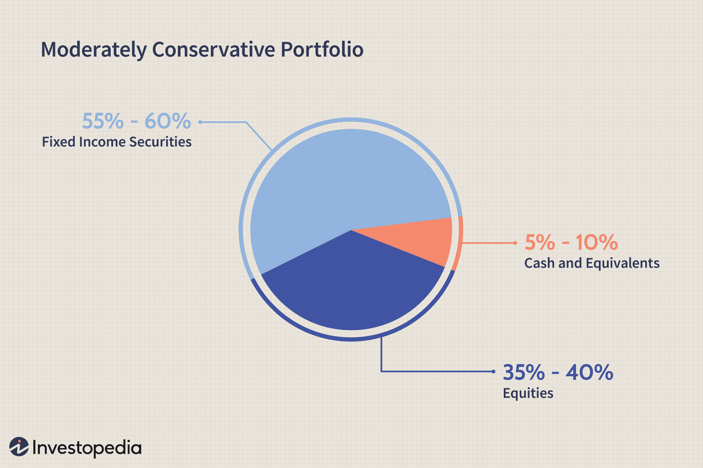

## Table of Contents

## What are large-cap stocks?

Large-cap stocks are shares of companies that have a big market value, usually over $10 billion. These companies are often well-known and have been around for a long time. Because they are big and stable, many people see them as safer investments compared to smaller companies.

Investing in large-cap stocks can be a good choice if you want your money to grow steadily over time. These stocks are often part of major stock indexes like the S&P 500. They might not grow as fast as smaller companies, but they are less likely to have big drops in value, which can make them a good choice for people who don't want to take big risks with their money.

## Why should someone consider including large-cap stocks in their investment portfolio?

Someone should consider including large-cap stocks in their investment portfolio because they offer stability and reliability. Large-cap companies are usually well-established and have a strong track record. This means they are less likely to have big ups and downs in their stock prices, which can help keep your investment safe. If you're someone who doesn't like taking big risks with your money, large-cap stocks can be a good choice because they are more predictable and less likely to lose a lot of value quickly.

Another reason to include large-cap stocks is that they can help your money grow over time. While they might not grow as fast as smaller companies, they often pay regular dividends, which are like little payments to shareholders. These dividends can add up and provide you with extra income. Plus, large-cap stocks are often part of big stock indexes like the S&P 500, so they can help you stay diversified, which means spreading your money across different types of investments to reduce risk. So, if you want steady growth and some extra income, large-cap stocks are a smart choice for your portfolio.

## What is a diversified portfolio and how do large-cap stocks fit into it?

A diversified portfolio is when you spread your money across different types of investments. This helps lower your risk because if one investment doesn't do well, the others might still be okay. It's like not putting all your eggs in one basket. You can have stocks, bonds, real estate, and other things in your portfolio. By having a mix, you protect your money from big losses and increase your chances of making money over time.

Large-cap stocks fit well into a diversified portfolio because they are big and stable. They are less likely to have big price drops, which makes them a safer choice. When you include large-cap stocks, you're adding something reliable to your mix. These stocks often pay dividends too, which can give you extra income. So, by having large-cap stocks in your portfolio, you're balancing out riskier investments and helping your money grow steadily.

## How can one determine the optimal allocation of large-cap stocks in a portfolio?

Deciding how much of your portfolio should be in large-cap stocks depends on a few things like your age, how much risk you're okay with, and what you want your money to do. If you're younger and can handle more risk, you might not put as much money in large-cap stocks because they grow slower than smaller companies. But if you're older or want to keep your money safe, you might put more money in large-cap stocks because they are more stable and often pay dividends.

One way to figure out the right amount is to look at your overall investment goals. If you want steady growth and some income, you might want a bigger part of your portfolio in large-cap stocks. A common rule is to have a mix of different types of investments, like 60% in stocks and 40% in bonds. Within the stock part, you could have half in large-cap stocks, which would be 30% of your whole portfolio. But everyone is different, so you might need to change this based on what you feel comfortable with and what you're trying to achieve with your money.

## What are the risks associated with large-cap stocks and how can they be mitigated?

Large-cap stocks can be a safe choice, but they still have some risks. One risk is that they might not grow as fast as smaller companies. This means if you want your money to grow a lot quickly, large-cap stocks might not be the best choice. Another risk is that even big companies can have problems. They might lose money or face challenges that make their stock price go down. Also, if the whole market goes down, large-cap stocks will go down too, even if they are usually more stable.

To lower these risks, you can do a few things. First, you can spread your money around by not putting all of it in large-cap stocks. Having some money in smaller companies or other types of investments like bonds can help balance things out. Second, you can look at the company's history and how it's doing now to see if it's a good choice. Companies that pay regular dividends can also help because those payments can give you some money even if the stock price goes down a bit. Finally, you can keep checking your investments and make changes if needed to make sure your money is still safe and growing.

## How do large-cap stocks perform compared to other asset classes over different time horizons?

Large-cap stocks often do well over long periods of time, like 10 or 20 years. They might not grow as fast as smaller companies, but they are usually more stable. Over the long run, large-cap stocks can give you steady growth and sometimes pay dividends, which is extra money you get just for owning the stock. If you look at big stock indexes like the S&P 500, which is full of large-cap stocks, you'll see that they tend to go up over time, even if there are ups and downs along the way.

Over shorter periods, like a few years or even a few months, large-cap stocks can be more unpredictable. They might not grow as much as other investments like small-cap stocks or even some bonds. But they are less likely to lose a lot of value quickly, which makes them safer than riskier investments. If you're looking at a shorter time frame, large-cap stocks might not give you the big gains you want, but they can help keep your money safe and still grow a bit.

## What role do large-cap stocks play in balancing risk and return in a portfolio?

Large-cap stocks help balance risk and return in a portfolio by offering a mix of safety and growth. These stocks come from big, well-known companies that have been around for a long time. Because they are stable, they don't go up and down as much as smaller companies. This makes them a safer choice if you want to keep your money safe. Even though they might not grow as fast as smaller companies, large-cap stocks can still give you steady growth over time.

Another way large-cap stocks help with balancing risk and return is by paying dividends. These are like little payments you get just for owning the stock. Dividends can give you extra income, which is good if you want your money to grow without taking big risks. By having large-cap stocks in your portfolio, you can get some growth and some income, which helps balance out riskier investments. So, if you want to keep your money safe while still making it grow, large-cap stocks are a good choice.

## How does sector diversification within large-cap stocks affect portfolio performance?

When you spread your large-cap stocks across different sectors, like technology, healthcare, and energy, it can help your portfolio do better. If one sector doesn't do well, the others might still be okay. This means your money is safer because you're not relying on just one type of company. For example, if tech stocks go down, your healthcare or energy stocks might still be doing well, which can help balance things out.

Having a mix of sectors can also help your money grow. Different sectors do well at different times. By having stocks in many sectors, you can take advantage of these changes. If you only have stocks in one sector, you might miss out on growth in other areas. So, by spreading your large-cap stocks across different sectors, you can make your portfolio more stable and increase your chances of making money over time.

## What are some advanced strategies for optimizing the allocation of large-cap stocks?

One advanced strategy for optimizing the allocation of large-cap stocks is to use a sector rotation approach. This means you look at which sectors are doing well at different times and move your money around to take advantage of these trends. For example, if you see that technology stocks are growing fast, you might put more money into tech large-cap stocks. Later, if energy stocks start doing better, you could shift some of your money there. By doing this, you can try to get better returns by being in the right sectors at the right time.

Another strategy is to use a [factor](/wiki/factor-investing)-based approach, where you focus on certain characteristics of stocks that can help you do better. For example, you might look for large-cap stocks that have a low price-to-earnings ratio, which means they might be undervalued and a good buy. Or you might look for stocks with high dividend yields if you want more income. By choosing large-cap stocks based on these factors, you can try to pick the ones that are most likely to perform well and fit your investment goals.

Lastly, you can use a risk parity approach, which means you balance your portfolio so that each part has the same level of risk. With large-cap stocks, this might mean you put more money into stocks that are a bit riskier but have the potential for higher returns, and less into very safe stocks. This way, you're not putting all your money into the safest large-cap stocks, but you're still keeping things balanced. By using these advanced strategies, you can try to get the best out of your large-cap stock investments.

## How can quantitative models be used to enhance the allocation of large-cap stocks in a portfolio?

Quantitative models can help you make better choices about which large-cap stocks to put in your portfolio. These models use math and data to look at things like how much a company is worth, how fast it's growing, and how much risk it has. By using these models, you can find large-cap stocks that might do better than others. For example, a model might tell you to pick stocks with a low price compared to how much money the company makes, which could mean they are a good deal. Or it might suggest stocks that pay high dividends if you want more income from your investments.

Another way quantitative models help is by figuring out how much of your money to put into different large-cap stocks. These models can look at how each stock moves up and down and how they relate to each other. This helps you spread your money around in a smart way, so you're not putting too much into one stock or sector. By using these models, you can make your portfolio more balanced and less risky. This means you can try to get the best returns while keeping your money safe.

## What impact do macroeconomic factors have on the optimal allocation of large-cap stocks?

Macroeconomic factors like interest rates, inflation, and economic growth can really change how you should put your money into large-cap stocks. When interest rates go up, borrowing money gets more expensive for companies. This can slow down their growth and make their stock prices go down. So, if you think interest rates will go up, you might want to put less money into large-cap stocks, especially those that need a lot of borrowing to grow. On the other hand, if you think the economy will grow a lot, you might want to put more money into large-cap stocks because they often do well when the economy is strong.

Inflation is another big thing to think about. When prices go up a lot, it can hurt companies because it costs more to make things. But some large-cap companies can handle inflation better than others because they can raise their prices too. So, if you think inflation will be high, you might want to pick large-cap stocks from companies that can deal with it well. By looking at these big economic factors, you can make smarter choices about how much of your money to put into large-cap stocks and which ones to pick.

## How should one adjust the allocation of large-cap stocks in response to changing market conditions?

When the market changes, you might need to change how much money you have in large-cap stocks. If the economy is doing well and growing, you might want to put more money into large-cap stocks because they often do well when things are good. But if the economy is slowing down or if there's a lot of uncertainty, you might want to put less money into large-cap stocks and more into safer things like bonds. This way, you can protect your money from big drops in the market.

Another thing to think about is what's happening with interest rates and inflation. If interest rates are going up, borrowing money gets more expensive for companies, which can make their stock prices go down. So, you might want to have less money in large-cap stocks, especially those that need a lot of borrowing to grow. On the other hand, if inflation is high, you might want to pick large-cap stocks from companies that can handle it well, like those that can raise their prices easily. By keeping an eye on these big changes in the market, you can make smart choices about how much of your money to put into large-cap stocks.

## References & Further Reading

[1]: Markowitz, H. (1952). ["Portfolio Selection."](https://onlinelibrary.wiley.com/doi/abs/10.1111/j.1540-6261.1952.tb01525.x) The Journal of Finance, 7(1), 77-91.

[2]: Grinold, R. C., & Kahn, R. N. (1999). ["Active Portfolio Management: A Quantitative Approach for Producing Superior Returns and Controlling Risk."](https://www.amazon.com/Active-Portfolio-Management-Quantitative-Controlling/dp/0070248826) McGraw-Hill.

[3]: Lopez de Prado, M. (2018). ["Advances in Financial Machine Learning."](https://www.amazon.com/Advances-Financial-Machine-Learning-Marcos/dp/1119482089) Wiley.

[4]: Chan, E. P. (2008). ["Quantitative Trading: How to Build Your Own Algorithmic Trading Business."](https://github.com/egorpe/EPChan-QuantitativeTrading/blob/master/example7_6.m) Wiley.

[5]: Jansen, S. (2018). ["Machine Learning for Algorithmic Trading."](https://github.com/stefan-jansen/machine-learning-for-trading) Packt Publishing.

[6]: Aronson, D. R. (2006). ["Evidence-Based Technical Analysis: Applying the Scientific Method and Statistical Inference to Trading Signals."](https://www.amazon.com/Evidence-Based-Technical-Analysis-Scientific-Statistical/dp/0470008741) Wiley.