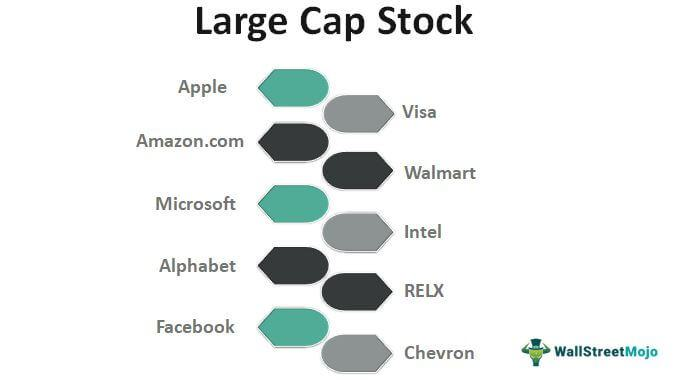

In today's dynamic financial landscape, achieving a diversified investment portfolio is a paramount strategy for reducing risk and enhancing potential returns. Diversification is essential as it spreads investments across different asset classes, such as stocks, bonds, and other securities, thereby minimizing the impact of a poor-performing investment on the overall portfolio. This concept aligns with the principle of not "putting all your eggs in one basket," reducing exposure to specific market fluctuations and enhancing the potential for stable returns.

This article explores the intricacies of diversified portfolio investment allocation, particularly focusing on large-cap stocks and the role of algorithmic trading. Large-cap stocks, typically defined by companies with a market capitalization exceeding $10 billion, are integral to a diversified portfolio due to their stability and consistent return potential. While they might not offer the high growth prospects of smaller companies, large-cap stocks often provide dividend payouts, which can significantly enhance the overall performance of an investment portfolio.



Algorithmic trading, often referred to as algo trading, is another advanced strategy gaining traction among investors seeking to optimize portfolio performance. By employing automated algorithms, trades are executed at high speed and efficiency, allowing access to diverse markets and asset classes. This approach not only facilitates dynamic portfolio allocation but also reduces asset correlation, further minimizing risk.

In addition to exploring these strategies, we will examine the benefits and considerations of integrating algorithmic trading in the investment process. While algo trading offers innovative tools for diversification and enhanced market access, it requires careful implementation. Considerations such as historical testing, risk alignment, and continuous monitoring are vital for maintaining an effective and balanced investment strategy. Through a blend of traditional investments, like large-cap stocks, and modern techniques, such as algorithmic trading, investors can build a resilient and effective investment portfolio.

## Table of Contents

## Understanding Diversified Portfolio Investment

Diversification is a fundamental principle in investment strategy that aims to reduce risk by allocating investments across various asset classes. This approach is akin to not putting all your eggs in one basket and is employed to mitigate the impact of market volatility on an investment portfolio.

A well-diversified portfolio typically includes a combination of stocks, bonds, and alternative assets such as real estate or commodities. The idea is to spread out exposure so that the negative performance of one asset class may be counterbalanced by the positive performance of another. For example, bonds and stocks often exhibit an inverse relationship in terms of performance during different economic cycles. When stock markets are bearish, bonds tend to perform relatively well, providing a hedge against market downturns.

The core objective of diversification is to minimize unsystematic risk—risk that is specific to a particular company or industry. By investing in a variety of asset classes, an investor can reduce the influence of this type of risk on the overall portfolio. Systematic risk, which affects the entire market and cannot be eliminated through diversification, remains. However, by reducing unsystematic risk, the portfolio's total risk is lowered, potentially enhancing risk-adjusted returns.

The importance of diversification can be illustrated through the Modern Portfolio Theory (MPT), proposed by Harry Markowitz in 1952. The theory suggests that an efficient portfolio is one that offers the maximum expected return for a given level of risk. By calculating the expected return and risk (standard deviation) for each combination of assets, investors can identify the "efficient frontier" where the portfolios lie. Python code for calculating the efficient frontier might look like this:

```python
import numpy as np
import matplotlib.pyplot as plt

# Simulate returns
returns = np.random.normal(0.1, 0.2, (1000, 3))

# Calculate portfolio metrics
def portfolio_performance(weights, mean_returns, cov_matrix):
    returns = np.sum(mean_returns * weights) * 252
    volatility = np.sqrt(np.dot(weights.T, np.dot(cov_matrix, weights))) * np.sqrt(252)
    return returns, volatility

# Random portfolio generation
mean_returns = np.mean(returns, axis=0)
cov_matrix = np.cov(returns.T)
results = np.zeros((3, 10000))

for i in range(10000):
    weights = np.random.random(3)
    weights /= np.sum(weights)
    portfolio_return, portfolio_volatility = portfolio_performance(weights, mean_returns, cov_matrix)

    results[0,i] = portfolio_volatility
    results[1,i] = portfolio_return
    results[2,i] = results[1,i] / results[0,i]

# Plot
plt.figure(figsize=(10, 7))
plt.scatter(results[0,:], results[1,:], c=results[2,:], cmap='YlGnBu', marker='o')
plt.title('Efficient Frontier')
plt.xlabel('Volatility')
plt.ylabel('Returns')
plt.colorbar(label='Sharpe Ratio')
plt.show()
```

This diversification strategy results in a reduction of investment [volatility](/wiki/volatility-trading-strategies). Volatility, measured as the standard deviation of returns, reflects the degree to which the price of each component of the portfolio swings. By diligently choosing investments with low correlations, investors can further diminish portfolio volatility. An asset with low or negative correlation to other assets can offer protection in times of market turmoil, as its performance might deviate from other investments.

In summary, diversification plays a crucial role in managing investment risk and enhancing the stability of portfolio performance. By reducing exposure to any single asset or market fluctuation through a diversified mix of investment vehicles, investors optimize for steadier returns and reduced risk over time.

## Large Cap Stocks: A Stable Foundation

Large-cap stocks, typically defined as companies with a market capitalization exceeding $10 billion, are fundamental components of a diversified investment portfolio. These stocks are characterized by their association with well-established, financially stable companies that exhibit a proven track record of performance and market presence. As a result, large-cap stocks are often considered a safer investment option, particularly appealing to investors seeking stability and reliable returns.

The stability of large-cap stocks stems from their ability to weather economic fluctuations better than their mid-cap or small-cap counterparts. These companies often have a diversified product range, a strong market presence, and robust management practices, which contribute to their resilience in various economic conditions. Consequently, investing in large-cap stocks helps to cushion a portfolio against volatility, aligning with the goal of minimizing risk through diversification.

One of the notable advantages of large-cap stocks is their potential to offer consistent dividends. These dividend payouts are a key attraction for investors looking for regular income streams. While the growth potential of large-cap stocks may not match that of smaller firms, the dividends can substantially enhance total returns. Reinvesting these dividends can also compound investment growth over time.

In a diversified portfolio, large-cap stocks play a strategic role by providing a core foundation that balances higher-risk, higher-reward investments. For instance, they are typically less susceptible to dramatic market swings, offering a measure of predictability that is essential for long-term financial planning. This characteristic makes them particularly attractive in periods of market uncertainty.

Furthermore, large-cap stocks often feature prominently in index funds and exchange-traded funds (ETFs). These investment vehicles benefit from the inclusion of large-cap stocks, which provide [liquidity](/wiki/liquidity-risk-premium) and steady performance metrics that appeal to a broad range of investors.

Integrating large-cap stocks into a diversified portfolio can therefore provide a measure of security and predictability, contributing to a more resilient investment strategy. By anchoring a portfolio with these stable investments, an investor can explore opportunities with mid-cap or small-cap stocks, potentially enhancing the growth horizon while maintaining a degree of stability crucial for sustainable portfolio health.

## Role of Algorithmic Trading in Portfolio Diversification

Algorithmic trading, commonly referred to as algo trading, represents a paradigm shift in the way financial markets operate, primarily due to its ability to execute trades with high speed and precision. At its core, this form of trading employs complex algorithms—consisting of mathematical models and computational techniques—to determine the timing, price, and quantity of trade executions across various markets and asset classes.

A principal advantage of [algorithmic trading](/wiki/algorithmic-trading) is its capacity to significantly enhance diversification opportunities within a portfolio. This is achieved through its ability to access and interact with an extensive range of markets and asset classes that might otherwise be challenging to incorporate manually. By automating trade executions, investors can efficiently allocate capital across multiple markets, including stocks, futures, options, and foreign exchange, facilitating a more diversified investment structure that may mitigate overall portfolio risk.

Moreover, algorithmic trading supports dynamic portfolio allocation, enabling rapid adjustments to asset allocation in response to market conditions. Algorithms can be designed to continuously monitor market data and execute trades in milliseconds, thereby strategically rebalancing portfolios to maintain desired risk levels and optimize returns. This rapid adaptive response helps reduce the correlation among assets within the portfolio, particularly by identifying and exploiting uncorrelated or negatively correlated investment opportunities that traditional approaches might overlook.

For instance, an algorithm can be coded to recognize patterns or signals in market data suggestive of impending changes in market correlation or volatility. By responding to these signals, the algorithm can adjust the portfolio's asset mix to capitalize on these shifts, effectively achieving a more stable return profile.

Enhanced diversification through algorithmic trading is further supported by access to expanded markets. Algo trading systems can execute trades in markets that operate 24/7, such as [cryptocurrency](/wiki/cryptocurrency) or international markets, offering broader exposure and derived benefits from multiple time zone [arbitrage](/wiki/arbitrage) opportunities. This access allows investors to hedge against localized risks and take advantage of global economic cycles, reinforcing the robustness and resilience of the investment portfolio.

Overall, algorithmic trading represents a potent tool for investors seeking to diversify their portfolios, offering numerous advantages over traditional methods through enhanced speed, precision, and a broadened market scope. Through strategic implementation, it provides investors with the means to actively manage portfolio risk and exploit diverse market opportunities, contributing to a well-rounded and resilient investment portfolio.

## Strategies Employed in Algo Trading for Diversification

In the pursuit of portfolio diversification through algorithmic trading, several strategies are implemented to leverage market inefficiencies and manage risk effectively. These strategies provide diverse mechanisms for achieving a robust and resilient investment portfolio.

### Statistical Arbitrage

Statistical arbitrage involves using mathematical models to identify and exploit pricing inefficiencies between related financial instruments. This strategy typically relies on mean reversion—that prices will revert to a long-term mean—allowing for profits from temporary mispricing. By employing statistical models such as cointegration, time series analysis, or [machine learning](/wiki/machine-learning) techniques, traders can automate the identification of these arbitrage opportunities. Strategies may involve pairs trading, where the historical correlation between two stocks is analyzed, and trades are executed when they deviate from their expected relationship. The advantage of [statistical arbitrage](/wiki/statistical-arbitrage) lies in its market-neutral approach, which helps in reducing directional risk and enhancing diversification.

### Global Macro Strategies

Global macro strategies capitalize on large-scale economic and political events to predict market movements across various asset classes. This strategy employs analysis of macroeconomic indicators such as GDP growth, inflation rates, interest rates, and geopolitical events. Algorithmic trading systems can efficiently process vast amounts of economic data, allowing for the timely execution of trades across global markets. By utilizing [global macro](/wiki/global-macro-strategy) strategies, traders can diversify their portfolios by taking positions in equities, currencies, commodities, and bonds. The extensive range of asset classes and geographies covered ensures that the portfolio is not overly dependent on a specific market or region.

### Sector Rotation

Sector rotation strategy involves reallocating assets among different sectors based on the economic cycle's performance expectations. The idea is to invest in sectors that are anticipated to perform well in the forthcoming economic phase while divesting from those that are expected to underperform. Algorithmic trading platforms can automate this process by analyzing sector performance metrics and economic indicators to predict the cyclical rotation. This strategy enhances diversification by ensuring exposure to a broad range of sectors, each responding differently to economic changes. As sectors typically have varying risk profiles and returns, sector rotation allows investors to optimize portfolio performance in alignment with economic trends.

Each of these strategies involves distinct methods and analyzations, providing investors with opportunities to mitigate risks and exploit market inefficiencies. Incorporating these algorithmic trading strategies ensures that the investment process remains dynamic and adaptable, ultimately contributing to a more balanced and diversified portfolio.

## Considerations for Leveraging Algorithmic Trading

While algorithmic trading offers substantial benefits for portfolio diversification and optimization, several key considerations are imperative to maximize its effectiveness. 

One crucial consideration is the implementation of stop-loss orders. Stop-loss orders serve as an automated trading tool to sell assets when they reach a specified price, thereby limiting potential losses. By employing stop-loss orders, investors can safeguard their portfolios against significant downturns within volatile markets. This automatic execution helps in maintaining discipline and preventing emotional decision-making errors, particularly in fast-moving markets.

Diversification of algorithmic strategies is another important [factor](/wiki/factor-investing). Relying on a singular algorithmic strategy could expose an investor to specific risks associated with that strategy. By diversifying across multiple algorithmic strategies, investors can mitigate the idiosyncratic risks inherent in each strategy. For example, combining statistical arbitrage with trend-following strategies may reduce exposure to market anomalies and fluctuations. This diversification aligns with the broader goal of maintaining a balanced exposure across various market conditions.

Continuous monitoring of algorithmic trading systems is essential to ensure they operate as intended. Markets are dynamic, and an algorithm's performance can degrade over time due to changes in market conditions, technology, or regulatory environments. Regularly reviewing and updating algorithms can prevent them from becoming outdated and losing effectiveness. Monitoring also includes performance tracking against predetermined benchmarks and adjusting parameters to optimize outcomes.

Historical testing, or [backtesting](/wiki/backtesting), is vital to validate the reliability of algorithmic strategies. Backtesting involves assessing how a strategy would have performed in past market conditions, thereby providing insights into its potential future performance. This process requires precise and comprehensive historical data to avoid overfitting, where a model might perform exceptionally well on historical data but fail in live trading. The use of accurate and extensive backtesting can fine-tune strategies to meet the investor's desired risk-return profile.

Aligning risk profiles with investment goals is the final consideration for leveraging algorithmic trading effectively. Different investors have varying risk tolerances and financial objectives, and algorithms must be tailored accordingly. An investor with a higher risk tolerance may prioritize strategies offering greater potential returns, while a risk-averse individual might focus on capital preservation. Customization ensures that the algorithmic trading approach is congruent with the investor’s overall strategic objectives.

In conclusion, while algorithmic trading provides innovative solutions for portfolio diversification, a number of critical considerations must be addressed to harness its full potential. Implementing tools like stop-loss orders, diversifying algorithmic strategies, continuous monitoring, rigorous backtesting, and aligning strategies with personal risk profiles are paramount for maintaining a well-balanced and diverse investment portfolio.

## Conclusion

In summary, diversified portfolio investment allocation stands as a pivotal strategy for investors aiming to mitigate risks while enhancing returns. By distributing assets across various classes, investors minimize their exposure to the volatility and fluctuations of individual markets or sectors. Large-cap stocks, characterized by their substantial market capitalization and established track record, offer a reliable and stable component within this diversified approach. Their propensity to deliver steady returns, often complemented by dividend payouts, makes them a cornerstone of risk-averse investment strategies.

Moreover, algorithmic trading emerges as a formidable tool in the modern investor's arsenal, allowing for greater diversification and portfolio optimization. Through the use of sophisticated algorithms, this approach enhances market access and enables dynamic asset allocation. By leveraging algorithmic solutions, investors can not only speed up their trading processes but also uncover correlations and opportunities within disparate market segments.

For a truly resilient and effective investment portfolio, a symbiotic integration of traditional investment methods with advanced algorithmic strategies is essential. This hybrid approach equips investors to navigate the complexities of contemporary financial markets with agility and foresight, ultimately fostering a more robust and adaptable portfolio capable of weathering diverse financial environments.

## References & Further Reading

[1]: Markowitz, H. (1952). ["Portfolio Selection."](https://onlinelibrary.wiley.com/doi/abs/10.1111/j.1540-6261.1952.tb01525.x) The Journal of Finance, 7(1), 77-91.

[2]: Grinold, R. C., & Kahn, R. N. (1999). ["Active Portfolio Management: A Quantitative Approach for Producing Superior Returns and Controlling Risk."](https://www.amazon.com/Active-Portfolio-Management-Quantitative-Controlling/dp/0070248826) McGraw-Hill.

[3]: Lopez de Prado, M. (2018). ["Advances in Financial Machine Learning."](https://www.amazon.com/Advances-Financial-Machine-Learning-Marcos/dp/1119482089) Wiley.

[4]: Chan, E. P. (2008). ["Quantitative Trading: How to Build Your Own Algorithmic Trading Business."](https://github.com/egorpe/EPChan-QuantitativeTrading/blob/master/example7_6.m) Wiley.

[5]: Jansen, S. (2018). ["Machine Learning for Algorithmic Trading."](https://github.com/stefan-jansen/machine-learning-for-trading) Packt Publishing.

[6]: Aronson, D. R. (2006). ["Evidence-Based Technical Analysis: Applying the Scientific Method and Statistical Inference to Trading Signals."](https://www.amazon.com/Evidence-Based-Technical-Analysis-Scientific-Statistical/dp/0470008741) Wiley.