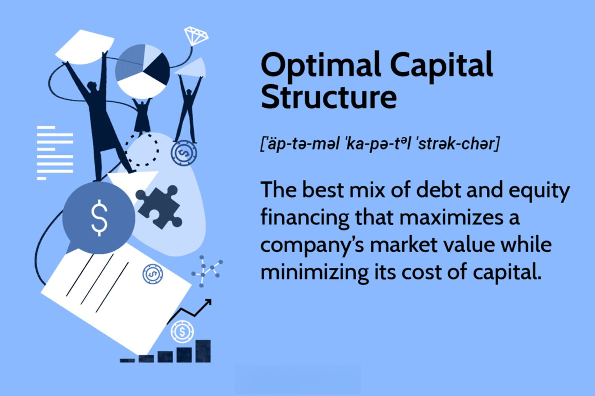

## Table of Contents

## What is the basic definition of capital structure?

Capital structure refers to the way a company finances its operations and growth by using different sources of funds. These sources mainly include debt and equity. Debt means borrowing money, usually from banks or by issuing bonds, which the company must pay back with interest. Equity, on the other hand, involves selling shares of the company to investors, who then own a part of the business.

The choice of capital structure is important because it affects the company's risk and cost of capital. More debt can increase the risk of bankruptcy because the company has to make regular interest payments. However, debt can also be cheaper than equity because interest payments are tax-deductible. Equity does not have to be paid back, but it can be more expensive because shareholders expect a return on their investment through dividends or rising share prices. A company needs to balance these factors to find the best capital structure for its situation.

## Why is the concept of optimal capital structure important for a business?

The concept of optimal capital structure is important for a business because it helps the company decide the best way to finance its operations and growth. By finding the right mix of debt and equity, a business can lower its cost of capital, which means it can borrow or raise money at a lower cost. This can make the company more profitable because it can use the money to invest in new projects or expand its business without spending too much on financing.

Having an optimal capital structure also helps a business manage its financial risks. If a company uses too much debt, it might struggle to pay back the loans, especially if it faces tough times. On the other hand, relying too much on equity can dilute the ownership of existing shareholders and might be more expensive in the long run. By balancing debt and equity, a business can reduce the chance of financial trouble and keep its shareholders happy, which is key to long-term success.

## What are the main components of a company's capital structure?

The main components of a company's capital structure are debt and equity. Debt is money that a company borrows, usually from banks or by issuing bonds. The company has to pay this money back with interest. Debt can be a good way to finance a business because interest payments can be deducted from taxes, which makes it cheaper than equity. But too much debt can be risky because the company has to make regular interest payments, and if it can't, it might go bankrupt.

Equity is another way for a company to raise money. It involves selling shares of the company to investors, who then own a part of the business. Unlike debt, equity does not have to be paid back, but it can be more expensive because shareholders expect to get a return on their investment through dividends or rising share prices. When a company sells more shares, it dilutes the ownership of existing shareholders, which can be a downside. Balancing debt and equity is important for a company to find the best way to finance its operations and growth.

## How does debt influence a company's capital structure?

Debt plays a big role in a company's capital structure because it's one way the company can get money to run and grow its business. When a company borrows money, either from a bank or by selling bonds, it has to pay this money back with interest. This is called debt. Using debt can be good because the interest payments are tax-deductible, which means the company can save on taxes. This makes debt cheaper than other ways to get money. But too much debt can be risky. If a company borrows too much, it has to make a lot of interest payments, and if it can't, it might go bankrupt. So, a company needs to be careful about how much debt it uses.

The amount of debt a company has also affects how risky it seems to investors and lenders. If a company has a lot of debt, it might be seen as more likely to have financial problems. This can make it harder for the company to borrow more money or raise money from investors. On the other hand, if a company has less debt, it might be seen as safer, which can make it easier to get more money. Finding the right amount of debt is important for a company because it helps balance the benefits of using debt with the risks that come with it.

## What role does equity play in determining the optimal capital structure?

Equity is a key part of a company's capital structure because it's another way the company can get money to run and grow its business. When a company sells shares to investors, it's using equity. This means the investors own a part of the company. Unlike debt, equity doesn't have to be paid back, but the investors expect to get something in return, like dividends or an increase in the value of their shares. This can make equity more expensive than debt because the company has to give some of its profits to the shareholders.

The amount of equity a company uses can affect how it finds the best mix of debt and equity, which is called the optimal capital structure. If a company uses more equity, it might be seen as safer because it doesn't have to make regular interest payments like it does with debt. But using too much equity can dilute the ownership of existing shareholders, which means they own a smaller part of the company. Finding the right balance between debt and equity is important for a company because it helps keep the cost of getting money low and the risk of financial problems down.

## Can you explain the trade-off theory in relation to optimal capital structure?

The trade-off theory is a way to think about how a company should balance debt and equity to find the best capital structure. It says that a company should use debt because it's cheaper than equity. Debt is cheaper because the interest payments can be taken off the company's taxes, which saves money. But using debt also has risks. If a company borrows too much money, it might have trouble paying it back, especially if it has a bad year. So, the trade-off theory says that a company should use debt until the benefits of using more debt are balanced by the risks of having too much debt.

Finding the right balance is important because it helps a company lower its cost of getting money and manage its financial risks. If a company uses too much debt, it might go bankrupt if it can't make the interest payments. But if it uses too much equity, it might be more expensive because shareholders expect to get a return on their investment. The trade-off theory helps a company figure out the best mix of debt and equity by weighing the benefits of using debt against the risks of having too much debt.

## How does the pecking order theory affect decisions on capital structure?

The pecking order theory is a way to think about how companies decide to get money for their business. It says that companies prefer to use money they already have, like profits, before they borrow money or sell shares. This is because using their own money is the cheapest and easiest way. If they need more money, they will borrow it next because debt is cheaper than selling shares. Selling shares is the last choice because it can make the company's stock price go down and it can be more expensive in the long run.

This theory affects how companies choose their capital structure because it makes them think about the costs and risks of different ways to get money. If a company follows the pecking order theory, it will use its own money first, then borrow money, and only sell shares if it really needs to. This can help the company keep its costs low and avoid too much risk. But it also means the company's capital structure might change over time, depending on how much money it has and what it needs to do.

## What are the key factors that influence the choice of an optimal capital structure?

The choice of an optimal capital structure depends on several key factors. One important [factor](/wiki/factor-investing) is the cost of capital. Companies want to use a mix of debt and equity that keeps their costs low. Debt can be cheaper than equity because the interest payments can be taken off the company's taxes. But too much debt can be risky because the company has to make regular interest payments, and if it can't, it might go bankrupt. So, companies need to balance the benefits of using debt with the risks of having too much debt.

Another factor is the company's business risk. If a company's business is risky, it might not want to use too much debt because it could make the company's financial situation even riskier. The company's growth plans also matter. If a company wants to grow quickly, it might need more money, and it will have to decide whether to use debt or equity to get it. The company's industry and how investors and lenders see it can also affect its choice of capital structure. Companies need to think about all these factors to find the best mix of debt and equity for their situation.

## How do taxes impact the determination of an optimal capital structure?

Taxes play a big role in figuring out the best mix of debt and equity for a company. When a company borrows money, it has to pay interest on the loan. But the good thing is, these interest payments can be taken off the company's taxes. This means the company can save money on taxes, which makes borrowing money cheaper than selling shares. So, a company might want to use more debt to get this tax benefit and lower its overall cost of getting money.

However, using too much debt can be risky. If a company has a lot of debt, it has to make a lot of interest payments, and if it can't, it might go bankrupt. So, the company needs to balance the tax benefits of using debt with the risks of having too much debt. This balance is important because it helps the company find the best way to finance its business while keeping its costs low and managing its financial risks.

## What are the potential risks associated with an aggressive capital structure?

An aggressive capital structure means a company uses a lot of debt to get money. This can be risky because the company has to make regular interest payments on the debt. If the company has a bad year and can't make these payments, it might go bankrupt. This is called financial risk. Using a lot of debt also makes the company's cash flow tight because it has to pay back the debt and the interest. If something unexpected happens, like a drop in sales or an economic downturn, the company might not have enough money to cover its costs.

Another risk is that using a lot of debt can make it harder for the company to borrow more money in the future. If lenders see that the company already has a lot of debt, they might think it's too risky to lend more money. This can limit the company's options for getting money when it needs it. Also, if the company uses too much debt, it might make investors nervous. They might worry that the company is too risky and sell their shares, which can make the company's stock price go down. So, an aggressive capital structure can lead to more financial and business risks for the company.

## How can a company assess if its current capital structure is optimal?

A company can assess if its current capital structure is optimal by looking at how much it costs to get money. If the company uses a lot of debt, it should check if the interest payments are too high and if they are putting the company at risk of not being able to pay them. The company can also compare the cost of debt, which is cheaper because of tax benefits, with the cost of equity, which is more expensive because shareholders expect a return. If the company finds a good balance where it can keep costs low and manage risks well, then its capital structure might be optimal.

Another way to assess the capital structure is by looking at the company's business risk. If the company's business is risky, it might want to use less debt to avoid making its financial situation even riskier. The company should also think about its growth plans. If it wants to grow quickly, it might need more money, and it will have to decide if using more debt or equity is the best way to get it. By considering all these factors, the company can figure out if its current mix of debt and equity is the best for its situation.

## What are the limitations and criticisms of traditional theories on optimal capital structure?

Traditional theories on optimal capital structure, like the trade-off theory and the pecking order theory, have some limitations and criticisms. One big criticism is that they don't always fit the real world. The trade-off theory says a company should use debt until the benefits of using more debt are balanced by the risks of having too much debt. But in real life, it's hard to know exactly when that balance is reached. The pecking order theory says companies prefer to use their own money first, then borrow money, and only sell shares if they really need to. But this doesn't explain why some companies use a lot of debt even when they have a lot of their own money.

Another criticism is that these theories don't take into account all the things that can affect a company's capital structure. For example, they don't consider things like how the company's industry works, what the economy is doing, or how investors and lenders see the company. These things can change a lot and can make a big difference in what the best capital structure is for a company. Also, these theories often assume that companies always act in a way that makes the most financial sense, but in real life, companies might make decisions based on other things, like what their managers think or what their competitors are doing.

## What is the Understanding of Optimal Capital Structure?

Optimal capital structure refers to the ideal combination of debt and equity that maximizes a company's market value while minimizing its overall cost of capital. The central idea is to balance these forms of financing to achieve the biggest benefit for the firm and its shareholders. One of the key factors in determining this mix is the Weighted Average Cost of Capital (WACC), which represents the average rate that a company is expected to pay to finance its assets, weighted according to the proportion of debt and equity.

$$
\text{WACC} = \frac{E}{V} \times Re + \frac{D}{V} \times Rd \times (1 - Tc)
$$

Where:
- $E$ is the market value of the equity
- $D$ is the market value of the debt
- $V$ is the total market value of the company’s financing (equity + debt)
- $Re$ is the cost of equity
- $Rd$ is the cost of debt
- $Tc$ is the corporate tax rate

The Modigliani-Miller theorem provides foundational insights into the capital structure by proposing that, in a perfect market, the value of a firm is unaffected by whether it is financed by debt or equity. This theorem is predicated on the assumption of capital market efficiency, suggesting that no capital structure is superior to another in ideal conditions. However, real-world markets are not perfect; various factors such as taxes, bankruptcy costs, and information asymmetry introduce complexities.

Real-life applications therefore necessitate a nuanced approach. For instance, the tax shield from debt provides an incentive to incorporate debt into the capital structure as interest payments are tax-deductible. However, excessive reliance on debt increases the risk of financial distress and potential bankruptcy, which in turn can decrease a firm's value. Thus, companies must weigh the tax advantages of debt against the potential costs associated with bankruptcy and financial instability.

Moreover, prevailing market conditions and the industry context also play a crucial role in determining the optimal capital structure. Firms operating in volatile industries may prioritize financial flexibility and thus have a relatively higher equity ratio to navigate uncertainty efficiently. Conversely, stable industries might leverage debt more aggressively to capitalize on the tax benefits.

In conclusion, determining the optimal capital structure is contingent upon balancing theoretical ideals with practical constraints, considering a multitude of factors to maximize a firm’s valuation while prudently managing its financial health.

## What are the analytical approaches to determining the optimal capital structure?

Determining the optimal capital structure is a critical task in financial management, involving a strategic analysis of various financial indicators and scenarios. The aim is to identify the ideal debt-to-equity ratio that minimizes the cost of capital and enhances corporate value. Here, we explore key analytical methods used in this determination process.

One primary tool is the Weighted Average Cost of Capital (WACC) analysis. WACC is the average rate of return a company is expected to pay its security holders to finance its assets. It reflects the overall required return on the company’s equity and debt. The formula for WACC is:

$$
\text{WACC} = \frac{E}{V} \times \text{Re} + \frac{D}{V} \times \text{Rd} \times (1 - \text{Tc})
$$

where:
- $E$ is the market value of equity,
- $V$ is the total market value of equity and debt,
- $D$ is the market value of debt,
- $\text{Re}$ is the cost of equity,
- $\text{Rd}$ is the cost of debt,
- $\text{Tc}$ is the corporate tax rate.

By minimizing the WACC, firms can achieve an optimal financing mix that enhances their market valuation.

Monte Carlo simulations provide another robust technique, offering probabilistic insights into various financial scenarios. These simulations involve running numerous iterations of possible outcomes for financial variables, helping firms assess potential risks and returns associated with different capital structures. The results assist in making informed decisions about the balance between debt and equity, underpinned by statistical confidence and scenario analysis.

Coverage ratios also play a substantial role in managing capital structures. Ratios such as the interest coverage ratio (ICR) and the debt service coverage ratio (DSCR) indicate a firm's ability to meet its financial obligations. These ratios, calculated as:

$$
\text{ICR} = \frac{\text{EBIT}}{\text{Interest Expense}}
$$

$$
\text{DSCR} = \frac{\text{Net Operating Income}}{\text{Total Debt Service}}
$$

ensure the company maintains a healthy credit profile, critical to securing favorable financing conditions.

Python can also aid in analyzing capital structures through simulations and financial modeling. For instance, using scipy and numpy for statistical computations and simulations enables firms to model various financing scenarios effectively.

```python
import numpy as np

# Example Monte Carlo Simulation for potential returns
def monte_carlo_simulation(mu, sigma, starting_price, days, simulations):
    results = []
    for _ in range(simulations):
        prices = [starting_price]
        for _ in range(days):
            prices.append(prices[-1] * np.exp(np.random.normal(mu, sigma)))
        results.append(prices)
    return np.array(results)

# Parameters
mu = 0.0002       # Mean daily return
sigma = 0.01      # Daily volatility
starting_price = 100
days = 252        # Trading days in a year
simulations = 10000

# Run the simulation
simulated_results = monte_carlo_simulation(mu, sigma, starting_price, days, simulations)
```

These analytical approaches, from WACC analysis to Monte Carlo simulations and coverage ratio assessments, equip firms with the tools necessary to tailor financial strategies that align with specific organizational needs and market conditions, paving the way towards an optimal capital structure.

## References & Further Reading

[1]: Modigliani, F., & Miller, M. H. (1958). ["The Cost of Capital, Corporation Finance and the Theory of Investment."](https://www.jstor.org/stable/1812919) The American Economic Review, 48(3), 261-297.

[2]: Brigham, E. F., & Ehrhardt, M. C. (2020). ["Financial Management: Theory & Practice."](https://www.cengage.com/c/financial-management-theory-practice-16e-brigham-ehrhardt/9781337902601/?searchIsbn=ISBN%209781337902601) Cengage Learning.

[3]: Damodaran, A. (2012). ["Investment Valuation: Tools and Techniques for Determining the Value of Any Asset, 3rd Edition."](https://books.google.com/books/about/Investment_Valuation.html?id=5SRHAAAAQBAJ) Wiley & Sons.

[4]: Fabozzi, F. J., & Markowitz, H. M. (Eds.). (2011). ["The Theory and Practice of Investment Management: Asset Allocation, Valuation, Portfolio Construction, and Strategies, 2nd Edition."](https://books.google.com/books/about/The_Theory_and_Practice_of_Investment_Ma.html?id=PFZhVW1W0k8C) Wiley & Sons.

[5]: Kestner, L. N. (2003). ["Quantitative Trading Strategies: Harnessing the Power of Quantitative Techniques to Create a Winning Trading Program."](https://archive.org/details/quantitativetrad0000kest) McGraw-Hill.