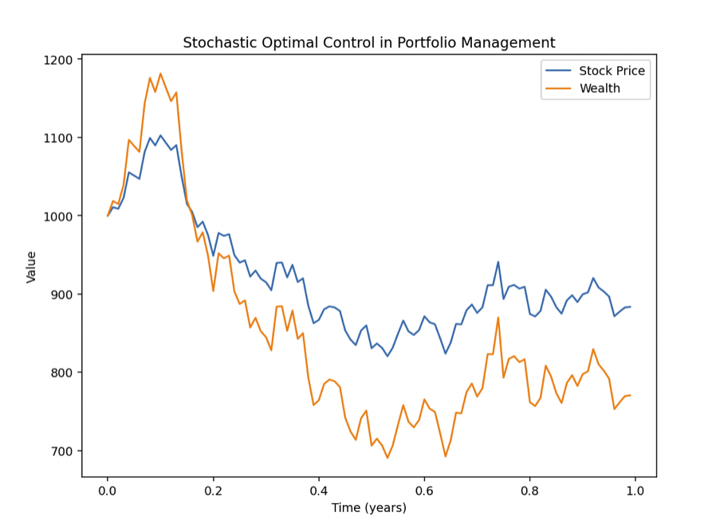

## Table of Contents

## What is optimal control in the context of trading?

Optimal control in trading is about finding the best way to manage and adjust a trading strategy to get the best results. Imagine you're driving a car and you want to reach your destination as quickly and safely as possible. In trading, optimal control helps you decide when to buy or sell, how much to invest, and how to adjust your strategy based on what's happening in the market. The goal is to maximize profits and minimize risks by making smart decisions at the right times.

To do this, traders use mathematical models and algorithms. These tools help predict how the market might move and suggest the best actions to take. For example, an algorithm might tell a trader to buy more of a stock if its price is expected to go up, or to sell if the price is likely to drop. By using optimal control, traders can make more informed decisions and improve their chances of success in the unpredictable world of trading.

## How does optimal control differ from traditional trading strategies?

Optimal control in trading is different from traditional trading strategies because it uses math and computers to make decisions. Traditional trading strategies often rely on a trader's experience and intuition. For example, a traditional trader might decide to buy or sell based on news or a gut feeling. On the other hand, optimal control uses algorithms to analyze data and predict market movements, helping the trader make more precise decisions.

Another key difference is how these strategies handle changes in the market. Traditional strategies might be slow to adjust because they depend on the trader's ability to recognize and react to new information. Optimal control, however, can quickly adapt to new data. It continuously updates its calculations and can change the trading strategy in real-time to take advantage of new opportunities or to minimize risks. This makes optimal control more flexible and potentially more effective in fast-changing markets.

## What are the basic mathematical principles behind optimal control in trading?

The basic math behind optimal control in trading is about figuring out the best way to reach a goal, like making the most money while taking the least risk. This involves using something called a "cost function" or "objective function." This function helps measure how well the trading strategy is doing. For example, it might look at how much profit you're making and how much risk you're taking. The goal is to find the settings for your trading strategy that make this function as good as possible, usually by making it as small as possible if it's a cost function.

To find these best settings, traders use something called "optimization techniques." These are math methods that help search through all the possible ways to trade and pick the one that works best according to the cost function. One common method is called "dynamic programming," which breaks down the trading problem into smaller, easier parts and solves them one by one. Another method is "gradient-based optimization," which looks at how small changes in the trading strategy affect the cost function and uses this information to find the best strategy step by step. These techniques help traders make smarter decisions by using math to guide their actions in the market.

## Can you explain the role of dynamic programming in optimal control trading strategies?

Dynamic programming plays a key role in optimal control trading strategies by breaking down complex trading problems into smaller, more manageable pieces. Imagine you're trying to solve a big puzzle. Instead of trying to fit all the pieces together at once, you start with smaller sections and work your way up. In trading, dynamic programming does something similar. It looks at the trading problem over time, figuring out the best actions to take at each step by considering all possible future outcomes. This way, it helps traders make decisions that lead to the best overall results.

By using dynamic programming, traders can create a plan that adjusts to new information as it comes in. This is important because markets are always changing, and a good trading strategy needs to be flexible. Dynamic programming helps traders look ahead and see how their current decisions might affect their future profits and risks. It's like playing chess, where you think about not just your next move, but several moves ahead. This forward-thinking approach helps traders find the best path to their goals, making their strategies more effective and efficient.

## What are some common models used for optimal control in trading?

Some common models used for optimal control in trading are the Linear Quadratic Regulator (LQR) model and the Model Predictive Control (MPC) model. The LQR model is like a simple tool that helps traders balance making money and managing risk. It uses math to find the best way to trade by looking at how much profit you want to make and how much risk you're willing to take. It's called "linear" because it assumes the relationships between things like stock prices and trading decisions are straightforward, and "quadratic" because it measures how well you're doing with a special kind of math equation.

The Model Predictive Control (MPC) model is a bit more complex but very useful. It's like a smart assistant that looks at what's happening in the market right now and predicts what might happen next. Then, it suggests the best trading actions to take based on those predictions. MPC is great because it can quickly adjust to new information, making it perfect for the fast-changing world of trading. It's like having a crystal ball that helps you make better decisions by looking a few steps ahead.

## How do traders apply optimal control to manage risk and maximize returns?

Traders use optimal control to manage risk and maximize returns by using math and computers to make smart decisions. They start by setting up a plan that tells them what to do based on what's happening in the market. This plan, called a trading strategy, is guided by a special math tool called a "cost function." The cost function helps traders see how well they're doing by looking at both their profits and their risks. By using this tool, traders can figure out the best way to trade that keeps risks low while making as much money as possible.

To put this into action, traders use optimization techniques to find the best settings for their trading strategy. These techniques help them search through all the different ways they could trade and pick the one that works best according to the cost function. For example, they might use dynamic programming to break down the trading problem into smaller pieces and solve it step by step, always looking ahead to see how their current decisions might affect their future results. By doing this, traders can make their strategies more flexible and effective, adjusting to new market information quickly and making smarter decisions that help them manage risk and maximize returns.

## What are the challenges of implementing optimal control strategies in real-time trading environments?

Implementing optimal control strategies in real-time trading environments can be tough because markets move quickly and unpredictably. Traders need to make decisions fast, and the math models used in optimal control can take time to process all the new information coming in. If the model takes too long to update, traders might miss out on good opportunities or make decisions based on outdated data. Also, the models need a lot of data to work well, and getting enough good data in real-time can be hard. Sometimes, the data might be wrong or missing, which can mess up the model's predictions.

Another challenge is that the math behind optimal control can be complicated. Even with computers helping out, setting up and fine-tuning the models requires a lot of expertise. Traders need to understand how to use the models correctly and make sure they're working right. If something goes wrong with the model, it can lead to big mistakes in trading. Plus, the market can change in ways the model didn't expect, so traders need to keep an eye on things and be ready to adjust their strategies. All these challenges make it tricky to use optimal control effectively in the fast-paced world of real-time trading.

## How can machine learning enhance optimal control strategies in trading?

Machine learning can make optimal control strategies in trading a lot better by helping traders learn from past data and make smarter decisions. Instead of just using math models, [machine learning](/wiki/machine-learning) can look at tons of past trades and market data to find patterns and predict what might happen next. This helps traders adjust their strategies to fit the current market conditions better. For example, machine learning can help figure out which factors, like news or economic reports, are most important for predicting stock prices, so traders can focus on those when making decisions.

Also, machine learning can make the whole process faster and more accurate. In the fast world of trading, every second counts, and machine learning algorithms can quickly process new data and update trading strategies in real-time. This means traders can react to changes in the market much faster than they could with just traditional math models. By using machine learning, traders can not only manage risk better but also find more opportunities to make money, making their optimal control strategies even more effective.

## What are the latest advancements in optimal control theory applicable to trading?

One of the latest advancements in optimal control theory that's being used in trading is called [reinforcement learning](/wiki/reinforcement-learning). This is a type of machine learning where the computer learns by doing, kind of like how you learn to ride a bike by practicing. In trading, the computer can use reinforcement learning to try different strategies and see which ones work best. It learns from its successes and failures, getting better over time at figuring out the best way to trade. This helps traders adapt to new market conditions quickly and make smarter decisions.

Another advancement is the use of [deep learning](/wiki/deep-learning), which is a more advanced form of machine learning. Deep learning can handle really complex data, like images or lots of numbers at once, to find patterns that traditional models might miss. In trading, this means the computer can look at tons of data from the market, news, and other sources to predict what might happen next. By using deep learning, traders can create more accurate models that help them manage risk and find good opportunities to make money. These advancements are making optimal control strategies in trading more powerful and effective.

## Can you provide case studies where optimal control has significantly impacted trading performance?

In one case, a [hedge fund](/wiki/hedge-fund-trading-strategies) used optimal control to improve its trading strategy for foreign exchange markets. They set up a model that looked at how much money they were making and how much risk they were taking. The model used dynamic programming to break down the trading problem into smaller steps and figure out the best actions to take at each step. By using this approach, the hedge fund was able to make more money and take less risk than before. They found that their profits went up by about 15% over a year, showing how powerful optimal control can be in real-world trading.

Another case involved a trading firm that used optimal control with machine learning to trade stocks. They used reinforcement learning to let their computer try different trading strategies and learn from the results. Over time, the computer got better at [picking](/wiki/asset-class-picking) the right times to buy and sell stocks. This led to a big improvement in their trading performance, with their returns increasing by around 20% compared to their old strategies. The firm was able to manage risk better and make more money, proving that combining optimal control with machine learning can really make a difference in trading.

## How do regulatory frameworks affect the application of optimal control in trading?

Regulatory frameworks can affect how traders use optimal control in their strategies. These rules are made by governments and financial organizations to make sure trading is fair and safe. They can limit what traders are allowed to do, like how much they can trade or what kind of data they can use. For example, some rules might say that traders can't use certain types of information or that they have to report their trades in a certain way. This means traders need to make sure their optimal control models follow these rules, which can make things more complicated.

Even though regulatory frameworks can add challenges, they also help make trading more reliable. Traders need to adjust their optimal control strategies to fit within these rules, but this can also help them build trust with investors and other market players. By following the rules, traders can show that their strategies are not just smart but also safe and fair. This can be good for their business in the long run, even if it takes more work to set up their optimal control models correctly.

## What future trends are expected in the field of optimal control for trading?

In the future, optimal control in trading is expected to become even more advanced with the help of new technology. One big trend will be the use of more powerful machine learning and [artificial intelligence](/wiki/ai-artificial-intelligence). These technologies can look at huge amounts of data and learn from it, helping traders make better decisions faster. They can also find new patterns in the market that humans might miss. This means optimal control strategies will get smarter and more accurate, helping traders make more money while taking less risk.

Another trend will be the use of more real-time data. As technology improves, traders will be able to get information about the market almost instantly. This will let them adjust their strategies very quickly to take advantage of new opportunities or avoid risks. Optimal control models will need to keep up with this fast pace, using new math and computer techniques to process all this data and make the best decisions in the moment. This will make trading more dynamic and responsive, leading to better results for traders.

## What is the Concept of Optimal Control?

Optimal control theory is a mathematical optimization method designed to find the control law for a given system to achieve a desired performance. It is instrumental in systems where the behavior can be described by differential equations, aiming to find control inputs that will minimize or maximize some performance criterion over a certain period.

### Historical Development of Optimal Control

The roots of optimal control theory can be traced back to the calculus of variations, a field established in the 18th century. The modern foundation of optimal control was laid in the mid-20th century with the introduction of the maximum principle by Lev Pontryagin and his colleagues in the late 1950s. This was complemented by the work on dynamic programming by Richard Bellman, who formalized the basis of optimal control as it is known today. The advancements in digital computing during the latter half of the 20th century further accelerated the development and application of optimal control, making it a critical tool in various scientific and engineering disciplines.

### Basic Principles and Equations

Optimal control involves finding a control law $u(t)$ for a control system represented by a set of differential equations:

$$
\dot{x}(t) = f(x(t), u(t), t),
$$

with an objective to optimize a performance index of the form:

$$
J = \int_{t_0}^{t_f} L(x(t), u(t), t) dt + \Phi(x(t_f)),
$$

where $x(t)$ is the state vector, $u(t)$ is the control vector, $L$ is the running cost, and $\Phi$ is the terminal cost.

Pontryagin's Maximum Principle provides necessary conditions for optimality, translating the problem into a boundary-value problem. According to the principle, solving for optimal control entails finding a trajectory and a corresponding control that maximizes the Hamiltonian function:

$$
H(x, u, \lambda, t) = L(x(t), u(t), t) + \lambda^T f(x(t), u(t), t),
$$

where $\lambda$ is the co-state vector.

### Applications of Optimal Control in Different Fields

Optimal control theory has widespread applications across various fields:

1. **Engineering**: In aerospace engineering, it is used for trajectory optimization of spacecraft and aircraft, enabling fuel-efficient and time-efficient paths. In robotics, it aids in the movement and operation efficiency of robots, ensuring optimal performance and energy use.

2. **Economics**: Optimal control is used to model economic growth and monetary policies, optimizing resource allocation in both macroeconomic and microeconomic contexts.

3. **Biology and Medicine**: It plays a role in therapeutic strategies, such as optimizing drug dosage over time to maximize treatment efficacy while minimizing side effects.

4. **Energy Systems**: In power grid management and renewable energy systems, optimal control helps in demand planning, load balancing, and reducing losses. It is pivotal in developing smart grid technologies and energy-efficient processes.

The robust mathematical foundation and versatility of optimal control make it invaluable for solving complex, real-world optimization problems across diverse disciplines.

## References & Further Reading

[1]: Bertsimas, D., & Tsitsiklis, J. N. (1997). ["Introduction to Linear Optimization."](https://www.researchgate.net/publication/235558951_Introduction_to_Linear_Optimization) Athena Scientific.

[2]: Zhou, X. Y., & Li, D. (2000). ["Continuous-Time Mean-Variance Portfolio Selection: A Stochastic LQ Framework."](https://link.springer.com/article/10.1007/s002450010003) Applied Probability Trust.

[3]: Fleming, W. H., & Rishel, R. W. (1975). ["Deterministic and Stochastic Optimal Control."](https://link.springer.com/book/10.1007/978-1-4612-6380-7) Springer.

[4]: Chan, E. (2009). ["Quantitative Trading: How to Build Your Own Algorithmic Trading Business."](https://github.com/justinchou/books-quantitative-trading) John Wiley & Sons.

[5]: Narang, R. K. (2009). ["Inside the Black Box: A Simple Guide to Quantitative and High-Frequency Trading."](https://onlinelibrary.wiley.com/doi/book/10.1002/9781118267738) John Wiley & Sons.

[6]: Aldridge, I. (2013). ["High-Frequency Trading: A Practical Guide to Algorithmic Strategies and Trading Systems."](https://onlinelibrary.wiley.com/doi/pdf/10.1002/9781119203803.fmatter) John Wiley & Sons.

[7]: Chaboud, A., Chiquoine, B., Hjalmarsson, E., & Vega, C. (2014). ["Rise of the Machines: Algorithmic Trading in the Foreign Exchange Market."](https://papers.ssrn.com/sol3/papers.cfm?abstract_id=1501135) Journal of Finance.

[8]: Avellaneda, M., & Stoikov, S. (2008). ["High-Frequency Trading in a Limit Order Book."](https://people.orie.cornell.edu/sfs33/LimitOrderBook.pdf) Quantitative Finance.

[9]: Engle, R., & Russell, J. R. (2004). ["Analysis of High-Frequency Financial Data."](http://www.olsendata.com/data_products/client_papers/papers/200412-EngleRussell-AnalHFFinData.pdf) In Handbook of Financial Econometrics. North-Holland.