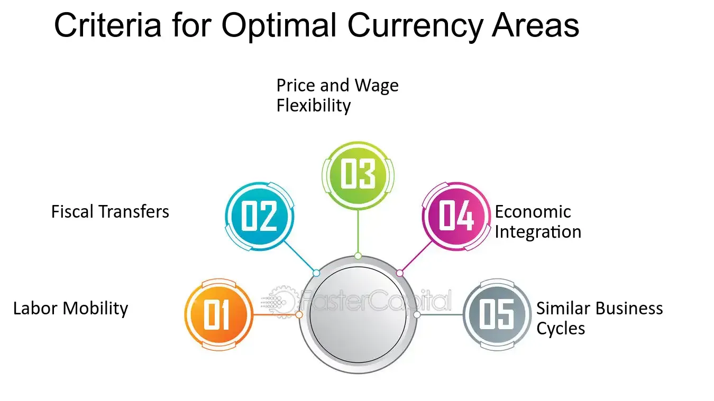

## Table of Contents

## What is an Optimal Currency Area (OCA)?

An Optimal Currency Area (OCA) is a geographic region where it makes sense for all the countries within it to use the same currency. This idea was first talked about by economist Robert Mundell in the 1960s. The main idea is that if countries in an area share a currency, it can help them trade more easily and save money on exchange rates. But for this to work well, the countries need to be similar in certain ways, like how their economies work and how they react to economic changes.

For a region to be considered an OCA, it should have a few key features. First, the countries should have similar business cycles, meaning they go through economic ups and downs at the same time. This makes it easier for them to handle economic problems together. Second, there should be a lot of trade between the countries, so using the same currency can really help. Lastly, if something goes wrong economically in one country, it should be easy for people to move to another country in the area to find work. This helps spread out the economic risk.

## Who first proposed the concept of an Optimal Currency Area?

The idea of an Optimal Currency Area was first talked about by an economist named Robert Mundell. He came up with this concept in the 1960s. Robert Mundell thought about how countries could benefit from using the same money, like how it could make trading easier and save money on changing currencies.

Mundell's idea was important because it helped people think about what makes a group of countries good at sharing a currency. He said that for it to work well, the countries should have similar economies and be able to handle economic problems together. This concept has been used to discuss big things like the Euro, which is used by many countries in Europe.

## What are the basic criteria for an Optimal Currency Area?

For a group of countries to be considered an Optimal Currency Area, they need to meet certain criteria. First, the countries should have similar business cycles. This means they should go through good and bad economic times at the same time. If one country is doing well while another is struggling, it can be hard for them to share a currency. When their economies move together, it's easier for them to make decisions about money and handle economic problems as a group.

Second, there should be a lot of trade happening between the countries. Using the same currency can make trading easier and cheaper because they don't have to change money all the time. This can help their economies grow. Also, if one country faces economic trouble, it should be easy for people to move to another country in the area to find work. This helps spread out the risk and supports the whole region's economy.

These criteria are important because they help make sure that sharing a currency will actually help the countries involved. If the countries are too different or don't trade much with each other, using the same currency might cause more problems than it solves. So, understanding these basics can help decide if a group of countries should share a currency.

## How does labor mobility contribute to an Optimal Currency Area?

Labor mobility is really important for an Optimal Currency Area. It means that people can easily move from one country to another within the area to find work. If one country is having economic problems, people can go to another country where the economy is doing better. This helps because it spreads out the economic risk. Instead of one country suffering a lot, the people can move and find jobs elsewhere, which helps the whole area stay stable.

When people can move freely, it also helps the countries share a currency better. If everyone uses the same money, but one country's economy is doing badly, the people there can move to where jobs are available. This movement helps keep the economy balanced across the whole area. So, labor mobility makes it easier for countries to handle economic ups and downs together, which is a big part of what makes an Optimal Currency Area work well.

## What role does price and wage flexibility play in an OCA?

Price and wage flexibility is important for an Optimal Currency Area. It means that prices for things we buy and the money people earn can change easily. When the economy is doing well, prices and wages can go up. But if the economy is not doing so great, they can go down. This flexibility helps keep the economy balanced. If one country in the area is having trouble, prices and wages can change to help fix the problem without needing to change the currency.

When countries share a currency, they can't change it to help their economy. So, they need other ways to adjust. Price and wage flexibility is one of those ways. If prices and wages can move up or down based on what's happening in the economy, it helps the whole area stay stable. This makes it easier for countries to work together and use the same money without causing big problems.

## Can you explain the significance of economic integration in forming an OCA?

Economic integration is really important when countries want to form an Optimal Currency Area. It means that the countries work together more closely, like trading a lot with each other and making it easier for people and money to move between them. When countries are economically integrated, using the same currency can help them a lot. It makes trading easier because they don't have to change money all the time, which can save them money and time. This can help their economies grow and make them stronger together.

If countries are not well integrated, sharing a currency might cause more problems than it solves. For example, if one country's economy is doing badly but another's is doing well, it can be hard for them to use the same money. Economic integration helps because it means the countries are more similar and can handle economic ups and downs together. So, when countries are economically integrated, it's a good sign that they might be able to form an Optimal Currency Area and benefit from using the same currency.

## How do fiscal transfers help in maintaining an Optimal Currency Area?

Fiscal transfers are payments that go from one country to another within an Optimal Currency Area. They help keep the whole area's economy stable. If one country is doing badly and another is doing well, the richer country can send money to the poorer one. This helps the poorer country deal with its economic problems without having to change the currency they share.

These transfers are important because they help spread out the economic risk. If one country is struggling, the whole area doesn't suffer as much. The money helps the people in the struggling country keep buying things and paying for what they need. This way, the whole Optimal Currency Area stays strong and works better together, making it easier for all the countries to use the same money.

## What are the challenges of implementing an OCA in practice?

Implementing an Optimal Currency Area can be really hard because countries need to be very similar in how their economies work. If one country's economy is doing well while another's is struggling, it can cause big problems. They need to have similar business cycles, meaning they go through good and bad economic times at the same time. If they don't, using the same money can make things worse instead of better. Also, they need to trade a lot with each other and let people move easily between countries to find work. If these things don't happen, sharing a currency might not work out well.

Another challenge is that countries need to be willing to help each other out. This means richer countries might need to send money to poorer ones to keep the whole area stable. This can be hard because countries might not want to give away their money. Also, prices and wages need to be able to change easily. If they can't, it's harder for countries to handle economic problems without changing their currency. So, making an Optimal Currency Area work in real life needs a lot of cooperation and flexibility from all the countries involved.

## How do different countries measure up to the OCA criteria?

Some countries in Europe, like those in the Eurozone, have tried to form an Optimal Currency Area by using the Euro. They trade a lot with each other and have tried to make it easier for people to move between countries. But they still face challenges because their economies don't always go through good and bad times at the same time. Some countries, like Germany, have done well, while others, like Greece, have struggled. This makes it hard for them to share a currency because they need to help each other out, like sending money from richer to poorer countries, which can be difficult.

In North America, the United States is often seen as a good example of an Optimal Currency Area. The different states have similar business cycles and trade a lot with each other. People can also move easily between states to find work. This helps the whole country stay stable even if one state is doing badly. But even in the U.S., there are challenges. Some states might need help from the federal government, and not everyone agrees on how much help should be given. So, while the U.S. does well in many ways, it still faces some of the same problems as other areas trying to form an OCA.

## What are the economic benefits of joining an Optimal Currency Area?

Joining an Optimal Currency Area can help countries trade more easily with each other. When countries use the same money, they don't have to change their money all the time, which can save them time and money. This can make it easier for businesses to sell things to other countries in the area. More trade can help the economies of all the countries grow because they can buy and sell more things. This can lead to more jobs and more money for people in the area.

Another benefit is that countries can work together better to handle economic problems. If one country is doing badly, the other countries can help out by sending money or letting people move to find work. This can help keep the whole area's economy stable. When countries are part of an Optimal Currency Area, they can make decisions together about money and how to help each other. This can make the whole area stronger and more able to deal with economic ups and downs.

## How does the theory of Optimal Currency Areas apply to the European Union?

The European Union has tried to make an Optimal Currency Area by using the Euro. Many countries in the EU use the Euro, which makes it easier for them to trade with each other. They don't have to change their money all the time, which saves them time and money. This can help their economies grow because they can buy and sell more things. But for this to work well, the countries need to be similar in how their economies work. They should go through good and bad economic times at the same time, and it should be easy for people to move between countries to find work.

However, the European Union faces some challenges in making the Euro work as an Optimal Currency Area. Not all countries in the EU have the same business cycles. Some countries, like Germany, have done well, while others, like Greece, have struggled. This makes it hard for them to use the same money because they need to help each other out. Richer countries might need to send money to poorer ones to keep the whole area stable, but this can be hard because countries might not want to give away their money. So, while the EU has made progress, it still faces challenges in meeting all the criteria for an Optimal Currency Area.

## What are the latest research findings on the evolution of Optimal Currency Area theory?

Recent research on Optimal Currency Area theory has looked at how countries can work together better. One big finding is that countries need to be more flexible with their prices and wages. If prices and wages can change easily, it helps the whole area stay stable even if one country is doing badly. Researchers have also found that countries need to be more open to helping each other out. This means richer countries might need to send money to poorer ones to keep the whole area's economy strong. This kind of help is important because it spreads out the economic risk and makes it easier for countries to share a currency.

Another important finding is that technology and global trade have changed how Optimal Currency Areas work. With more trade happening around the world, countries need to think about how they fit into the global economy. Researchers have found that countries that trade a lot with each other and the rest of the world might do better in an Optimal Currency Area. Also, new technology makes it easier for people to move and find work in different countries. This can help the whole area stay stable because people can go where the jobs are. So, the latest research shows that flexibility, cooperation, and global connections are key to making an Optimal Currency Area work well.

## References & Further Reading

[1]: Mundell, R. A. (1961). ["A Theory of Optimum Currency Areas."](https://www.sfu.ca/~kkasa/mundell_61.pdf) The American Economic Review, 51(4), 657-665.

[2]: De Grauwe, P. (2018). ["Economics of Monetary Union."](https://books.google.com/books/about/Economics_of_Monetary_Union.html?id=gY_UDwAAQBAJ) Oxford University Press.

[3]: Lane, P. R., & Milesi-Ferretti, G. M. (2007). ["The External Wealth of Nations Mark II: Revised and Extended Estimates of Foreign Assets and Liabilities, 1970-2004."](https://www.sciencedirect.com/science/article/pii/S0022199607000591) Journal of International Economics, 73(2), 223-250.

[4]: Lopez de Prado, M. (2018). ["Advances in Financial Machine Learning."](https://www.amazon.com/Advances-Financial-Machine-Learning-Marcos/dp/1119482089) Wiley.

[5]: Aronson, D. R. (2006). ["Evidence-Based Technical Analysis: Applying the Scientific Method and Statistical Inference to Trading Signals."](https://www.amazon.com/Evidence-Based-Technical-Analysis-Scientific-Statistical/dp/0470008741) Wiley.

[6]: Chan, E. P. (2009). ["Quantitative Trading: How to Build Your Own Algorithmic Trading Business."](https://github.com/ftvision/quant_trading_echan_book) Wiley.

[7]: European Central Bank. (2015). ["The International Role of the Euro."](https://www.ecb.europa.eu/pub/pdf/other/euro-international-role-201507.en.pdf) European Central Bank.