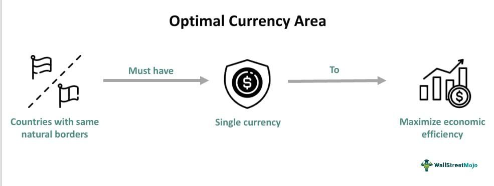

The Optimal Currency Area (OCA) theory, introduced by economist Robert Mundell in 1961, provides a framework for analyzing the conditions under which a group of countries would benefit from sharing a single currency. The theory highlights criteria such as labor mobility, capital mobility, fiscal integration, and synchronized business cycles, all of which are essential for ensuring the success of a monetary union. These factors help mitigate the economic disparities and asymmetric shocks that can arise when multiple countries operate under a unified monetary policy.

When forming a monetary union, it is crucial to consider OCA criteria to enhance economic coordination and stability. A monetary union that fulfills these criteria can reduce transaction costs, foster economic integration, and enhance efficiency across member states. However, if these conditions are not adequately addressed, the union may experience economic imbalances, potentially leading to financial instability and reduced effectiveness of the monetary policy.



Algorithmic trading, characterized by the use of computer algorithms to execute trades at high speed and volume, has become a significant force in global financial markets. Its influence is particularly relevant to monetary unions operating under the OCA framework, as it can impact currency stability and exchange rates both within and across currency areas. The integration of advanced trading technologies introduces new dynamics that member countries must navigate to maintain economic balance and optimize currency areas.

This article aims to explore the intersection of OCA criteria and algorithmic trading in the context of monetary unions. It will examine how the application of algorithmic trading strategies could be aligned with OCA principles to enhance currency stability and economic forecasting within these unions. The importance of optimizing currency areas in this manner cannot be understated, as achieving economic stability and efficiency is vital for the prosperity of member countries in a monetary union. Through this exploration, the discussion will shed light on how modern financial technologies can be used to support the goals of optimal currency areas, offering insights into the pathways countries might pursue to improve or establish successful monetary unions amidst an evolving financial landscape.

## Table of Contents

## Understanding the Optimal Currency Area (OCA) Theory

The Optimal Currency Area (OCA) theory, articulated by Robert Mundell in 1961, is integral to understanding the economic implications of forming monetary unions. It posits that certain regions are better suited to share a common currency if they meet specific criteria. The primary objective of the OCA theory is to identify conditions under which economic efficiencies and stability can be enhanced through a common currency.

**Criteria for an Optimal Currency Area**

1. **Labor Mobility**: One of the main criteria is the free movement of labor across regions. High labor mobility allows adjustments to external shocks that may impact specific areas differently. When workers can move freely to areas with better economic prospects, employment levels across the currency area can be balanced, reducing the strain on individual regions.

2. **Openness and Capital Mobility**: This criterion focuses on the ease with which capital can move across borders and the degree of economic interactions between regions. Open economies with free capital flows allow for better allocation of resources, making it easier to respond to regional asymmetries. Furthermore, greater economic openness often leads to synchronized business cycles, which is beneficial for a shared currency.

3. **Price and Wage Flexibility**: In an optimal currency area, prices and wages need to adjust quickly in response to economic disturbances. Flexibility in wage and price adjustments ensures that imbalances do not lead to prolonged unemployment or inflation. When nominal prices and wages can react without rigidities, the economy can absorb shocks more efficiently without the need for exchange rate adjustments.

4. **Similar Business Cycles**: The convergence of business cycles is essential for reducing the likelihood of asymmetric shocks. If regions within a currency area experience economic expansions and contractions simultaneously, the need for region-specific monetary policies diminishes. Shared economic conditions reinforce the viability of having a single monetary policy.

**Economic Implications of OCA Criteria**

Meeting these criteria determines the feasibility of a successful monetary union. An optimal currency area minimizes the adverse impacts of asymmetric shocks since regions can adjust through labor mobility and flexible prices rather than exchange rate alterations. The fulfillment of OCA criteria also correlates with increased economic stability and efficiency, as regions can leverage shared economic policies to bolster growth.

**Benefits of Forming an Optimal Currency Area**

The adoption of a common currency yields substantial benefits, notably through reduced transaction costs and greater economic integration. Without currency exchange fees and uncertainties, trade between regions becomes more straightforward and cost-effective. This reduction in transaction costs enhances trade fluidity and competitiveness. Furthermore, monetary integration fosters closer economic ties, reducing barriers to trade and investment, and facilitating a more cohesive economic policy environment.

In summary, the OCA theory provides a robust framework for assessing the potential success of monetary unions. By focusing on labor mobility, capital openness, price and wage flexibility, and cyclical convergence, the theory outlines essential conditions under which a common currency becomes advantageous, leading to reduced transaction costs and improved economic integration.

## Monetary Unions and the Importance of OCA Criteria

Monetary unions represent a significant endeavor in international economics, where multiple countries adopt a shared currency, pursuing benefits like enhanced economic integration and minimized transaction costs. Central to the successful formation of these unions is the Optimal Currency Area (OCA) criteria, initially proposed by Robert Mundell. These criteria are pivotal for assessing whether the involved countries possess sufficient economic alignment for a single currency to be beneficial.

### Relationship Between OCA Criteria and Monetary Union Formation

The OCA criteria provide a framework for evaluating the feasibility of a monetary union. Key elements include labor mobility, openness with capital mobility, and price and wage flexibility, ensuring that resources can freely move across borders in response to economic shifts. Additionally, countries should share similar business cycles, meaning that economic downturns and upswings are experienced simultaneously, ensuring uniform responses to fiscal and monetary policies.

### Historical Examples: The Eurozone

A prominent example of a monetary union is the Eurozone, encompassing numerous European nations under the euro. The Eurozone was designed to align with OCA principles, promoting cohesion among member states. For instance, the European Union facilitates labor mobility through policies allowing citizens to work freely across member states. The European Central Bank (ECB) manages monetary policy, aiding capital mobility and influencing price stability.

However, the Eurozone exhibits challenges where not all members are perfectly aligned with OCA criteria. Countries like Greece and Portugal have shown disparities in economic structure and stability compared to more robust economies like Germany and France. These differences highlight the critical nature of aligning OCA criteria before full integration.

### Challenges in Non-Optimal Currency Areas

Countries within a monetary union that do not fully meet OCA criteria face significant hurdles. Discrepancies in labor mobility or business cycles can lead to economic imbalances. Suppose one country faces a recession while others experience growth. In that case, the union's single monetary policy may not address the recessionary needs adequately, creating potential conflict and requiring fiscal transfers or bailouts.

Moreover, asymmetric shocks—economic events affecting members differently—pose risks to stability. For example, a sudden demand shift in external markets disproportionately affecting export-reliant countries can create fiscal stress within the union. Without appropriate adjustment mechanisms, such disparities can magnify economic strain.

### Economic Imbalances and Asymmetric Shocks

Economic imbalances arise when countries with structural differences, like productivity levels or fiscal discipline, share a currency. The absence of independent monetary policies limits their ability to respond individually to economic challenges, leading to potential crises, as observed during the Eurozone sovereign debt crisis.

Addressing asymmetric shocks, monetary unions often require fiscal integration, like a central budget or stabilization fund to support affected areas. However, such solutions necessitate significant political cooperation, which can be challenging given sovereignty concerns and varying fiscal cultures.

In conclusion, the application of OCA criteria is essential in the establishment and operation of monetary unions. Historical instances like the Eurozone illustrate both the potential alignment with these principles and the challenges faced when disparities exist. For a sustainable and efficient monetary union, rigorous adherence to OCA criteria and mechanisms to handle economic imbalances are indispensable.

## Algorithmic Trading in the Context of Currency Areas

Algorithmic trading refers to the use of computer algorithms to automate and optimize trade decisions in the financial markets. By analyzing vast datasets and market conditions at exceptional speeds, [algorithmic trading](/wiki/algorithmic-trading) has significantly transformed financial market operations. This technology is integral to modern trading environments, with its influence extending to currency markets and the broader macroeconomic landscape.

The primary advantages of algorithmic trading include speed, accuracy, and efficiency. Algorithms can execute trades within milliseconds, reacting instantaneously to market shifts, thus providing a competitive edge over traditional methods. This rapid execution minimizes latency, which is crucial in high-frequency trading scenarios where time is directly correlated with profitability. The precision of algorithmic trading also reduces human error, ensuring consistent adherence to predefined strategies and minimizing the risk of emotional decision-making.

Algorithmic trading can profoundly impact exchange rates and currency stability, particularly within monetary unions. By executing trades based on real-time data and predictive modeling, algorithms contribute to determining exchange rates through supply-demand dynamics in the [forex](/wiki/forex-system) markets. This influence can stabilize or destabilize currency values, depending on the extent of algorithmic presence and trading [volume](/wiki/volume-trading-strategy). In monetary unions, where maintaining stable exchange rates is critical, algorithmic trading can aid in harmonizing currency valuations across member states, reducing [volatility](/wiki/volatility-trading-strategies), and enhancing [liquidity](/wiki/liquidity-risk-premium).

However, algorithmic trading also presents both opportunities and risks, especially in non-optimized currency areas. In these regions, where OCA criteria such as labor mobility and economic synchrony are not fully realized, the rapid changes enforced by algorithmic trades can lead to economic imbalances and amplify financial instability. For instance, algorithm-driven trades may exacerbate exchange rate fluctuations in response to asymmetric shocks, placing additional pressure on economies with structural weaknesses.

Opportunities emerge in the form of increased market liquidity and the potential for algorithms to identify [arbitrage](/wiki/arbitrage) opportunities, leading to more integrated and efficient financial markets. Moreover, the use of sophisticated models, including [machine learning](/wiki/machine-learning) techniques, holds promise for improved economic forecasting and policy-making.

Despite these benefits, algorithmic trading also raises concerns regarding market manipulation, systemic risks, and regulatory challenges. High-frequency trading, a subset of algorithmic trading, can sometimes trigger flash crashes—sharp, brief drops in asset prices—that expose weaknesses in financial systems and regulation.

Effective governance is crucial for ensuring that algorithmic trading contributes positively to currency stability. This includes implementing technology-driven oversight mechanisms and developing robust frameworks that balance innovation and stability, particularly within monetary unions. As financial technologies continue to evolve, the integration of algorithmic trading with OCA principles may play an essential role in shaping future economic landscapes.

## Integrating OCA Criteria with Algorithmic Trading Strategies

Algorithmic trading aligns with Optimal Currency Area (OCA) criteria to enhance currency stability by facilitating more efficient and responsive financial markets. Given the dynamic nature of monetary unions, such as the Eurozone, algorithmic trading can incorporate OCA factors into its models to create more robust economic environments.

Algorithmic trading algorithms can be designed to accommodate OCA criteria such as labor mobility, price and wage flexibility, and synchronized business cycles. For instance, labor mobility data can be integrated into trading algorithms to predict labor market shifts and wage adjustments, influencing currency supply and demand aspects. By considering [factor](/wiki/factor-investing) movements and regional economic indicators, algorithmic trading can optimize decision-making processes, providing a responsive buffer to asymmetric economic shocks, thereby contributing to overall currency stability.

Algorithmic trading strategies significantly enhance economic forecasting and decision-making within monetary unions. Algos can process large volumes of economic data in real time, identifying patterns and trends that might elude traditional analysis. This capability enables more accurate forecasts of economic performance, which are critical for policymakers and economists within a monetary union. For example, algorithmic models can incorporate macroeconomic indicators, such as GDP growth rates and employment figures, allowing for predictive analytics that can guide economic and monetary policies.

Big data and machine learning play pivotal roles in refining algorithmic models to better account for OCA factors. Machine learning algorithms can ingest and analyze vast datasets encompassing a range of economic indicators across different regions. Python, with libraries such as TensorFlow or Scikit-learn, is particularly well-suited for this task:

```python
from sklearn.ensemble import RandomForestRegressor
import numpy as np

# Sample dataset: [economic_indicator_1, economic_indicator_2, ..., target_currency_stability]
data = np.array([[5.0, 3.2, 80], [3.5, 2.8, 75], [6.0, 3.1, 85], ...])

X = data[:, :-1]  # Features: economic indicators
y = data[:, -1]   # Target variable: currency stability

# Initialize and fit the model
model = RandomForestRegressor()
model.fit(X, y)

# Predict currency stability
currency_stability_prediction = model.predict([[4.5, 3.0]])
```

By continuously training models with updated data, machine learning systems can adapt to new economic conditions, ensuring that monetary policy adjustments are timely and effective.

Algorithmic trading profoundly impacts central banking policies within monetary unions, which aim to satisfy OCA conditions. Algorithms can provide central banks with valuable insights into market dynamics, helping shape monetary policy to achieve price stability and economic growth. For instance, algorithm-driven insights might prompt central banks to adjust interest rates or conduct open market operations, reducing the likelihood of regional economic imbalances.

In summary, algorithmic trading integrated with OCA criteria provides a sophisticated means to enhance currency stability within monetary unions. By leveraging big data and machine learning, these systems facilitate better economic forecasting and decision-making, aligning monetary policies more closely with the dynamic needs of optimal currency areas.

## Challenges and Future Perspectives

Implementing algorithmic trading within the framework of Optimal Currency Area (OCA) criteria presents several challenges that require careful consideration. A primary challenge is ensuring that algorithmic trading systems adhere to the economic guidelines established for monetary unions defined as optimal currency areas. This involves aligning trading strategies with the fundamental characteristics of these regions, such as synchronized business cycles and stable exchange rates, to prevent market disturbances and ensure economic stability.

Regulatory and ethical considerations play a crucial role in this implementation. Algorithmic trading, characterized by high-frequency trading and complex algorithms, often raises concerns about market fairness, transparency, and the potential for market abuse. Regulatory bodies in monetary unions must establish robust frameworks to ensure these systems operate fairly and do not disproportionately benefit certain market players. Ethical considerations also include issues such as data privacy, the potential for job displacement due to automation, and the need to maintain human oversight over algorithmically-driven decisions.

Looking towards the future, advancements in technology, particularly in machine learning and [artificial intelligence](/wiki/ai-artificial-intelligence) (AI), offer the potential to significantly enhance algorithmic trading strategies in ways that could optimize currency areas. AI-driven models can analyze vast amounts of economic data to predict market trends with improved accuracy, potentially aligning trading strategies more closely with OCA criteria. This data-driven approach could assist in better forecasting economic conditions and smoothing exchange rate volatility within monetary unions.

Nevertheless, integrating AI into algorithmic trading poses its own sets of challenges. These include the complexity of algorithmic models, the risk of model bias, and the need for continuous adaptation to changing market conditions. Moreover, the rapid pace of technological change raises questions about the ability of regulatory frameworks to keep pace with innovation while safeguarding economic stability and ensuring compliance with the principles underpinning optimal currency areas.

The evolving role of AI in financial markets within OCA-based monetary unions could enhance economic efficiencies, both by improving the precision of trade execution and by fostering a deeper understanding of market dynamics through advanced data analytics. As AI technologies mature, they could offer tools that not only enhance trading strategies but also provide insights into managing monetary policy more effectively. For countries looking to establish or optimize currency areas amidst evolving financial technologies, a balanced approach that embraces technological advancements while adhering to OCA principles and regulatory safeguards will be critical.

## Conclusion

The exploration of the Optimal Currency Area (OCA) criteria reveals their critical importance in the structure and functionality of monetary unions. By examining elements such as labor mobility, capital openness, and synchronized business cycles, these criteria serve as foundational components in evaluating the feasibility and success of currency unions. Historical examples, like the Eurozone, underscore how alignment with OCA principles can facilitate economic integration and reduce transaction costs, though they also highlight potential risks related to asymmetric shocks in areas where these criteria are not fully met.

Algorithmic trading emerges as a transformative tool capable of optimizing currency areas and fostering monetary stability. Its advantages in speed, accuracy, and efficiency make it a potent force in financial markets, influencing exchange rates and potentially stabilizing currencies within and across monetary unions. By leveraging algorithmic trading strategies that align with OCA criteria, there is a promising avenue for enhancing economic forecasting and improving decision-making processes within these unions. The integration of big data and machine learning further refines these strategies, enabling more nuanced consideration of key OCA factors.

The combination of OCA criteria with modern trading technologies has broad economic implications. Algorithmic trading, when effectively aligned with these criteria, can not only promote stability but also support central banking policies designed to adhere to OCA conditions. The evolving landscape of artificial intelligence presents additional opportunities to enhance market efficiency and the overall functionality of monetary unions.

Looking ahead, countries aiming to establish or optimize their currency areas must consider both the evolving financial technologies and the enduring relevance of OCA criteria. Balancing these elements will be crucial in navigating future economic developments and achieving optimal currency stability. As technological advancements continue, the potential for creating robust, economically integrated currency areas grows, offering a path toward enhanced global economic stability.

## References & Further Reading

[1]: Mundell, R. A. (1961). ["A Theory of Optimum Currency Areas."](https://www.sfu.ca/~kkasa/mundell_61.pdf) The American Economic Review, 51(4), 657-665.

[2]: De Grauwe, P. (2018). ["Economics of Monetary Union."](https://books.google.com/books/about/Economics_of_Monetary_Union.html?id=gY_UDwAAQBAJ) Oxford University Press.

[3]: Lane, P. R., & Milesi-Ferretti, G. M. (2007). ["The External Wealth of Nations Mark II: Revised and Extended Estimates of Foreign Assets and Liabilities, 1970-2004."](https://www.sciencedirect.com/science/article/pii/S0022199607000591) Journal of International Economics, 73(2), 223-250.

[4]: Lopez de Prado, M. (2018). ["Advances in Financial Machine Learning."](https://www.amazon.com/Advances-Financial-Machine-Learning-Marcos/dp/1119482089) Wiley.

[5]: Aronson, D. R. (2006). ["Evidence-Based Technical Analysis: Applying the Scientific Method and Statistical Inference to Trading Signals."](https://www.amazon.com/Evidence-Based-Technical-Analysis-Scientific-Statistical/dp/0470008741) Wiley.

[6]: Chan, E. P. (2009). ["Quantitative Trading: How to Build Your Own Algorithmic Trading Business."](https://github.com/ftvision/quant_trading_echan_book) Wiley.

[7]: European Central Bank. (2015). ["The International Role of the Euro."](https://www.ecb.europa.eu/pub/pdf/other/euro-international-role-201507.en.pdf) European Central Bank.