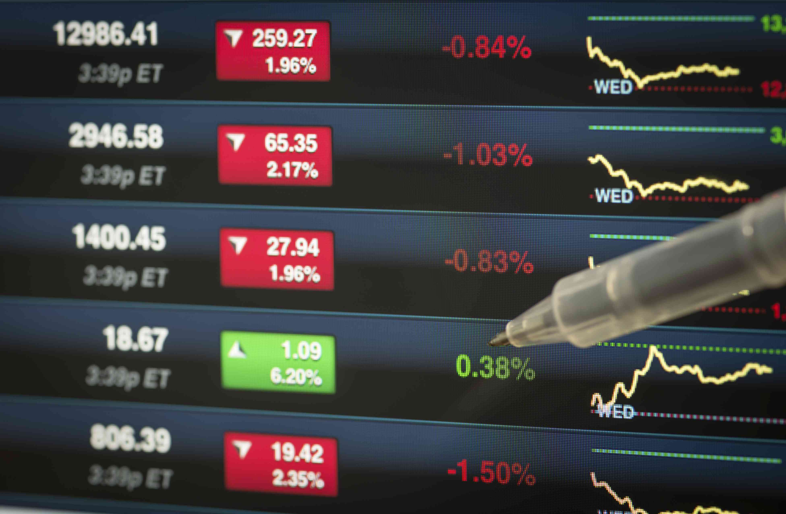

Investment strategies in the stock market have advanced remarkably due to technological progress, with short positions and algorithmic trading standing out as sophisticated techniques used to optimize portfolio performance. Short positions allow investors to profit from declining stock prices by borrowing shares and selling them with the aim of repurchasing at a lower price. Conversely, algorithmic trading leverages computer algorithms to execute trades based on set criteria, analyzing vast datasets to identify profitable opportunities at speeds unmatched by human traders.

These strategies provide valuable insights into market trends and assist investors in making informed decisions. Short selling offers the potential for profit in bearish markets, whereas algorithmic trading enhances trading efficiency and speed, particularly in high-frequency trading scenarios. Both strategies, however, carry inherent risks, necessitating a nuanced understanding and careful implementation. The integration of algorithmic insights with traditional short positions can be particularly powerful, allowing investors to respond adeptly to both bullish and bearish market conditions.



This article investigates into the complexities and potential of these investment techniques, examining their advantages and risks and how they can be effectively incorporated into trading strategies. By comprehending and responsibly deploying short positions and algorithmic trading, investors can significantly enhance their investment portfolios while maintaining ethical trading practices amid evolving market dynamics.

## Table of Contents

## Understanding Short Positions

Short selling is a strategy wherein an investor borrows shares of a stock, sells them at the current market price, and then aims to repurchase the same shares later at a lower price. The investor profits from the difference between the selling price and the buying price if the stock value decreases as anticipated. Key to this process is the expectation of a price decline, which differentiates short selling from traditional buy-and-hold strategies focused on price appreciation.

While short selling can offer substantial rewards, it also harbors significant risks. One major risk is the potential for unlimited losses. If the stock price increases instead of decreases, the investor is compelled to buy back shares at a higher price, leading to a financial loss. Unlike buying stocks, where the maximum loss is limited to the amount invested, short selling presents a scenario where losses could theoretically exceed the initial investment, since stock prices can rise indefinitely.

Several considerations should be accounted for when engaging in short selling. Interest charges come into play because the shares are borrowed, and the lender typically charges interest or fees for the duration of the short sale. Market volatility can also impact the success of a short position; rapid price changes can result in abrupt losses or gains. Therefore, it is crucial for investors to have a well-considered exit strategy to limit potential losses.

Risk management tools such as stop-loss orders are valuable in mitigating the risks associated with short selling. A stop-loss order automatically triggers the purchase of a stock once its price reaches a certain level, thereby protecting the investor from further losses. For instance, if an investor sells a stock short at $50 with a stop-loss set at $55, the position will automatically close if the stock price rises to $55, capping the loss at $5 per share.

These considerations highlight the complexity and risk inherent in short selling, emphasizing the need for educated decision-making and prudent risk management.

 to Algorithmic Trading

Algorithmic trading involves the use of computer algorithms to automatically execute trades based on a set of predefined criteria. These systems are designed to analyze vast amounts of data rapidly, identifying opportunities that might otherwise go unnoticed by human traders. This capability allows [algorithmic trading](/wiki/algorithmic-trading) systems to execute trades with a speed and efficiency unmatched by traditional trading methods, making them particularly popular in high-frequency trading ([HFT](/wiki/high-frequency-trading-strategies)).

High-frequency trading relies on incredibly fast data processing and trade execution to capitalize on small market inefficiencies. The algorithms used in HFT can process trade orders, manage portfolios, and implement complex trading strategies within milliseconds. This capacity to trade rapidly and in large volumes can lead to significant profits, although it also introduces new risks, particularly concerning market stability.

The strategies employed in algorithmic trading are diverse. Arbitrage strategies seek to exploit price discrepancies of the same asset across different markets. For example, if a stock is priced differently on two exchanges, an algorithm might buy the stock on the exchange where it is undervalued and simultaneously sell it where it is overvalued. Trend-following strategies, another common form of algorithmic trading, rely on identifying and investing in the direction of an established market trend. This approach involves statistical analysis of price patterns and market [momentum](/wiki/momentum) indicators.

Market-making is another strategy frequently associated with algorithmic trading. A market-making algorithm places limit orders to buy and sell securities, aiming to profit from the bid-ask spread. By providing [liquidity](/wiki/liquidity-risk-premium) to the markets, market makers benefit from the small, incremental profits from these trades over time. 

Risk management is a critical aspect of algorithmic trading, given its reliance on technology and data. Robust systems are necessary to manage risks such as software errors, hardware failures, and unexpected market changes. Algorithms must be tested thoroughly through [backtesting](/wiki/backtesting)—evaluating the system using historical data to ensure the strategy can withstand various market conditions. Moreover, these systems must be constantly monitored and updated to adapt to new information and changing market dynamics.

Overall, the sophistication and potential of algorithmic trading are immense. When implemented correctly, these systems can significantly enhance trading precision and profitability. However, traders must remain vigilant about the risks and maintain rigorous system checks to maximize the benefits while preserving stability within the financial markets.

## Combining Short Selling with Algorithmic Trading

Integrating short selling with algorithmic trading offers traders a sophisticated approach to maximizing returns during market downturns. This synergy leverages the analytical power of algorithms to efficiently identify and act on short selling opportunities, enabling traders to make informed decisions based on vast amounts of market data.

Algorithms play a pivotal role in this integration by continuously analyzing data streams to detect changes in market sentiment. This dynamic analysis allows for the rapid identification of potential short selling opportunities, as algorithms can be programmed to monitor various indicators and financial metrics. For instance, algorithms can track stock price movements, [volume](/wiki/volume-trading-strategy) changes, and relevant news sentiment to pinpoint stocks that may be overvalued. 

The continuous data analysis capabilities of algorithms are particularly advantageous as they enable them to adjust short positions in real-time. This adaptability is crucial, as market conditions can shift rapidly. By responding promptly to these shifts, algorithms help traders manage their positions effectively, ensuring that they capitalize on both rising and falling market conditions.

Moreover, combining short selling with algorithmic trading enhances risk management strategies. Algorithms can be designed to incorporate precise entry and [exit](/wiki/exit-strategy) points, reducing the risk of substantial losses. This precision in execution is often achieved through stop-loss orders and other automated risk management tools that limit potential downsides. For example, a trader might set an algorithm to close a position if a stock price increases beyond a certain threshold, thus preventing further losses.

The implementation of these strategies can be illustrated through a simple Python algorithm using popular financial data platforms and libraries such as `pandas` and `numpy`:

```python
import numpy as np
import pandas as pd

def identify_short_opportunities(data):
    # Example of using moving averages to identify opportunities
    data['ShortSignal'] = np.where(data['ShortMA'] < data['LongMA'], True, False)
    return data

# Assuming `data` is a DataFrame with stock prices, including short and long moving averages
data = fetch_financial_data('AAPL')  # Placeholder function for fetching data
data = identify_short_opportunities(data)

# Example output
print(data[['Date', 'ShortSignal']])
```

This Python snippet demonstrates a simple moving average crossover strategy to identify potential short selling signals. Traders can automate these checks to continuously adjust their short positions based on the evolving market data.

Ultimately, combining short selling with algorithmic trading necessitates a focus on precise risk management protocols. Traders utilize these algorithms to define strategies that are not only profitable but also sustainable by dynamically setting stop-loss levels and profit targets in response to live market conditions. This ensures a robust approach to trading that maximizes returns while mitigating losses.

## Risk Management in Short Selling and Algo Trading

Effective risk management in both short selling and algorithmic trading is crucial for minimizing losses and maximizing potential profits. Central to this endeavor is setting clear thresholds for acceptable losses and target profits. This involves establishing predefined criteria, such as stop-loss and take-profit orders, which automatically trigger when a certain price is reached, thereby limiting emotional decision-making and enforcing discipline in trading.

Leveraging algorithmic tools enables traders to set these thresholds dynamically based on live market data. Algorithms can be designed to adjust stop-loss levels in response to [volatility](/wiki/volatility-trading-strategies) indicators, like the standard deviation of recent price movements. This dynamic adjustment can be implemented through code, such as in Python, by using libraries like NumPy for real-time data analysis. For example:

```python
import numpy as np

def update_stop_loss(current_price, volatility):
    stop_loss = current_price - (2 * volatility)
    return stop_loss

current_price = 100  # Example stock price
volatility = np.std([99, 101, 98, 102, 100])  # Example of recent price volatility
dynamic_stop_loss = update_stop_loss(current_price, volatility)
```

Diversification of strategies is another essential risk management technique. By spreading investments across various assets and trading strategies, traders can hedge against adverse market conditions that might affect a single security or strategy. This approach reduces the overall risk of the trading portfolio, as losses from one position can potentially be offset by gains in another.

Margins and leveraged trading offer the potential for amplified returns but also come with increased risks of significant losses. Therefore, traders need to closely monitor their margin levels to prevent margin calls, which occur when equity in the trading account falls below the required minimum. Risk can be mitigated by maintaining a buffer above the minimum margin requirements and avoiding excessive leverage.

Continuous backtesting of algorithms plays a vital role in risk management, ensuring that trading strategies remain robust and adaptable to evolving market dynamics. Backtesting involves simulating a trading strategy on historical data to evaluate its performance and refine its parameters. This practice helps identify any weaknesses or limitations before deploying the strategy with real capital.

Overall, effective risk management in short selling and algorithmic trading is a blend of strategic planning, technological tools, and disciplined execution. Traders who successfully integrate these components into their trading practices can better navigate the complexities of the financial markets and safeguard their investments against unexpected challenges.

## Ethical Considerations and Market Impact

The increased reliance on algorithmic trading in financial markets raises significant ethical and market impact concerns. One key issue is the potential for rapid automated trading to contribute to market volatility, as demonstrated by incidents like "flash crashes." Flash crashes occur when automated trading systems, operating at high frequencies and speeds, trigger sudden and drastic price movements. These events can destabilize markets, erode investor confidence, and lead to financial losses. 

To address such vulnerabilities, regulatory bodies have implemented measures designed to prevent manipulative trading practices. These regulations often focus on ensuring market transparency, enforcing trading limits, and requiring detailed reporting of algorithmic trading activities. For instance, the U.S. Securities and Exchange Commission (SEC) and the Commodity Futures Trading Commission (CFTC) have set guidelines that mandate the design and implementation of "kill switches" to halt trading in the event of abnormal activity. Additionally, there are rules in place to scrutinize trading algorithms for patterns indicative of manipulation, such as spoofing or layering.

Investors and firms engaged in algorithmic trading have a responsibility to ensure that their algorithms adhere to these legal standards and do not contribute to market manipulation. This involves rigorous testing and validation of algorithms to confirm their compliance with regulatory frameworks. It is essential that algorithms are programmed to operate within the legal and ethical boundaries, preventing practices that can distort market conditions or create unfair advantages.

Adopting sustainable trading practices is crucial for the long-term success and stability of markets. This entails not only compliance with existing regulations but also fostering a culture of ethical trading that prioritizes market integrity over short-term gains. Sustainable trading practices include incorporating risk management algorithms that consider environmental, social, and governance ([ESG](/wiki/esg-investing)) factors, which can enhance resilience against market shocks and contribute to broader societal goals.

Overall, the interplay of algorithmic trading with ethical considerations and market impact underscores the need for a balanced approach—one that leverages technological advancements while safeguarding the fairness and stability of financial markets. Embracing ethical and responsible trading practices is essential to preserving market integrity and ensuring its continuous evolution in a rapidly changing environment.

## Conclusion

Short positions and algorithmic trading stand as potent tools for modern investors willing to engage with their complexities. Harnessing these strategies necessitates a delicate equilibrium between potential benefits and inherent risks. Short selling allows traders to capitalize on declining markets, yet carries significant risk if market trends reverse unexpectedly. Meanwhile, algorithmic trading leverages technology to execute trades with precision and speed, presenting advantages in market analysis and transaction efficiency.

Successfully deploying these techniques demands rigorous attention to market trends and constant refinement of strategies. The financial landscape is inherently dynamic, requiring investors to stay informed and adapt to shifts swiftly. This adaptability can be achieved through continuous learning and the integration of new data points and market insights into trading algorithms and plans.

Moreover, adherence to ethical and responsible trading practices is essential to maintaining market integrity. While algorithmic trading can boost market liquidity, it also poses challenges such as potential volatility and unfair market conditions if not appropriately regulated. Investors must ensure their algorithms align with legal frameworks and industry standards, thereby avoiding manipulative behaviors.

Ultimately, when executed with precision and integrity, short positions and algorithmic trading can significantly enhance an investment portfolio's performance, fostering both growth and sustainability in the complex world of financial markets.

## References & Further Reading

[1]: Bergstra, J., Bardenet, R., Bengio, Y., & Kégl, B. (2011). ["Algorithms for Hyper-Parameter Optimization."](https://dl.acm.org/doi/10.5555/2986459.2986743) Advances in Neural Information Processing Systems 24.

[2]: ["Advances in Financial Machine Learning"](https://www.amazon.com/Advances-Financial-Machine-Learning-Marcos/dp/1119482089) by Marcos Lopez de Prado

[3]: ["Evidence-Based Technical Analysis: Applying the Scientific Method and Statistical Inference to Trading Signals"](https://www.amazon.com/Evidence-Based-Technical-Analysis-Scientific-Statistical/dp/0470008741) by David Aronson

[4]: ["Machine Learning for Algorithmic Trading"](https://github.com/stefan-jansen/machine-learning-for-trading) by Stefan Jansen

[5]: ["Quantitative Trading: How to Build Your Own Algorithmic Trading Business"](https://github.com/LucindaYa/quant-resources/blob/master/Quantitative%20Trading%20How%20to%20Build%20Your%20Own%20Algorithmic%20Trading%20Business.pdf) by Ernest P. Chan

[6]: Gomber, P., Arndt, B., Lutat, M., & Uhle, T. (2011). ["High-Frequency Trading."](https://papers.ssrn.com/sol3/papers.cfm?abstract_id=1858626) Wirtschaftsinformatik.

[7]: SEC & CFTC. (2010). ["Findings Regarding the Market Events of May 6, 2010."](https://www.sec.gov/about/reports-publications/newsstudies2010marketevents-reportpdf) Report of the Staffs of the CFTC and SEC to the Joint Advisory Committee on Emerging Regulatory Issues.

[8]: Durbin, M. (2010). ["All About High-Frequency Trading."](https://www.amazon.com/All-About-High-Frequency-Trading/dp/0071743448) McGraw-Hill Education.