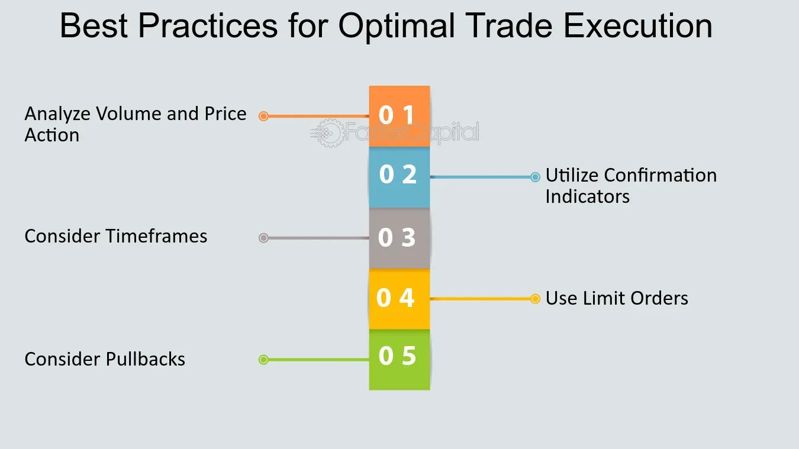

## Table of Contents

## What is an optimal execution strategy?

An optimal execution strategy is a plan to buy or sell a large amount of a financial asset in the best possible way. The goal is to get the best price and minimize the impact on the market. When someone wants to trade a big amount, it can affect the price. If they sell a lot at once, the price might go down. If they buy a lot at once, the price might go up. An optimal execution strategy helps to avoid these problems by breaking the big trade into smaller parts and spreading them out over time.

To create an optimal execution strategy, traders use different methods. They might use computer models to predict how the market will react. They also look at past data to see how similar trades have affected the market before. The strategy can change depending on the asset being traded, the size of the trade, and the current market conditions. The key is to balance getting the best price with minimizing the impact on the market. This way, traders can execute large orders without causing big price changes.

## Why is optimal execution important in trading?

Optimal execution is important in trading because it helps traders get the best price for their trades. When someone wants to buy or sell a large amount of an asset, doing it all at once can change the market price. If they sell a lot quickly, the price might drop. If they buy a lot quickly, the price might rise. By using an optimal execution strategy, traders can break up their big trades into smaller pieces and spread them out over time. This way, they can avoid big price changes and get a better average price for their trade.

Another reason optimal execution is important is that it helps minimize the costs of trading. When traders affect the market price by trading large amounts, they might end up paying more or getting less than they hoped for. This is called market impact cost. By using an optimal execution strategy, traders can reduce these costs. They can plan their trades carefully to make sure they are not causing big swings in the market. This not only saves money but also helps keep the market stable for everyone involved.

## What are the basic principles of optimal execution?

The first basic principle of optimal execution is to minimize market impact. When you trade a big amount of an asset, it can change the price. If you sell a lot at once, the price might go down. If you buy a lot at once, the price might go up. To avoid this, you can break your big trade into smaller pieces and spread them out over time. This way, you won't cause big price changes and you can get a better average price for your trade.

The second principle is to reduce trading costs. When you affect the market price by trading large amounts, you might end up paying more or getting less than you planned. This is called market impact cost. By using an optimal execution strategy, you can plan your trades carefully to keep these costs low. This not only saves you money but also helps keep the market stable for everyone.

The third principle is to use data and models to make smart decisions. Traders use past data to see how similar trades have affected the market before. They also use computer models to predict how the market might react to their trades. By understanding these patterns, traders can choose the best times and ways to execute their trades. This helps them get the best price and minimize the impact on the market.

## How do market conditions affect optimal execution strategies?

Market conditions can change how traders use optimal execution strategies. When the market is very busy and lots of people are trading, it can be harder to buy or sell a big amount without changing the price. In these times, traders might spread their trades out even more to avoid big price changes. But if the market is quiet and not many people are trading, it might be easier to make big trades without affecting the price much. Traders might then choose to do their trades a bit faster.

Different market conditions also affect how traders use data and models to plan their trades. In a stable market, past data and models can be very helpful in predicting how the market will react. But in a fast-changing or unpredictable market, these tools might not be as useful. Traders might need to adjust their strategies quickly to match the new market conditions. This means they have to be flexible and ready to change their plans based on what's happening in the market.

## What are the common types of execution strategies used in trading?

One common type of execution strategy is called the VWAP (Volume Weighted Average Price) strategy. Traders using this strategy try to buy or sell their assets at a price that is as close as possible to the average price of the day. They do this by spreading their trades out over time, matching the volume of trades happening in the market. This helps them blend in with other traders and avoid causing big price changes. The VWAP strategy is useful in markets that are busy and have lots of trading activity.

Another strategy is the TWAP (Time Weighted Average Price) strategy. In this strategy, traders spread their trades evenly over a set period of time. They don't worry about the volume of trades in the market but focus on making sure their trades are spread out evenly. This can be a good strategy in quieter markets where there isn't as much trading activity. By spreading their trades evenly, traders can avoid big price changes and get a better average price for their trades.

A third type of strategy is the iceberg order. This strategy is used when traders want to buy or sell a very large amount of an asset without showing the whole amount to the market. They break their big order into smaller parts and only show a small part at a time. This helps them hide their full trading intentions and avoid causing big price changes. The iceberg order is useful in markets where showing a big order could scare other traders and change the price a lot.

## How does liquidity impact the choice of an execution strategy?

Liquidity, which means how easy it is to buy or sell an asset without changing its price, is very important when choosing an execution strategy. When the market is liquid, it's easier to trade large amounts without causing big price changes. In these cases, traders might choose strategies like VWAP or TWAP because they can spread their trades over time and blend in with other market activity. These strategies work well in liquid markets where there are lots of buyers and sellers.

On the other hand, when the market is not very liquid, it can be harder to trade big amounts without affecting the price. In less liquid markets, traders might need to be more careful and use strategies like iceberg orders. These orders help hide the full size of the trade, so other traders don't see the whole amount and change their behavior. By using iceberg orders, traders can slowly buy or sell their assets without causing big price swings in markets where there aren't many buyers and sellers.

## What role does technology play in implementing optimal execution strategies?

Technology is really important for making optimal execution strategies work well. Computers and special software help traders plan their trades carefully. They use algorithms, which are like step-by-step instructions for a computer, to decide the best times and ways to buy or sell. These algorithms can look at a lot of information very quickly, like past trades and current market conditions, to figure out the best strategy. This helps traders get the best price and avoid causing big price changes in the market.

Another way technology helps is by making trading faster and more accurate. With high-speed internet and trading platforms, traders can send their orders to the market very quickly. This is important because even small delays can affect the price they get for their trades. Technology also helps traders keep an eye on the market all the time. They can use real-time data to change their strategies if the market conditions change suddenly. This makes it easier for them to stick to their optimal execution plans and get the best results.

## How can traders measure the performance of their execution strategies?

Traders can measure the performance of their execution strategies by looking at how close they get to their target price. They set a goal for the price they want to buy or sell at, and then they compare this goal to the actual price they get. If the actual price is very close to the target price, the strategy is working well. Traders also look at the difference between the price they get and the market price at the time of their trade. A smaller difference means the strategy is good at minimizing market impact.

Another way to measure performance is by looking at the costs of trading. Traders keep track of all the costs, like fees and the costs from changing the market price. They want to keep these costs as low as possible. If the costs are low, it means the strategy is working well to save money. Traders also use special numbers called performance metrics, like the Implementation Shortfall, to see how well their strategy is doing. These metrics help them understand if they are getting the best price and keeping costs down.

## What are the challenges faced when implementing optimal execution strategies?

One big challenge when implementing optimal execution strategies is dealing with changing market conditions. The market can be very busy one day and quiet the next. This means traders have to keep changing their strategies to match what's happening in the market. If they don't adjust quickly enough, they might end up buying or selling at bad prices. Another challenge is that the market can be unpredictable. Even with good data and models, it's hard to know exactly how the market will react to a big trade. This makes it tough for traders to plan their trades perfectly.

Another challenge is the cost of technology. Good trading software and fast internet can be expensive. Traders need these tools to make their strategies work well, but the costs can add up. They have to balance the cost of the technology with the benefits it brings. Also, using technology means traders have to trust their algorithms and models. If these tools make a mistake, it can lead to bad trades and losses. So, traders have to be careful and always check their strategies to make sure they are working right.

## How do regulatory requirements influence optimal execution strategies?

Regulatory requirements can change how traders use optimal execution strategies. Rules from places like the SEC or other financial watchdogs can tell traders what they can and can't do when they trade. For example, some rules say traders have to show their full order to the market. This can make it harder to use strategies like iceberg orders, where traders want to hide part of their order. Traders have to follow these rules, even if it means their strategies might not work as well.

These rules also make traders keep good records of their trades. They have to show that they are trying to get the best price and not hurting the market. This means traders need to be careful and keep track of everything they do. Sometimes, the rules can make trading more complicated and costly. But they are there to protect everyone in the market and make sure trading is fair. So, traders have to find a balance between following the rules and making their strategies work well.

## What advanced techniques can be used to optimize execution in high-frequency trading?

In high-frequency trading, one advanced technique to optimize execution is using smart order routing. This means using special software that can quickly send orders to different markets to find the best price. The software looks at prices in many places at the same time and chooses the best one. This helps traders get the best price even when the market is moving very fast. Another technique is using predictive analytics. Traders use computers to look at lots of data and guess what the market will do next. This helps them decide the best times to buy or sell, so they can get the best price and avoid big price changes.

Another technique is algo-trading, where traders use algorithms to make quick decisions. These algorithms can look at the market and make trades in just a few seconds. This is important in high-frequency trading because everything happens so fast. Traders can use these algorithms to break up big trades into small pieces and spread them out over time. This way, they can avoid causing big price changes and get a better average price. All these techniques help traders in high-frequency trading get the best results and stay ahead in the fast-moving market.

## How can machine learning and AI enhance optimal execution strategies?

Machine learning and AI can make optimal execution strategies better by helping traders predict what the market will do next. These smart computer programs can look at a lot of past data to find patterns and guess how prices will change. This helps traders decide the best times to buy or sell their assets. For example, AI can look at how the market reacted to similar trades before and use that information to plan new trades. This way, traders can avoid causing big price changes and get the best price for their trades.

Another way AI and machine learning help is by making trading decisions faster and more accurate. These technologies can process information very quickly and make decisions in just a few seconds. This is important in fast-moving markets where even small delays can affect the price. AI can also keep an eye on the market all the time and change the trading strategy if needed. By using AI, traders can make sure their execution strategies are always working well and getting the best results.

## What are the key components of optimal execution strategies?

Optimal execution strategies in algorithmic trading are designed to minimize market impact and transaction costs while executing large orders. These strategies rely on a set of critical components that are essential for their development and effective functioning.

One fundamental component of optimal execution strategies is the construction of a pricing model that seeks to predict future asset prices with a degree of accuracy. The model assesses market conditions to guide the timing and size of trades to achieve favorable prices. A common approach involves statistical methods and [machine learning](/wiki/machine-learning) algorithms to forecast short-term price movements.

Another key component is the risk management framework which ensures that the algorithm adheres to predefined risk parameters. This includes setting limits on the size of trades, stop-loss thresholds, and ensuring compliance with regulatory standards. Risk management is crucial to prevent large losses and to maintain a stable trading strategy.

Trading infrastructure and technology are essential tools for optimal execution. High-frequency trading ([HFT](/wiki/high-frequency-trading-strategies)) systems that facilitate rapid data processing and order execution are often used. These systems depend on low-latency connections to market data feeds and execution venues to minimize delays and slippage, thus maintaining the price advantage.

Data analysis and processing play an integral role in optimal execution strategies. The quality and timeliness of data directly impact decision-making processes. Techniques such as real-time data monitoring, historical data analysis, and predictive analytics are employed to extract insights and inform execution decisions. Efficient data processing frameworks are necessary to handle large volumes of data and to generate actionable insights promptly.

Mathematically, an optimal execution strategy might aim to minimize a cost function, C(t), which includes both market impact and the opportunity cost of not executing immediately. A simplified version of this would be:

$$
C(t) = \int_{0}^{t} (p(s) - p_0) x(s) \, ds + \lambda \cdot \text{Var}(p(t))
$$

where $p(s)$ is the price at time $s$, $p_0$ is the initial price, $x(s)$ is the execution rate, and $\lambda$ is the risk aversion parameter. The strategy seeks to determine the optimal $x(t)$ that minimizes $C(t)$.

In conclusion, the development of optimal execution strategies relies on an amalgamation of sophisticated pricing models, robust risk management frameworks, advanced technology, and comprehensive data analysis. These components work in harmony to ensure that trading objectives are met efficiently and effectively in the dynamic landscape of financial markets.

## What are Popular Optimal Execution Algorithms?

In the context of optimal execution in algorithmic trading, several popular algorithms are widely recognized for their ability to enhance trade execution efficiency by minimizing market impact and reducing transaction costs. Among these, the Volume Weighted Average Price (VWAP), Time Weighted Average Price (TWAP), and Implementation Shortfall (IS) algorithms play significant roles.

### Volume Weighted Average Price (VWAP)

VWAP is a trading benchmark that represents the average price a security has traded at throughout the day, based on both [volume](/wiki/volume-trading-strategy) and price. It is crucial for assessing the quality of execution. The VWAP formula is expressed as follows:

$$

VWAP = \frac{\sum (Price_i \times Volume_i)}{\sum Volume_i}
$$

where $Price_i$ and $Volume_i$ refer to the price and volume of a security at the ith transaction, respectively.

**Use Case and Benefits**: VWAP is typically used by traders who seek to minimize the market impact of large orders. This algorithm breaks down a large order into smaller ones and executes them incrementally throughout the day, aligning with the prevailing market volume.

**Pros and Cons**: The main advantage of VWAP is that it provides a way to trade large volumes without significantly affecting the market. However, it might not be optimal in volatile markets or when immediate execution is necessary since VWAP trades in line and might miss advantageous price points.

### Time Weighted Average Price (TWAP)

TWAP is a strategy that involves executing trades evenly over a specified time period, focusing on dividing the order equally across the timeframe without considering the market volume.

**Use Case and Benefits**: Suitable for environments where the trader expects market volumes and prices to be relatively stable. Because it is time-focused, TWAP helps to minimize timing risk and provides an average execution price that is unbiased by volume spikes.

**Pros and Cons**: A major advantage of TWAP is its simplicity and effectiveness in stable markets. However, it does not account for sudden changes in market conditions and could lead to less optimal executions during highly volatile periods or in thinly traded securities.

### Implementation Shortfall (IS)

Implementation Shortfall, also known as the slippage strategy, seeks to minimize the difference between the decision price at which trading is desired and the actual execution price. This algorithm measures the costs associated with the execution of an order, which include commissions, fees, and market impact.

**Use Case and Benefits**: IS is beneficial for traders looking to minimize the total cost of a trade, including both explicit and implicit costs. By analyzing the slippage and market impact, IS aims to optimize the trade execution process.

**Pros and Cons**: An advantage of IS is its comprehensive approach to cost measurement, which makes it a valuable tool for performance evaluation. However, its complexity and the necessity for detailed transaction cost analysis can be seen as a downside, requiring sophisticated systems and substantial data for accurate implementation.

In conclusion, the selection of an execution algorithm such as VWAP, TWAP, or IS depends primarily on the trader's objectives and the market conditions. Each has distinct advantages and limitations, making them suitable for different types of trades and market environments.

## References & Further Reading

[1]: Almgren, R., & Chriss, N. (2001). ["Optimal Execution of Portfolio Transactions."](https://smallake.kr/wp-content/uploads/2016/03/optliq.pdf) Journal of Risk, 3(2), 5-39.

[2]: Kissell, R., & Glantz, M. (2003). ["Optimal Trading Strategies: Quantitative Approaches for Managing Market Impact and Trading Risk."](https://archive.org/details/optimaltradingst0000kiss) AMACOM.

[3]: Bertsimas, D., Lo, A. W., & Hummel, P. (1999). ["Optimal Control of Execution Costs."](http://web.mit.edu/dbertsim/www/papers/Finance/Optimal%20control%20of%20execution%20costs.pdf) Journal of Financial Markets, 1(1), 1-50.

[4]: Bouchaud, J. P. (2010). ["Price Impact."](https://arxiv.org/abs/0903.2428) In Encyclopedia of Quantitative Finance, 1356-1363. John Wiley & Sons.

[5]: Gatheral, J. (2010). ["No-Dynamic-Arbitrage and Market Impact."](https://www.tandfonline.com/doi/full/10.1080/14697680903373692) Quantitative Finance, 10(7), 749-759.

[6]: Huberman, G., & Stanzl, W. (2004). ["Price Manipulation and Quasi-Arbitrage."](https://onlinelibrary.wiley.com/doi/abs/10.1111/j.1468-0262.2004.00531.x) Econometrica, 72(4), 1247-1275.

[7]: Kissell, R. (2014). ["The Science of Algorithmic Trading and Portfolio Management."](https://www.sciencedirect.com/book/9780124016897/the-science-of-algorithmic-trading-and-portfolio-management) Academic Press.

[8]: Schied, A., & Schöneborn, T. (2009). ["Risk-Aversion and the Dynamics of Optimal Liquidation Strategies in Limit Order Books."](https://link.springer.com/content/pdf/10.1007/s00780-008-0082-8.pdf) Finance and Stochastics, 13(2), 181-204.

[9]: Cartea, Á., & Jaimungal, S. (2016). ["Algorithmic and High-Frequency Trading."](https://assets.cambridge.org/97811070/91146/frontmatter/9781107091146_frontmatter.pdf) Cambridge University Press.

[10]: Follmer, H., & Schied, A. (2004). ["Stochastic Finance: An Introduction in Discrete Time."](https://link.springer.com/article/10.1007/s00184-007-0164-1) Walter de Gruyter & Co.