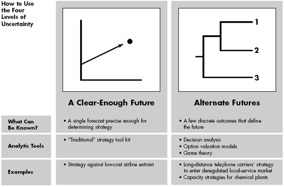

## Table of Contents

## What is meant by 'optimal execution' in the context of uncertainty?

Optimal execution in the context of uncertainty refers to making the best possible decisions and actions when the future is not clear. Imagine you are trying to reach a goal, but you don't know exactly what obstacles you might face along the way. Optimal execution means figuring out the best path to take, given what you know and what you can guess about the future. It's like trying to solve a puzzle with some pieces missing; you use the pieces you have to make the best picture you can.

In practical terms, optimal execution involves using strategies and tools to manage risks and make informed choices. For example, a business might use data analysis and forecasting to plan its next steps, even though it can't predict everything that will happen. The key is to be flexible and ready to adjust plans as new information comes in. By doing this, you can navigate through uncertainty more effectively and increase your chances of reaching your goals successfully.

## Why is uncertainty important to consider in execution strategies?

Uncertainty is important to consider in execution strategies because it helps us prepare for things we can't predict. Life is full of surprises, and if we ignore them, our plans might fail. By thinking about what could go wrong, we can come up with backup plans and be ready to change our approach if needed. This makes our strategies more flexible and stronger, like having a safety net when walking on a tightrope.

Ignoring uncertainty can lead to big problems. If we only plan for the best-case scenario, we might be shocked when something unexpected happens. This can cause us to make hasty decisions or even give up on our goals. By acknowledging uncertainty, we can set realistic expectations and build resilience. This way, we're better equipped to handle whatever comes our way and keep moving forward toward our goals.

## Can you explain the basic principles of decision-making under uncertainty?

Decision-making under uncertainty means making choices when you don't know everything that will happen. It's like trying to guess the weather without a forecast. The first principle is to gather as much information as you can. Even if you can't know everything, knowing some things can help you make better guesses. For example, if you're deciding whether to bring an umbrella, you might look at the sky or check the weather report. This information helps you decide if it's worth the hassle of carrying an umbrella.

The second principle is to think about different possible outcomes and how likely they are. This is called scenario planning. Imagine different ways things could go and decide what you would do in each case. If it might rain, you could plan to carry an umbrella, wear a raincoat, or just take the risk of getting wet. By thinking about these scenarios, you can be ready for whatever happens. It's like playing a game where you try to predict the other player's moves and plan your strategy accordingly.

The third principle is to be flexible and ready to change your plan. Since you can't predict everything, you need to be able to adjust as new information comes in. If you see dark clouds after leaving home without an umbrella, you might decide to find shelter or buy an umbrella on the way. Being able to change your plan helps you handle surprises better. It's like sailing a boat; you need to adjust your sails to the wind to keep moving in the right direction.

## What are some common models used for optimal execution under uncertainty?

One common model for optimal execution under uncertainty is the Stochastic Optimization model. This model helps you make decisions when things are unpredictable. Imagine you're planning a trip but you're not sure about the weather. Stochastic Optimization lets you consider different weather scenarios and choose the best plan for each one. It's like having a backup plan for every possible situation. By using this model, you can make choices that work well no matter what happens.

Another model is the Robust Optimization model. This model focuses on making decisions that will work well even in the worst-case scenarios. Think of it like packing for a trip where you want to be ready for anything. Robust Optimization helps you find a plan that might not be perfect but will still be good enough if things go wrong. It's about being prepared for the unexpected and making sure your plan can handle tough situations.

A third model is the Decision Tree model. This model helps you visualize different choices and their possible outcomes. It's like drawing a map of your journey with different paths you could take. Each branch of the tree represents a decision and what might happen next. By looking at the decision tree, you can see which path might lead to the best result. This model is useful because it helps you think through your options and plan for different possibilities.

## How do different types of uncertainties affect the execution strategy?

Different types of uncertainties can change how you plan and carry out your strategy. One type is known as aleatory uncertainty, which comes from natural randomness, like the weather. When you're dealing with this kind of uncertainty, you need to be ready for anything. You might use models like Stochastic Optimization to plan for different scenarios. For example, if you're planning a picnic, you might check the weather forecast and have a backup plan for rain. This way, you can still have a good time no matter what the weather does.

Another type of uncertainty is epistemic uncertainty, which comes from not knowing enough. This could be because you don't have all the information or because things are changing quickly. When facing this kind of uncertainty, you might use Robust Optimization to make sure your plan can handle surprises. For instance, if you're starting a new business, you might not know how customers will react to your product. By planning for different customer reactions, you can be ready to adjust your strategy as you learn more. This helps you stay on track even when things are uncertain.

## What role does risk management play in optimal execution under uncertainty?

Risk management is really important for making the best choices when things are uncertain. It's like having a safety plan for your journey. Risk management helps you figure out what could go wrong and how bad it could be. By thinking about these risks, you can come up with ways to avoid them or handle them if they happen. For example, if you're planning a trip and you know there might be traffic, you can leave earlier to avoid being late. This way, you're ready for surprises and can still reach your goal.

Using risk management also means you can make smarter choices about what to do next. When you know the risks, you can decide if it's worth taking a chance or if you should play it safe. This helps you keep your plans on track even when things are unpredictable. Imagine you're saving money for a big purchase, but there's a chance you might lose your job. By setting aside some money as a safety net, you can still reach your goal even if the worst happens. Risk management makes your plans stronger and more likely to succeed.

## How can one measure the performance of an execution strategy under uncertainty?

Measuring the performance of an execution strategy under uncertainty means looking at how well your plan works when things don't go as expected. One way to do this is by using key performance indicators (KPIs). These are like checkpoints that tell you if you're on the right track. For example, if your goal is to save money, you might check how much you've saved each month. If your plan is working well, you should see progress even if unexpected things happen, like a surprise expense.

Another way to measure performance is by comparing different scenarios. You can look at what would have happened if you had chosen a different path. This helps you see if your plan is better than other options. For instance, if you're trying to grow a garden, you might compare how well your plants are doing with how they would have done if you had used a different type of soil. By doing this, you can tell if your strategy is helping you handle uncertainty better than other strategies.

## What are the latest algorithms or techniques used for optimizing execution under uncertainty?

One of the latest techniques for optimizing execution under uncertainty is reinforcement learning. This is a type of artificial intelligence where a computer learns by trying different actions and seeing what works best. Imagine you're playing a game and trying to figure out the best moves. Reinforcement learning is like the computer playing the game over and over, getting better each time by learning from its mistakes. This technique is really helpful for making decisions when you don't know everything that will happen because it can adapt to new situations as they come up.

Another technique is called Monte Carlo Tree Search. This method is great for planning ahead when things are uncertain. It works by imagining lots of different ways the future could go and figuring out which choices lead to the best results. Think of it like playing chess and trying to predict your opponent's moves. Monte Carlo Tree Search helps you explore all the possible moves and pick the one that gives you the best chance of winning, even if you can't see the whole board. Both of these techniques help you make better decisions and stay on track toward your goals, no matter what surprises come your way.

## Can you discuss case studies where optimal execution under uncertainty has been successfully implemented?

One great example of optimal execution under uncertainty is how Amazon manages its supply chain. Amazon deals with a lot of uncertainty because it's hard to predict exactly what people will buy and when. They use a technique called stochastic optimization to plan their inventory. This means they look at different scenarios of what might happen and plan their stock levels accordingly. For example, if there's a big sale coming up, they might order more of certain items to be ready for a rush of orders. By doing this, Amazon can keep its customers happy and avoid running out of popular products, even when things don't go as planned.

Another case study is how the energy company, Enel, uses robust optimization to manage its renewable energy sources. Renewable energy, like wind and solar power, can be unpredictable because it depends on the weather. Enel uses robust optimization to make sure it can still provide power even if the wind doesn't blow or the sun doesn't shine as expected. They plan for the worst-case scenarios, like a week with no wind, and make sure they have backup plans in place. This way, they can keep the lights on for their customers no matter what the weather does. By being ready for surprises, Enel can keep its energy supply stable and reliable.

## How do regulatory frameworks influence strategies for optimal execution under uncertainty?

Regulatory frameworks can really change how businesses plan and carry out their strategies when things are uncertain. These rules set by governments or other authorities can limit what a company can do. For example, if there are strict rules about how much pollution a factory can make, the company has to plan around those limits. This means they might need to use different methods or technologies to meet the rules, even if they're not sure how well those methods will work. By following these regulations, companies can avoid fines and keep their operations running smoothly, even when things don't go as planned.

On the other hand, regulatory frameworks can also help companies by giving them clear guidelines to follow. When businesses know what the rules are, they can plan better for different situations. For instance, if there are clear rules about safety in a workplace, a company can make sure it has the right safety measures in place. This helps them be ready for unexpected events, like accidents, and handle them well. By understanding and following the regulations, companies can make their strategies stronger and more likely to succeed, even in uncertain times.

## What are the challenges in real-time decision-making for optimal execution under uncertainty?

Real-time decision-making for optimal execution under uncertainty can be really tough because you have to make choices quickly without knowing everything that will happen. Imagine you're driving in a busy city and you need to decide which way to turn at a busy intersection. You don't have time to think about all the possible scenarios, so you have to use the information you have right now to make the best choice. This can be stressful because if you make the wrong turn, you might get stuck in traffic or miss your destination. The challenge is to stay calm and use the tools and information you have to make a good decision fast.

Another challenge is that things can change quickly, so you need to be ready to adjust your plan on the fly. For example, if you're managing a stock portfolio, the market can go up and down in seconds. You need to keep an eye on what's happening and be ready to buy or sell at the right moment. This means you have to be flexible and able to change your strategy as new information comes in. It's like playing a fast-paced game where you need to react quickly to what's happening around you. By staying alert and ready to adapt, you can make better decisions even when things are uncertain.

## How does machine learning enhance the ability to achieve optimal execution under uncertainty?

Machine learning helps make better decisions when things are uncertain by finding patterns in data that humans might miss. Imagine you're trying to predict the weather. You can look at the sky and guess, but machine learning can look at tons of past weather data and find patterns that help it predict rain more accurately. It's like having a super smart friend who can see things you can't. By using machine learning, businesses and people can make choices based on more information, which helps them handle surprises better. For example, a company might use machine learning to predict how much of a product to make, so they don't run out or make too much, even if they're not sure how many people will buy it.

Another way machine learning helps is by learning from mistakes and getting better over time. Think of it like playing a video game where you get better each time you play. Machine learning algorithms can try different strategies and see which ones work best. If something goes wrong, they can learn from it and do better next time. This is really helpful for making decisions in real-time because the algorithms can adapt quickly to new information. For instance, if a self-driving car faces a sudden obstacle, machine learning can help it decide the best way to react based on what it has learned from past experiences. By constantly learning and adapting, machine learning makes it easier to navigate through uncertainty and reach your goals.

## References & Further Reading

[1]: Kissell, R. (2013). ["The Science of Algorithmic Trading and Portfolio Management"](https://www.sciencedirect.com/book/9780124016897/the-science-of-algorithmic-trading-and-portfolio-management). Academic Press.

[2]: Lopez de Prado, M. (2018). ["Advances in Financial Machine Learning"](https://books.google.com/books/about/Advances_in_Financial_Machine_Learning.html?id=oU9KDwAAQBAJ). Wiley.

[3]: Chan, E. P. (2009). ["Quantitative Trading: How to Build Your Own Algorithmic Trading Business"](https://github.com/egorpe/EPChan-QuantitativeTrading/blob/master/example7_6.m). Wiley.

[4]: Jansen, S. (2020). ["Machine Learning for Algorithmic Trading."](https://github.com/stefan-jansen/machine-learning-for-trading) Packt Publishing.

[5]: Aldridge, I. (2013). ["High-Frequency Trading: A Practical Guide to Algorithmic Strategies and Trading Systems"](https://www.amazon.com/High-Frequency-Trading-Practical-Algorithmic-Strategies/dp/1118343506). Wiley Finance.

[6]: Aronson, D. R. (2007). ["Evidence-Based Technical Analysis: Applying the Scientific Method and Statistical Inference to Trading Signals"](https://onlinelibrary.wiley.com/doi/book/10.1002/9781118268315). Wiley.

[7]: Bouchaud, J. P., & Potters, M. (2003). ["Theory of Financial Risk and Derivative Pricing: From Statistical Physics to Risk Management"](https://www.cambridge.org/core/books/theory-of-financial-risk-and-derivative-pricing/5BBBA04CE72ED9E5E7C1C028D9A94FCB). Cambridge University Press.