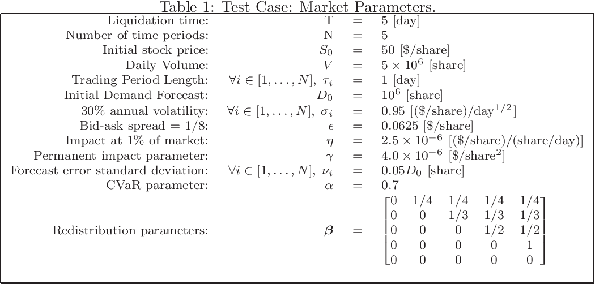

Algorithmic trading, a prominent advancement in modern financial markets, has fundamentally transformed how trades are executed by providing unprecedented levels of efficiency and precision. This method leverages complex algorithms and vast computational power to automate trading decisions, minimizing human intervention and error. One particularly crucial aspect of algorithmic trading is optimal execution under uncertainty, which focuses on reducing the costs and risks associated with executing large orders that can significantly impact market prices.

In financial markets that are often unpredictable and volatile, achieving optimal execution requires deploying sophisticated algorithms capable of dynamically adjusting to real-time data and uncertain conditions. These algorithms must be adept at processing large volumes of market data instantaneously, allowing traders to make informed decisions that reflect current market states.



This article examines the array of techniques and strategies applied to attain optimal execution within this uncertain landscape of financial trading. Various challenges, such as market volatility and liquidity fluctuations, are addressed, and the methodologies to combat these challenges are discussed. The emphasis remains on understanding how traders and investors can leverage these strategies to mitigate risks and enhance financial gains. By exploring both technological advancements and the requisite ethical considerations, this article aims to provide a comprehensive overview of the implications and future directions of algorithmic trading.

## Table of Contents

## What is Optimal Execution?

Optimal execution is a critical aspect of algorithmic trading, focusing on executing trade orders to minimize costs and maximize efficiency. This process becomes especially important when dealing with large volumes that have the potential to affect market prices. The fundamental objective in optimal execution is to achieve the most favorable trade execution outcomes given the prevailing market conditions, which are typically characterized by uncertainty and volatility.

To achieve optimal execution, traders employ strategies that carefully balance elements such as trading speed, market impact, and price volatility. These strategies are designed to reduce slippage, which occurs when the difference between the expected price and the actual executed price of a trade increases. Additionally, mitigating adverse price movements is crucial as these can significantly impact the profitability of trades.

Optimal execution hinges on sophisticated algorithms capable of processing vast amounts of market data in real-time. These algorithms make precise and informed decisions, leveraging various data analysis techniques. For instance, historical data analysis enables the algorithm to understand past trading patterns and price behaviors, providing a foundation for predictive modeling that anticipates future market movements.

Moreover, real-time adjustment capabilities are integral to these sophisticated algorithms, allowing them to dynamically respond to sudden changes in market conditions. This adaptability is essential in minimizing risks and capitalizing on favorable trading opportunities as they arise. Advanced algorithms often employ predictive modeling techniques, such as [machine learning](/wiki/machine-learning) algorithms, to forecast market trends and make informed predictions about future price movements.

An example of a Python implementation for such predictive modeling might involve machine learning libraries such as scikit-learn or TensorFlow. Consider a simple linear regression model used for predictive analysis:

```python
from sklearn.model_selection import train_test_split
from sklearn.linear_model import LinearRegression
import numpy as np

# Example dataset
X = np.array([[1, 2], [2, 3], [3, 4], [4, 5]])
y = np.array([2, 3, 4, 5])

# Splitting the dataset into training and testing sets
X_train, X_test, y_train, y_test = train_test_split(X, y, test_size=0.2, random_state=42)

# Creating and training the linear regression model
model = LinearRegression()
model.fit(X_train, y_train)

# Making predictions
predictions = model.predict(X_test)

print("Predicted values:", predictions)
```

Such models, while simplistic in this form, illustrate the process of using historical data to make predictions about future outcomes, an essential element of optimal execution in [algorithmic trading](/wiki/algorithmic-trading). By continuously analyzing new data, these algorithms can adjust their strategies to optimize execution in the ever-changing landscape of financial markets.

## Challenges of Uncertainty in Algo Trading

Uncertainty in algorithmic trading arises from various factors, most notably market [volatility](/wiki/volatility-trading-strategies), news events, and fluctuations in market [liquidity](/wiki/liquidity-risk-premium). These elements introduce complexities that challenge traders in executing trades effectively. Market volatility, characterized by rapid and unpredictable price changes, directly impacts trading strategies by potentially deviating expected price movements. This volatility can lead to significant discrepancies in trade execution, affecting overall outcomes.

One critical issue traders face is the risk of slippage. Slippage occurs when there is a difference between the anticipated price of a trade and the actual price at which the trade is executed. This discrepancy typically arises due to sudden market shifts—resulting from either high volatility or insufficient liquidity—that hinder the ability of trading algorithms to execute orders at desired prices.

Large orders represent another significant challenge, as their sheer size can inadvertently influence market movements. Executing substantial trade volumes can lead to a temporary scarcity in available market liquidity, causing prices to shift away from the trader's favorable position, thus necessitating strategic adjustments. To mitigate this, traders often employ order-slicing techniques, breaking down large orders into smaller executions over time to lessen market impact.

The development and refinement of algorithms to handle these uncertainties are essential for attaining optimal execution. Algorithms must be capable of dynamically adjusting in response to real-time data. This is achieved through advanced modeling techniques, such as statistical [arbitrage](/wiki/arbitrage) and machine learning, which process historical and real-time market data to predict potential market movements and adapt trading strategies accordingly.

For example, here is a simplified Python code snippet utilizing a basic moving average crossover strategy to demonstrate how algorithms might respond to price changes:

```python
import numpy as np

def moving_average(data, window_size):
    return np.convolve(data, np.ones(window_size), 'valid') / window_size

def execute_trade(prices, short_window, long_window):
    short_ma = moving_average(prices, short_window)
    long_ma = moving_average(prices, long_window)

    signals = np.zeros(len(prices))
    signals[short_window:] = np.where(short_ma > long_ma[long_window - short_window:], 1.0, 0.0)

    return signals

prices = [100, 102, 101, 105, 107, 110, 108, 109, 111, 112]
signals = execute_trade(prices, short_window=2, long_window=5)

print(signals)  # Example output indicating buy/sell signals
```

In this simplified illustration, a moving average crossover triggers buy or sell signals based on price movements, showcasing the basic principle of adapting to market fluctuations. The complexity and capability of real-world algorithms far exceed this example, involving multifaceted analysis and instantaneous adjustments.

To achieve optimal execution, traders must surmount these challenges by integrating advanced analytics and adaptive algorithms, ensuring trade executions are both efficient and aligned with desired outcomes amidst unpredictability.

## Strategies for Optimal Execution

One common strategy in algorithmic trading for achieving optimal execution is the technique known as slicing, which involves breaking large trade orders into smaller, more manageable orders. This approach minimizes market impact by distributing the trades over time or across different trading venues, thereby preventing significant price fluctuations that might occur with the execution of a large block of shares.

The Volume Weighted Average Price (VWAP) is frequently used as a benchmark for assessing optimal execution. VWAP is calculated by dividing the total dollar value of trades by the total [volume](/wiki/volume-trading-strategy) of shares traded during a particular time frame. The objective for traders is to execute orders at prices close to or better than the VWAP, ensuring that trades are reflective of the average price and reducing transaction costs.

Implementation Shortfall strategies address the difference between the price at the time of the trading decision and the actual execution price. This difference, known as slippage, takes into account factors such as market volatility and other costs. To minimize this shortfall, algorithms can dynamically adjust order sizes and execution speeds based on current market conditions.

Real-time data analytics and machine learning play a crucial role in refining these strategies. By continuously analyzing incoming market data, algorithms can predict short-term price movements and adapt their execution strategies accordingly. Machine learning models are particularly adept at recognizing patterns and making rapid predictions, allowing for responsive adjustments in trading tactics.

Risk management is an integral part of achieving optimal execution under uncertainty. Strategies such as setting stop-loss orders and dynamically adjusting trading parameters are essential for mitigating the risks associated with volatile markets. These measures help safeguard against significant adverse price movements, ensuring that the execution of trades does not exceed predefined risk thresholds.

Incorporating these strategies within algorithmic trading frameworks enhances their effectiveness, allowing traders to navigate complex and uncertain market environments while optimizing their execution outcomes.

## Technological Advancements in Algo Trading

Advancements in technology have significantly enhanced the capabilities of algorithmic trading systems, providing faster processing speeds and improved data handling. Machine learning and [artificial intelligence](/wiki/ai-artificial-intelligence) (AI) are at the forefront of this technological evolution, playing a crucial role in optimizing trading algorithms. These technologies enable the development of predictive models and adaptive learning systems that can assess market conditions and adjust trading strategies accordingly. Machine learning algorithms, such as neural networks and decision trees, can identify patterns and trends in historical data, allowing traders to make informed predictions and decisions.

Cloud computing and big data analytics further empower traders by providing the infrastructure necessary to access, process, and analyze vast amounts of market data. These technologies offer scalable and cost-effective solutions for handling the immense volume of data generated daily by financial markets. By leveraging cloud-based platforms, traders can deploy sophisticated algorithms with high computational demands, ensuring they operate efficiently without the need for costly on-premises hardware.

High-frequency trading ([HFT](/wiki/high-frequency-trading-strategies)) is another area benefiting from these technological advancements. HFT firms utilize cutting-edge hardware and software to execute trades at extremely high speeds, often in microseconds. These trades capitalize on minimal price differences, exploiting market inefficiencies before they vanish. The speed and volume of transactions in HFT require technologies that minimize latency, such as proximity hosting and ultra-fast communication networks.

Blockchain technology is an emerging trend with potential implications for algorithmic trading. As a decentralized and secure ledger system, blockchain can enhance the transparency and security of financial transactions, reducing the risks associated with intermediaries. The integration of blockchain with algorithmic trading platforms could streamline settlement processes and improve the reliability of trade execution.

Decentralized finance (DeFi) is another trend redefining the landscape of financial markets. DeFi leverages blockchain technology to create open and permissionless financial systems, offering new opportunities for algorithmic traders. This paradigm shift could lead to innovative financial products and trading strategies, expanding the scope of algorithmic trading beyond traditional markets.

In summary, technological advancements such as machine learning, cloud computing, big data analytics, and blockchain are transforming algorithmic trading. By enhancing speed, accuracy, and reliability, these technologies enable traders to execute optimal strategies in complex and uncertain market environments.

## Implications for Traders and Investors

Algorithmic trading strategies, when effectively employed, can revolutionize trading outcomes for both traders and investors by achieving optimal execution. By minimizing transaction costs and maximizing efficiency, these strategies can substantially enhance returns. The successful application of algorithmic trading relies on a thorough understanding of the inherent uncertainties in market operations and the ability to manage them effectively. Unpredictable factors such as market volatility, liquidity changes, and external economic events can dramatically influence trading outcomes. Traders and investors must develop and deploy algorithms that are resilient and adaptable to these uncertainties to maintain a competitive edge and ensure profitability.

Technological advancements play a crucial role in shaping and improving algorithmic trading strategies. Traders and investors must continuously update themselves on innovations such as machine learning, artificial intelligence, and advanced data analytics, which enhance the predictive and adaptive capabilities of trading algorithms. This continuous learning and adaptation are essential in keeping pace with rapid changes in market structure and dynamics.

Ethical considerations in algorithmic trading are paramount to fostering trust and integrity in financial markets. Practices such as market manipulation can lead to unfair advantages and disrupt market fairness. It is essential for traders and investors to adhere to ethical standards, ensuring that trading activities do not undermine market integrity. Transparency in trading algorithms and adherence to ethical guidelines can help mitigate the risk of regulatory actions and reputational harm.

As algorithmic trading evolves, regulatory frameworks must adapt to new developments and emerging risks. Regulators need to ensure that the regulatory environment is robust enough to address potential risks associated with algorithmic trading, such as systemic risk and market manipulation, while also fostering innovation. A balance must be struck between ensuring market stability and encouraging technological advancements that improve efficiency and market participation.

In summary, traders and investors leveraging algorithmic trading strategies for optimal execution stand to gain significant financial advantages. However, success requires a comprehensive approach that involves understanding and managing market uncertainties, staying abreast of technological innovations, adhering to ethical principles, and navigating the evolving regulatory landscape. These factors are integral to achieving sustainable profitability and maintaining a competitive position in today’s dynamic financial markets.

## Conclusion

Optimal execution under uncertainty is a fundamental component of successful algorithmic trading strategies. By leveraging advanced technologies and sophisticated algorithms, traders can effectively navigate the complexities and uncertainties of the market. These systems employ techniques such as predictive modeling and real-time data analysis, which enable them to adjust trading strategies dynamically in response to fluctuating market conditions. This adaptability is vital in reducing the impact of unforeseen events and minimizing costs associated with large order execution.

Continuous adaptation and innovation are essential for achieving optimal execution and staying competitive in an ever-evolving financial landscape. As new technologies and trading platforms emerge, traders must be agile, refining their algorithms to integrate the latest advancements in machine learning, data analytics, and computational power. By conducting regular reviews and updates to these systems, traders not only enhance their performance but also ensure they remain at the forefront of algorithmic trading developments.

As the industry progresses, understanding and implementing these strategies will continue to be a crucial aspect of trading and investment decisions. Market participants must remain vigilant, keeping abreast of regulatory changes and ethical considerations that may influence trading practices. Additionally, as financial markets become increasingly interconnected, the need for robust, scalable, and reliable trading algorithms becomes even more pronounced. In summary, the pursuit of optimal execution under uncertainty requires a commitment to ongoing learning and adaptation, ensuring sustained success in the highly competitive financial markets.

## References & Further Reading

[1]: Kissell, R. (2013). ["The Science of Algorithmic Trading and Portfolio Management"](https://www.sciencedirect.com/book/9780124016897/the-science-of-algorithmic-trading-and-portfolio-management). Academic Press.

[2]: Lopez de Prado, M. (2018). ["Advances in Financial Machine Learning"](https://books.google.com/books/about/Advances_in_Financial_Machine_Learning.html?id=oU9KDwAAQBAJ). Wiley.

[3]: Chan, E. P. (2009). ["Quantitative Trading: How to Build Your Own Algorithmic Trading Business"](https://github.com/egorpe/EPChan-QuantitativeTrading/blob/master/example7_6.m). Wiley.

[4]: Jansen, S. (2020). ["Machine Learning for Algorithmic Trading."](https://github.com/stefan-jansen/machine-learning-for-trading) Packt Publishing.

[5]: Aldridge, I. (2013). ["High-Frequency Trading: A Practical Guide to Algorithmic Strategies and Trading Systems"](https://www.amazon.com/High-Frequency-Trading-Practical-Algorithmic-Strategies/dp/1118343506). Wiley Finance.

[6]: Aronson, D. R. (2007). ["Evidence-Based Technical Analysis: Applying the Scientific Method and Statistical Inference to Trading Signals"](https://onlinelibrary.wiley.com/doi/book/10.1002/9781118268315). Wiley.

[7]: Bouchaud, J. P., & Potters, M. (2003). ["Theory of Financial Risk and Derivative Pricing: From Statistical Physics to Risk Management"](https://www.cambridge.org/core/books/theory-of-financial-risk-and-derivative-pricing/5BBBA04CE72ED9E5E7C1C028D9A94FCB). Cambridge University Press.