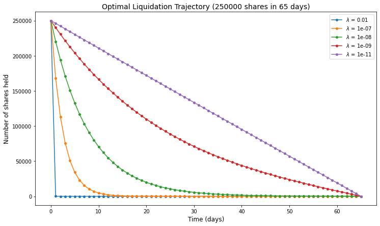

## Table of Contents

## What is optimal execution?

Optimal execution is about finding the best way to buy or sell a large amount of stocks or other financial assets. When you have a big order, you can't just do it all at once because it might affect the market price too much. So, you need a plan to spread out the order over time or through different ways to get the best price possible.

This process involves using special computer programs and math models to figure out the best strategy. These models look at things like how the market is moving, how much the price might change, and how other people are trading. The goal is to finish the order without making the price go up or down too much, so you end up paying less or getting more money for your trade.

## Why is optimal execution important in trading?

Optimal execution is really important in trading because it helps traders get the best price when they are buying or selling a lot of stocks or other financial stuff. If you have a big order, doing it all at once can make the price move a lot, which is not good for you. By using optimal execution, you can break up your big order into smaller pieces and spread them out over time or use different ways to trade. This way, you don't cause a big change in the price, and you can end up paying less or getting more money for your trade.

Another reason optimal execution matters is that it helps traders save money on trading costs. When you trade, you have to pay fees and other costs, and these can add up if you're not careful. Optimal execution uses smart computer programs and math to figure out the best way to trade, so you can keep these costs down. This means more money stays in your pocket at the end of the day, which is always a good thing.

## What are the key factors affecting optimal execution?

Several things can affect how well you can execute a big trade. One big factor is how much the market is moving around. If prices are jumping up and down a lot, it can be harder to buy or sell without making the price move even more. Another factor is how much you're trying to trade. If it's a really big order, it can be tough to do it without affecting the price, so you need to be careful and maybe spread it out over time.

Another thing that matters is how other people are trading. If lots of other traders are buying or selling the same thing at the same time, it can push the price up or down. You also need to think about the costs of trading, like fees and other charges. These can eat into your profits, so you want to keep them as low as possible. Using smart computer programs and math models can help you figure out the best way to trade, taking all these things into account.

Lastly, the type of asset you're trading can make a difference too. Some things, like stocks, might be easier to trade without affecting the price too much, while others, like less common assets, can be trickier. Knowing the market well and using the right tools can help you handle all these factors and get the best possible price for your trade.

## How does market liquidity impact optimal execution strategies?

Market liquidity is how easy it is to buy or sell something without moving the price too much. When the market is very liquid, there are lots of people buying and selling, so you can usually trade big amounts without making the price jump around. This makes it easier to use optimal execution strategies because you can break up your big order into smaller pieces and spread them out without worrying too much about the price changing a lot. In a liquid market, you can also find more ways to trade, like using different trading platforms or times, which can help you get the best price.

On the other hand, if the market is not very liquid, it's harder to trade big amounts without affecting the price. When you try to buy or sell a lot in a less liquid market, you might end up moving the price against you, which means you'll pay more or get less money for your trade. In these situations, optimal execution strategies need to be more careful. Traders might need to spread their orders out over a longer time or use special trading methods to try and hide their big orders from the market. This can make the whole process more complicated and risky, but it's important to do it right to get the best price possible.

## What are the different types of optimal execution algorithms?

There are several types of optimal execution algorithms that traders use to make sure they get the best price when buying or selling a lot of stocks or other financial stuff. One common type is the Volume Weighted Average Price (VWAP) algorithm. This one tries to match the average price of the asset over the day, so you end up paying or getting a price that's close to what everyone else is paying or getting. Another type is the Time Weighted Average Price (TWAP) algorithm. This one spreads out your order evenly over time, so you don't buy or sell too much at once and make the price move a lot.

Another type of algorithm is the Implementation Shortfall (IS) algorithm. This one tries to minimize the difference between the price you actually get and the price you would have gotten if you had traded right away. It's a bit more complex because it takes into account how the market is moving and tries to predict the best times to trade. There's also the Percentage of Volume (POV) algorithm, which trades a set percentage of the total market volume. This can be useful if you want to make sure your trades don't take up too much of the market and move the price.

Lastly, there are more advanced algorithms like the Adaptive algorithm, which changes its strategy based on what's happening in the market. If the market gets more or less liquid, or if prices start moving a lot, the algorithm can adjust how it's trading to try and get the best price. All these different types of algorithms help traders handle big orders in a smart way, so they can get the best price without causing too much trouble in the market.

## How do transaction costs influence optimal execution?

Transaction costs are a big deal when it comes to optimal execution. These costs include things like trading fees, taxes, and other charges you have to pay when you buy or sell stocks or other financial stuff. If these costs are high, it can eat into your profits, so you want to keep them as low as possible. Optimal execution strategies use smart computer programs and math to figure out the best way to trade, so you can save money on these costs. For example, if you break up a big order into smaller pieces and spread them out over time, you might be able to pay less in fees and get a better price overall.

Another way transaction costs affect optimal execution is by making traders think more about how they trade. If the costs are high, traders might decide to use different types of algorithms or trading methods to try and save money. For instance, they might use a VWAP or TWAP algorithm to spread out their trades and avoid paying high fees all at once. By being careful about transaction costs and using the right strategies, traders can make sure they get the best price for their trades and keep more money in their pockets at the end of the day.

## What role does timing play in achieving optimal execution?

Timing is super important when you're trying to get the best price for a big trade. If you do everything at once, you might make the price go up or down a lot, which isn't good for you. So, you need to spread out your trade over time. This way, you can buy or sell without causing a big change in the price. For example, if you know that the market is usually less busy in the morning, you might decide to do some of your trading then to avoid moving the price too much.

Using the right timing also helps you save money on trading costs. If you spread out your trades, you might be able to pay less in fees and other charges. Some traders use special computer programs, like VWAP or TWAP algorithms, to figure out the best times to trade. These programs look at how the market is moving and try to find the best moments to buy or sell. By being smart about when you trade, you can get a better price and keep more money in your pocket at the end of the day.

## How can one measure the effectiveness of an optimal execution strategy?

Measuring the effectiveness of an optimal execution strategy involves looking at how well it achieves its goals. One way to do this is by comparing the actual price you got for your trade with a benchmark price, like the VWAP or TWAP. If your price is close to or better than the benchmark, it means your strategy worked well. Another way is to look at the costs of trading, like fees and other charges. If your strategy helped you keep these costs low, it's a sign that it was effective. You can also check how much the price moved while you were trading. If the price didn't change much, it means your strategy was good at hiding your big order from the market.

Another important measure is the implementation shortfall, which is the difference between the price you actually got and the price you would have gotten if you had traded right away. A smaller implementation shortfall means your strategy did a good job of minimizing the impact of your trade on the market. It's also helpful to look at how your strategy performed over time. If it consistently gives you good results, it's a sign that it's effective. By using these different measures, you can get a clear picture of how well your optimal execution strategy is working and make changes if needed to improve it.

## What are the common challenges faced in implementing optimal execution?

One big challenge in implementing optimal execution is dealing with market volatility. When prices are jumping around a lot, it's hard to trade a big order without making the price move even more. This can make it tough to get the best price, and you might end up paying more or getting less money than you wanted. Another challenge is figuring out how to spread out your order over time. If you do it wrong, you might still cause the price to change too much, or you might miss out on good trading opportunities.

Another common issue is managing transaction costs. These costs can add up quickly, and if you're not careful, they can eat into your profits. Finding the right balance between trading quickly and keeping costs low can be tricky. Also, choosing the right algorithm for your trade can be challenging. Different algorithms work better in different situations, so you need to pick the one that fits your needs. If you pick the wrong one, you might not get the best results.

## How do regulatory requirements affect optimal execution practices?

Regulatory requirements can have a big impact on how traders use optimal execution practices. These rules are made to make sure that trading is fair and open, and they can change how traders need to do their trades. For example, some rules might say that you have to report your trades in a certain way or that you can't do certain types of trades. This means traders have to be careful and make sure they follow these rules while still trying to get the best price for their trades. If they don't follow the rules, they could get in trouble or even have to pay fines.

Another way regulatory requirements affect optimal execution is by making traders use different strategies. For instance, some rules might limit how much you can trade at one time or how you can break up your orders. This can make it harder to use certain algorithms or trading methods that might have worked well before. Traders need to keep up with these rules and adjust their strategies to make sure they stay within the law while still trying to get the best price possible. This can make optimal execution more complicated, but it's important to do it right to avoid any problems.

## What advanced techniques can be used to enhance optimal execution?

One advanced technique to enhance optimal execution is using machine learning and artificial intelligence. These smart computer programs can look at a lot of data really quickly and find patterns that humans might miss. They can help predict how the market will move and figure out the best times to trade. By using these programs, traders can make better decisions about when and how to break up their big orders, so they can get the best price without moving the market too much.

Another technique is called dark pool trading. Dark pools are special places where big trades can happen without everyone knowing about them. This can help traders hide their big orders from the market and avoid making the price move a lot. By using dark pools, traders can spread out their trades in a way that keeps the price stable and helps them get a better deal. It's a bit like trading in secret, but it's legal and can be a smart way to handle big orders.

## How does machine learning contribute to optimizing execution strategies?

Machine learning helps make trading better by looking at a lot of information really fast. It can find patterns in how the market moves and figure out the best times to buy or sell. Traders use these smart computer programs to decide when and how to break up their big orders. This way, they can get the best price without making the market price jump around too much. Machine learning can also learn from past trades and get better over time, so it keeps finding new ways to save money and get better results.

Another way machine learning helps is by understanding how other people are trading. It can see what other traders are doing and guess what they might do next. This helps traders plan their own trades better and avoid making big changes in the price. By using machine learning, traders can make smarter choices and keep their trading costs low. This means they can keep more money at the end of the day, which is always a good thing.

## What are the key concepts in optimal execution?

Optimal execution in algorithmic trading involves minimizing the complexities associated with executing large trade orders. One of the most significant factors influencing execution costs is market impact. Market impact arises when a trade, particularly a large one, causes a change in the asset's price, potentially increasing the cost of the transaction. The degree of market impact largely depends on the order's size relative to the available liquidity. In essence, as a trader executes larger orders, they risk pushing the market price against their desired direction, which can inflate costs and reduce the profitability of the trades.

Transaction costs in optimal execution span both explicit and implicit categories. Explicit costs are straightforward and include paid commissions, fees, or taxes linked directly to executing the trade. Implicit costs, however, are less visible and often underestimated. These include the aforementioned market impact as well as opportunity costs, which are the potential benefits a trader misses due to the timing or inefficiency of the trade execution.

Slippage, another critical concept, denotes the variance between the expected price of a trade and the actual execution price. Slippage can result from several factors, such as high market [volatility](/wiki/volatility-trading-strategies) or delayed order processing. For instance, if a trader intends to buy an asset at a specific price, rapid market movements can lead to execution at a higher price, thereby increasing the purchase cost. In [algorithmic trading](/wiki/algorithmic-trading), minimizing slippage is essential, and traders often employ sophisticated algorithms to predict and react to market changes swiftly.

In mathematical terms, if $P_e$ is the expected price and $P_a$ is the actual execution price, slippage can be expressed as:

$$
\text{Slippage} = P_a - P_e
$$

Algorithms aim to minimize this slippage to better align executed trades with the strategic objectives of the order. By managing transaction costs, reducing market impact, and controlling slippage, traders can enhance the overall quality of trade execution and achieve a more efficient trading process.

## How can we measure execution quality?

Measuring execution quality is an essential aspect of evaluating the effectiveness of algorithmic trading strategies. Key performance benchmarks such as Time-Weighted Average Price (TWAP), Volume-Weighted Average Price (VWAP), and implementation shortfall are pivotal in this assessment.

TWAP is calculated by dividing the cumulative price by the number of time intervals within the trading period. It provides a reference point to gauge whether trades were executed at favorable prices.

$$
\text{TWAP} = \frac{\sum_{i=1}^{n} P_i}{n}
$$

where $P_i$ is the price at time $i$, and $n$ is the total number of time intervals.

VWAP, on the other hand, incorporates traded volumes to provide a more nuanced benchmark. It is the ratio of the total traded value to the total traded volume.

$$
\text{VWAP} = \frac{\sum_{i=1}^{n} P_i \cdot Q_i}{\sum_{i=1}^{n} Q_i}
$$

where $P_i$ is the price at interval $i$, and $Q_i$ is the volume traded at interval $i$.

Implementation shortfall measures the difference between the price at the decision point and the final execution price, accounting for different market conditions during execution. This metric effectively captures the total cost associated with the execution, including market impact and timing costs.

Assessing these benchmarks is complemented by post-trade analysis, which involves a detailed examination of trade execution factors to foster continuous improvement. This analysis entails reviewing slippage, market impact, and other transaction costs to optimize future trades.

Python can be used to automate the calculation of these benchmarks. For instance, calculating VWAP for a list of prices and volumes over a trading day can be achieved as follows:

```python
def calculate_vwap(prices, volumes):
    total_value = sum(p * v for p, v in zip(prices, volumes))
    total_volume = sum(volumes)
    return total_value / total_volume if total_volume != 0 else 0

prices = [100, 101, 102, 103]
volumes = [200, 250, 300, 350]

vwap = calculate_vwap(prices, volumes)
```

By utilizing such quantitative measures and post-trade evaluations, traders can systematically enhance their execution strategies, driving toward more efficient and cost-effective trading outcomes.

## References & Further Reading

[1]: Almgren, R., & Chriss, N. (2000). ["Optimal Execution of Portfolio Transactions."](https://smallake.kr/wp-content/uploads/2016/03/optliq.pdf)00020-3) Journal of Risk, 3(2), 5-39.

[2]: Kissell, R. (2014). ["The Science of Algorithmic Trading and Portfolio Management"](https://www.sciencedirect.com/book/9780124016897/the-science-of-algorithmic-trading-and-portfolio-management). Academic Press.

[3]: Cartea, Á., Jaimungal, S., & Penalva, J. (2015). ["Algorithmic and High-Frequency Trading"](https://assets.cambridge.org/97811070/91146/frontmatter/9781107091146_frontmatter.pdf). Cambridge University Press.

[4]: Lopez de Prado, M. (2018). ["Advances in Financial Machine Learning"](https://www.amazon.com/Advances-Financial-Machine-Learning-Marcos/dp/1119482089). Wiley.

[5]: Johnson, B. (2010). ["Algorithmic Trading & DMA: An introduction to direct access trading strategies"](https://archive.org/details/algorithmictradi0000john). 4Myeloma Press.