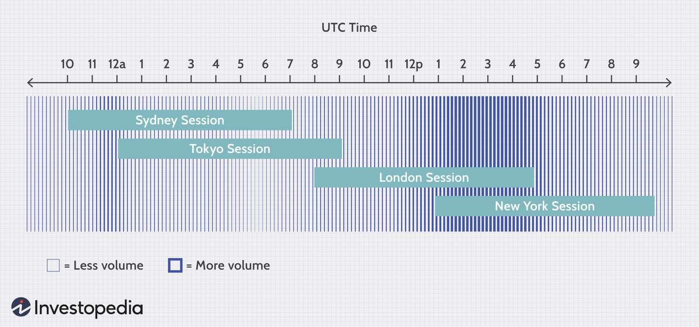

## Table of Contents

## What is Forex trading and why are trading times important?

Forex trading, also known as foreign exchange trading, is the buying and selling of different currencies on the foreign exchange market. It's like a big marketplace where people and businesses from all over the world trade one currency for another. The goal is often to make a profit from the changes in the value of one currency compared to another. For example, if you think the US dollar will get stronger compared to the Euro, you might buy dollars with Euros, and then sell the dollars later for more Euros if the value goes up.

Trading times are important in Forex because the market is open 24 hours a day during the weekdays, but it's not equally active all the time. Different countries have their own trading sessions, like the London session or the New York session, and these sessions can affect how much the currencies move. When more people are trading, like during the overlap of the London and New York sessions, the market can be more active and prices can change more quickly. Knowing when these busy times are can help traders decide the best times to buy or sell currencies to make the most of their trades.

## What are the major Forex market sessions and their time zones?

The Forex market has four major trading sessions: the Sydney session, the Tokyo session, the London session, and the New York session. Each session starts when the financial centers in these cities open for business. The Sydney session starts first at 10 PM UTC, followed by the Tokyo session at midnight UTC. The London session begins at 8 AM UTC, and the New York session starts at 1 PM UTC. These times are based on Universal Time Coordinate (UTC), which helps traders around the world know when each session is happening no matter where they are.

The times when these sessions overlap can be the busiest times in the Forex market. For example, the Tokyo and London sessions overlap from 8 AM to 9 AM UTC, and the London and New York sessions overlap from 1 PM to 5 PM UTC. During these overlaps, more traders are active, which can lead to more trading and bigger price movements. It's good for traders to know these times because they might have more chances to make trades and profits during these busy periods.

## How do different trading sessions affect currency volatility?

Different trading sessions can make the Forex market more or less busy, which affects how much the prices of currencies move around, called volatility. When more people are trading, like during the times when the sessions overlap, the market can get busier. This can make the prices of currencies change more quickly and by bigger amounts. For example, when the London and New York sessions are both open at the same time, a lot of trading happens, and the market can be very active.

On the other hand, when fewer people are trading, like during the Sydney session, the market might be quieter. This can mean that the prices of currencies don't change as much or as quickly. Knowing when the different sessions happen can help traders guess when the market might be more or less active, and plan their trades around these times to take advantage of the changes in volatility.

## What are the best times to trade Forex for beginners?

For beginners, the best times to trade Forex are during the overlaps of the major trading sessions, especially the London and New York sessions. This overlap happens from 1 PM to 5 PM UTC, which is a very busy time in the market. When both sessions are open, a lot of traders are buying and selling, which can make the prices of currencies move more. This can be good for beginners because there are more chances to make trades and see how the market works. But, it can also be a bit scary because the prices can change quickly.

Another good time for beginners to trade is during the quieter periods, like the Sydney session from 10 PM to 7 AM UTC. During these times, the market is not as busy, and the prices of currencies don't move around as much. This can be easier for beginners to handle because it's less stressful. They can practice making trades and get used to how the market works without the big price swings that happen during the busier times.

## How can traders identify optimal trading times using economic calendars?

Traders can use economic calendars to find the best times to trade by looking at when important news and events are happening. These calendars show when countries will release information about their economy, like jobs numbers or interest rate changes. When this news comes out, it can make the prices of currencies move a lot because traders react to the new information. By checking the economic calendar, traders can see when these events are scheduled and plan to trade around those times. This can help them catch big price movements and maybe make more money.

Another way economic calendars help is by showing when markets might be quiet. If there are no big news events planned, the market might not move as much. This can be a good time for beginners to practice trading without the stress of big price swings. By using the economic calendar, traders can pick times that match their trading style, whether they want to trade during busy times with lots of action or during quieter times when things are more calm.

## What role do overlapping trading sessions play in Forex trading?

Overlapping trading sessions are times when two major Forex market sessions are open at the same time. This happens when the London session overlaps with the Tokyo session from 8 AM to 9 AM UTC, and when the London session overlaps with the New York session from 1 PM to 5 PM UTC. During these overlaps, more traders from different parts of the world are active, which makes the market busier. When more people are trading, the prices of currencies can change more quickly and by bigger amounts. This can be a good time for traders to make trades because there are more chances to buy and sell currencies at good prices.

These busy times during overlapping sessions can be both exciting and challenging. For traders who like a lot of action, the overlaps can offer more opportunities to make profits because the market is more active. But, it can also be harder to predict how the prices will move because so many people are trading. Beginners might find these times a bit overwhelming because the prices can change so fast. Still, knowing when these overlaps happen can help traders plan their trading better, whether they want to take advantage of the big price movements or avoid them.

## How does the time of day impact Forex market liquidity?

The time of day can change how easy it is to buy and sell currencies in the Forex market. This is called liquidity. When more people are trading, like during the times when the London and New York sessions overlap, there are more buyers and sellers. This makes it easier to trade because you can find someone to trade with quickly. The market is more liquid, and the prices of currencies can move a lot because so many people are trading.

On the other hand, when fewer people are trading, like during the Sydney session, the market can be less liquid. There are fewer buyers and sellers, so it might take longer to find someone to trade with. This can make the prices of currencies move less because not as many people are buying and selling. Knowing when the market is more or less liquid can help traders decide the best times to make their trades.

## What are the advantages and disadvantages of trading during high volatility periods?

Trading during high volatility periods, like when the London and New York sessions overlap, can be good because there are more chances to make money. When the market is busy, the prices of currencies can change a lot. If you can guess which way the prices will go, you might be able to buy low and sell high quickly, making a profit. Also, with more people trading, it's easier to find someone to trade with, which means you can get in and out of trades faster.

But, trading during these busy times can also be risky. The prices can change so fast that it's hard to predict what will happen next. If you guess wrong, you could lose money quickly. It can also be stressful because everything is happening so fast. For beginners, it might be hard to keep up with all the changes and make good decisions. So, while high volatility can offer big rewards, it also comes with big risks.

## How can advanced traders use technical analysis to determine the best trading times?

Advanced traders can use technical analysis to find the best times to trade by looking at charts and patterns. They use tools like moving averages, support and resistance levels, and indicators like the Relative Strength Index (RSI) or the Moving Average Convergence Divergence (MACD). These tools help them see when the market might be about to move a lot. For example, if a currency pair is getting close to a big support level and the RSI shows it's oversold, a trader might think it's a good time to buy because the price could go up soon. By watching these signs, traders can pick times when the market is likely to be active and the prices might change a lot.

Another way advanced traders use technical analysis is by looking at the time of day when certain patterns happen more often. They might notice that certain currency pairs tend to move a lot during the London and New York session overlap. By studying past data, they can see if there are times when these patterns are more likely to happen. This helps them plan their trades around these times, so they can be ready to act when the market is likely to be busy. Using technical analysis this way helps traders make better guesses about when to trade and can improve their chances of making money.

## What strategies can be employed during different Forex market sessions?

During the quieter sessions like the Sydney session, traders can use strategies that work well when the market is not moving a lot. One good strategy is called range trading. This means looking for times when the price of a currency stays between two levels, called support and resistance. Traders can buy the currency when it's near the support level and sell it when it's near the resistance level. This can be a good way to make small profits over and over again without the stress of big price swings. Another strategy is to use longer-term charts, like daily or weekly charts, to see bigger trends and make trades that last longer.

When the market gets busy during the overlaps of the London and New York sessions, traders can use strategies that take advantage of the big price movements. One popular strategy is called breakout trading. This means watching for times when the price of a currency breaks out of its normal range and starts moving a lot. Traders can buy the currency if it breaks out to the upside or sell it if it breaks out to the downside, hoping to make money from the big move. Another strategy is to use shorter-term charts, like 5-minute or 15-minute charts, to make quick trades and catch the fast price changes. These strategies can be exciting but also risky because the market can be unpredictable during these busy times.

## How do global economic events influence optimal Forex trading times?

Global economic events can change when the Forex market is busy and when it's quiet. When countries release important news about their economy, like job numbers or interest rate changes, it can make the prices of currencies move a lot. Traders from all over the world want to know this news and react to it, so they start trading more during these times. For example, if the U.S. releases its jobs report at a certain time, traders will be ready to buy or sell the U.S. dollar based on the news. This can make the market very active and the best time to trade if you want to catch big price movements.

But, these economic events can also make trading harder. If a big news event is coming up, traders might wait to see what happens before they make their trades. This can make the market quiet just before the news comes out, and then very busy right after. Knowing when these events are happening can help traders plan their trading times. They can decide to trade during the busy times to take advantage of the big price moves or avoid them if they want to trade when things are calmer. Using an economic calendar to see when these events are scheduled can help traders make better choices about when to trade.

## What tools and resources can traders use to stay updated on the best trading times?

Traders can use economic calendars to stay updated on the best trading times. These calendars show when countries will release important news about their economy, like jobs numbers or interest rate changes. By checking the calendar, traders can see when these events are happening and plan to trade around those times. This helps them catch big price movements and maybe make more money. Economic calendars are available on many financial websites and trading platforms, so traders can easily find them.

Another useful tool is a Forex market hours monitor. This tool shows when the different trading sessions, like the London and New York sessions, are open and when they overlap. Traders can use this to know when the market is likely to be busy and when it might be quiet. This helps them decide the best times to make their trades. Many trading platforms and Forex websites offer these monitors, so traders can keep an eye on them while they trade.

Lastly, traders can use news apps and financial news websites to stay updated on global economic events. These resources give real-time news and analysis that can affect the Forex market. By keeping up with the news, traders can know when big events are happening and how they might impact the market. This can help them plan their trading times better and make more informed decisions.

## References & Further Reading

[1]: Babypips.com. ["The Best Times to Trade the Forex Market."](https://www.babypips.com/learn/forex/best-days-of-the-week-to-trade)

[2]: Sweet, P. (2020). ["Forex Essentials in 15 Trades: The Global-View Guide to Successful Currency Trading"](https://www.wiley.com/en-us/Forex+Essentials+in+15+Trades%3A+The+Global+View+com+Guide+to+Successful+Currency+Trading-p-9780470471289). Harriman House.

[3]: ["The Impact of News Announcements on Foreign Exchange Rates"](https://www.sciencedirect.com/science/article/pii/S1042443112000303), Federal Reserve.

[4]: Aldridge, I. (2013). ["High-Frequency Trading: A Practical Guide to Algorithmic Strategies and Trading Systems."](https://www.wiley.com/en-us/High+Frequency+Trading%3A+A+Practical+Guide+to+Algorithmic+Strategies+and+Trading+Systems%2C+2nd+Edition-p-9781118343500) Wiley Finance.

[5]: Duran, I. P. (2020). ["Algorithmic and High-Frequency Trading."](https://assets.cambridge.org/97811070/91146/frontmatter/9781107091146_frontmatter.pdf) CRC Press.