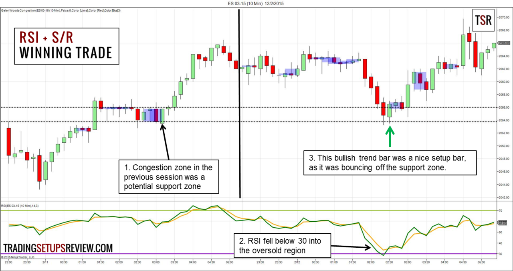

The use of technical analysis indicators in trading strategies is a well-established practice among traders seeking to understand market dynamics and make informed decisions. One of the most respected indicators within this sphere is the Relative Strength Index (RSI), a momentum oscillator that plays a pivotal role in signaling potential overbought or oversold conditions in the market. These insights are crucial, as they can indicate the likelihood of an impending market reversal, enabling traders to position themselves advantageously. 

This article is dedicated to exploring a range of trading strategies that incorporate the RSI indicator, highlighting the strategic advantages it offers. By integrating RSI with algorithmic trading, traders can optimize their strategies, enhancing both speed and accuracy. Algorithmic systems can execute trades based on predefined RSI triggers, reducing human error and emotional bias, thus making the trading process more efficient.



Furthermore, understanding how RSI interacts with other technical indicators, such as the Moving Average Convergence Divergence (MACD) and moving averages, can significantly enhance trading decisions. These combinations help provide a more comprehensive view of market trends and momentum, allowing traders to make more informed decisions based on multifaceted data.

The final part of the discussion will focus on the automation of RSI-based strategies using modern trading platforms and algorithmic trading systems. With advancements in technology, these systems can automate the execution of RSI strategies, providing traders with tools to increase efficiency and scalability in their trading operations. This approach not only enhances precision in trade execution but also allows traders to capitalize on market opportunities round-the-clock without manual intervention.

## Table of Contents

## Understanding RSI Indicators

The Relative Strength Index (RSI) is a well-regarded technical analysis tool in the field of trading, developed by J. Welles Wilder, Jr. RSI is a momentum oscillator that quantifies the speed and change of price movements in financial markets. It is an effective instrument for identifying potential overbought or oversold conditions, thereby helping traders pinpoint market reversals.

RSI values range from 0 to 100 and are typically analyzed by set thresholds: a reading above 70 suggests that an asset may be overbought, whereas a reading below 30 indicates it may be oversold. This makes RSI a valuable predictor of potential price reversals and allows traders to anticipate possible adjustments in market dynamics.

The calculation of RSI involves a comparison between the magnitude of recent gains and losses over a specified time period. The standard period for RSI is 14 days, but it can be modified to suit the trader’s specific strategies. The RSI is calculated using the following formula:

$$

RSI = 100 - \left(\frac{100}{1 + RS}\right) 
$$

where $RS$ (Relative Strength) is the average gain of 'up' periods during the specified time frame divided by the average loss of 'down' periods. Mathematically:

$$

RS = \frac{\text{Average Gain}}{\text{Average Loss}} 
$$

It's important to note some nuances in the interpretation of RSI. While it identifies potential market reversals, these signals are best used in conjunction with other indicators to confirm these movements. This is due to the fact that RSI can sometimes mislead in volatile or trending markets if used in isolation.

One common pitfall is the assumption that once RSI hits the overbought or oversold thresholds, a reversal is imminent. However, an asset can remain in these states for extended periods, especially during strong trending phases. Therefore, reliance solely on RSI for making trade decisions without additional signals or context can be risky.

Adjusting RSI parameters is a method used to tailor the indicator for different trading scenarios. By increasing the RSI period, traders can smooth out price fluctuations, which is useful in volatile markets. Conversely, a shorter period would provide more sensitive readings, potentially useful for [scalping](/wiki/gamma-scalping) strategies but at the cost of increased false signals.

For example, a Python script to calculate RSI for a given timeseries data could look like this:

```python
import pandas as pd

def calculate_rsi(data, period=14):
    delta = data.diff(1)
    gain = delta.where(delta > 0, 0)
    loss = -delta.where(delta < 0, 0)

    avg_gain = gain.rolling(window=period, min_periods=1).mean()
    avg_loss = loss.rolling(window=period, min_periods=1).mean()

    rs = avg_gain / avg_loss
    rsi = 100 - (100 / (1 + rs))

    return rsi

# Example usage
# Assuming `prices` is a Pandas Series with the historical price data
# rsi_values = calculate_rsi(prices)
```

This code provides a straightforward method to compute RSI values for any given price data series, allowing traders to integrate dynamic RSI calculations into their trading analyses.

## Best RSI Trading Strategies

Integrating the Relative Strength Index (RSI) into trading strategies can take various forms, tailored to the unique preferences and goals of individual traders. However, several approaches have gained widespread recognition for their effectiveness.

One prevailing strategy combines RSI with the Moving Average Convergence Divergence (MACD) to confirm trends before executing trades. RSI, by identifying potential overbought or oversold conditions, can highlight prospective market turning points. Meanwhile, the MACD, known for its dual moving averages, offers insights into [momentum](/wiki/momentum) and trend direction. By using RSI to flag potential reversals and the MACD to confirm these signals through trend verification, traders can increase the reliability of their entries and exits.

Another effective method is incorporating moving average crossovers alongside RSI. In this approach, RSI serves as a preliminary signal to detect possible buying or selling opportunities. This initial RSI indication prompts further analysis using moving averages to confirm potential trades. When a shorter-period moving average crosses above a longer one, it suggests a bullish market sentiment, whereas the opposite crossover indicates bearish sentiment. This dual-confirmation process minimizes false signals and refines decision-making.

The smoothed RSI technique offers an additional layer of reliability by averaging RSI values over a specified period. This process reduces the frequency of misleading signals by focusing on more durable market trends. By applying a smoothing function to RSI data, traders can filter out market noise and achieve a clearer picture of viable trading opportunities. This method proves particularly useful in volatile markets where sudden price movements often generate misleading signals.

Long-term RSI strategies cater to traders seeking to align short-term buy or sell signals within broader market trends. By extending the analysis to larger time frames, such as weekly or monthly charts, these strategies provide insights into the overarching market direction. Traders adopting this approach may consider RSI crossovers occurring on longer time frames to substantiate short-term signals, thus ensuring that their trades resonate with the prevailing long-term trend.

These RSI-based strategies collectively underscore the flexibility and adaptability of the RSI indicator in various trading contexts. While the effectiveness of each strategy depends on market conditions and trader expertise, they all highlight RSI’s potential in optimizing trading outcomes.

## Algorithmic Trading with RSI

Algorithmic trading, often known as algo trading, involves utilizing computer programs to automate the trading process, which can greatly enhance the execution of strategies based on the Relative Strength Index (RSI). This method allows traders to capitalize on both speed and accuracy, avoiding human error and emotional decision-making. 

To effectively program RSI strategies into trading algorithms, traders need to set up automated alerts for buy and sell signals based on specific RSI values. For instance, a basic RSI strategy might issue a buy signal when the RSI falls below 30, indicating an oversold condition, and a sell signal when it rises above 70, indicating an overbought condition. This can be implemented using Python with libraries such as pandas and TA-Lib. Here's a simple example of how such a strategy might be coded:

```python
import pandas as pd
import talib

# Sample price data
data = pd.read_csv('price_data.csv')  # Assuming CSV with 'Close' column
close = data['Close']

# Calculate RSI
rsi = talib.RSI(close, timeperiod=14)

# Identify buy and sell signals
buy_signals = rsi < 30
sell_signals = rsi > 70

data['Buy_Signal'] = buy_signals
data['Sell_Signal'] = sell_signals

# Display signals
print(data)
```

Backtesting is a critical component of evaluating RSI strategies. By applying historical data, traders can simulate their algorithm's performance and refine strategies to improve future outcomes. Backtesting software, such as Backtrader or QuantConnect, can process extensive datasets efficiently, providing insights into the potential success or failure of a strategy before live trading.

As technology progresses, traders possess the capability to develop sophisticated trading bots that integrate multiple technical indicators beyond the RSI, adapting to various market conditions. A comprehensive bot might combine RSI with indicators like the Moving Average Convergence Divergence (MACD) or simple moving averages to confirm trends and reduce the probability of false signals.

For beginners eager to embark on creating their own RSI trading bots, several platforms and resources can serve as starting points. Online platforms like QuantConnect and Alpaca offer [algorithmic trading](/wiki/algorithmic-trading) environments with easy access to historical data and community support to aid novices. Educational resources, such as interactive courses on platforms like Coursera or Udemy, provide structured learning paths to grasp the fundamentals of algorithmic trading and technical analysis.

Overall, algo trading with RSI strategies can optimize trading processes, offering traders enhanced precision and removing emotional biases. With ample resources and platforms available, both seasoned and novice traders can effectively harness this technology to improve their trading strategies.

## Combining RSI with Other Indicators

Combining the Relative Strength Index (RSI) with other indicators can augment its effectiveness by providing a more comprehensive view of market conditions. Two prominent indicators that complement RSI are the Moving Average Convergence Divergence (MACD) and moving averages. Each of these technical tools offers unique insights into momentum and trend direction.

The MACD is a trend-following momentum indicator that shows the relationship between two moving averages of a security’s price. It is calculated by subtracting the 26-period Exponential Moving Average (EMA) from the 12-period EMA, and the result is the MACD line. A nine-day EMA of the MACD, called the signal line, is then plotted on top of the MACD line, which can act as a trigger for buy and sell signals. When RSI is combined with MACD, traders can confirm momentum shifts and potential entry or [exit](/wiki/exit-strategy) points. For instance, if the RSI signals an oversold condition and the MACD shows a bullish crossover, it may confirm a potential buying opportunity.

Moving averages, either simple or exponential, provide another layer of analysis. By smoothing out price data over a set period, moving averages help identify trends more clearly. An RSI signal, such as an overbought or oversold condition, that coincides with a price crossing above or below a moving average can serve as a strong indication of a trend reversal or continuation. For example, if RSI indicates an overbought condition and the price falls below a significant moving average, it may signal a possible trend change.

Volume-related indicators, such as the On-Balance Volume (OBV) or the Volume Oscillator, can add further context to RSI readings by revealing the strength behind price movements. Increases in [volume](/wiki/volume-trading-strategy) can substantiate a price direction signaled by RSI, suggesting the move is backed by broader market participation. For example, if RSI indicates a potential bullish reversal and there is a corresponding increase in OBV, it may reinforce the bullish sentiment.

Traders often employ a multi-timeframe approach, analyzing RSI across different time scales to improve decision-making. A bullish signal in a shorter timeframe can be more reliable if it aligns with a positive signal in a longer timeframe. This method helps in identifying convergent signals, promoting more informed trading decisions.

In practice, integrating these indicators can be tailored to various trading scenarios. For [day trading](/wiki/day-trading-spy), quick, responsive signals are essential, and the combination of RSI with short-term moving averages or MACD can provide timely insights. Swing traders might use RSI with longer moving averages to capture medium-term trends. Long-term investors could focus on weekly or monthly RSI signals complemented by long-term moving averages to align with overarching market trends.

By combining RSI with these additional technical indicators, traders can enhance their market analysis, enabling more nuanced and strategic trading decisions.

## Case Studies and Real-World Applications

Real-world trading examples can vividly illustrate how the Relative Strength Index (RSI) has been effectively employed across various asset classes. Through analysis of equities, [forex](/wiki/forex-system), and commodities, it becomes evident how RSI can guide traders toward profitable decisions while underscoring the importance of adaptability in fluctuating market conditions.

### Equities

In equities trading, RSI is often used to identify potential buy and sell signals based on overbought and oversold conditions. A notable case involves Apple Inc. (AAPL) in early 2021, where RSI readings fell below the 30 threshold, indicating an oversold market. Traders who capitalized on this signal witnessed a subsequent price rally, confirming RSI's predictive potential in the context of equity markets. During this period, consideration of accompanying indicators like moving averages helped reinforce trade decisions, providing an added layer of confidence. The ability to adjust strategy based on RSI [volatility](/wiki/volatility-trading-strategies) offered a significant advantage, as market conditions fluctuated due to ongoing economic uncertainties.

### Forex

The forex market, characterized by high [liquidity](/wiki/liquidity-risk-premium) and volatility, presents unique challenges and opportunities for RSI application. In a 2019 scenario involving the EUR/USD currency pair, RSI dropped below 30, suggesting a buying opportunity. As anticipated, the euro experienced an upward movement against the dollar shortly thereafter. However, this reversal was also influenced by external factors such as geopolitical tensions and economic data releases impacting currency valuations. Understanding these elements is crucial, as RSI alone might not account for sudden market shifts driven by news events. The pairing of RSI with volume indicators or economic calendars provided enhanced context, helping traders make more informed decisions.

### Commodities

Commodities trading, particularly in gold and oil markets, shows how RSI can highlight lucrative entry and exit points. In 2020, RSI readings for [crude oil](/wiki/crude-oil) hit below 30 during a period marked by geopolitical instability and pandemic-related fluctuations in demand. Traders who interpreted the oversold signal as a buying opportunity experienced substantial gains as oil prices rebounded. The case underlines the importance of contextual awareness, with global news significantly impacting commodity prices and, by extension, RSI indicators. By tracking the influence of such macroeconomic factors, traders can refine their RSI strategies to better anticipate commodity market trends.

### Market Volatility and External Factors

Market volatility, geopolitical events, and economic data releases are pivotal elements that impact RSI readings and trade outcomes. For instance, during high-volatility periods such as the COVID-19 pandemic onset, RSI indicators across various asset classes exhibited extreme values more frequently. Adapting RSI parameters, such as adjusting the period length, may help traders avoid false signals during such turbulent times and identify more sustainable market entry points.

### Adaptability and Limitations

These case studies demonstrate both the adaptability and limitations of RSI strategies. While RSI can effectively signal potential market reversals, its simplicity leaves it vulnerable to providing false signals, particularly in trending markets where momentum can persist despite overbought or oversold conditions. Thus, combining RSI with other technical tools and maintaining a keen awareness of market context is imperative for enhancing decision-making accuracy.

### Strategic Adjustments

Traders are encouraged to continuously refine their RSI strategies by adjusting parameters based on evolving market conditions and integrating additional indicators to corroborate RSI signals. By adopting a holistic approach that considers both technical analysis and broader market dynamics, traders can achieve greater success in their trading endeavors.

## Conclusion

RSI remains a cornerstone of technical analysis due to its proficiency in identifying potential market turning points. By signaling overbought or oversold conditions, RSI allows traders to anticipate changes in price trends, making it an invaluable tool in a trader's arsenal.

Integrating RSI with algorithmic trading platforms enhances trading precision and efficiency. Automation diminishes human error and emotional biases, enabling swift and calculated execution of trades based on predefined RSI signals. Algorithmic systems can continuously scan markets, offering advantages in speed and data processing, which are crucial in fast-paced trading environments.

Despite its advantages, no single indicator can guarantee success. RSI provides critical insights but should be part of a broader strategy. Combining RSI with other indicators, such as Moving Average Convergence Divergence (MACD) or moving averages, can yield a more comprehensive analysis. A multi-indicator approach can help confirm signals and offer a holistic view of market trends, reducing the likelihood of false positives.

Successful RSI-based strategies rely on ongoing learning and adaptation to market dynamics. Market conditions are ever-evolving, necessitating continuous education and strategy refinement. Traders who embrace lifelong learning stand the best chance of sustaining success. Books such as "Technical Analysis of the Financial Markets" by John J. Murphy and communities like the Quantitative Finance Stack Exchange provide valuable resources. Online platforms, including Coursera and Udemy, offer courses on technical analysis and algorithmic trading. Engaging with these materials helps traders stay informed and adapt strategies effectively, ensuring they remain competitive in changing markets.

## References & Further Reading

[1]: Wilder, J. W. (1978). ["New Concepts in Technical Trading Systems."](https://archive.org/details/newconceptsintec00wild) Trend Research.

[2]: Murphy, J. J. (1999). ["Technical Analysis of the Financial Markets: A Comprehensive Guide to Trading Methods and Applications."](https://archive.org/details/technicalanalysi0000murp) New York Institute of Finance.

[3]: Lopez de Prado, M. (2018). ["Advances in Financial Machine Learning."](https://www.amazon.com/Advances-Financial-Machine-Learning-Marcos/dp/1119482089) Wiley.

[4]: Aronson, D. R. (2007). ["Evidence-Based Technical Analysis: Applying the Scientific Method and Statistical Inference to Trading Signals."](https://onlinelibrary.wiley.com/doi/book/10.1002/9781118268315) Wiley.

[5]: Jansen, S. (2020). ["Machine Learning for Algorithmic Trading: Predictive models to extract signals from market and alternative data for systematic trading strategies with Python."](https://www.amazon.com/Machine-Learning-Algorithmic-Trading-alternative/dp/1839217715) Packt Publishing.

[6]: Chan, E. P. (2008). ["Quantitative Trading: How to Build Your Own Algorithmic Trading Business."](https://github.com/ftvision/quant_trading_echan_book) Wiley.