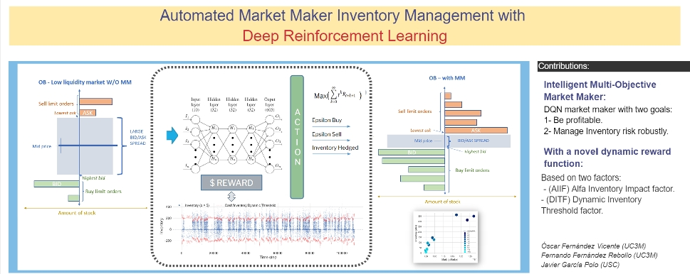

## Table of Contents

## What is inventory management in the context of market making?

Inventory management in market making refers to how a market maker handles the stocks or other assets they buy and sell. A market maker is a person or firm that buys and sells securities to provide liquidity in the market. They need to keep track of the assets they have, making sure they don't have too much or too little of any one stock. If they have too much of a stock, they might have to sell it at a lower price than they want. If they have too little, they might miss out on making profits.

To manage their inventory well, market makers use different strategies. They might set rules for how much of each stock they want to hold at any time. They also watch the market closely to decide when to buy or sell. Good inventory management helps market makers make money by buying low and selling high, while also keeping the market stable by always being ready to trade.

## Why is optimal inventory management important for market makers?

Optimal inventory management is crucial for market makers because it helps them make more money and keep the market stable. When market makers manage their inventory well, they can buy stocks at lower prices and sell them at higher prices, which is how they earn their profit. If they have too much of a stock, they might need to sell it at a lower price just to get rid of it, which means less profit. On the other hand, if they don't have enough of a stock, they might miss out on selling it at a good price when the demand is high.

Good inventory management also helps market makers keep the market stable. Market makers are supposed to always be ready to buy and sell stocks, which helps keep the market running smoothly. If they manage their inventory poorly, they might not be able to do this, and the market could become less stable. For example, if a market maker has too much of a stock and suddenly needs to sell a lot of it, it could cause the stock's price to drop quickly. By managing their inventory well, market makers can avoid these problems and help keep the market steady.

## What are the basic principles of inventory management for market makers?

Inventory management for market makers is about keeping the right amount of stocks or assets. They need to make sure they don't have too much or too little of any stock. If they have too much, they might have to sell it at a lower price, which means less profit. If they have too little, they might miss out on selling it when the price is high. So, market makers always try to balance their inventory to buy low and sell high.

To do this, market makers use certain rules or strategies. They set limits on how much of each stock they want to hold at any time. They also keep a close eye on the market to decide when to buy or sell. By following these rules, market makers can make more money and help keep the market stable. It's all about having the right amount of stocks at the right time.

## How does inventory risk affect market makers?

Inventory risk can have a big impact on market makers. It's the chance that they might lose money because they have too much or too little of a stock. If market makers buy a lot of a stock and then the price goes down, they could lose money when they sell it. On the other hand, if they don't have enough of a stock and the price goes up, they miss out on making more money. So, managing this risk is really important for market makers to keep making profits.

To manage inventory risk, market makers need to be careful about how much of each stock they hold. They use different strategies to make sure they don't end up with too much or too little of any stock. By keeping a close eye on the market and using these strategies, market makers can reduce their inventory risk. This helps them stay profitable and keep the market stable by always being ready to buy and sell stocks.

## What are common strategies for managing inventory as a market maker?

Market makers use different strategies to manage their inventory well. One common strategy is setting limits on how much of each stock they want to hold at any time. This helps them avoid having too much of a stock, which could force them to sell it at a lower price. They also set rules for when to buy or sell, based on the market conditions. For example, if the price of a stock starts to go up, they might sell some of their inventory to take advantage of the higher price. If the price starts to go down, they might buy more to get it at a lower cost.

Another strategy is to keep a close eye on the market and adjust their inventory accordingly. Market makers use tools and data to watch the price movements and trading volumes of stocks. This helps them decide when to buy or sell to keep their inventory balanced. By staying informed and reacting quickly to market changes, they can reduce the risk of having too much or too little of any stock. This way, they can keep making profits and help keep the market stable by always being ready to trade.

## How can market makers use technology to optimize inventory management?

Market makers can use technology to make their inventory management better by using special software and tools. These tools help them keep track of how much of each stock they have and what the prices are doing in real time. For example, they can use computer programs to see when the price of a stock is going up or down and decide quickly if they should buy or sell. This helps them keep the right amount of stocks and avoid having too much or too little.

Another way technology helps is by using algorithms. These are like smart math formulas that can look at a lot of data and make decisions fast. Market makers can set up these algorithms to automatically buy or sell stocks based on certain rules. This means they can manage their inventory without having to watch the market all the time. By using technology like this, market makers can make more money and keep the market running smoothly.

## What role does market volatility play in inventory management for market makers?

Market volatility, which means how much and how fast stock prices change, is very important for market makers when they manage their inventory. When the market is very volatile, the prices of stocks can go up and down a lot in a short time. This makes it harder for market makers to decide when to buy or sell. If they have too much of a stock and the price suddenly drops, they might lose money when they sell it. On the other hand, if they don't have enough of a stock and the price suddenly goes up, they might miss out on making more money.

To deal with market volatility, market makers need to be very careful and quick in managing their inventory. They use tools and strategies to watch the market closely and adjust their inventory as needed. For example, they might set tighter limits on how much of each stock they hold when the market is volatile. By doing this, they can try to keep their inventory balanced and reduce the risk of losing money. Good inventory management in a volatile market helps market makers keep making profits and helps keep the market stable.

## How do market makers balance inventory across different assets?

Market makers need to balance their inventory across different assets to make sure they don't have too much or too little of any one stock. They do this by setting rules for how much of each stock they want to hold at any time. For example, they might decide to keep a certain number of shares of one stock and a different number of shares of another stock. By setting these limits, market makers can make sure they have a good mix of assets. This helps them buy low and sell high, which is how they make money.

To manage their inventory across different assets, market makers also watch the market closely. They use tools and data to see how the prices of different stocks are moving. If one stock's price is going up, they might sell some of it to take advantage of the higher price. If another stock's price is going down, they might buy more of it to get it at a lower cost. By keeping a close eye on the market and adjusting their inventory accordingly, market makers can balance their assets well. This helps them stay profitable and keep the market stable by always being ready to trade.

## What advanced techniques can market makers use to predict inventory needs?

Market makers can use advanced techniques like machine learning to predict their inventory needs. Machine learning is a type of computer program that can learn from data and make smart guesses about the future. Market makers can use this to look at past data on stock prices and trading volumes to see patterns. By understanding these patterns, they can predict when they might need more or less of a stock. This helps them keep the right amount of inventory and avoid having too much or too little.

Another advanced technique is using predictive analytics. This involves using math and statistics to forecast what might happen in the future. Market makers can use predictive analytics to look at things like news events, economic reports, and other market data to guess how stock prices might change. By doing this, they can adjust their inventory before these changes happen. This helps them stay ahead of the market and manage their inventory more effectively, which can lead to more profits and a more stable market.

## How does regulatory compliance impact inventory management strategies for market makers?

Regulatory compliance can affect how market makers manage their inventory. Rules set by financial regulators can limit how much of a stock market makers can hold at one time. This means they have to be careful not to break these rules, which can make it harder to keep the right amount of stock. For example, if a rule says they can only hold a certain number of shares, they might have to sell some shares even if the price is not good. This can affect their profits and how they manage their inventory.

Also, market makers need to report their inventory to regulators. This means they have to keep good records of what they buy and sell. Keeping track of everything can take time and effort, which might take away from the time they spend on managing their inventory. But following these rules is important because it helps keep the market fair and stable. So, market makers need to find a balance between following the rules and managing their inventory well to make profits.

## What are the best practices for monitoring and adjusting inventory levels in real-time?

To monitor and adjust inventory levels in real-time, market makers need to use technology like special software and tools. These tools help them see how much of each stock they have at any moment and how the prices are changing. By using these tools, market makers can quickly decide if they need to buy or sell more of a stock. For example, if they see the price of a stock going up, they might sell some of it to make a profit. If the price is going down, they might buy more to get it at a lower cost. This helps them keep their inventory balanced and avoid having too much or too little of any stock.

Another important practice is setting up alerts and using algorithms. Alerts can notify market makers when certain conditions are met, like when a stock's price reaches a certain level. This helps them react quickly to changes in the market. Algorithms are like smart math formulas that can automatically buy or sell stocks based on rules that market makers set. By using these algorithms, market makers can adjust their inventory without having to watch the market all the time. This makes it easier to keep their inventory at the right levels and helps them make more money while keeping the market stable.

## How can market makers integrate machine learning models to enhance inventory management?

Market makers can use machine learning to make their inventory management better. Machine learning is a type of computer program that can learn from data and make smart guesses about the future. By looking at past data on stock prices and how much people are trading, machine learning can find patterns. This helps market makers predict when they might need more or less of a stock. For example, if the machine learning model sees that a stock's price usually goes up after a certain event, it can tell the market maker to buy more of that stock before the event happens. This way, market makers can keep the right amount of stock and avoid having too much or too little.

Using machine learning also helps market makers adjust their inventory quickly. The models can look at a lot of data very fast and make decisions based on what they see. For instance, if the model notices that the price of a stock is starting to go down, it can tell the market maker to sell some of it before the price drops too much. This can help market makers make more money by buying low and selling high. By using machine learning, market makers can stay ahead of the market and manage their inventory more effectively, which leads to more profits and a more stable market.

## What are Inventory Models for Optimal Management?

Economic Order Quantity (EOQ) is a fundamental model adapted for the financial context to manage and minimize the costs associated with ordering and holding securities. Traditionally used in inventory management for physical goods, EOQ's principles are applied to algorithmic trading to determine the optimal quantity of securities to hold or order while balancing the associated costs of transactions and capital holding. The model helps in identifying the point where the total cost of ownership, represented by the sum of ordering and holding costs, reaches its minimum.

In algorithmic trading, a variant of the EOQ formula can be adapted as follows:

$$
EOQ = \sqrt{\frac{2DS}{H}}
$$

where:
- $D$ represents the demand for the security,
- $S$ is the setup or transaction cost per order,
- $H$ is the holding cost per unit of inventory.

Mean-Variance Optimization is a quantitative approach that aims to balance the expected returns of a portfolio with the associated risk, represented as variance or standard deviation of returns. This model helps traders in algorithmic trading to set inventory levels that optimize the trade-off between risk and return. By adjusting the portfolio to align with target risk levels, traders can achieve a more stable performance which aligns with their strategic goals. The mathematical formulation typically involves solving a quadratic optimization problem:

$$
\min \frac{1}{2} x^T \Sigma x - r^T x
$$

subject to:

$$
x^T 1 = 1
$$

where:
- $x$ is the vector of weights representing the proportion invested in each security,
- $\Sigma$ is the covariance matrix of portfolio returns,
- $r$ is the vector of expected returns.

Inventory Control Theory applies stochastic processes to manage inventory within dynamic market conditions. By incorporating randomness and uncertainty, this theory aids in setting appropriate inventory levels under volatile trading scenarios. Key elements include stochastic demand and supply, which are critical when market conditions change unpredictably. Methods such as Markov decision processes can be employed to model and solve these problems, allowing for strategic adjustments in inventory based on changing market environments.

Dynamic Programming, an essential computational technique, addresses decision-making in complex, multi-period scenarios. In the context of inventory management for algorithmic trading, it provides a framework to optimize the overall gain across multiple trading sessions by considering the evolution of inventory levels over time. Through successive solution breakdowns, dynamic programming enables the determination of an optimal trading path that maximizes profit while minimizing risk exposure. This is particularly useful for dealing with lagged effects where past actions influence future outcomes, and can be represented recursively as:

$$
V_t(x) = \max_{a} \left\{ R_t(x,a) + \mathbb{E}[V_{t+1}(f(x,a,\omega_{t+1}))] \right\}
$$

where:
- $V_t(x)$ is the value function representing the maximum expected return given state $x$ at time $t$,
- $R_t(x,a)$ is the immediate reward from taking action $a$,
- $f(x,a,\omega_{t+1})$ describes the state transition function,
- $\omega_{t+1}$ captures the stochastic effect of taking action $a$ at state $x$.

## References & Further Reading

[1]: Avellaneda, M., & Stoikov, S. (2008). ["High-frequency trading in a limit order book."](https://people.orie.cornell.edu/sfs33/LimitOrderBook.pdf) Quantitative Finance, 8(3), 217-224.

[2]: Cartea, Á., & Jaimungal, S. (2011). ["Optimal investment with high frequency trading."](https://assets.cambridge.org/97811070/91146/frontmatter/9781107091146_frontmatter.pdf) Review of Financial Studies, 24(11), 3296-3336.

[3]: Hasbrouck, J., & Saar, G. (2013). ["Low-latency trading."](https://www.sciencedirect.com/science/article/abs/pii/S1386418113000165) Review of Financial Studies, 26(9), 3112-3154.

[4]: Almgren, R., & Chriss, N. (2000). ["Optimal execution of portfolio transactions."](https://smallake.kr/wp-content/uploads/2016/03/optliq.pdf) Journal of Risk, 3, 5-39.

[5]: Chan, E. (2009). ["Quantitative Trading: How to Build Your Own Algorithmic Trading Business."](https://github.com/ftvision/quant_trading_echan_book) Wiley.

[6]: Kissell, R. (2013). ["The Science of Algorithmic Trading and Portfolio Management."](https://www.sciencedirect.com/book/9780124016897/the-science-of-algorithmic-trading-and-portfolio-management) Academic Press.

[7]: Lopez de Prado, M. (2018). ["Advances in Financial Machine Learning."](https://www.amazon.com/Advances-Financial-Machine-Learning-Marcos/dp/1119482089) Wiley.