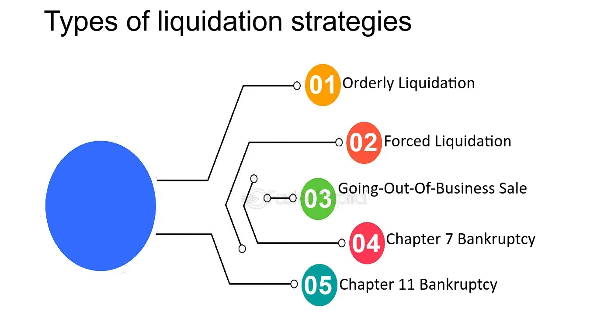

## Table of Contents

## What is meant by 'liquidation' in financial markets?

Liquidation in financial markets means selling off assets to turn them into cash. This often happens when a company or a person can't pay their debts. The money from selling the assets is used to pay back what they owe. For example, if a business is going bankrupt, it might have to sell its buildings, equipment, and inventory to get cash to pay its creditors.

Liquidation can also refer to a type of investment strategy where an investor sells their holdings to exit their position. This could be because they want to take their profits or cut their losses. In trading, if someone has bought stocks on margin (borrowed money) and the value of those stocks drops a lot, the broker might force them to liquidate their position to cover the loan. This is known as a margin call.

## Why is it important to have an optimal liquidation strategy?

Having an optimal liquidation strategy is important because it helps you get the most money from selling your assets. When you need to turn your assets into cash quickly, like when you're in debt or need money fast, you want to do it in a way that doesn't make the value of your assets drop too much. If you sell everything at once, the market might get flooded with your assets, and their value could go down. By planning your sales carefully, you can avoid this and get a better price for your assets.

Also, an optimal liquidation strategy can help you manage risks better. If you're forced to sell your assets because of a margin call or other financial pressure, doing it the wrong way can make your losses bigger. By spreading out your sales over time or choosing the right moments to sell, you can reduce the impact on your finances. This way, you can protect yourself from losing too much money and handle your financial situation more smoothly.

## What are the basic principles of a liquidation strategy?

A good liquidation strategy starts with understanding what you own and how much it's worth. You need to know which of your things can be turned into cash quickly and which ones might take longer to sell. This helps you decide what to sell first and how to get the best price for your stuff. It's also important to think about how selling your things might affect their value. If you sell a lot of the same thing at once, the price might go down because there's too much of it in the market. So, you might want to sell your things slowly over time to keep the price up.

Another key part of a liquidation strategy is managing risks. When you need to sell your things because you owe money or you're in a tight spot financially, you don't want to make things worse by selling at the wrong time. You should try to sell when the market is good for your things, so you can get more money. Also, think about any rules or taxes that might affect how much money you get from selling. By planning carefully and selling smartly, you can handle your financial problems better and maybe even come out ahead.

## How does market impact affect liquidation strategies?

Market impact is how selling a lot of something can change its price. When you need to turn your things into cash, you have to think about this. If you sell a big amount of your stuff all at once, it can make the price go down. This is because there's suddenly more of it in the market than people want to buy. So, if you're not careful, you might end up getting less money than you hoped for.

To handle market impact, you need a smart plan. Instead of selling everything at the same time, you can sell your things little by little. This way, you don't flood the market and the price stays higher. It's like taking small bites instead of one big gulp. By spreading out your sales over time, you can get a better price for your stuff and end up with more cash in your pocket.

## What role does timing play in executing a liquidation strategy?

Timing is really important when you're trying to sell your things for the best price. If you sell when a lot of people want to buy what you have, you can get more money. For example, if you're selling winter coats, it's better to sell them in the fall when people are getting ready for winter, not in the summer when nobody needs them. So, you should watch the market and try to sell your things when the time is right.

Also, timing helps you avoid making the price of your things go down. If you sell a lot of your stuff all at once, it can make the market think there's too much of it, and the price can drop. But if you sell slowly over time, you can keep the price up. This way, you can get more money for your things and handle your financial problems better. So, thinking about when to sell is a big part of a good liquidation plan.

## Can you explain the concept of slippage in the context of liquidation?

Slippage is when you plan to sell something at one price, but you end up selling it at a different price. This can happen when you're trying to turn your things into cash quickly. For example, if you want to sell your stock for $100 per share, but by the time you actually sell it, the price has dropped to $95 per share, that $5 difference is slippage. It means you get less money than you expected.

Slippage is important to think about when you're making a plan to sell your things. If you're selling a lot of the same thing at once, it can make the price go down, which causes more slippage. To avoid this, you might want to sell your things slowly over time. This way, you can keep the price closer to what you want and get more money from your sales.

## What are some common liquidation strategies used by traders and investors?

Traders and investors use different ways to turn their assets into cash. One common way is to sell their things slowly over time. This helps them avoid making the price go down too much. They might decide to sell a little bit each day or week, so they don't flood the market with their stuff all at once. This way, they can get a better price for what they're selling and end up with more money.

Another way is to sell their things when the market is good for them. They watch the market and try to sell when a lot of people want to buy what they have. For example, if they're selling summer clothes, they might wait until spring when people start thinking about summer. By selling at the right time, they can get more money for their things. Both of these ways help traders and investors manage their sales better and handle their financial situations more smoothly.

## How do algorithmic trading systems optimize liquidation?

Algorithmic trading systems help make selling things easier and better. They use special computer programs to decide when and how to sell things. These programs can look at a lot of information very quickly and find the best times to sell. This way, they can sell things slowly over time instead of all at once, which helps keep the price up. They also watch the market all the time and can sell when the price is good, so you get more money for your things.

These systems also help avoid slippage, which is when the price you get is different from what you wanted. By selling things little by little, the programs can make sure the price stays close to what you want. They can also change their plan if the market changes, so they always do what's best for you. Using these smart programs, traders and investors can turn their things into cash in a way that gets them the most money and helps them handle their financial problems better.

## What are the differences between liquidation strategies for stocks versus other asset classes?

Liquidation strategies for stocks often focus on timing and [volume](/wiki/volume-trading-strategy) to minimize market impact and slippage. When selling stocks, traders might use [algorithmic trading](/wiki/algorithmic-trading) systems to spread out their sales over time, selling small amounts each day to avoid flooding the market and driving the price down. They also watch the market closely and try to sell when the stock price is high, which can help them get more money. Stocks are traded on exchanges where prices can change quickly, so having a plan that reacts to these changes is important.

For other asset classes, like real estate or commodities, the strategies can be different because these assets might not be as easy to sell quickly. With real estate, for example, it can take a long time to find a buyer, so the strategy might involve setting the right price and making the property attractive to potential buyers. Commodities, like gold or oil, might be sold on different markets, and the strategy could involve choosing the right time based on supply and demand. Unlike stocks, these assets might not have as much immediate market impact, but the challenge is often in finding buyers and getting the best price.

In both cases, the goal is to turn the assets into cash in a way that gets the best possible price. For stocks, this often means using technology and quick decision-making, while for other assets, it might involve more patience and careful planning. Understanding the unique characteristics of each asset class is key to developing an effective liquidation strategy.

## How do regulatory environments influence liquidation strategies?

Regulatory environments can change how people sell their things. Different places have different rules about selling things, like stocks or real estate. These rules can affect how fast you can sell, how much you have to pay in taxes, and even who you can sell to. For example, some places might have rules that make it hard to sell a lot of stocks quickly, because they want to keep the market stable. So, people might need to sell their stocks more slowly to follow these rules.

Also, rules can affect how much money you get from selling your things. If there are high taxes on selling certain assets, you might get less money than you hoped for. Knowing these rules is important because it helps you plan your sales better. You might need to wait for a better time to sell, or you might need to sell in a different way to avoid losing too much money to taxes or other costs. Understanding the rules can help you make a good plan to turn your things into cash without breaking any laws.

## What advanced mathematical models are used to develop optimal liquidation strategies?

Advanced mathematical models help people figure out the best way to sell their things without losing too much money. One common model is the Almgren-Chriss model. This model looks at how selling a lot of something can make its price go down. It helps people decide how fast they should sell their things to keep the price up. The model uses math to balance how quickly they want to sell with how much the price might drop. By using this model, people can plan their sales to get the most money possible.

Another model is the Optimal VWAP (Volume Weighted Average Price) strategy. This model tries to sell things at the average price that other people are paying over a certain time. It helps people sell their things in a way that matches what the market is doing. The model uses math to figure out the best times and amounts to sell, so the price stays close to the average. By following this model, people can avoid selling when the price is too low and get a better price for their things. Both of these models help people make smart plans to turn their things into cash without losing too much value.

## Can you discuss case studies where optimal liquidation strategies significantly impacted outcomes?

In one case, a big investment firm had to sell a lot of stocks quickly because they were losing money. They used the Almgren-Chriss model to plan their sales. Instead of selling all the stocks at once, which could make the price go down a lot, they sold a little bit each day. This helped them keep the price up and get more money than they would have if they sold everything at once. By using this smart plan, they were able to handle their financial problems better and avoid losing too much money.

Another case involved a company that needed to sell some of its real estate to pay off debts. They used an Optimal VWAP strategy to find the best times to sell their properties. They watched the market and sold when other people were buying similar properties at good prices. This way, they got more money for their real estate than if they had sold it all at once. By planning their sales carefully, they were able to pay off their debts and keep their business running smoothly.

## What is the role of dynamic programming in liquidation strategies?

Dynamic programming is a pivotal methodology in optimizing liquidation strategies within algorithmic trading. It addresses complex decision-making processes by decomposing them into simpler, manageable sub-problems. This structured approach facilitates the dynamic adaptation of trading strategies to evolving market conditions, crucial for effective order execution and risk management.

At its core, dynamic programming operationalizes the principle of optimality, wherein the optimal solution to a problem consists of optimal solutions to its sub-problems. In algorithmic trading, this principle is applied to devise strategies that execute large trades by determining the most advantageous points in time and in what quantities orders should be executed. The inherently recursive nature of dynamic programming enables the continuous refinement of trading decisions, promoting adaptive strategies that respond promptly to market fluctuations.

In scenarios involving multi-step trading problems, dynamic programming proves particularly advantageous. It allows for the strategic adjustment of tactics in real-time, crucial for capitalizing on transient market opportunities and mitigating potential adverse price movements. By breaking down the liquidation process into incremental decision stages, traders can iteratively optimize each stage, thereby enhancing overall execution efficiency.

Mathematically, the dynamic programming approach in liquidation strategies can be framed using recursive algorithms to solve Bellman equations. For example, the problem can be defined in terms of a state variable $s_t$ representing the stock's current holding position, and a control variable $a_t$ denoting the quantity to sell. The optimization process involves determining the policy $\pi$ that maximizes expected returns, which can be expressed as:

$$
V(s_t) = \max_{a_t} \left\{ R(s_t, a_t) + \sum_{s_{t+1}} P(s_{t+1} | s_t, a_t) V(s_{t+1}) \right\}
$$

Here, $V(s_t)$ is the value function at time $t$, $R(s_t, a_t)$ represents immediate rewards from executing action $a_t$, and $P(s_{t+1} | s_t, a_t)$ is the state transition probability.

The integration of Limit Order Book (LOB) data with dynamic programming augments the strategy by offering granular insights into market [liquidity](/wiki/liquidity-risk-premium) and [order book](/wiki/order-book-trading-strategies) dynamics. By incorporating real-time LOB data, traders can tailor their strategies to better align with specific trading objectives, such as minimizing market impact or optimizing the trade-off between execution speed and order cost. Leveraging this data enables traders to fine-tune their models, enhancing prediction accuracy and execution precision.

In conclusion, dynamic programming embodies a robust strategic framework within algorithmic trading, fostering the development of sophisticated liquidation strategies that are responsive to market conditions. Its ability to integrate real-time data and facilitate real-time tactical adjustments renders it an indispensable tool for traders seeking to optimize execution and manage risks efficiently.

## References & Further Reading

[1]: Almgren, R., & Chriss, N. (2001). [“Optimal execution of portfolio transactions.”](https://smallake.kr/wp-content/uploads/2016/03/optliq.pdf) Journal of Risk, 3(2), 5-40.

[2]: Cartea, Á., Jaimungal, S., & Penalva, J. (2015). ["Algorithmic and High-Frequency Trading."](https://assets.cambridge.org/97811070/91146/frontmatter/9781107091146_frontmatter.pdf) Cambridge University Press.

[3]: Lopez de Prado, M. (2018). ["Advances in Financial Machine Learning."](https://www.amazon.com/Advances-Financial-Machine-Learning-Marcos/dp/1119482089) Wiley.

[4]: Gatheral, J. (2010). [“No-Dynamic-Arbitrage and Market Impact.”](https://www.tandfonline.com/doi/full/10.1080/14697680903373692) Quantitative Finance, 10(7), 749-759.

[5]: Chan, E. P. (2009). ["Quantitative Trading: How to Build Your Own Algorithmic Trading Business."](https://github.com/ftvision/quant_trading_echan_book) Wiley.

[6]: Jansen, S. (2020). ["Machine Learning for Algorithmic Trading: Second Edition."](https://github.com/stefan-jansen/machine-learning-for-trading) Packt Publishing.

[7]: Abernethy, J., Kale, S., & Vaughan, J. W. (2013). [“Adaptive Market Making via Online Learning.”](https://proceedings.neurips.cc/paper/2013/file/995e1fda4a2b5f55ef0df50868bf2a8f-Paper.pdf) Proceedings of the 30th International Conference on Machine Learning, 97-105.