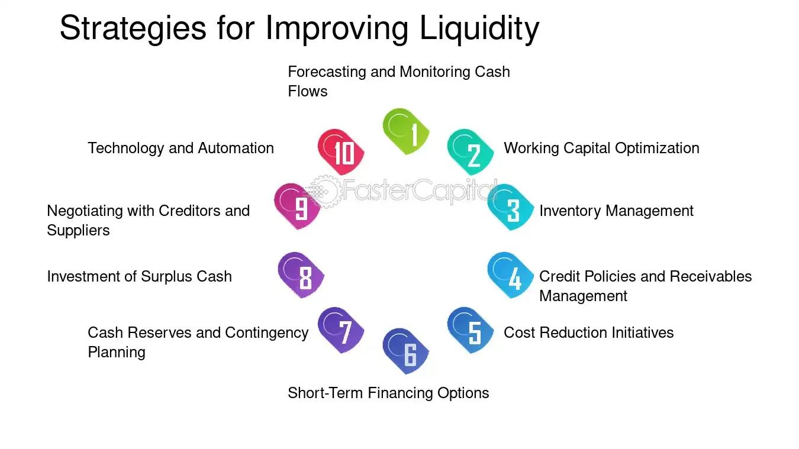

## Table of Contents

## What is liquidity in financial markets?

Liquidity in financial markets refers to how easily you can buy or sell an asset without affecting its price too much. If a market is liquid, it means there are lots of buyers and sellers, so you can quickly trade your assets at a fair price. Think of it like a busy marketplace where it's easy to find someone to trade with.

On the other hand, if a market is not liquid, it can be hard to find someone to buy or sell to. This can lead to bigger price changes when you do trade, because there are fewer people in the market. It's like trying to sell something unique at a small local market where not many people are interested.

## Why is liquidity important for traders and investors?

Liquidity is really important for traders and investors because it makes it easier and quicker for them to buy or sell their assets. When a market is liquid, you can trade without worrying too much about the price changing a lot. This means you can get in and out of your investments more easily. For example, if you need to sell a stock quickly to get some cash, a liquid market lets you do that without having to wait or accept a much lower price.

Also, liquidity helps keep the costs of trading lower. In a liquid market, the difference between the price someone is willing to buy at and the price someone is willing to sell at (called the bid-ask spread) is smaller. This means you lose less money when you trade. If a market isn't liquid, you might have to pay more to buy or get less when you sell, which can eat into your profits. So, liquidity is key for making sure trading is smooth and cost-effective.

## What are the basic strategies for seeking liquidity?

One basic strategy for seeking liquidity is to focus on trading assets that are popular and widely traded. Stocks of big companies like Apple or Microsoft, for example, are usually very liquid because lots of people want to buy and sell them. By sticking to these popular assets, you can be sure that you'll find someone to trade with quickly and without big price changes.

Another strategy is to use limit orders instead of market orders. A limit order lets you set the price at which you're willing to buy or sell. This can help you get a better price, especially in less liquid markets, because you're not just accepting whatever price is available at the moment. It might take a bit longer, but it can save you money and help you manage your trades better.

Lastly, you can improve your liquidity by diversifying your portfolio. Instead of putting all your money into one or two assets, spread it out across different types of investments. This way, if one asset is hard to sell, you can still trade others more easily. Diversification not only helps with liquidity but also reduces the risk of losing a lot of money if one investment doesn't do well.

## How does market depth affect liquidity seeking?

Market depth is about how many buy and sell orders there are at different prices. When a market has good depth, it means there are lots of orders, so it's easier to trade without the price moving a lot. This makes the market more liquid because you can buy or sell big amounts without causing big price changes. Think of it like a deep pool of water where you can jump in without making big waves.

If a market doesn't have good depth, it can be harder to trade. When you try to buy or sell a lot, you might move the price a lot because there aren't enough orders to match yours. This can make the market less liquid, and you might have to wait longer or accept a worse price. So, when you're looking for liquidity, checking the market depth can help you pick the best times and places to trade.

## What role do market makers play in liquidity?

Market makers are like the helpers of the stock market. They make sure there's always someone to buy or sell from by putting up their own buy and sell orders. This means even if there aren't a lot of other traders around, you can still trade your stocks easily. By doing this, market makers help make the market more liquid. It's like having a store that's always open, so you can always go there to buy or sell what you need.

When you see a price for a stock, it's often because a market maker is there offering to buy or sell at that price. They help keep the prices steady by making sure there are always orders in the market. This is really important because it makes trading smoother and helps everyone feel more confident about the market. Without market makers, it could be harder to trade and prices might jump around a lot more.

## How can order types influence liquidity seeking strategies?

Using different types of orders can really change how you look for liquidity in the market. If you use a market order, you're saying you want to buy or sell right away at whatever price is available. This is good when you need to trade fast, but in a market that's not very liquid, you might end up with a price that's not what you expected. On the other hand, a limit order lets you set the price you want to trade at. This can be better in less liquid markets because you can wait for the price you want, but it might take longer to get your trade done.

Another order type that can affect your liquidity seeking is the stop order. A stop order turns into a market order when the price hits a certain level. This can be useful if you want to limit your losses or lock in profits, but in a less liquid market, the price might jump a lot when your stop order triggers. Knowing how these orders work can help you pick the best way to trade based on how liquid the market is. By choosing the right order type, you can make your trading smoother and get better prices.

## What are the differences between passive and aggressive liquidity seeking?

Passive liquidity seeking is when you take your time to trade. You might use a limit order to set the price you want to buy or sell at, and then you wait for someone else to come and trade with you at that price. This way, you don't rush into a trade, and you can often get a better price. It's like waiting for the right moment to buy something at a store when it's on sale. Passive liquidity seeking is good when you're not in a hurry and want to make sure you get a good deal.

Aggressive liquidity seeking is the opposite. You want to trade right away, so you use a market order to buy or sell at the current price, no matter what it is. This is useful when you need to get into or out of a trade quickly, but it can mean you end up paying more or getting less than you hoped for. It's like grabbing something off the shelf at a store because you need it right now, even if it's not on sale. Aggressive liquidity seeking is better when speed is more important to you than getting the best price.

## How do algorithmic trading strategies enhance liquidity seeking?

Algorithmic trading strategies help with liquidity seeking by breaking big trades into smaller pieces. Instead of buying or selling all at once, which could move the price a lot in a less liquid market, these strategies spread the trade out over time. This way, they can trade without causing big price changes. It's like taking small sips of water instead of drinking a whole glass at once, so you don't spill any.

These strategies also use smart ways to find the best times and places to trade. They look at lots of data to figure out when the market is more liquid and when prices are better. By doing this, they can get better prices and trade more smoothly. It's like using a map to find the easiest path to your destination, making your journey quicker and easier.

## What are the risks associated with liquidity seeking strategies?

When you try to find liquidity, there are some risks you need to watch out for. One big risk is that you might not be able to trade as quickly as you want. If you're using a limit order to get a good price, you might have to wait a long time for someone to trade with you. This can be a problem if you need to get your money out of the market fast. Also, if you use a market order to trade quickly, you might end up with a bad price, especially if the market isn't very liquid. This means you could lose more money than you expected.

Another risk is that the market can change suddenly. Even if you think you've found a good time to trade, something unexpected can happen that makes the market less liquid. This can make it harder to buy or sell, and you might have to accept a worse price. Plus, if you're using algorithmic trading to break your trades into smaller pieces, there's a chance that other traders might figure out what you're doing. They could try to take advantage of your strategy by trading against you, which can mess up your plans and cost you money.

## How do regulatory environments impact liquidity seeking?

Regulatory environments can change how easy it is to find liquidity in the market. If the rules are strict, it might be harder for market makers to do their job. Market makers are the ones who help keep the market liquid by always being ready to buy or sell. If the rules make it too hard for them, they might not want to do it as much, and then the market can become less liquid. Also, if the rules make trading more expensive or complicated, fewer people might want to trade, which can make the market less liquid too.

On the other hand, good regulations can help make the market more liquid. If the rules make sure that everyone is playing fair and that the market is safe, more people might want to trade. This can bring more buyers and sellers into the market, making it easier to find someone to trade with. So, the rules can have a big effect on how liquid the market is, depending on whether they make trading easier or harder.

## What advanced techniques exist for optimizing liquidity seeking in volatile markets?

In volatile markets, one advanced technique for optimizing liquidity seeking is using adaptive algorithms. These smart computer programs can change how they trade based on what's happening in the market. If the market gets really wild, the algorithm can slow down its trades or break them into even smaller pieces. This helps avoid big price jumps and makes sure you can still trade without losing too much money. It's like having a smart helper who knows when to take a step back and wait for the right moment to move.

Another technique is using dark pools. These are private places to trade where not everyone can see what's happening. In a volatile market, using a dark pool can help you find liquidity without affecting the public market prices too much. You can trade big amounts without scaring other traders and causing the price to move a lot. It's like finding a quiet corner in a busy room where you can make your deals without everyone watching.

## How can machine learning be applied to develop dynamic liquidity seeking strategies?

Machine learning can help make liquidity seeking strategies smarter by looking at lots of data to find patterns that people might miss. It can learn from past trades to figure out the best times and ways to buy or sell. For example, it might see that certain times of the day are more liquid than others or that certain events make the market more or less liquid. By using this information, machine learning can change how it trades to get the best prices and make trading smoother, even when the market is moving a lot.

Another way machine learning helps is by predicting how the market will change. It can use data to guess when the market will be more or less liquid in the future. This means it can plan ahead and decide when to trade more aggressively or when to wait for a better moment. By always learning and adapting, machine learning can make sure that liquidity seeking strategies stay sharp and effective, no matter how the market behaves.

## How can one balance aggressiveness and market impact?

An optimal liquidity seeking strategy involves a delicate balance between aggressiveness and market impact. This concept is particularly critical in algorithmic trading, where the aim is to execute large trades efficiently. Aggressive strategies prioritize fast execution, often placing large market orders that consume liquidity in the [order book](/wiki/order-book-trading-strategies). While this ensures rapid completion of trades, it can lead to significant market impact, characterized by unfavorable price movements and visible footprints in the market.

Conversely, adopting a more passive approach can minimize market impact. This involves placing limit orders which may not execute immediately, thus avoiding prominent disturbances in the market. However, the downside is potentially slower execution and the risk of orders remaining unfulfilled, particularly in swiftly moving markets.

Determining the optimal level of aggressiveness requires traders to carefully analyze prevailing market conditions and specific stock characteristics. Factors such as stock volatility play an essential role; highly volatile stocks may necessitate more aggressive strategies to capture fleeting opportunities. Liquidity availability is another critical [factor](/wiki/factor-investing), as low liquidity would mean that aggressive orders could significantly alter market prices.

Market trends must also be considered. In a trending market, an aggressive posture might be appropriate to capitalize on [momentum](/wiki/momentum), whereas, in a sideways market, a passive stance could prevent unnecessary market impact with little price advantage. 

Successfully navigating these factors often involves constructing mathematical models that predict the ideal aggressiveness level. For instance, a trader might compute the expected market impact $I$ of an order of size $Q$ on a stock with average daily [volume](/wiki/volume-trading-strategy) $V$ as follows:

$$
I = \alpha \left( \frac{Q}{V} \right)^\beta
$$

where $\alpha$ and $\beta$ are empirically determined parameters specific to the market environment and the asset class. 

By applying a predictive model and continuously monitoring execution performance, traders can adjust their strategies to optimize the trade-off between execution speed and market impact, striving for improved execution quality.

## References & Further Reading

[1]: Lopez de Prado, M. (2018). ["Advances in Financial Machine Learning."](https://www.amazon.com/Advances-Financial-Machine-Learning-Marcos/dp/1119482089) Wiley.

[2]: Jansen, S. (2020). ["Machine Learning for Algorithmic Trading."](https://github.com/stefan-jansen/machine-learning-for-trading) Packt Publishing.

[3]: Chan, E. P. (2009). ["Quantitative Trading: How to Build Your Own Algorithmic Trading Business."](https://github.com/ftvision/quant_trading_echan_book) Wiley.

[4]: Narang, R. K. (2013). ["Inside the Black Box: A Simple Guide to Quantitative and High Frequency Trading."](https://onlinelibrary.wiley.com/doi/book/10.1002/9781118662717) Wiley.

[5]: Hendershott, T., Jones, C. M., & Menkveld, A. J. (2011). ["Does Algorithmic Trading Improve Liquidity?"](https://onlinelibrary.wiley.com/doi/full/10.1111/j.1540-6261.2010.01624.x) The Review of Financial Studies, 24(3), 4665-4699.

[6]: Kissell, R. (2013). ["The Science of Algorithmic Trading and Portfolio Management."](https://www.sciencedirect.com/book/9780124016897/the-science-of-algorithmic-trading-and-portfolio-management) Academic Press.