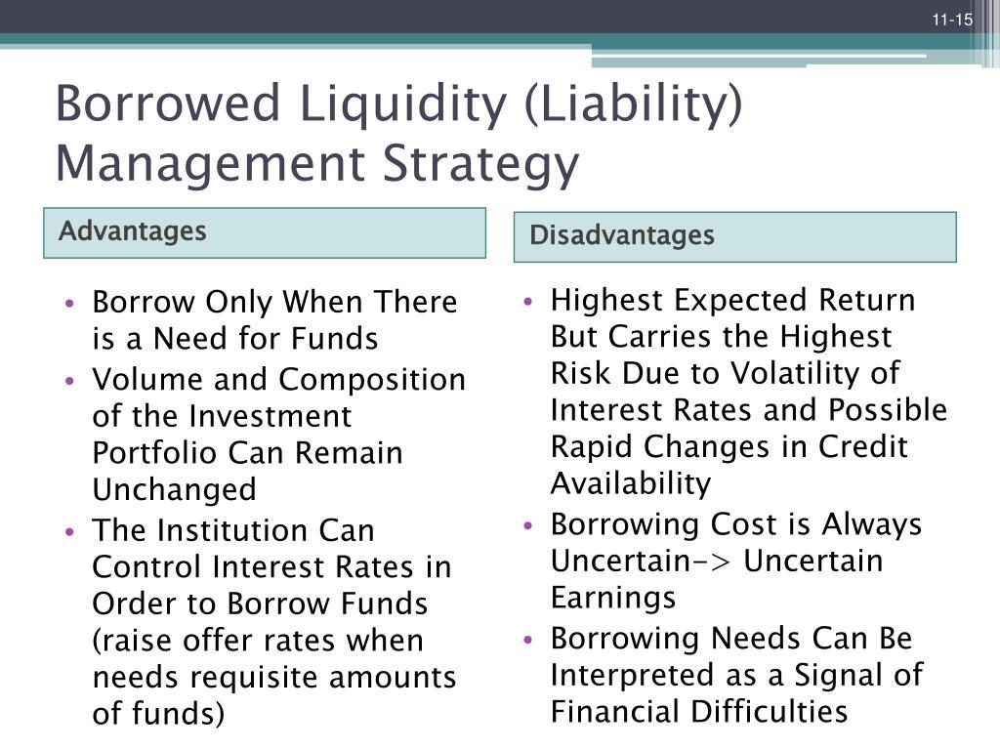

The landscape of algorithmic trading is undergoing continuous transformation, driven by technological innovations and evolving market dynamics. Among the various strategies employed by traders, liquidity seeking strategies have gained considerable recognition for their ability to execute large orders with minimal market impact. These strategies are specifically designed to access hidden liquidity within the market, often harnessing complex algorithms to navigate vast and fragmented trading venues. The primary objective is to optimize execution quality by reducing the cost associated with market impact and effectively reaching deep liquidity pools.

Understanding and optimizing liquidity seeking algorithms is pivotal for traders aiming to enhance execution quality. By meticulously balancing the trade-off between immediacy and the potential cost of liquidity, these strategies ensure efficient execution of large orders. The importance of this balance cannot be overstated as aggressive execution strategies may expedite order completion but can inadvertently escalate market impact, whereas less aggressive strategies may mitigate impact at the expense of execution speed.



Liquidity seeking strategies often involve leveraging dark pools, alternative trading systems (ATS), and other off-exchange venues. These platforms allow for interactions with large institutional counterparties discreetly, thereby reducing the visibility of large trades in public markets. Consequently, the optimization of these algorithms hinges on a deep understanding of market liquidity dynamics and the intelligent assimilation of technological advancements. This article aims to provide insights into the key components and factors influencing the effectiveness of liquidity seeking strategies, offering a comprehensive examination of this crucial facet of algorithmic trading.

## Table of Contents

## Understanding Liquidity Seeking Algorithms

Liquidity seeking algorithms are specialized tools designed to identify and access hidden liquidity in financial markets. These algorithms are integral to executing large orders with minimal market impact, thereby reducing adverse price movements that can result from large trades. They achieve this by employing sophisticated methodologies that allow them to discreetly interact with significant institutional counterparties.

One of the key components of these algorithms is their ability to utilize alternative trading venues such as dark pools and other off-exchange platforms, collectively known as alternative trading systems (ATS). Dark pools provide a mechanism for trading large blocks of securities confidentially, thus minimizing the chance of price slippage. Unlike public exchanges, these venues do not display order sizes, which helps reduce information leakage that could impact market prices.

The primary objective of liquidity seeking algorithms is to optimize order execution by finding the right balance between the immediacy of execution and the potential cost associated with accessing liquidity. This involves a trade-off between executing quickly to avoid price movement and waiting to access more favorable prices. The decision-making process often involves an assessment of current market conditions, liquidity availability, and the specific characteristics of the stocks being traded. These algorithms need to make real-time decisions, often using intricate logic tailored to the liquidity profiles of the assets involved.

In Python, an example of a simple model for evaluating trade-offs in such algorithms might look like this:

```python
def calculate_cost(immediacy_factor, liquidity_cost):
    """
    Calculates the theoretical cost of executing a trade with given parameters.

    :param immediacy_factor: A measure of the urgency of the trade (higher means more immediate).
    :param liquidity_cost: The cost associated with accessing liquidity.
    :return: The total execution cost.
    """
    return immediacy_factor * liquidity_cost

# Example usage:
immediacy_factor = 1.2  # Example urgency value
liquidity_cost = 100  # Hypothetical cost of accessing liquidity
total_cost = calculate_cost(immediacy_factor, liquidity_cost)
print(f"Total execution cost: {total_cost}")
```

This balance is crucial for minimizing market impact while still allowing for efficient execution of large orders. By continuously refining their methods to adapt to market changes, [liquidity](/wiki/liquidity-risk-premium) seeking algorithms remain an essential part of [algorithmic trading](/wiki/algorithmic-trading), providing traders with the tools necessary to execute large trades effectively.

## Incorporating Client Alpha

Incorporating client alpha into liquidity seeking algorithms is a crucial component for optimizing algorithmic trading strategies. Client alpha refers to the anticipated short-term price movements predicted by the client, and effectively integrating this information allows for enhanced execution performance. By customizing algorithms to align with client alpha, brokers and traders can achieve a more precise execution that is closely aligned with client expectations and market forecasts.

Brokers play an essential role in the incorporation of client alpha by using statistical analysis and extensive execution data to assess and quantify this metric. By leveraging historical data and market patterns, brokers can better understand potential price movements, thereby enabling the algorithm to make more informed decisions. The process often involves analyzing variables such as historical price data, trading volumes, and news sentiment, utilizing statistical models and [machine learning](/wiki/machine-learning) techniques to produce actionable insights.

To ensure the efficacy of these strategies, continuous refinement is paramount. Algorithms must be regularly fine-tuned to maintain alignment with evolving client expectations and shifting market dynamics. This can be accomplished by incorporating feedback loops into the algorithmic design, whereby the performance of trades is continually monitored and used to recalibrate models. Such feedback loops may involve the adjustment of parameters based on real-time market conditions or the integration of new data sources to improve predictive accuracy.

Adapting to market changes is particularly important given the dynamic nature of financial markets, where [volatility](/wiki/volatility-trading-strategies), liquidity, and sentiment can shift rapidly. By maintaining a flexible and adaptive algorithmic framework, traders can respond promptly to changes in market conditions, thereby optimizing execution quality and minimizing slippage.

For instance, Python programming can facilitate the implementation of these adaptive strategies. A simple example of a feedback loop in Python could involve recalibrating the alpha estimation model based on recent trade performance:

```python
def update_alpha_model(trade_data, alpha_model):
    new_alpha_estimate = alpha_model.predict(trade_data['recent_data'])
    performance_metric = evaluate_trade_performance(trade_data)

    if performance_metric < threshold:
        alpha_model.update_model_parameters(new_alpha_estimate)

    return alpha_model

```

In this hypothetical function, `trade_data` contains recent trading information, while `alpha_model` represents the predictive model used to estimate client alpha. By evaluating trade performance against a predefined threshold, the model can dynamically adjust its parameters to better align with observed market behavior.

In summary, integrating client alpha into liquidity seeking algorithms is essential for maximizing execution effectiveness. By combining quantitative analysis, adaptive algorithmic strategies, and ongoing performance assessment, traders can significantly enhance execution outcomes in a rapidly evolving financial landscape.

## Balancing Aggressiveness and Market Impact

An optimal liquidity seeking strategy involves a delicate balance between aggressiveness and market impact. This concept is particularly critical in algorithmic trading, where the aim is to execute large trades efficiently. Aggressive strategies prioritize fast execution, often placing large market orders that consume liquidity in the [order book](/wiki/order-book-trading-strategies). While this ensures rapid completion of trades, it can lead to significant market impact, characterized by unfavorable price movements and visible footprints in the market.

Conversely, adopting a more passive approach can minimize market impact. This involves placing limit orders which may not execute immediately, thus avoiding prominent disturbances in the market. However, the downside is potentially slower execution and the risk of orders remaining unfulfilled, particularly in swiftly moving markets.

Determining the optimal level of aggressiveness requires traders to carefully analyze prevailing market conditions and specific stock characteristics. Factors such as stock volatility play an essential role; highly volatile stocks may necessitate more aggressive strategies to capture fleeting opportunities. Liquidity availability is another critical [factor](/wiki/factor-investing), as low liquidity would mean that aggressive orders could significantly alter market prices.

Market trends must also be considered. In a trending market, an aggressive posture might be appropriate to capitalize on [momentum](/wiki/momentum), whereas, in a sideways market, a passive stance could prevent unnecessary market impact with little price advantage. 

Successfully navigating these factors often involves constructing mathematical models that predict the ideal aggressiveness level. For instance, a trader might compute the expected market impact $I$ of an order of size $Q$ on a stock with average daily [volume](/wiki/volume-trading-strategy) $V$ as follows:

$$
I = \alpha \left( \frac{Q}{V} \right)^\beta
$$

where $\alpha$ and $\beta$ are empirically determined parameters specific to the market environment and the asset class. 

By applying a predictive model and continuously monitoring execution performance, traders can adjust their strategies to optimize the trade-off between execution speed and market impact, striving for improved execution quality.

## Technology and Innovation in Liquidity Seeking Algorithms

Advanced technology is integral to the enhancement and sophistication of liquidity seeking algorithms. At the forefront of this advancement are innovations in data analytics, machine learning, and [artificial intelligence](/wiki/ai-artificial-intelligence) (AI), which equip traders with formidable tools for strategy optimization. These technologies empower traders to process real-time data efficiently, make accurate predictive analyses, and execute dynamic decision-making processes crucial for optimal trade execution.

Data analytics plays a foundational role by providing the means to analyze vast quantities of market data, uncovering patterns and trends that are not immediately apparent. The ability to dissect such data allows traders to make more informed decisions regarding liquidity sourcing and order execution. For instance, advanced statistical models help identify the best time to trade or the most efficient venues to execute orders with minimal market impact.

Machine learning enhances this analytical capability by introducing algorithms that can learn from historical data and adapt to new information without needing explicit programming for each scenario. This adaptive learning aspect facilitates improvements in the algorithms' predictive precision, aiding in forecasting short-term market fluctuations and thereby tailoring execution strategies that align closely with expected market conditions.

AI complements these technologies by enabling algorithms that can simulate human-like decision-making with enhanced speed and accuracy. AI-driven systems can evaluate complex market scenarios, consider a multitude of variables simultaneously, and optimize execution strategies faster than traditionally possible. This leads to a higher probability of executing orders at favorable prices and conditions, ultimately yielding better trading outcomes.

In implementing these technologies, firms must invest in robust technological infrastructures capable of supporting high-frequency trading and other data-intensive operations. This includes state-of-the-art servers, high-speed connectivity, and secure data storage solutions. The infrastructure must be scalable to handle increasing data loads and sufficiently agile to adapt to technological advancements and regulatory demands.

Consider the following Python snippet as an illustration of how machine learning might be employed to predict optimal trading periods:

```python
from sklearn.ensemble import RandomForestRegressor
from sklearn.model_selection import train_test_split
import pandas as pd

# Load historical trading data
data = pd.read_csv('historical_trading_data.csv')

# Feature selection
features = data[['feature1', 'feature2', 'feature3']]
target = data['optimal_trading_period']

# Train-test split
X_train, X_test, y_train, y_test = train_test_split(features, target, test_size=0.2, random_state=42)

# Initialize and train the model
model = RandomForestRegressor()
model.fit(X_train, y_train)

# Predictions
predictions = model.predict(X_test)
```

This simple example demonstrates how a random forest model can be used to predict optimal trading periods based on historical data. Such models form part of the broader technological toolkit that supports algorithmic decision-making processes in liquidity seeking.

In conclusion, by leveraging these advanced technologies, firms can significantly enhance the efficiency of liquidity seeking algorithms, ultimately achieving improved execution performance and gaining a competitive edge in the rapidly evolving landscape of algorithmic trading.

## Conclusion

Optimal liquidity seeking strategies are critical for achieving best execution in algorithmic trading. These strategies require a nuanced understanding of market dynamics and continuous refinement to ensure alignment with client expectations and market conditions. By incorporating client expectations, traders can tailor algorithms to accommodate anticipated price movements, thereby enhancing execution performance.

Balancing aggressiveness with market impact remains a fundamental challenge. An aggressive approach can expedite executions but may increase market impact, affecting overall cost. Conversely, a passive method might mitigate impact but delay execution. Traders must determine the suitable level of aggressiveness by analyzing real-time market conditions and security characteristics such as volatility and liquidity availability. This assessment aids in minimizing potential negative impacts on prices while optimizing trade execution speeds.

Leveraging advanced technology and innovations is another cornerstone of successful liquidity seeking strategies. With the integration of machine learning, artificial intelligence, and sophisticated data analytics, traders can improve prediction accuracy, expedite data processing, and make dynamic decisions. By investing in a robust technological infrastructure, firms can better support high-frequency trading and handle the large volumes of data necessary for informed strategy optimization.

Continuous analysis and customization of these strategies are paramount for maintaining competitive edges. Regularly revising algorithmic parameters and incorporating feedback loops allow traders to adapt promptly to market shifts and client needs. As financial markets evolve and technology advances, traders must remain vigilant and adaptable in their approaches to liquidity seeking.

Future advancements in technology and data analytics promise to further enhance the effectiveness of these algorithms. Innovations in high-frequency data processing, enhanced predictive modeling, and tailored algorithmic responses will continue to drive improvements in execution quality. Keeping pace with these developments is crucial for traders aiming to maintain and extend their competitive advantages.

## References & Further Reading

[1]: Lopez de Prado, M. (2018). ["Advances in Financial Machine Learning."](https://www.amazon.com/Advances-Financial-Machine-Learning-Marcos/dp/1119482089) Wiley.

[2]: Jansen, S. (2020). ["Machine Learning for Algorithmic Trading."](https://github.com/stefan-jansen/machine-learning-for-trading) Packt Publishing.

[3]: Chan, E. P. (2009). ["Quantitative Trading: How to Build Your Own Algorithmic Trading Business."](https://github.com/ftvision/quant_trading_echan_book) Wiley.

[4]: Narang, R. K. (2013). ["Inside the Black Box: A Simple Guide to Quantitative and High Frequency Trading."](https://onlinelibrary.wiley.com/doi/book/10.1002/9781118662717) Wiley.

[5]: Hendershott, T., Jones, C. M., & Menkveld, A. J. (2011). ["Does Algorithmic Trading Improve Liquidity?"](https://onlinelibrary.wiley.com/doi/full/10.1111/j.1540-6261.2010.01624.x) The Review of Financial Studies, 24(3), 4665-4699.

[6]: Kissell, R. (2013). ["The Science of Algorithmic Trading and Portfolio Management."](https://www.sciencedirect.com/book/9780124016897/the-science-of-algorithmic-trading-and-portfolio-management) Academic Press.