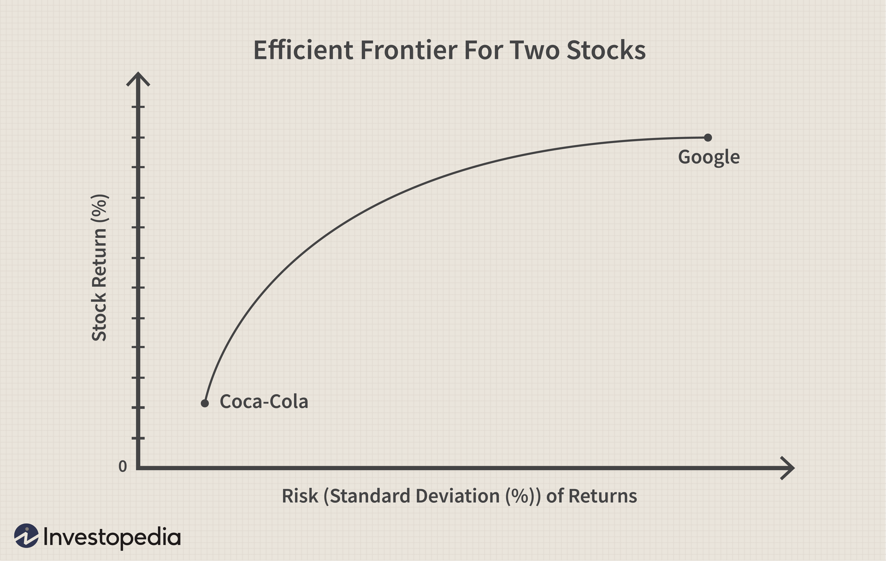

In the fast-paced world of investing, strategies are constantly evolving. As algorithmic trading and quantitative techniques gain traction, understanding portfolio diversification's foundational principles becomes imperative for investors aiming to optimize their strategies. Portfolio diversification involves spreading investments across various sectors, industries, and asset classes to mitigate risk. This approach minimizes the impact of market volatility and helps ensure more stable returns over time.

Algorithmic trading, utilizing sophisticated algorithms to automate trading strategies, complements diversification by enabling more efficient asset allocation and risk management. These computer-driven strategies allow quick adaptations to changing market conditions, facilitating a more dynamic and balanced investment portfolio. By implementing predefined criteria for asset allocation and rebalancing, algorithmic trading enhances the overall effectiveness of diversification efforts.



This article will explore the significance of portfolio diversification, analyze the ideal number of stocks for effective diversification, and examine how algorithmic trading plays a crucial role in executing successful investment strategies. Together, these elements provide investors with powerful tools to navigate the complexities of modern financial markets.

## Table of Contents

## Understanding Portfolio Diversification

Diversification is a fundamental risk management strategy in investment, designed to allocate assets across a wide array of financial instruments, industries, and other categories. The essence of diversification lies in its ability to spread risk by ensuring that not all investments are affected by a single event, thereby reducing the potential negative impact on the entire portfolio. 

The primary goal of diversification is to maximize return factors while minimizing risk by participating in a variety of investment opportunities. When a portfolio is well-diversified, it can significantly mitigate unsystematic risk—the risk inherent to a specific company or industry—by distributing investments across different sectors. For example, an unexpected downturn in the pharmaceutical industry may affect pharmaceutical stocks but might have little to no impact on technology stocks within the same portfolio.

The components of a diversified portfolio typically include three key elements: 

1. **Asset Class Diversification**: This involves spreading investments across different asset classes, such as equities, bonds, real estate, and commodities. Each asset class responds differently to various economic conditions, thus offering varying levels of risk and return. 

2. **Sector Diversification**: By investing in a multitude of industries such as technology, healthcare, finance, and consumer goods, investors can shield their portfolios from sector-specific downturns. For instance, if the automotive industry faces a slump, a robust portfolio containing strong-performing sectors like technology or healthcare can offset these losses.

3. **Geographic Diversification**: Allocating investments across different geographical regions can further reduce risk associated with country-specific economic, political, or environmental events. For example, an economic downturn in one country may be counterbalanced by growth in another, provided the portfolio includes international assets.

A mathematical perspective can further elucidate diversification's impact on risk and return. The portfolio variance, a measure of risk, is given by:

$$
\sigma_p^2 = \sum_{i=1}^{n} w_i^2 \sigma_i^2 + \sum_{i=1}^{n}\sum_{j=i+1}^{n} 2 w_i w_j \sigma_i \sigma_j \rho_{ij}
$$

Where:
- $\sigma_p^2$ is the portfolio variance.
- $w_i$ and $w_j$ are the weights of the individual assets.
- $\sigma_i$ and $\sigma_j$ are the standard deviations of the individual assets.
- $\rho_{ij}$ is the correlation coefficient between the returns on asset $i$ and asset $j$.

This formula highlights how diversification can reduce portfolio variance (risk), especially when assets with low or negative correlations are included. By strategically choosing assets with varying levels of correlation, investors can achieve a more stable portfolio with a potential for higher returns without an equivalently elevated level of risk.

In practice, achieving a balanced portfolio requires careful analysis and consistent monitoring to ensure it aligns with the investor's objectives, risk tolerance, and market dynamics. Leveraging tools such as [algorithmic trading](/wiki/algorithmic-trading) can assist in the continuous adjustment and rebalancing required to maintain optimal diversification.

## Ideal Number of Stocks for Diversification

Determining the ideal number of stocks to hold in a diversified portfolio is a subject of considerable debate among financial experts. While there is no universally agreed-upon number, many suggest a range of 10 to 30 stocks. This range aims to strike a balance between minimizing risk and maximizing potential returns without incurring excessive costs.

The basic principle behind diversification is the reduction of unsystematic risk, which is the risk associated with individual companies or sectors. By holding stocks across various sectors and industries, investors can shield themselves from fluctuations specific to any single industry. This diversification helps stabilize returns as the performance of different sectors may not be correlated.

Holding an optimal number of stocks allows for effective diversification. If an investor holds too few stocks, say fewer than 10, the portfolio may be overly exposed to the specific risks of those companies, failing to capture the benefits of diversification. On the other hand, owning too many stocks, such as more than 30, can lead to redundancy. It may increase transaction costs and management complexities without significantly further reducing risk, as much of the unsystematic risk is already mitigated with a smaller, well-chosen collection of stocks.

Calculating the diversification benefit in terms of risk reduction often involves understanding the correlation between stocks. A portfolio is said to be effectively diversified when the selected stocks exhibit low or negative correlations, thereby ensuring that the poor performance of some does not unduly affect the overall portfolio. 

Investors often employ statistical methods to determine the effectiveness of diversification. For instance, calculating the standard deviation of the portfolio's return can be a measure of its overall risk. Tools such as Python's `numpy` library can be used for these calculations:

```python
import numpy as np

# Example of calculating the portfolio standard deviation
returns = np.array([[0.05, 0.02, -0.01], [0.03, 0.02, 0.04], [0.07, -0.02, 0.01]])
weights = np.array([0.4, 0.4, 0.2])

portfolio_variance = np.dot(weights.T, np.dot(np.cov(returns, rowvar=False), weights))
portfolio_std_dev = np.sqrt(portfolio_variance)

print("Portfolio Standard Deviation:", portfolio_std_dev)
```

In this example, a matrix of returns for three assets over three periods is used to calculate the portfolio's standard deviation, indicating the risk level. Such quantitative analyses support the identification of an optimal range of stocks for diversification, balancing the cost and complexity of managing a large number of investments with the benefits of risk reduction.

## The Role of Algorithmic Trading

Algorithmic trading involves the use of computer algorithms to execute trading orders with a predetermined set of parameters, enabling trades to be made at speeds and frequencies inconceivable for human traders. At its core, algorithmic trading relies on complex statistical models and mathematical computations to make decisions based on available data, thus minimizing human intervention and emotional bias.

One of the significant advantages of algorithmic trading is its capacity to enhance diversification strategies through automated asset allocation. This is achieved by setting predetermined criteria that allow the algorithm to dynamically adjust the portfolio composition as market conditions evolve. The systematic approach ensures that investments are not overly concentrated in any single asset or sector, thereby optimizing the risk-return profile.

In the context of maintaining a diversified portfolio, algorithmic trading systems offer robust solutions for portfolio rebalancing. Portfolio rebalancing refers to the process of realigning the weightings of a portfolio's assets. Algorithms can automate this process by continuously analyzing and reallocating assets in response to market shifts, ensuring the portfolio remains aligned with an investor's specified risk tolerance and diversification goals.

For instance, a simple mathematical model for rebalancing might involve calculating the target investment needed for each asset class within the portfolio based on their target weights and then comparing these to their current values. The algorithm could use this discrepancy to decide if rebalancing actions are necessary, using formulas like:

$$
\text{Target Investment} = \text{Total Portfolio Value} \times \text{Target Weight of Asset}
$$

Moreover, the rapid execution capabilities of algorithmic trading allow portfolios to be adjusted much quicker than manual trading, which can be crucial when responding to sharp market movements. By implementing advanced algorithms, investors can efficiently direct capital away from underperforming assets and towards those with better prospects, thereby maintaining a balanced diversification.

Nevertheless, while algorithmic trading provides substantial benefits, it requires rigorous [backtesting](/wiki/backtesting) to ensure that strategies perform effectively under various market conditions. Backtesting involves simulating the trading strategy on past market data to evaluate its performance. Proper coding, thorough testing, and continuous strategy optimization are essential to mitigate the risks associated with algorithmic trading, ensuring the system's effectiveness in supporting diversification.

Overall, the integration of algorithmic trading into diversification strategies enables investors to automate complex portfolio management tasks. This not only enhances efficiency but also permits swift responses to market dynamics, reinforcing the robustness of a diversified investment approach.

## Benefits and Risks of Diversification with Algorithmic Trading

Combining diversification strategies with algorithmic trading significantly enhances the management of complex investment portfolios. One of the most prominent benefits is the automation of portfolio management processes. Algorithmic systems can execute diversification strategies with precision and speed beyond human capability, enabling real-time adjustments according to predefined parameters. This efficiency not only saves time and reduces human error but also optimizes investment returns by constantly aligning the portfolio with market trends.

Moreover, algorithmic trading supports large-scale diversification by facilitating the analysis and handling of extensive datasets. Machine learning models and statistical algorithms can identify correlations and diversify portfolios effectively across different sectors and asset classes. Algorithms can be programmed to adapt to shifting market dynamics, thus maintaining an optimal balance of risk and return.

However, the reliance on algorithmic trading introduces certain risks. The performance of these automated systems is contingent on the accuracy and robustness of their underlying models. There is a potential disconnect between the theoretical models and real-world market conditions, which may lead to suboptimal trading decisions. For instance, if an algorithm is based on historical data that does not adequately account for unprecedented market events, the resulting trades could amplify losses instead of mitigating risk.

Thus, backtesting becomes a crucial practice to mitigate these concerns. Backtesting involves simulating an algorithm's performance against historical data to evaluate its effectiveness before live deployment. Ensuring that algorithms are rigorously backtested can help identify possible vulnerabilities and enhance their resilience across different market conditions. Here is an example of a simple backtesting implementation in Python:

```python
import pandas as pd
import numpy as np

def backtest_strategy(prices, signals, initial_capital=10000):
    """Simple backtest of a trading strategy.

    prices: pandas Series of asset prices
    signals: pandas Series of buy/sell signals, 1 for buy, -1 for sell
    initial_capital: initial money to invest

    Returns a DataFrame with strategy metrics
    """
    positions = signals.shift() * initial_capital / prices
    portfolio = positions * prices
    returns = portfolio.pct_change().dropna()
    cumulative_returns = (1 + returns).cumprod()

    return pd.DataFrame({
        'Portfolio Value': portfolio,
        'Returns': returns,
        'Cumulative Returns': cumulative_returns
    })

# Example usage
prices = pd.Series([100, 105, 102, 110, 108], index=pd.date_range('2023-01-01', periods=5))
signals = pd.Series([1, 0, -1, 1, 0], index=prices.index)

backtest_results = backtest_strategy(prices, signals)
print(backtest_results)
```

Furthermore, safeguarding against system failures is essential. Implementing robust risk management protocols, such as setting stop-loss limits and maintaining regular system audits, can help mitigate the fallout from algorithmic errors or malfunctions. By acknowledging these risks and adopting comprehensive testing and safeguards, investors can harness the full potential of diversification complemented by algorithmic trading.

## Practical Steps for Implementing a Diversified Portfolio with Algorithmic Trading

Implementing a diversified portfolio with algorithmic trading involves several key practical steps. First, investors should begin by defining clear investment goals and risk tolerance. These foundational elements are essential for guiding the diversification strategy and ensuring that the investments align with personal or institutional financial objectives. A well-structured goals framework will assist in selecting appropriate asset classes, sectors, and geographical regions for diversification.

Next, leveraging algorithmic trading platforms becomes crucial. These platforms offer flexibility and efficiency in implementing and continuously monitoring diverse strategies. Algorithmic systems can automate the asset allocation process, adhere to predefined investment rules, and make real-time adjustments based on market data. For instance, an investor may deploy a mean-variance optimization model using Python libraries such as NumPy or SciPy to determine the optimal asset allocation:

```python
import numpy as np
from scipy.optimize import minimize

def portfolio_variance(weights, cov_matrix):
    return weights.T @ cov_matrix @ weights

def optimize_portfolio(expected_returns, cov_matrix, risk_tolerance):
    num_assets = len(expected_returns)
    constraints = ({'type': 'eq', 'fun': lambda weights: np.sum(weights) - 1})
    bounds = tuple((0, 1) for _ in range(num_assets))
    result = minimize(portfolio_variance, num_assets * [1./num_assets,], args=(cov_matrix,), 
                      method='SLSQP', bounds=bounds, constraints=constraints)
    return result.x

# Example usage
expected_returns = np.array([0.05, 0.1, 0.12])
cov_matrix = np.array([[0.005, -0.010, 0.004], [-0.010, 0.040, -0.002], [0.004, -0.002, 0.023]])
risk_tolerance = 0.1
optimal_weights = optimize_portfolio(expected_returns, cov_matrix, risk_tolerance)
```

Regular review and rebalancing of the portfolio are critical to maintaining alignment with evolving market conditions. Market dynamics, investor goals, and risk profiles can change over time, necessitating periodic reassessment of the portfolio composition. Rebalancing strategies might involve reallocating assets based on updated forecasts or shifting weights to maintain an optimal risk-return profile. Algorithmic trading frameworks can be programmed to conduct these rebalances systematically, enhancing operational efficiency and reducing transaction costs.

Finally, while algorithmic tools provide substantial capabilities, it is essential for investors to stay vigilant regarding technological dependencies and maintain robustness against unforeseen disruptions. Thus, investors should implement comprehensive backtesting and validation processes for their algorithms, ensuring consistent performance in various market scenarios. By integrating these practices, investors can harness the full potential of algorithmic trading while sustaining a diversified portfolio that meets their financial objectives.

## Conclusion

Portfolio diversification is a fundamental aspect of effective investment practice, offering a crucial safety net against the unpredictable nature of market [volatility](/wiki/volatility-trading-strategies). By spreading investments across multiple sectors, industries, and asset classes, investors can reduce unsystematic risk and stabilize their returns. When diversification is combined with algorithmic trading, the process becomes significantly more efficient. Algorithmic trading enables the automation of portfolio diversification, allowing for rapid adjustments to market conditions and optimizing asset allocation based on predefined criteria. This technological advancement permits investors to manage complex portfolios with greater precision and speed than manual methods.

However, the efficacy of these strategies hinges on the investor's ability to remain informed and adaptable. The fast-paced nature of financial markets, coupled with technological advancements, necessitates a proactive approach to strategy management. Investors should continuously evaluate and refine their trading algorithms to ensure they remain effective across various market scenarios. It's vital to implement robust backtesting and set up safeguards to mitigate the risks associated with reliance on technology and model inaccuracies. By doing so, investors can leverage the benefits of portfolio diversification and algorithmic trading, achieving a balanced approach that capitalizes on efficiencies while mitigating inherent risks.

## References & Further Reading

[1]: Markowitz, H. (1952). ["Portfolio Selection."](https://onlinelibrary.wiley.com/doi/abs/10.1111/j.1540-6261.1952.tb01525.x) The Journal of Finance, 7(1), 77-91.

[2]: Bodie, Z., Kane, A., & Marcus, A. J. (2014). ["Investments."](https://www.mheducation.com/highered/product/investments-bodie-kane/M9781264412662.html) McGraw-Hill Education.

[3]: ["Algorithmic Trading and DMA: An Introduction to Direct Access Trading Strategies"](https://www.amazon.com/Algorithmic-Trading-DMA-introduction-strategies/dp/0956399207) by Barry Johnson.

[4]: Elton, E. J., Gruber, M. J., Brown, S. J., & Goetzmann, W. N. (2009). ["Modern Portfolio Theory and Investment Analysis."](https://books.google.com/books/about/Modern_Portfolio_Theory_and_Investment_A.html?id=181CEAAAQBAJ) Wiley.

[5]: Focardi, S. M., & Fabozzi, F. J. (2004). ["The Mathematics of Financial Modeling and Investment Management."](https://www.semanticscholar.org/paper/The-Mathematics-of-Financial-Modeling-and-Focardi-Fabozzi/9ef7cbeee77cf22e2ee62cfef22f466a27aec6c8) Wiley.