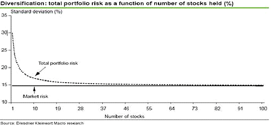

## Table of Contents

## What is a stock portfolio?

A stock portfolio is a collection of stocks and other investments that an individual or an organization owns. It's like a basket where you keep all your investment eggs. The stocks in a portfolio can be from different companies and industries, which helps spread out the risk. If one stock doesn't do well, the others might make up for it.

When you build a stock portfolio, you think about your goals, how much risk you're okay with, and how long you plan to invest. Some people like to have a mix of safe and risky stocks. Others might focus on certain industries they believe will do well in the future. Keeping an eye on your portfolio and making changes when needed is important to make sure it keeps meeting your goals.

## Why is diversification important in a stock portfolio?

Diversification is important in a stock portfolio because it helps reduce risk. When you spread your money across different types of investments, you're not putting all your eggs in one basket. If one company or industry does poorly, the other parts of your portfolio might still do well and balance things out. This way, you're less likely to lose a lot of money all at once.

Think of it like this: if you only invest in tech companies and the tech industry has a bad year, your whole portfolio could suffer. But if you also have investments in healthcare, energy, and consumer goods, those other areas might do better and help cushion the blow. Diversification doesn't guarantee you'll make money, but it can help protect you from big losses and make your investment journey smoother.

## How does the number of stocks in a portfolio affect diversification?

The number of stocks in a portfolio can really change how well it's diversified. If you only have a few stocks, your portfolio might not be very spread out. This means if one of those stocks does badly, it could hurt your whole portfolio a lot. But if you have more stocks, from different companies and industries, it's like having a safety net. If one stock goes down, the others might help keep your portfolio stable.

Having around 20 to 30 different stocks can be a good number for diversification. With this many, you can cover a lot of different areas and not be too affected if one stock has a bad day. But remember, it's not just about having a lot of stocks. It's also important to pick stocks from different sectors and types of companies. That way, you're really spreading out your risk and giving your portfolio the best chance to do well over time.

## What is the concept of 'optimal' in the context of a stock portfolio?

In the world of investing, the idea of an 'optimal' stock portfolio is all about finding the best mix of stocks that helps you reach your goals with the least amount of risk. It's like trying to find the perfect balance where your investments can grow well, but you're also protected from big losses. To find this sweet spot, people look at things like how much risk they're okay with, how long they plan to invest, and what they want to achieve with their money.

One way to think about an optimal portfolio is by using something called the Modern Portfolio Theory. This theory says that by carefully choosing a bunch of different investments, you can make your portfolio perform better than if you just picked stocks randomly. The key is to find stocks that don't all move in the same way at the same time. By doing this, you can lower your risk without giving up too much potential for growth. It's a bit like a puzzle where you're trying to fit all the pieces together just right to make the best picture possible.

## What are the risks of having too few stocks in a portfolio?

Having too few stocks in your portfolio can be risky because it doesn't spread out your risk very well. If you only have a handful of stocks, and one of them does badly, it can really hurt your whole portfolio. Imagine if you put all your money into just one or two companies, and those companies have a bad year. Your whole investment could go down a lot, and that's not good.

On the other hand, if you have more stocks from different companies and industries, it's like having a safety net. If one stock goes down, the others might stay steady or even go up, balancing things out. So, having too few stocks means you're more likely to lose a big chunk of your money if something goes wrong with one of your investments. It's like putting all your eggs in one basket – if you drop the basket, all your eggs could break.

## What are the challenges of managing a portfolio with too many stocks?

Managing a portfolio with too many stocks can be really hard. When you have a lot of different stocks, it takes a lot more time and effort to keep track of them all. You have to watch how each stock is doing, read up on news about the companies, and make sure you're still happy with your choices. It can feel overwhelming because there's just so much information to handle. Plus, if you want to make changes, like selling some stocks or buying new ones, it's a lot more work when you have a big list of stocks to go through.

Another challenge is that having too many stocks can actually make your portfolio less effective. When you spread your money too thin across a lot of different stocks, it can be hard to get the best returns. You might end up with a lot of stocks that are just okay, instead of focusing on a few that could really grow your money. Also, if you're not careful, you might end up with stocks that are too similar, which means you're not really spreading out your risk as much as you think. So, while having a lot of stocks might seem like a good idea for diversification, it can actually make things more complicated and less rewarding if you're not managing it well.

## How does Modern Portfolio Theory influence the optimal number of stocks?

Modern Portfolio Theory helps figure out how many stocks should be in a portfolio by trying to find the best mix of stocks that gives good returns without too much risk. It says that by [picking](/wiki/asset-class-picking) a bunch of different stocks that don't all go up and down at the same time, you can make your portfolio stronger. The theory suggests that having around 20 to 30 different stocks can be a good number because it helps spread out the risk. If you have fewer stocks, your portfolio might be too risky because one bad stock can hurt you a lot. But if you have too many stocks, it can be hard to manage and might not give you the best returns.

The idea is to find a balance where your portfolio can grow well but also stay safe. Modern Portfolio Theory uses math to look at how stocks move together and how much risk they bring to the table. By understanding these things, you can pick the right number of stocks that work well together. This way, you're not putting all your money into just a few stocks, but you're also not spreading it too thin across too many. It's all about finding that sweet spot where your portfolio can do its best.

## What role does correlation between stocks play in determining the optimal number?

The correlation between stocks is really important when you're trying to figure out the best number of stocks for your portfolio. Correlation is just a fancy word that means how much stocks move together. If two stocks go up and down at the same time a lot, they have a high correlation. If they don't move together much, they have a low correlation. When you're building your portfolio, you want to pick stocks that don't all move the same way. This helps spread out your risk so that if one stock goes down, another might go up and balance things out.

Modern Portfolio Theory says that by choosing stocks with low correlation, you can make your portfolio stronger. If you only have a few stocks, and they all move together a lot, your portfolio can be risky. But if you have around 20 to 30 stocks with different correlations, it can help lower your risk without hurting your chances of making money. It's like putting together a team where everyone has different skills – they work better together and help each other out when things get tough. So, understanding how stocks correlate helps you pick the right number of stocks to make your portfolio as good as it can be.

## Can the optimal number of stocks vary depending on an investor's strategy?

Yes, the best number of stocks for a portfolio can change based on what an investor wants to do. If someone likes to take big risks and wants to focus on just a few stocks they think will do really well, they might choose to have fewer stocks. This kind of investor might be okay with the chance of losing a lot of money if one of their stocks does badly, because they think the reward could be worth it. On the other hand, if someone wants to be safer and not lose too much money, they might pick more stocks from different companies and industries. This way, if one stock does poorly, the others can help keep their portfolio stable.

Different strategies also mean different ways of managing a portfolio. Someone who likes to keep a close eye on their investments and make changes often might be okay with having more stocks. They can handle the extra work of watching and adjusting their portfolio. But if someone doesn't want to spend a lot of time managing their stocks, they might stick to fewer stocks that they really believe in. So, the best number of stocks depends on what the investor is trying to achieve, how much risk they're okay with, and how much time they want to spend managing their investments.

## How do transaction costs and portfolio rebalancing affect the optimal number of stocks?

Transaction costs and portfolio rebalancing can really change the best number of stocks to have in a portfolio. When you buy or sell stocks, you have to pay fees, and these fees can add up if you're dealing with a lot of different stocks. If you have too many stocks, you might end up spending a lot of money just on these fees. So, if you want to keep your costs down, you might choose to have fewer stocks. That way, you won't have to pay as much every time you want to make a change.

Portfolio rebalancing is when you adjust your investments to keep them in line with your goals. If you have a lot of stocks, rebalancing can be a big job because you have to look at each stock and decide what to do with it. This can take a lot of time and money. If you don't want to spend a lot of time and money on rebalancing, you might decide to have fewer stocks. But if you're okay with the work and costs, having more stocks can help spread out your risk. So, the best number of stocks for you depends on how much you're willing to pay in fees and how much time you want to spend managing your portfolio.

## What empirical studies have been conducted on the optimal number of stocks in a portfolio?

Researchers have done a lot of studies to figure out the best number of stocks for a portfolio. One famous study is by Evans and Archer from 1968. They looked at how adding more stocks can lower risk. They found that having around 10 to 15 stocks can help a lot with reducing risk. But, they also said that having more than 30 stocks might not make much difference in lowering risk even more. This study helped start the idea that somewhere between 20 to 30 stocks is a good number for most people.

Other studies have also looked at this question. For example, a study by Statman in 1987 found that having about 30 to 40 stocks can be good for most investors. He said that with this many stocks, you can still get good returns while keeping risk low. But, he also pointed out that having too many stocks can make it hard to beat the market. So, these studies show that the best number of stocks can be different for different people, depending on what they want from their investments.

## How can advanced statistical methods like Monte Carlo simulations help determine the optimal number of stocks?

Advanced statistical methods like Monte Carlo simulations can help figure out the best number of stocks for a portfolio by running lots of different scenarios. These simulations use random numbers to see how a portfolio might do over time. By trying out different mixes of stocks and seeing how they perform in thousands of different situations, Monte Carlo simulations can show which number of stocks gives the best balance between risk and reward. This helps investors see how their portfolio might do in the future and pick the right number of stocks to meet their goals.

For example, if you want to know if having 20 stocks is better than having 30, a Monte Carlo simulation can run these scenarios many times. It can show you how often your portfolio would do well or badly with each number of stocks. This way, you can see if adding more stocks really helps lower your risk or if it just makes things more complicated without much benefit. Using these simulations helps take the guesswork out of picking the best number of stocks for your portfolio.

## What is Understanding Portfolio Diversification?

Diversification is a fundamental risk management strategy in investment, designed to allocate assets across a wide array of financial instruments, industries, and other categories. The essence of diversification lies in its ability to spread risk by ensuring that not all investments are affected by a single event, thereby reducing the potential negative impact on the entire portfolio. 

The primary goal of diversification is to maximize return factors while minimizing risk by participating in a variety of investment opportunities. When a portfolio is well-diversified, it can significantly mitigate unsystematic risk—the risk inherent to a specific company or industry—by distributing investments across different sectors. For example, an unexpected downturn in the pharmaceutical industry may affect pharmaceutical stocks but might have little to no impact on technology stocks within the same portfolio.

The components of a diversified portfolio typically include three key elements: 

1. **Asset Class Diversification**: This involves spreading investments across different asset classes, such as equities, bonds, real estate, and commodities. Each asset class responds differently to various economic conditions, thus offering varying levels of risk and return. 

2. **Sector Diversification**: By investing in a multitude of industries such as technology, healthcare, finance, and consumer goods, investors can shield their portfolios from sector-specific downturns. For instance, if the automotive industry faces a slump, a robust portfolio containing strong-performing sectors like technology or healthcare can offset these losses.

3. **Geographic Diversification**: Allocating investments across different geographical regions can further reduce risk associated with country-specific economic, political, or environmental events. For example, an economic downturn in one country may be counterbalanced by growth in another, provided the portfolio includes international assets.

A mathematical perspective can further elucidate diversification's impact on risk and return. The portfolio variance, a measure of risk, is given by:

$$
\sigma_p^2 = \sum_{i=1}^{n} w_i^2 \sigma_i^2 + \sum_{i=1}^{n}\sum_{j=i+1}^{n} 2 w_i w_j \sigma_i \sigma_j \rho_{ij}
$$

Where:
- $\sigma_p^2$ is the portfolio variance.
- $w_i$ and $w_j$ are the weights of the individual assets.
- $\sigma_i$ and $\sigma_j$ are the standard deviations of the individual assets.
- $\rho_{ij}$ is the correlation coefficient between the returns on asset $i$ and asset $j$.

This formula highlights how diversification can reduce portfolio variance (risk), especially when assets with low or negative correlations are included. By strategically choosing assets with varying levels of correlation, investors can achieve a more stable portfolio with a potential for higher returns without an equivalently elevated level of risk.

In practice, achieving a balanced portfolio requires careful analysis and consistent monitoring to ensure it aligns with the investor's objectives, risk tolerance, and market dynamics. Leveraging tools such as [algorithmic trading](/wiki/algorithmic-trading) can assist in the continuous adjustment and rebalancing required to maintain optimal diversification.

## What is the Role of Algorithmic Trading?

Algorithmic trading involves the use of computer algorithms to execute trading orders with a predetermined set of parameters, enabling trades to be made at speeds and frequencies inconceivable for human traders. At its core, algorithmic trading relies on complex statistical models and mathematical computations to make decisions based on available data, thus minimizing human intervention and emotional bias.

One of the significant advantages of algorithmic trading is its capacity to enhance diversification strategies through automated asset allocation. This is achieved by setting predetermined criteria that allow the algorithm to dynamically adjust the portfolio composition as market conditions evolve. The systematic approach ensures that investments are not overly concentrated in any single asset or sector, thereby optimizing the risk-return profile.

In the context of maintaining a diversified portfolio, algorithmic trading systems offer robust solutions for portfolio rebalancing. Portfolio rebalancing refers to the process of realigning the weightings of a portfolio's assets. Algorithms can automate this process by continuously analyzing and reallocating assets in response to market shifts, ensuring the portfolio remains aligned with an investor's specified risk tolerance and diversification goals.

For instance, a simple mathematical model for rebalancing might involve calculating the target investment needed for each asset class within the portfolio based on their target weights and then comparing these to their current values. The algorithm could use this discrepancy to decide if rebalancing actions are necessary, using formulas like:

$$
\text{Target Investment} = \text{Total Portfolio Value} \times \text{Target Weight of Asset}
$$

Moreover, the rapid execution capabilities of algorithmic trading allow portfolios to be adjusted much quicker than manual trading, which can be crucial when responding to sharp market movements. By implementing advanced algorithms, investors can efficiently direct capital away from underperforming assets and towards those with better prospects, thereby maintaining a balanced diversification.

Nevertheless, while algorithmic trading provides substantial benefits, it requires rigorous [backtesting](/wiki/backtesting) to ensure that strategies perform effectively under various market conditions. Backtesting involves simulating the trading strategy on past market data to evaluate its performance. Proper coding, thorough testing, and continuous strategy optimization are essential to mitigate the risks associated with algorithmic trading, ensuring the system's effectiveness in supporting diversification.

Overall, the integration of algorithmic trading into diversification strategies enables investors to automate complex portfolio management tasks. This not only enhances efficiency but also permits swift responses to market dynamics, reinforcing the robustness of a diversified investment approach.

## References & Further Reading

[1]: Markowitz, H. (1952). ["Portfolio Selection."](https://onlinelibrary.wiley.com/doi/abs/10.1111/j.1540-6261.1952.tb01525.x) The Journal of Finance, 7(1), 77-91.

[2]: Bodie, Z., Kane, A., & Marcus, A. J. (2014). ["Investments."](https://www.mheducation.com/highered/product/investments-bodie-kane/M9781264412662.html) McGraw-Hill Education.

[3]: ["Algorithmic Trading and DMA: An Introduction to Direct Access Trading Strategies"](https://www.amazon.com/Algorithmic-Trading-DMA-introduction-strategies/dp/0956399207) by Barry Johnson.

[4]: Elton, E. J., Gruber, M. J., Brown, S. J., & Goetzmann, W. N. (2009). ["Modern Portfolio Theory and Investment Analysis."](https://books.google.com/books/about/Modern_Portfolio_Theory_and_Investment_A.html?id=181CEAAAQBAJ) Wiley.

[5]: Focardi, S. M., & Fabozzi, F. J. (2004). ["The Mathematics of Financial Modeling and Investment Management."](https://www.semanticscholar.org/paper/The-Mathematics-of-Financial-Modeling-and-Focardi-Fabozzi/9ef7cbeee77cf22e2ee62cfef22f466a27aec6c8) Wiley.