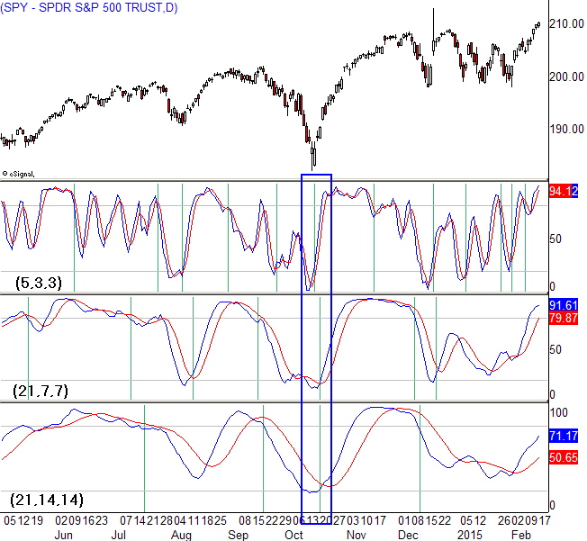

The stochastic oscillator is a widely used technical analysis tool that helps traders identify potential market reversals by analyzing momentum. Developed by George Lane in the 1950s, this indicator is particularly effective in determining whether a security is overbought or oversold, thus aiding in forecasting trend changes. This article discusses how the stochastic oscillator can be adeptly applied to trading strategies involving AAL stock and SPY ETF, with an emphasis on algorithmic trading. Understanding how the stochastic oscillator is constructed and its configurational settings can substantially improve trading efficiency and decision-making for both novice and experienced investors.

Algorithmic trading, or algo-trading, revolutionizes traditional trading methods by using pre-programmed strategies to automate trade execution, thereby minimizing human error and enhancing speed and efficiency. By incorporating stochastic oscillator signals into these algorithms, traders can optimize their strategies, thereby potentially increasing profitability. This systematic approach enables continuous market monitoring and timely reactions to market movements, which is crucial for capturing profitable opportunities.



Overall, this guide provides valuable insights into leveraging the stochastic oscillator within manual and automated trading systems. It aims to equip traders with the knowledge needed to refine their trading strategies, boost execution quality, and maximize returns in various market conditions.

## Table of Contents

## Understanding the Stochastic Oscillator

The stochastic oscillator, introduced by George Lane in the 1950s, is a popular momentum indicator that assists traders in evaluating a security's closing price relative to its price range over a defined period. The fundamental concept behind the stochastic oscillator is that prices tend to close near the extremes of their recent range during strong trends. This characteristic makes it a useful tool for predicting potential market reversals.

The stochastic oscillator is composed of two lines: %K and %D. The %K line represents the raw measure of the oscillator, while the %D line is a moving average of %K, typically a three-period simple moving average (SMA) of %K. These lines oscillate between values of 0 to 100, providing traders with visual signals of momentum shifts in the market.

The calculation of %K is formulated as follows:

$$
\%K = \frac{\text{Current Close} - \text{Lowest Low}}{\text{Highest High} - \text{Lowest Low}} \times 100
$$

Where:
- Current Close is the most recent closing price.
- Lowest Low is the lowest price over the defined period.
- Highest High is the highest price over the defined period.

Traders often interpret a crossing of the %K line above the %D line as a bullish signal, suggesting a potential upward reversal or continuation of an uptrend. Conversely, when the %K line crosses below the %D line, it is considered a bearish signal, indicating a potential downward reversal or continuation of a downtrend.

Extreme values on the oscillator are noteworthy. When the oscillator moves above 80, it enters the overbought territory, suggesting the asset may be due for a price correction or pullback. Conversely, when it moves below 20, it enters the oversold territory, indicating a potential buying opportunity as the price might rise. These thresholds can serve as early warnings for traders to prepare for possible market reversals.

In practical application, traders might use the stochastic oscillator alongside other indicators to enhance decision-making processes. However, it is critical to acknowledge that while the stochastic oscillator indicates potential overbought or oversold conditions, these situations can persist, signaling the need for additional analysis and confirmation before making trading decisions.

## Applying the Stochastic Oscillator to SPY and AAL Stock

Applying the stochastic oscillator to SPY (SPDR S&P 500 [ETF](/wiki/etf-trading-strategies) Trust) and AAL (American Airlines Group Inc.) stock involves adjusting the indicator's settings to suit different trading styles and objectives. Traders can apply various configurations of the stochastic oscillator to derive signals appropriate for these assets, adapting to both short-term and long-term market strategies.

**Stochastic Oscillator Settings**

The stochastic oscillator can be customized by adjusting its parameters: %K and %D. These denote the time periods used in calculations, with %K being the main indicator line and %D a moving average of %K. Typically, a 14-period setting is used by default, but for SPY and AAL stocks, different settings can be employed to cater to specific trading horizon needs.

**Short-Term vs Long-Term Trading**

- **Short-Term Trading**: Short-term traders typically employ lower settings of the stochastic oscillator to capture immediate market movements. For instance, a setting of 5-3-3 can be used, where %K and %D are based on five-day periods. This configuration allows traders to obtain frequent signals, although they may be less reliable due to market noise. Such setups are beneficial for day traders or swing traders who seek to exploit minor price fluctuations in SPY.

- **Long-Term Trading**: Conversely, long-term investors might prefer higher settings, such as 21-3-3, which smooth out short-term volatility and provide more dependable signals. These settings are advantageous for trend-following investors in the SPY ETF, where a broader market trend is more relevant than short-lived reversals.

**SPY ETF Trading**

In trading SPY using the stochastic oscillator, lower settings can detect rapid market shifts allowing traders to profit from quick reversals. However, these signals require careful management as they are susceptible to false positives. Implementing moving averages or other filters can assist in validating signals. 

Longer settings result in less frequent signals that align better with market trends, offering a clearer perspective on the ETF's direction. This reduces reaction to minor fluctuations, focusing instead on sustained trends.

**AAL Stock Trading**

In the context of AAL stock, traders utilize stochastic oscillator patterns to identify potential support and resistance levels. By observing the oscillator’s behavior around these technical levels, traders can refine their entry and [exit](/wiki/exit-strategy) strategies. For example, if stochastic values hover in overbought conditions near a historically confirmed resistance level, it might imply a selling opportunity. Conversely, oversold conditions aligning with a support level could suggest a buying opportunity.

**Practical Implementation**

Here is a simple example of how one might implement the stochastic oscillator in Python using the `pandas_ta` library:

```python
import yfinance as yf  # For more datasets, visit: https://paperswithbacktest.com/datasets
import pandas_ta as ta

# Fetch historical data for SPY
spy_data = yf.download('SPY', start='2020-01-01', end='2023-01-01')
# Calculate stochastic oscillator
spy_data['STOCH_%K'], spy_data['STOCH_%D'] = ta.stoch(spy_data['High'], spy_data['Low'], spy_data['Close'], k=5, d=3)

# Example of filtering buy signals
buy_signals = (spy_data['STOCH_%K'] < 20) & (spy_data['STOCH_%K'] > spy_data['STOCH_%D'])

# Print buy signals
print(spy_data.loc[buy_signals, ['Close', 'STOCH_%K', 'STOCH_%D']])
```

This code snippet fetches SPY data and calculates the stochastic oscillator with a 5-3-3 setup, identifying buy signals where the %K line crosses above the %D line and is below 20, suggesting oversold conditions.

Overall, understanding and applying different settings of the stochastic oscillator allows traders to tailor their strategies to the unique characteristics of SPY and AAL, catering to both immediate and extended market trends.

## Algorithmic Trading with the Stochastic Oscillator

Algorithmic trading involves using algorithms to execute trades based on predefined strategies. Incorporating the stochastic oscillator into these algorithms allows for automated and optimal trading decisions by leveraging the indicator’s ability to detect [momentum](/wiki/momentum) and potential market reversals. The stochastic oscillator's signals can be integrated into algorithmic models to automatically generate trading decisions, thus reducing human error and enhancing efficiency.

In the context of [algorithmic trading](/wiki/algorithmic-trading), the stochastic oscillator can be programmed to trigger buy or sell signals based on specific conditions, such as the %K line crossing above or below the %D line or reaching overbought/oversold thresholds. This automation ensures that trading strategy execution is swift and consistent.

Python is a widely-used language in algorithmic trading due to its versatility and the robust ecosystem of libraries that facilitate financial data analysis. The combination of Python, Pandas, and libraries such as yfinance and pandas_ta enables traders to implement and backtest strategies using stochastic indicators efficiently. Below is a sample Python snippet illustrating the retrieval of financial data and calculation of the stochastic oscillator using these libraries:

```python
import pandas as pd
import yfinance as yf  # For more datasets, visit: https://paperswithbacktest.com/datasets
import pandas_ta as ta

# Retrieve historical data for a stock
data = yf.download('AAL', start='2020-01-01', end='2023-01-01')

# Calculate the stochastic oscillator
stoch = ta.stoch(data['High'], data['Low'], data['Close'], k=14, d=3, smooth_k=3)

data = data.join(stoch)
print(data[['Close', 'STOCHk_14_3_3', 'STOCHd_14_3_3']].tail())
```

In this example, the historical data for American Airlines (AAL) is downloaded, and the stochastic oscillator with specified period settings is computed. Traders can further develop their algorithm by applying trade logic: executing trades when %K crosses %D or when the oscillator reaches predefined levels.

The stochastic oscillator is particularly valuable in algorithmic trading since it can quickly adapt to changing market conditions, enabling algorithms to capitalize on potential returns. Moreover, [backtesting](/wiki/backtesting) these strategies on historical data helps in assessing their viability before deployment in live markets. This capability ensures that the trading strategy is not only theoretically sound but also practically effective, thus optimizing the trading outcomes and maximizing potential returns.

## Combining Stochastic Oscillator with Other Indicators

Combining the stochastic oscillator with other technical indicators can significantly enhance trading strategies by increasing the reliability of trading signals. One popular combination involves the Moving Average Convergence Divergence (MACD) indicator, the Relative Strength Index (RSI), and Fibonacci retracement levels. 

The MACD indicator, a trend-following momentum indicator, can effectively confirm the direction of the trend indicated by the stochastic oscillator. Traders often use the MACD’s signal line crossing as confirmation of a stochastic oscillator signal: if both indicators suggest the same trend direction, the likelihood of a successful trade increases. For instance, a bullish crossover in the stochastic oscillator (where %K crosses above %D) that aligns with a MACD bullish signal provides a stronger suggestion of an upward price movement.

The RSI, another commonly used momentum oscillator, complements the stochastic oscillator by reinforcing overbought or oversold conditions. While stochastic values above 80 or below 20 indicate potential turning points, the RSI considers momentum and speed of price movements, generally using a baseline of 70 for overbought and 30 for oversold conditions. When both stochastic and RSI indicators reach extreme values, traders gauge a higher probability for a price reversal. This dual confirmation reduces false signals and increases the robustness of the strategy.

In addition to these oscillators, Fibonacci retracement levels help identify potential support and resistance. When the stochastic oscillator signals a reversal near a Fibonacci retracement level, especially at the 61.8% or 38.2% levels, it reinforces the decision-making process for entering or exiting trades. This confluence of multiple indicators not only validates the trade signal but also enhances timing precision.

The use of multiple indicators ensures a more comprehensive view of the market, mitigating the risk of relying on a single source which might give misleading signals. Here’s a simplified Python code snippet demonstrating how these indicators can be implemented together in an analysis strategy using libraries such as `pandas_ta` and `matplotlib`:

```python
import yfinance as yf  # For more datasets, visit: https://paperswithbacktest.com/datasets
import pandas_ta as ta
import matplotlib.pyplot as plt

# Fetch historical data
data = yf.download("AAPL", start="2021-01-01", end="2023-01-01")

# Calculate indicators
data['stoch'] = ta.stoch(data['High'], data['Low'], data['Close'])
data['macd'], data['macd_signal'] = ta.macd(data['Close'])
data['rsi'] = ta.rsi(data['Close'])

# Plot the data
plt.figure(figsize=(14, 7))
plt.plot(data['Close'], label='Close Price')
plt.plot(data['stoch'], label='Stochastic Oscillator')
plt.plot(data['macd'], label='MACD')
plt.plot(data['macd_signal'], label='MACD Signal Line')
plt.plot(data['rsi'], label='RSI')
plt.legend()
plt.show()
```

This code imports historical stock data for analysis, calculates the stochastic oscillator, MACD, and RSI, and visualizes these indicators for potential trade signals. By aligning signals across different indicators, traders can create more balanced and reliable trading strategies.

## Conclusion

The stochastic oscillator serves as a critical tool for traders aiming to predict market shifts and refine their trading decisions. Its primary utility lies in its ability to identify potential reversal points, thereby allowing traders to make informed decisions about entering or exiting trades. By leveraging the stochastic oscillator in algorithmic trading, traders can enhance efficiency and potentially increase returns through systematic, automated strategies that minimize human error and enable quick responses to market conditions.

Understanding the construction of the stochastic oscillator is crucial. It involves calculating the %K and %D lines, where %K is the current close's position relative to the range over a specified period (n), and %D is the moving average of %K. The formulas are:

$$

\text{%K} = \frac{\text{Current Close} - \text{Lowest Low}}{\text{Highest High} - \text{Lowest Low}} \times 100 
$$

$$

\text{%D} = \text{SMA of %K over a period}
$$

These lines help in deciphering market momentum and identifying overbought or oversold conditions—areas where a reversal might occur. Trading strategies can be fortified by integrating the stochastic oscillator with other indicators like the MACD or RSI, which can confirm signals provided by the oscillator, reducing the likelihood of false signals.

Consistent learning and experimentation with different settings and combinations are vital to adapting to varying market conditions. As each trading environment may present unique challenges, adjusting the oscillator's settings and testing them with historical data through backtesting can refine approaches and improve performance outcomes. By doing so, traders can ensure that their strategies remain robust and adaptable, maximizing their investment potential across different market climates.

## References & Further Reading

To deepen your understanding of the stochastic oscillator, especially its different settings and applications, resources like Investopedia provide accessible and comprehensive information. These resources explain how variations in the periods used for %K and %D lines affect signal accuracy and timing, crucial for tailoring strategies to specific trading styles.

For traders interested in algorithmic strategies, literature focusing on the intersection of stochastic oscillators with other indicators can provide profound insights. Books and scholarly articles on technical analysis offer detailed guidelines on combining stochastic signals with tools such as the Moving Average Convergence Divergence (MACD), Relative Strength Index (RSI), and Fibonacci retracement levels. This combination enhances the reliability of trading signals through signal confluence.

Practically applying these strategies can be further explored through algorithmic trading platforms. Experimentation on platforms like QuantConnect, MetaTrader, or using Python libraries such as `pandas` and `pandas_ta`, allows traders to implement and backtest their strategies. These platforms and tools help in creating algorithms that integrate stochastic oscillator signals, facilitating automated and efficient trade execution in real-time. By writing scripts or leveraging quantitative finance tools, such as `yfinance` for obtaining historical data, traders can refine their approaches through empirical testing.

Python Example:
```python
import yfinance as yf  # For more datasets, visit: https://paperswithbacktest.com/datasets
import pandas as pd
import pandas_ta as ta

# Download historical data for SPY ETF
spy_data = yf.download("SPY", start="2020-01-01", end="2023-01-01")

# Calculate the stochastic oscillator
spy_data['%K'] = ta.stoch(spy_data['High'], spy_data['Low'], spy_data['Close'])['STOCHk_14_3_3']
spy_data['%D'] = ta.stoch(spy_data['High'], spy_data['Low'], spy_data['Close'])['STOCHd_14_3_3']

# Visualizing the results
spy_data[['%K', '%D']].plot(title="Stochastic Oscillator for SPY ETF")
```

This example highlights how traders can integrate stochastic techniques into their trading systems by harnessing data analysis and visualization. These practical exercises reinforce theoretical learning and allow for customization of strategies according to individual trading goals.