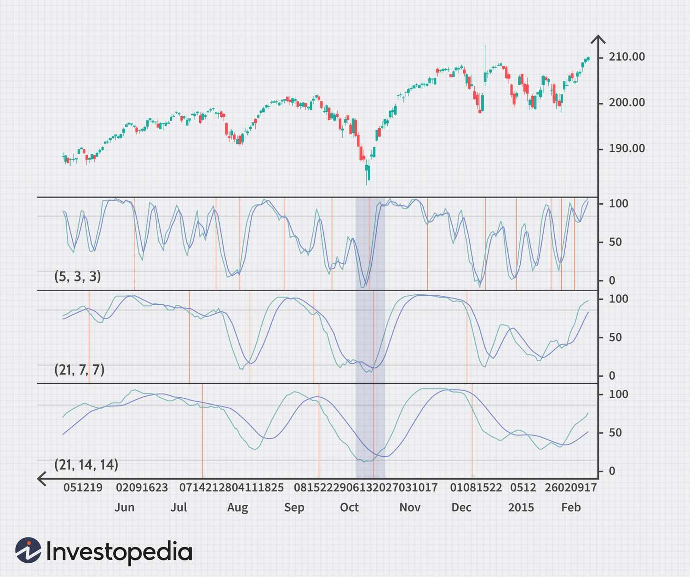

## Table of Contents

## What is a Stochastic Oscillator and how does it work?

A Stochastic Oscillator is a tool that traders use to figure out when to buy or sell things like stocks or currencies. It helps them see if a price is too high or too low compared to its recent prices. The oscillator works by comparing the closing price of something to its price range over a certain number of days, usually 14 days. It gives a number between 0 and 100. If the number is above 80, it might mean the price is too high and could go down soon. If it's below 20, it might mean the price is too low and could go up soon.

The Stochastic Oscillator uses two lines, called %K and %D, to show its readings. The %K line is the main line, and the %D line is a smoother version of %K, usually a three-day moving average of %K. When these lines cross each other, it can signal that it's time to buy or sell. For example, if the %K line crosses above the %D line and both are below 20, it might be a good time to buy. If the %K line crosses below the %D line and both are above 80, it might be a good time to sell. Traders use these signals to make decisions, but they also look at other things to make sure their choices are smart.

## Why is the Stochastic Oscillator useful for trading SPY and AAL?

The Stochastic Oscillator is useful for trading SPY (an ETF that tracks the S&P 500) and AAL (American Airlines stock) because it helps traders see if these assets are overbought or oversold. When the oscillator shows a reading above 80, it suggests that the price might be too high and could soon go down. This can be a signal for traders to sell their shares of SPY or AAL. On the other hand, if the reading is below 20, it suggests that the price might be too low and could soon go up, which could be a signal to buy these assets.

The oscillator also uses two lines, %K and %D, to give more detailed signals. When these lines cross each other, it can tell traders when to act. For example, if the %K line crosses above the %D line and both are below 20, it might be a good time to buy SPY or AAL. If the %K line crosses below the %D line and both are above 80, it might be a good time to sell. This can help traders make better decisions when trading these specific assets, but it's always smart to use other tools and information too.

## What are the default settings for a Stochastic Oscillator?

The default settings for a Stochastic Oscillator are usually set to a 14-day period. This means it looks at the price changes over the last 14 days to figure out if the price is too high or too low. The oscillator also uses two lines, called %K and %D, to show its readings. The %K line is calculated first, and then the %D line is made by smoothing out the %K line over three periods. So, the default settings for %K are 14 periods, and for %D, it's a 3-period moving average of %K.

These settings help traders see if a stock or another asset is overbought or oversold. If the Stochastic Oscillator goes above 80, it might mean the price is too high and could go down soon. If it goes below 20, it might mean the price is too low and could go up soon. Traders look at where the %K and %D lines cross to get more signals about when to buy or sell. For example, if %K crosses above %D and both are below 20, it might be a good time to buy. If %K crosses below %D and both are above 80, it might be a good time to sell.

## How can the Stochastic Oscillator settings be adjusted for SPY?

The Stochastic Oscillator settings for SPY, which tracks the S&P 500, can be adjusted to better fit the way this ETF moves. The standard setting is a 14-day period for %K and a 3-day moving average for %D. But because SPY is a broad market index, you might want to use a longer period, like 20 or 21 days, to smooth out the daily ups and downs and get a clearer picture of the market trends. This longer period can help you see if SPY is overbought or oversold more accurately.

You can also change the overbought and oversold levels. The usual levels are 80 for overbought and 20 for oversold. But for SPY, you might want to adjust these to 75 for overbought and 25 for oversold. This can help you avoid false signals because SPY can stay in overbought or oversold territory longer than individual stocks. By tweaking these settings, you can make the Stochastic Oscillator work better for trading SPY and get more reliable signals about when to buy or sell.

## How can the Stochastic Oscillator settings be adjusted for AAL?

The Stochastic Oscillator settings for AAL, which is American Airlines stock, can be changed to fit how this stock moves. The standard setting is a 14-day period for %K and a 3-day moving average for %D. But AAL can be more up and down than the whole market, so you might want to use a shorter period, like 10 or 12 days. This shorter period can help you see if AAL is overbought or oversold more quickly because the stock can change faster.

You can also change the overbought and oversold levels. The usual levels are 80 for overbought and 20 for oversold. For AAL, you might want to adjust these to 70 for overbought and 30 for oversold. This can help you get better signals because AAL might not stay overbought or oversold for as long as the market as a whole. By changing these settings, you can make the Stochastic Oscillator work better for trading AAL and get more reliable signals about when to buy or sell.

## What is the impact of different time periods on the Stochastic Oscillator for SPY and AAL?

The time period you use for the Stochastic Oscillator can change how it works for SPY, which tracks the S&P 500. If you use a longer time period, like 20 or 21 days, the oscillator will be smoother and less jumpy. This can be good for SPY because it's a broad market index and doesn't move as fast as single stocks. A longer period helps you see if SPY is overbought or oversold in a clearer way, without being tricked by small daily changes. But, if you use a shorter time period, like 10 days, the oscillator might give you signals too quickly, and you could miss out on the bigger trends in the market.

For AAL, which is American Airlines stock, the time period you choose can make a big difference too. AAL can move up and down more than the whole market, so a shorter time period, like 10 or 12 days, might be better. This shorter period can help you catch the quick changes in AAL's price and see if it's overbought or oversold faster. If you use a longer time period, like 14 or 20 days, the oscillator might be too slow to catch these fast moves, and you could miss out on good times to buy or sell. So, picking the right time period for AAL can help you get better signals and trade more smartly.

## How does the choice of %K and %D periods affect the sensitivity of the Stochastic Oscillator in trading SPY and AAL?

The choice of %K and %D periods can change how quickly the Stochastic Oscillator reacts to price changes in SPY. If you use a shorter %K period, like 10 days, the oscillator will be more sensitive and show changes faster. This can be good for catching quick moves in the market, but it might also give you false signals if SPY doesn't move as fast as you expect. On the other hand, a longer %K period, like 20 or 21 days, makes the oscillator less sensitive and smoother. This can help you see the bigger trends in SPY better, without being tricked by small daily ups and downs. The %D period, which is usually set to 3 days, also affects how smooth the oscillator is. A shorter %D period will make it more sensitive, while a longer one will make it smoother.

For AAL, choosing the right %K and %D periods is important because AAL's price can move up and down more than the whole market. A shorter %K period, like 10 or 12 days, will make the oscillator more sensitive and help you catch AAL's quick price changes. This can be good for getting signals faster, but it might also lead to more false signals if AAL's price moves a lot but doesn't change direction. A longer %K period, like 14 days, will make the oscillator less sensitive and smoother, which might be better if you want to avoid false signals. The %D period, usually set to 3 days, will also affect how sensitive the oscillator is. A shorter %D period will make it more sensitive, while a longer one will make it smoother and less likely to give you false signals.

## What are the best practices for setting the overbought and oversold levels for SPY and AAL?

For SPY, which follows the S&P 500, the best practice for setting overbought and oversold levels is to use 75 for overbought and 25 for oversold. This is because SPY can stay in overbought or oversold territory longer than individual stocks. Using these levels instead of the usual 80 and 20 can help you avoid false signals and get a better idea of when to buy or sell. Since SPY is a broad market index, it doesn't move as fast as single stocks, so these adjusted levels can help you make smarter trading decisions.

For AAL, which is American Airlines stock, the best practice is to set the overbought level at 70 and the oversold level at 30. AAL can move up and down more quickly than the whole market, so these adjusted levels can help you catch the quick changes in its price. Using 70 and 30 instead of 80 and 20 can give you more reliable signals about when to buy or sell AAL, helping you avoid false alarms and trade more effectively.

## How can traders use divergences with the Stochastic Oscillator to enhance trading decisions in SPY and AAL?

Traders can use divergences with the Stochastic Oscillator to make better trading decisions for SPY and AAL. A divergence happens when the price of a stock goes one way, but the Stochastic Oscillator goes the other way. For example, if SPY's price keeps going up, but the Stochastic Oscillator starts going down, this is called a bearish divergence. It might mean that SPY's price is about to go down too. On the other hand, if AAL's price keeps going down, but the Stochastic Oscillator starts going up, this is called a bullish divergence. It might mean that AAL's price is about to go up. By watching for these divergences, traders can get early signs that the price might change direction soon.

Using divergences with the Stochastic Oscillator can help traders decide when to buy or sell SPY and AAL. If you see a bearish divergence in SPY, it might be a good time to sell or wait before buying more. If you see a bullish divergence in AAL, it might be a good time to buy or hold onto your shares. These signals can help you catch changes in the market before they happen, but it's always smart to use other tools and information too. By combining divergences with the Stochastic Oscillator and other indicators, traders can make smarter choices and improve their chances of making good trades.

## What are some advanced techniques for optimizing Stochastic Oscillator settings specifically for SPY?

To optimize the Stochastic Oscillator settings for SPY, traders can start by adjusting the %K and %D periods. Since SPY tracks the S&P 500 and is less volatile than individual stocks, using a longer %K period, like 20 or 21 days, can help smooth out the daily ups and downs. This longer period makes the oscillator less sensitive to small price changes and helps you see the bigger trends in the market more clearly. For the %D period, sticking with the standard 3 days is usually good, but you might want to try a 4 or 5-day period to make the oscillator even smoother. By tweaking these settings, you can get a better picture of when SPY is overbought or oversold and make smarter trading decisions.

Another advanced technique is to adjust the overbought and oversold levels. Instead of using the usual 80 for overbought and 20 for oversold, you can set these levels to 75 for overbought and 25 for oversold. This adjustment helps you avoid false signals because SPY can stay in overbought or oversold territory longer than individual stocks. By using these levels, you can get more reliable signals about when to buy or sell SPY. Combining these optimized settings with other indicators, like moving averages or volume, can give you even more confidence in your trading decisions and help you catch the right moments to enter or exit the market.

## What are some advanced techniques for optimizing Stochastic Oscillator settings specifically for AAL?

To optimize the Stochastic Oscillator settings for AAL, you can start by changing the %K and %D periods. Since AAL is a single stock and can move up and down more quickly than the whole market, a shorter %K period, like 10 or 12 days, can help you catch these quick changes. This shorter period makes the oscillator more sensitive to price changes and helps you see if AAL is overbought or oversold faster. For the %D period, sticking with the standard 3 days is usually good, but you might want to try a 2 or 3-day period to make the oscillator even more sensitive. By tweaking these settings, you can get better signals about when to buy or sell AAL and make smarter trading choices.

Another advanced technique is to adjust the overbought and oversold levels. Instead of using the usual 80 for overbought and 20 for oversold, you can set these levels to 70 for overbought and 30 for oversold. This adjustment helps you get more reliable signals because AAL might not stay overbought or oversold for as long as the market as a whole. By using these levels, you can better spot the right times to buy or sell AAL. Combining these optimized settings with other indicators, like moving averages or volume, can give you even more confidence in your trading decisions and help you catch the best moments to enter or exit the market.

## How can backtesting be used to validate the optimal Stochastic Oscillator settings for SPY and AAL?

Backtesting is a way to check if the settings you picked for the Stochastic Oscillator work well for trading SPY and AAL. You can do this by looking at old price data and seeing how the Stochastic Oscillator would have told you to buy or sell in the past. For SPY, you would use the longer %K period, like 20 or 21 days, and the overbought and oversold levels at 75 and 25. You would see if these settings helped you make good trades by looking at how much money you would have made or lost. For AAL, you would use a shorter %K period, like 10 or 12 days, and the overbought and oversold levels at 70 and 30. By running the backtest, you can see if these settings would have given you good signals to buy or sell AAL in the past.

Using backtesting helps you find the best settings for the Stochastic Oscillator by showing you which ones work the best with real data. If the backtest shows that your settings for SPY and AAL made good trades and helped you make money, then you know these settings are good to use. But if the backtest shows that the settings didn't work well, you might need to change them and try again. Backtesting is a smart way to make sure your settings are right before you start trading for real, so you can be more confident in your decisions.

## What is the Stochastic Oscillator and how does it work?

The stochastic oscillator, introduced by George Lane in the 1950s, is a popular momentum indicator that assists traders in evaluating a security's closing price relative to its price range over a defined period. The fundamental concept behind the stochastic oscillator is that prices tend to close near the extremes of their recent range during strong trends. This characteristic makes it a useful tool for predicting potential market reversals.

The stochastic oscillator is composed of two lines: %K and %D. The %K line represents the raw measure of the oscillator, while the %D line is a moving average of %K, typically a three-period simple moving average (SMA) of %K. These lines oscillate between values of 0 to 100, providing traders with visual signals of momentum shifts in the market.

The calculation of %K is formulated as follows:

$$
\%K = \frac{\text{Current Close} - \text{Lowest Low}}{\text{Highest High} - \text{Lowest Low}} \times 100
$$

Where:
- Current Close is the most recent closing price.
- Lowest Low is the lowest price over the defined period.
- Highest High is the highest price over the defined period.

Traders often interpret a crossing of the %K line above the %D line as a bullish signal, suggesting a potential upward reversal or continuation of an uptrend. Conversely, when the %K line crosses below the %D line, it is considered a bearish signal, indicating a potential downward reversal or continuation of a downtrend.

Extreme values on the oscillator are noteworthy. When the oscillator moves above 80, it enters the overbought territory, suggesting the asset may be due for a price correction or pullback. Conversely, when it moves below 20, it enters the oversold territory, indicating a potential buying opportunity as the price might rise. These thresholds can serve as early warnings for traders to prepare for possible market reversals.

In practical application, traders might use the stochastic oscillator alongside other indicators to enhance decision-making processes. However, it is critical to acknowledge that while the stochastic oscillator indicates potential overbought or oversold conditions, these situations can persist, signaling the need for additional analysis and confirmation before making trading decisions.

## What is the conclusion?

The stochastic oscillator serves as a critical tool for traders aiming to predict market shifts and refine their trading decisions. Its primary utility lies in its ability to identify potential reversal points, thereby allowing traders to make informed decisions about entering or exiting trades. By leveraging the stochastic oscillator in algorithmic trading, traders can enhance efficiency and potentially increase returns through systematic, automated strategies that minimize human error and enable quick responses to market conditions.

Understanding the construction of the stochastic oscillator is crucial. It involves calculating the %K and %D lines, where %K is the current close's position relative to the range over a specified period (n), and %D is the moving average of %K. The formulas are:

$$

\text{%K} = \frac{\text{Current Close} - \text{Lowest Low}}{\text{Highest High} - \text{Lowest Low}} \times 100 
$$

$$

\text{%D} = \text{SMA of %K over a period}
$$

These lines help in deciphering market momentum and identifying overbought or oversold conditions—areas where a reversal might occur. Trading strategies can be fortified by integrating the stochastic oscillator with other indicators like the MACD or RSI, which can confirm signals provided by the oscillator, reducing the likelihood of false signals.

Consistent learning and experimentation with different settings and combinations are vital to adapting to varying market conditions. As each trading environment may present unique challenges, adjusting the oscillator's settings and testing them with historical data through backtesting can refine approaches and improve performance outcomes. By doing so, traders can ensure that their strategies remain robust and adaptable, maximizing their investment potential across different market climates.

## References & Further Reading

To deepen your understanding of the stochastic oscillator, especially its different settings and applications, resources like Investopedia provide accessible and comprehensive information. These resources explain how variations in the periods used for %K and %D lines affect signal accuracy and timing, crucial for tailoring strategies to specific trading styles.

For traders interested in algorithmic strategies, literature focusing on the intersection of stochastic oscillators with other indicators can provide profound insights. Books and scholarly articles on technical analysis offer detailed guidelines on combining stochastic signals with tools such as the Moving Average Convergence Divergence (MACD), Relative Strength Index (RSI), and Fibonacci retracement levels. This combination enhances the reliability of trading signals through signal confluence.

Practically applying these strategies can be further explored through algorithmic trading platforms. Experimentation on platforms like QuantConnect, MetaTrader, or using Python libraries such as `pandas` and `pandas_ta`, allows traders to implement and backtest their strategies. These platforms and tools help in creating algorithms that integrate stochastic oscillator signals, facilitating automated and efficient trade execution in real-time. By writing scripts or leveraging quantitative finance tools, such as `yfinance` for obtaining historical data, traders can refine their approaches through empirical testing.

Python Example:
```python
import yfinance as yf  # For more datasets, visit: https://paperswithbacktest.com/datasets
import pandas as pd
import pandas_ta as ta

# Download historical data for SPY ETF
spy_data = yf.download("SPY", start="2020-01-01", end="2023-01-01")

# Calculate the stochastic oscillator
spy_data['%K'] = ta.stoch(spy_data['High'], spy_data['Low'], spy_data['Close'])['STOCHk_14_3_3']
spy_data['%D'] = ta.stoch(spy_data['High'], spy_data['Low'], spy_data['Close'])['STOCHd_14_3_3']

# Visualizing the results
spy_data[['%K', '%D']].plot(title="Stochastic Oscillator for SPY ETF")
```

This example highlights how traders can integrate stochastic techniques into their trading systems by harnessing data analysis and visualization. These practical exercises reinforce theoretical learning and allow for customization of strategies according to individual trading goals.

