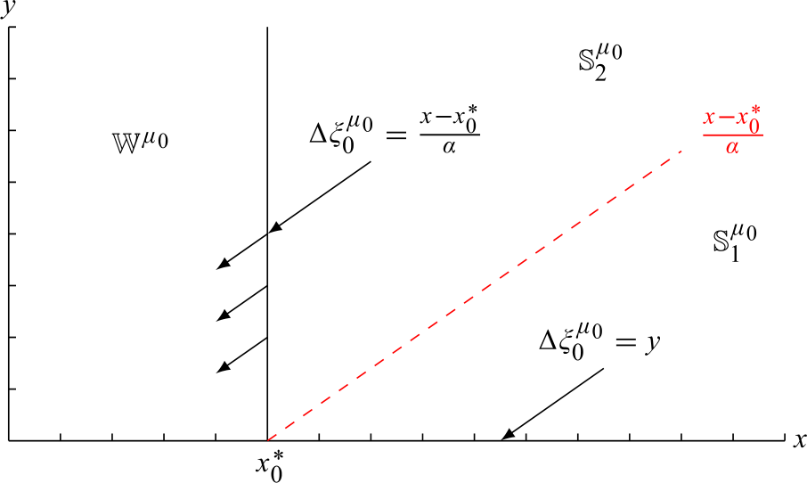

## Table of Contents

## What is optimal stopping in the context of execution?

Optimal stopping in the context of execution is about deciding the best time to take action. Imagine you are trying to sell your house. You want to get the best price, but you also don't want to wait forever. Optimal stopping helps you figure out when to stop looking for better offers and accept the current one. It's like a strategy to balance between waiting for a better opportunity and acting on what you have now.

This concept is used in many areas, like hiring employees or investing in stocks. For example, when hiring, you might interview many candidates. Optimal stopping helps you decide when to stop interviewing and hire someone. If you wait too long, you might miss out on good candidates. But if you decide too quickly, you might not find the best person. It's all about finding the right moment to make your move.

## Why is optimal stopping important in decision-making processes?

Optimal stopping is important in decision-making because it helps you make the best choice without wasting time. Imagine you're trying to pick the best apple from a tree. If you keep looking for a perfect apple, you might never pick one because there's always a chance a better one is out there. But if you stop too soon, you might miss out on a really good apple. Optimal stopping gives you a way to balance this, so you can feel confident about your choice.

In real life, this can make a big difference. For example, when you're job hunting, you don't want to keep looking forever for the perfect job, but you also don't want to take the first offer if it's not good enough. Optimal stopping helps you figure out when to stop looking and take a job that's good enough. This can save you time and help you avoid missing out on good opportunities.

## Can you explain the basic principles of optimal stopping with a simple example?

Imagine you're at a fair and you want to play a game where you pick the tallest sunflower out of 100 sunflowers. You can look at them one by one, but once you pass a sunflower, you can't go back to it. The trick is to decide when to stop looking and pick the sunflower you're looking at. If you pick too early, you might miss a taller one. If you wait too long, you might end up with a shorter one.

A good way to do this is to first look at the first 37 sunflowers without [picking](/wiki/asset-class-picking) any. This helps you get a sense of how tall the sunflowers are. After that, you keep looking at the rest of the sunflowers, and you pick the first one that's taller than the tallest one you saw in the first 37. This method gives you a good chance of picking one of the tallest sunflowers without looking at all of them. It's not perfect, but it's a smart way to make a decision when you can't see everything at once.

## What are some common applications of optimal stopping in real-life scenarios?

One common use of optimal stopping is in job hunting. When you're looking for a job, you want to find the best one, but you can't keep looking forever. Optimal stopping helps you figure out when to stop searching and take a job offer. You might look at the first few offers to get an idea of what's out there. Then, you can decide to take the next offer that's better than the best one you've seen so far. This way, you don't miss out on good jobs while still giving yourself a chance to find a great one.

Another application is in dating. When you're trying to find a partner, you might go on many dates. Optimal stopping can help you decide when to stop looking and commit to someone. You might date a few people first to see what you like. Then, you can choose to be with the next person who's better than the best you've dated so far. This helps you avoid endless dating while still trying to find a good match.

Optimal stopping is also used in investing. When you're buying stocks, you want to get the best price, but you can't wait forever. You might watch the market for a while to see how prices move. Then, you can decide to buy when the price is better than the best you've seen during your observation period. This strategy helps you make a smart investment without missing out on good opportunities.

## How does the 'Secretary Problem' relate to optimal stopping?

The 'Secretary Problem' is a famous example of optimal stopping. Imagine you're hiring a secretary and you have to interview 100 candidates. You can only hire one, and you have to make your decision as soon as you interview someone. If you pass on someone, you can't go back. The goal is to pick the best candidate. The best strategy is to look at the first 37 candidates without hiring anyone. This helps you see what kind of candidates are out there. After that, you hire the first candidate who is better than the best of the first 37. This method gives you a good chance of picking the best candidate without looking at everyone.

This problem is a lot like the sunflower example I mentioned earlier. Both are about deciding when to stop looking and make a choice. In real life, the Secretary Problem can help with decisions like job hunting or dating. You look at some options first to get an idea of what's good, then you pick the next one that's better than the best you've seen so far. It's a simple but powerful way to make decisions when you can't see everything at once.

## What mathematical models are used to solve optimal stopping problems?

One common mathematical model used to solve optimal stopping problems is the 'threshold rule'. Imagine you're trying to pick the best apple from a tree. You look at some apples first without picking any. This helps you figure out what a good apple looks like. Then, you pick the next apple that's better than the best one you saw in the first group. The math behind this is about figuring out how many apples to look at before you start picking. It's like a game of setting a 'threshold' and waiting for something better than that to come along.

Another model is the 'dynamic programming' approach. This is like planning a trip where you need to decide when to stop at different places along the way. You look at all the possible stops and figure out the best time to stop based on what you know so far. As you move forward, you keep updating your plan. The math here is about making the best choice at each step by thinking about what might happen next. It's a bit like playing chess, where you think several moves ahead to make the best decision now.

## How can one calculate the expected value in an optimal stopping scenario?

To calculate the expected value in an optimal stopping scenario, you need to think about the average outcome you can expect if you follow a certain strategy. Imagine you're trying to pick the best apple from a tree. You look at some apples first without picking any, then you pick the next apple that's better than the best one you saw in the first group. The expected value is like the average size of the apple you'll end up with if you do this many times. You calculate it by figuring out all the possible outcomes and their chances of happening, then taking the average of those outcomes.

For example, let's say you're playing the Secretary Problem with 100 candidates. You look at the first 37 candidates without hiring anyone, then hire the first candidate who's better than the best of those 37. To find the expected value, you'd need to consider all the possible outcomes. If the best candidate is among the first 37, you won't hire them, so your expected value will be lower. But if the best candidate comes after the first 37 and is better than the best of those 37, you'll hire them, which makes your expected value higher. You add up all these possibilities, weighted by how likely they are to happen, to get the average outcome, which is your expected value.

## What are the differences between continuous and discrete time optimal stopping problems?

In discrete time optimal stopping problems, you make decisions at specific moments, like choosing a job after looking at a set number of offers. Imagine you're picking the best apple from a tree. You look at the first few apples, then decide to pick the next one that's better than the best you've seen so far. Each apple you look at is like a moment in time where you can make a choice. The math behind this involves figuring out the best time to stop based on what you know at each step. It's like a game where you can only move forward and need to decide when to stop.

In continuous time optimal stopping problems, you can make decisions at any moment, not just at set times. Think of it like watching a river flow and deciding when to catch a fish. You can choose to stop at any point, not just after looking at a certain number of fish. The math here is more complex because you need to consider what might happen at any moment. It's like planning a trip where you can stop whenever you want, and you need to figure out the best time to do so based on what you see along the way.

## How do you implement optimal stopping strategies in algorithmic trading?

In [algorithmic trading](/wiki/algorithmic-trading), optimal stopping strategies help you decide when to buy or sell stocks. Imagine you're watching the stock market like a river flowing. You want to catch the fish (stocks) at the best time. You might look at how the stock price moves for a while without buying or selling. This helps you understand what a good price looks like. Then, you can decide to buy or sell when the price is better than the best you've seen during your observation period. This way, you don't miss out on good opportunities while still trying to get the best deal.

Using a computer to do this can be really helpful. The computer can watch the stock prices all the time and make decisions based on what it sees. It can use math to figure out the best time to stop looking and make a trade. This is like setting a trap in the river and waiting for the right fish to come along. The computer keeps updating its plan based on new information, so it can make the best choice at any moment. This makes trading more efficient and helps you make better decisions.

## What are the challenges in applying optimal stopping to complex systems?

Applying optimal stopping to complex systems can be really hard because these systems have a lot of moving parts. Imagine you're trying to pick the best apple from a huge orchard where the apples keep growing and changing. In complex systems, like big companies or the stock market, things are always changing. You need to look at a lot of information to make a good choice. Sometimes, the information is not clear or it's hard to tell what's important. This makes it tough to know when to stop looking and make a decision.

Another challenge is that complex systems often have many different outcomes that can happen. It's like trying to predict the weather in a place where it can be sunny, rainy, or stormy all at once. You have to think about all these possibilities and how likely they are. This can make the math really complicated. Plus, you might need to make decisions quickly, so you don't have a lot of time to think. All these things together make it hard to use optimal stopping in complex systems, but if you can do it well, it can help you make better choices.

## How can machine learning enhance optimal stopping strategies?

Machine learning can make optimal stopping strategies better by helping us learn from lots of data. Imagine you're trying to pick the best apple from a tree. You've done this many times before, and you've kept track of when you picked apples and how good they were. Machine learning can look at all this information and figure out the best time to stop looking and pick an apple. It can find patterns that you might miss, like certain times of day when bigger apples are more likely to be found. This way, [machine learning](/wiki/machine-learning) helps you make smarter choices based on what you've learned from the past.

Another way machine learning helps is by making decisions in real-time. In the stock market, prices change all the time, and you need to decide when to buy or sell quickly. Machine learning can watch these changes and use what it knows to decide the best time to stop looking and make a trade. It's like having a smart friend who can keep an eye on everything and tell you when to act. This makes your strategy more flexible and can lead to better results, especially in situations where things are always changing.

## What advanced techniques exist for optimizing stopping rules in stochastic environments?

In a world where things keep changing and you can't predict everything, optimizing when to stop looking and make a choice can be tough. One advanced technique is called '[reinforcement learning](/wiki/reinforcement-learning).' It's like learning from experience. Imagine you're playing a game where you need to decide when to stop and pick up a prize. You try different times to stop, and the game tells you how good your choice was. Over time, you learn when the best time to stop is. Reinforcement learning helps computers do this too, by letting them try different stopping rules and learn from the results.

Another technique is 'Monte Carlo simulation.' This is like playing the game many times in your head to see what might happen. You imagine all the different ways things could go and see how well your stopping rule works in each case. By doing this many times, you can figure out the best rule to use. It's like practicing a lot so you know what to expect and can make the best choice when the time comes. Both of these methods help you make better decisions in situations where you can't see everything that's going to happen.

## What are the strategies for optimal execution?

Strategies for optimal execution in algorithmic trading are essential for minimizing market impact and avoiding inefficiencies in trade execution. Among the popular techniques are TWAP (Time-Weighted Average Price) and VWAP (Volume-Weighted Average Price), both of which aim to break down large trades into smaller orders over time to seamlessly integrate into the market. 

TWAP operates by dividing a trade uniformly over a specified duration, ignoring [volume](/wiki/volume-trading-strategy) fluctuations and focusing solely on time. This can be advantageous in stable markets where price and volume remain consistent. The TWAP of a trade can be mathematically expressed as:

$$
\text{TWAP} = \frac{1}{N} \sum_{i=1}^{N} P_i
$$

where $P_i$ is the price at each time interval, and $N$ is the total number of intervals.

Conversely, VWAP focuses on the volume and aims to execute trades in proportion to the trading volume, ensuring better alignment with market activity. The VWAP is calculated as:

$$
\text{VWAP} = \frac{\sum_{i=1}^{N} P_i \times V_i}{\sum_{i=1}^{N} V_i}
$$

where $V_i$ represents the trading volume at each price point $P_i$.

Beyond these conventional strategies, advanced algorithms leverage historical and real-time data, adapting execution strategies in response to current and predicted market conditions. By analyzing patterns and trends, these algorithms can anticipate market shifts and modify trade execution accordingly.

Another approach involves using hidden orders and stacking the book, where trades are placed within the bid-ask spread without revealing their full size to the market. This reduces visibility to predatory and high-frequency trading algorithms, which may exploit large visible orders. Through hidden orders, traders execute transactions with minimal market disturbance, maintaining strategic discretion.

The implementation of these advanced strategies often leverages programming languages like Python for algorithm development. Here's a simple Python snippet illustrating a basic run of a VWAP calculation:

```python
def calculate_vwap(prices, volumes):
    weighted_price_volume = [p * v for p, v in zip(prices, volumes)]
    total_volume = sum(volumes)
    vwap = sum(weighted_price_volume) / total_volume
    return vwap

prices = [100, 102, 101, 103]
volumes = [150, 80, 200, 170]
vwap = calculate_vwap(prices, volumes)
print("VWAP:", vwap)
```

In summary, selecting the right execution strategy is pivotal for mitigating market impact and enhancing trade efficiency. Utilization of both traditional and sophisticated techniques caters to specific market conditions and execution goals, illustrating the adaptability required in the evolving landscape of algorithmic trading.

## References & Further Reading

[1]: Bellman, R. (1957). ["Dynamic Programming."](https://archive.org/details/dynamicprogrammi0000bell) Princeton University Press.

[2]: Gatheral, J. (2010). ["The Volatility Surface: A Practitioner's Guide."](https://onlinelibrary.wiley.com/doi/book/10.1002/9781119202073) Wiley.

[3]: O'Hara, M. (1997). ["Market Microstructure Theory."](https://www.amazon.com/Market-Microstructure-Theory-Maureen-OHara/dp/0631207619) Blackwell.

[4]: Mancino, M. E., & Malliavin, P. (2003). ["Fourier transform method for nonparametric estimation of multivariate volatility."](https://www.semanticscholar.org/paper/Fourier-series-method-for-measurement-of-Malliavin-Mancino/69068f5d5602c774740e8768244ae97f3583bf37) Finance and Stochastics, 7(4), 451-470.

[5]: Kissell, R. (2013). ["The Science of Algorithmic Trading and Portfolio Management."](https://www.sciencedirect.com/book/9780124016897/the-science-of-algorithmic-trading-and-portfolio-management) Academic Press.

[6]: Lopez de Prado, M. (2018). ["Advances in Financial Machine Learning."](https://www.amazon.com/Advances-Financial-Machine-Learning-Marcos/dp/1119482089) Wiley.

[7]: Cartea, Á., Jaimungal, S., & Penalva, J. (2015). ["Algorithmic and High-Frequency Trading."](https://assets.cambridge.org/97811070/91146/frontmatter/9781107091146_frontmatter.pdf) Cambridge University Press.