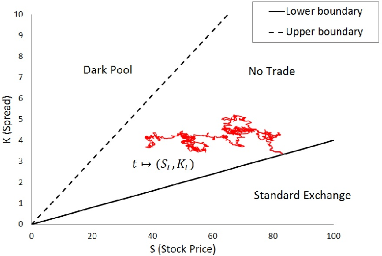

Optimal stopping, in the context of algorithmic trading, refers to a decision-making process that determines when to take a particular action, such as entering or exiting a trade, to achieve the maximum expected reward or to minimize potential losses. This concept is rooted in mathematical finance and statistics, where it forms a critical part of the decision framework used by trading algorithms. The importance of optimal stopping lies in its ability to guide traders on the timing of transactions, which can significantly impact the profitability of trading strategies. In highly dynamic and volatile markets, identifying the optimal entry and exit points is crucial as minor changes in timing can result in substantial differences in trade outcomes.

Optimal stopping provides a structured methodology for trading decisions. It employs a mathematical framework that quantifies the potential benefits and risks of holding or selling assets at any given time. This is achieved through creating models that evaluate uncertainties and forecast future price movements based on historical data and market conditions. By defining a stopping rule—criteria that govern the execution of buy or sell actions—traders can systematically approach even the most complex trading environments.



In modern trading platforms, the popularity and necessity of optimal stopping methods have been underscored by their integration into algorithmic strategies. With increasing access to advanced computational resources and data, traders and financial institutions harness these mathematical tools to enhance decision-making efficiency. As markets grow more sophisticated, the need for precise entry and exit strategies becomes ever more apparent, solidifying optimal stopping as an indispensable component of contemporary algorithmic trading systems.

## Table of Contents

## Understanding Optimal Stopping Theory

Optimal stopping theory is a mathematical framework used to determine the best time to take a particular action in order to maximize expected outcomes. This theory is rooted in probability and statistical theories, originating from efforts to solve problems involving decision-making over time under uncertainty. The fundamental challenge of optimal stopping is to decide when to stop a process in order to achieve the optimal result, such as maximizing profit or minimizing cost.

The role of optimal stopping in evaluating the timing of actions is crucial for achieving the best financial outcomes. In financial markets, the ability to determine the precise moment to enter or exit a trade can significantly impact the profitability of trading strategies. By utilizing optimal stopping theory, traders can develop systematic methods to make these timing decisions based on mathematical algorithms and probabilistic analysis.

The main components of optimal stopping theory include the stopping rule and optimal stopping time. A stopping rule is a set of criteria or a strategy that guides the decision to stop the process at a particular time. For instance, in a trading scenario, a stopping rule might dictate selling a stock when its price reaches a certain threshold or when specific market indicators provide a signal.

Optimal stopping time, on the other hand, refers to the specific point in time at which the expected value of taking an action, such as selling an asset, is maximized. This involves calculating the point where the expected returns are greater than the potential future gains from continuing the current strategy.

Mathematically, the optimal stopping problem can be expressed in terms of maximizing the expected payoff. Consider a sequence $X_1, X_2, \ldots, X_n$ representing potential payoffs at different time periods. The objective is to determine a stopping time $\tau$ to maximize the expected value $E[X_\tau]$, where $\tau$ is a random variable representing the decision time. This problem can often be solved using tools such as dynamic programming and involves calculating the Bellman equation to find the solution.

In summary, optimal stopping theory provides a structured mathematical approach to evaluate the timing of actions in order to achieve the best possible financial outcomes. The framework's main components—the stopping rule and optimal stopping time—are integral to crafting effective decision-making strategies in financial markets. This theory guides traders in systematically determining when to act, helping optimize trading strategies and improve financial results.

## Key Concepts: Stopping Rule and Optimal Stopping Time

A stopping rule is a crucial concept in optimal stopping theory, particularly when applied to [algorithmic trading](/wiki/algorithmic-trading). It consists of a predefined set of criteria or conditions that dictate the most advantageous timing for buying or selling financial assets. The effectiveness of a stopping rule lies in its ability to assess various market indicators and financial data in order to guide trading decisions that aim to optimize profitability or minimize losses.

Optimal stopping time is another fundamental element in this context. It refers to the specific moment identified through algorithmic analysis when the expected value of taking an action, such as selling a stock, reaches its maximum. Establishing an optimal stopping time is essential for traders seeking to enhance their financial performance since it directly affects the outcome of their transactions. This calculated point is determined by evaluating factors like market trends, asset [volatility](/wiki/volatility-trading-strategies), and historical data patterns to predict future price movements accurately.

These concepts are integral to creating effective trading strategies because they provide a structured approach to decision-making. By employing stopping rules and determining optimal stopping times, traders can systematize the process of entering and exiting trades. This systematic approach reduces uncertainties associated with market fluctuations by relying on quantitative analysis rather than intuition or emotion-driven decisions. 

Incorporating these principles into trading strategies often involves mathematical models and computational algorithms. For example, Python code can be utilized to simulate various scenarios, evaluate potential outcomes, and identify the optimal stopping time for a given asset. This quantitative framework allows for more consistent and objective trading decisions.

By understanding and applying the principles of stopping rules and optimal stopping time, traders can significantly improve their strategies, ensuring that decisions are made based on rigorous analysis and thorough evaluation of market conditions. These concepts provide a solid foundation for constructing robust and effective trading algorithms designed to operate in diverse and dynamic financial environments.

## Mathematical Formulation of the Optimal Stopping Problem

The mathematical formulation of the optimal stopping problem is crucial for algorithmic trading. It involves determining when to take a particular action to optimize expected rewards, often under uncertain conditions. Central to this framework are concepts like the objective function, state process, and Bellman equation.

1. **Objective Function**: The objective function represents the ultimate goal, typically involving the maximization of expected returns or minimization of risks. In formal terms, it is described as:
$$
   \max_{\tau} \mathbb{E}[X_{\tau}]

$$

   Here, $\tau$ is the stopping time chosen from a set of possible times, and $X_{\tau}$ represents the value of the asset at time $\tau$. The goal is to find $\tau$ that maximizes the expected value of the asset or the payoff.

2. **State Process**: This refers to the random process describing the evolution of the system over time. In financial markets, it can denote asset prices evolving according to certain stochastic models, such as Geometric Brownian Motion (GBM). A typical representation of a state process is:
$$
   dS_t = \mu S_t dt + \sigma S_t dW_t

$$

   Here, $S_t$ is the asset price at time $t$, $\mu$ is the drift coefficient, $\sigma$ is the volatility, and $dW_t$ is a Wiener process. Understanding these dynamics is essential for predicting future market movements and forming the basis for determining the optimal stopping time.

3. **Bellman Equation**: Instrumental in solving optimal stopping problems, the Bellman equation captures the principle of dynamic programming. It expresses the value function, $V(t, S_t)$, as:
$$
   V(t, S_t) = \max \{ \phi(S_t), \mathbb{E}[V(t + \Delta t, S_{t + \Delta t})|S_t] \}

$$

   In this equation, $\phi(S_t)$ is the immediate payoff from stopping at time $t$, and the second term represents the expected value if the decision to stop is deferred. The challenge is to compute the value function across different states and times to determine the optimal stopping policy.

These mathematical formulations serve to model trading strategies by predicting the right moments to buy or sell based on expected outcomes. By employing these mathematical structures, traders can effectively anticipate market conditions and make informed timing decisions. The integration of objective functions, state processes, and Bellman equations into algorithmic frameworks allows for the development of sophisticated models to navigate the complexities of financial markets and optimize trading performance.

## Applications in Algorithmic Trading

Optimal stopping theory finds valuable applications in algorithmic trading by influencing decisions on market timing, option exercises, and real-time trading algorithms. These applications optimize trading strategies, enhancing profitability and risk management.

### Market Timing

Market timing involves deciding the optimal moments to enter or [exit](/wiki/exit-strategy) a market position. Optimal stopping theory supports traders in predicting these points to maximize returns or minimize losses. By evaluating historical price data and predicting future market trends, traders can develop strategies that help ascertain the right moments to act. For example, a trader might use a stopping rule based on achieving a specific return or hitting a certain volatility threshold, thereby informing buy or sell decisions.

### Option Exercises

In the context of options trading, optimal stopping theory assists in making informed decisions about the timing of exercising American options, which can be executed at any point before expiration. Here, optimal stopping time is crucial to determine the most advantageous moment to exercise an option. The goal is to maximize the payoff by choosing a point where the intrinsic value of exercising exceeds future expected payoffs. Using numerical methods or simulation-based approaches, traders can create models to derive optimal stopping rules that guide these exercises, improving the overall profitability of options portfolios.

### Real-Time Trading Algorithms

Real-time trading algorithms benefit significantly from optimal stopping theory by enabling automated systems to make instantaneous decisions on buying or selling assets based on predefined criteria. This involves continuously monitoring market data streams and applying computational algorithms to identify optimal stopping points. For instance, in algorithmic stock trading, a system might execute trades automatically when certain technical indicators, such as moving averages or Bollinger Bands, signal optimal market conditions.

Below is a simple Python example illustrating the implementation of a basic stopping rule in an algorithmic trading system:

```python
import pandas as pd

# Load historical price data
data = pd.read_csv('price_data.csv')
prices = data['Close']

# Define a simple moving average stopping rule
window_size = 10
moving_average = prices.rolling(window=window_size).mean()

# Determine optimal stopping points based on moving average crossover
buy_signals = (prices > moving_average) & (prices.shift() <= moving_average.shift())
sell_signals = (prices < moving_average) & (prices.shift() >= moving_average.shift())

# Execute trades at stopping points
for i in range(len(prices)):
    if buy_signals[i]:
        print(f"Buy signal on day {i}")
    elif sell_signals[i]:
        print(f"Sell signal on day {i}")
```

In essence, optimal stopping theory equips traders with a robust mathematical foundation to improve decision-making processes across various trading scenarios. By applying these strategies, traders can potentially enhance their trading performance and achieve their financial objectives.

## Practical Implementations and Industry Use Cases

Financial institutions and trading platforms have increasingly adopted optimal stopping theory in their algorithmic trading strategies to enhance decision-making related to trade entries and exits. This section explores how some well-known companies utilize this mathematical framework to better their market performance.

Optiver, a proprietary trading firm, is renowned for integrating sophisticated mathematical models, including optimal stopping theory, into its trading systems. The firm applies this theory to optimize the timing of trade executions by evaluating real-time market data and predicting short-term price movements. By doing so, Optiver can make informed decisions on when to initiate or terminate trades, thereby improving the returns on their high-frequency trading activities.

Similarly, Jane Street, another leader in [quantitative trading](/wiki/quantitative-trading), employs optimal stopping frameworks as a core component of its trading strategy formulations. The theory informs the development of Jane Street's trading algorithms, which assess the best times to buy or sell financial instruments, such as stocks and options. These algorithms incorporate continuous market analysis and predictive models to determine the optimal stopping time, maximizing profits and minimizing market risk exposure.

Renaissance Technologies is also a prominent user of advanced mathematical theories in trading, and optimal stopping is a crucial part of its strategy. The firm uses predictive analytics to analyze large volumes of historical pricing data, identifying trends and patterns that signal optimal buy or sell points. By applying optimal stopping principles, Renaissance Technologies can ensure that its trading actions are aligned with expected market movements, allowing the firm to achieve superior trading outcomes.

All these companies effectively demonstrate how integrating optimal stopping theory into trading models can significantly enhance results. By systematically applying established mathematical techniques to predict market trends and determine ideal trading times, these firms succeed in achieving robust financial performance. This application of optimal stopping not only provides a competitive edge but also exemplifies the seamless fusion of mathematics and technology in modern financial markets.

## Conclusion

Optimal stopping theory plays a crucial role in optimizing algorithmic trading strategies, offering a mathematical approach to determine the most opportune times for executing trades. By leveraging mathematical models and computational algorithms, such as the Bellman equation, traders can significantly refine their decision-making processes. These models enable the anticipation of future market movements and the calculation of expected values tied to various actions, aiding traders in pinpointing the precise moments to enter or exit a trade to maximize returns or mitigate risks.

The integration of optimal stopping theory within trading strategies provides a systematic way to handle uncertainty and variability in financial markets. Rather than relying on intuition or heuristic methods, traders can apply rigorous quantitative frameworks that consistently evaluate market conditions and respond accordingly. This practice not only enhances the precision of trading decisions but also supports the development of automated trading systems, which are indispensable in the fast-paced environment of modern financial markets.

Encouraging traders to adopt such frameworks can lead to substantial improvements in overall trading success. By embedding optimal stopping principles into their strategies, traders can achieve a more disciplined approach in managing portfolios, fostering better performance metrics through increased efficiency and reduced emotional bias. Moreover, the continual refinement of these models through computational advancements ensures that traders remain adaptable to evolving market dynamics, further solidifying the importance of optimal stopping in the ever-changing landscape of algorithmic trading.

## References & Further Reading

[1]: Peskir, G., & Shiryaev, A. (2006). ["Optimal Stopping and Free-Boundary Problems."](https://link.springer.com/book/10.1007/978-3-7643-7390-0) Birkhäuser.

[2]: Hull, J. C. (2018). ["Options, Futures, and Other Derivatives"](https://www.semanticscholar.org/paper/Options%2C-Futures%2C-and-Other-Derivatives-Hull/89bdee500c8623864fc9eb7a471546aa713acc44) (9th ed.). Pearson.

[3]: Bertsekas, D. P. (2000). ["Dynamic Programming and Optimal Control, Vol. I"](https://www.mit.edu/~dimitrib/dpbook.html) Athena Scientific.

[4]: Shreve, S. E. (2004). ["Stochastic Calculus for Finance II: Continuous-Time Models."](https://link.springer.com/book/9780387401010) Springer.

[5]: Glasserman, P. (2003). ["Monte Carlo Methods in Financial Engineering."](https://link.springer.com/book/10.1007/978-0-387-21617-1) Springer.