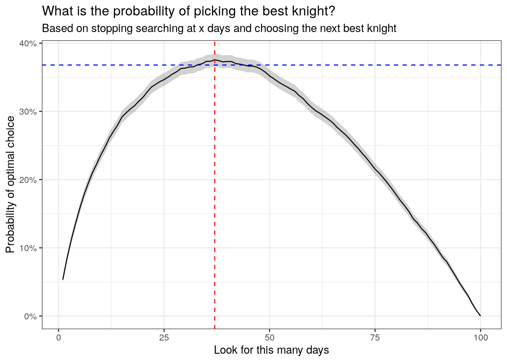

Algorithmic trading, a sophisticated domain within financial markets, relies heavily on decision-making problems known as optimal stopping problems. These problems are concerned with the challenge of determining the most advantageous moment to cease observing a stochastic process in order to either maximize expected rewards or minimize expected costs associated with trading decisions.

In essence, optimal stopping problems compel traders to decide the precise time to execute trades, thereby enhancing the potential for better financial outcomes. This involves intricate mathematical models and theories that guide traders in recognizing these optimal moments amidst volatile market conditions. The strategic timing afforded by optimal stopping theory can significantly influence the profitability and risk management strategies employed by algorithmic traders.



This article serves as an introduction to optimal stopping problems and their critical role in the field of algorithmic trading. It outlines the mathematical principles underpinning these problems, providing insight into how they can be harnessed to inform trading strategies. Through examples and discussions of various solution methods, the text offers a comprehensive overview of how optimal stopping is applied within trading algorithms to bolster decision-making processes. By understanding these foundational concepts, traders and researchers alike can optimize their approach to executing trades, potentially leading to superior financial performance in trading activities.

## Table of Contents

## Understanding Optimal Stopping Problems

Optimal stopping problems are central to sequential decision-making processes where the timing of actions significantly impacts outcomes. These problems involve deciding when to cease observing a stochastic process to maximize expected rewards or minimize expected costs. Optimal stopping principles are applicable in various domains such as statistics for hypothesis testing, economics for investment appraisals, and mathematical finance for option pricing.

In the context of algorithmic trading, optimal stopping problems are pivotal for effectively timing trade executions to maximize profitability. Traders need to decide the optimal moment to buy or sell assets, considering fluctuating market conditions. The ability to determine when to execute trades based on algorithmic strategies often distinguishes successful trading from less effective approaches.

Optimal stopping problems are typically categorized into discrete and continuous time scenarios. In discrete time, decisions are made at specific intervals, while in continuous time, decisions can occur at any point. For discrete time, consider a sequence of i.i.d. random variables $X_1, X_2, \ldots, X_n$ representing asset prices observed at different times. The problem is to find a stopping time $\tau$ that maximizes the expected payoff function $\mathbb{E}[X_\tau]$.

In continuous time, the situation is more complex as observations occur in a continuous manner. Here, stochastic calculus and advanced mathematical tools are used to model the sequential decision framework. The aim is to determine a stopping time that optimizes the expected outcome of an investment or trading strategy continuously evaluated over time.

The theoretical exposition of these problems lays the foundation for developing algorithms that can strategically determine optimal trade timings. Understanding the mathematical formulation of these problems is crucial for translating theoretical insights into practical trading strategies, ultimately enhancing financial decision-making and outcome optimization in the world of [algorithmic trading](/wiki/algorithmic-trading).

## Discrete Time Optimal Stopping

In discrete time stopping problems, decision-making occurs at specific intervals or time steps. Traders evaluate sequences of random variables, such as stock prices, with the aim of identifying the right moment to implement a trading action, like selling a stock or exercising an American option. This decision hinges on expected rewards, which are weighed against the potential risks stemming from adverse price fluctuations. 

To tackle these problems, stopping rules are employed, designed to optimize decisions by striking a balance between projected gains and associated risks. For instance, if a trader is observing the fluctuating prices of a stock, a stopping rule might suggest selling when the price surpasses a certain threshold or if the expected drop in price outweighs potential gains from holding the position longer. Such rules are crucial in maximizing financial outcomes by preventing premature or delayed actions that might lead to suboptimal results.

Dynamic programming is a widely-used methodology for solving discrete time optimal stopping problems. It involves breaking down the problem into smaller, manageable subproblems and solving them recursively. This approach is instrumental in deriving the optimal stopping rule by systematically evaluating each possible decision at different stages of the timeline. The Snell envelope is another pivotal concept in this context, serving as a tool to determine the optimal stopping strategy. It represents the highest expected reward achievable, starting from any given point in time.

Consider a simple example involving an American option, which gives the holder the right to exercise the option at any time before its expiration. The decision on when to exercise the option can be framed as a discrete time optimal stopping problem. The trader must observe the evolving prices to decide the optimal moment to exercise the option, maximizing the payoff.

In Python, a basic dynamic programming setup to solve a simple discrete time optimal stopping problem can be illustrated as follows:

```python
import numpy as np

# Example: Optimal stopping problem with random stock prices
np.random.seed(42)
stock_prices = np.random.randint(90, 110, size=10)
n = len(stock_prices)
dp = np.zeros(n)

# Backward induction to fill dp array
dp[-1] = max(stock_prices[-1], 0)  # Base case
for i in range(n - 2, -1, -1):
    dp[i] = max(stock_prices[i], dp[i + 1])

optimal_decision = np.argmax(dp)  # Index of optimal stopping
print(f"Optimal stopping at time step: {optimal_decision}, Stock price: {stock_prices[optimal_decision]}")
```

This code snippet simulates random stock prices and utilizes dynamic programming to find the optimal stopping point that maximizes the reward. Such computational techniques underscore the importance of systematic and rational decision-making in trading, facilitated by mathematical models and algorithms.

## Continuous Time Optimal Stopping

Continuous time optimal stopping problems involve decision-making where changes in variables occur continuously. This setting demands advanced mathematical tools to accurately model the evolving nature of financial markets. The primary objective in continuous time problems is determining an optimal stopping time that either maximizes expected returns or minimizes potential losses over a continuous timeline.

A crucial component in these problems is the value function, which denotes the maximum expected reward achievable from any given state. Mathematically, the value function $V(t, X_t)$ is defined as:

$$
V(t, X_t) = \sup_{\tau \geq t} \mathbb{E}\left[g(\tau, X_\tau) \mid X_t\right]
$$

where $X_t$ represents the state of the process at time $t$, and $g(\tau, X_\tau)$ is the reward function contingent on stopping at time $\tau$.

In continuous time, one frequently employs stochastic calculus to address these problems. Processes are often modeled using stochastic differential equations (SDEs), which serve to describe the dynamics of the underlying process:

$$
dX_t = \mu(t, X_t) dt + \sigma(t, X_t) dW_t
$$

Here, $\mu(t, X_t)$ corresponds to the drift term, $\sigma(t, X_t)$ to the [volatility](/wiki/volatility-trading-strategies) term, and $dW_t$ is a Wiener process increment. The solution involves finding a stopping rule, often identified using techniques like the Itô calculus and Hamilton-Jacobi-Bellman (HJB) equations. The HJB equation provides conditions under which the value function is maximized, often leading to boundary conditions that guide the optimal stopping strategy.

Applications of continuous time optimal stopping are varied in algorithmic trading and can include high-frequency trading, where decisions must be made rapidly in response to real-time data. Long-term investment strategies similarly benefit from continuous time modeling by optimizing the timing of asset liquidation or reallocation decisions. Implementing these models often involves numerical methodologies for solving partial differential equations (PDEs) or Monte Carlo simulations to approximate optimal stopping times and corresponding value functions.

For instance, in high-frequency trading, algorithms might continuously monitor asset price movements, utilizing statistical [arbitrage](/wiki/arbitrage) strategies to initiate trades at precise moments when the expected return justifies the transaction costs and potential risk. Here's a simplified Python snippet illustrating a basic concept:

```python
import numpy as np

def simulate_price_path(S0, mu, sigma, T, dt):
    steps = int(T / dt)
    prices = np.zeros(steps)
    prices[0] = S0
    for t in range(1, steps):
        prices[t] = prices[t-1] * np.exp((mu - 0.5 * sigma ** 2) * dt + sigma * np.sqrt(dt) * np.random.normal())
    return prices

def optimal_stopping(prices, stop_threshold):
    for i, price in enumerate(prices):
        if price >= stop_threshold:
            return i, price
    return len(prices) - 1, prices[-1]

# Simulation parameters
S0 = 100  # Initial stock price
mu = 0.05  # Expected return
sigma = 0.2  # Volatility
T = 1.0  # Time horizon in years
dt = 1/252  # Daily steps

prices = simulate_price_path(S0, mu, sigma, T, dt)
stop_day, stop_price = optimal_stopping(prices, 110)
```

In this example, the code simulates a stock price path and determines the first day when the price exceeds a predefined threshold, illustrating a basic stopping decision framework. Such implementations underscore the intricate balance between theoretical optimization and practical application in the dynamic environment of financial markets.

## Solution Methods for Optimal Stopping

In the study of optimal stopping problems, two principal methodologies are prevalently used to derive solutions: the martingale approach and the Markov process method. These strategies utilize different mathematical tools and are especially pertinent in the context of algorithmic trading.

The martingale approach primarily involves the use of probabilistic techniques to identify the optimal stopping rule. A key component of this method is the Snell envelope, which provides the optimal strategy by essentially computing the maximum expected payoff achievable from any given point in time. This approach is powerful in determining when future gains outweigh potential immediate rewards. The Snell envelope can be mathematically expressed as:

$$
S_n = \max(E[X_{n} | \mathcal{F}_k], X_n)
$$

where $X_n$ represents the sequence of rewards, and $\mathcal{F}_k$ denotes the information available at time $k$.

Dynamic programming is a crucial aspect under the broader umbrella of the martingale approach, particularly useful in discrete time scenarios with a finite planning horizon. It involves breaking down a larger problem into simpler subproblems and solving each subproblem just once, storing its solution – typically utilizing a recursive algorithm to determine the value function. This value function reflects the optimal payoff from any starting position and time, facilitating the determination of the best stopping time.

In contrast, handling continuous time processes often necessitates the application of the Markov process method. This approach is instrumental for problems where the decision framework is parameterized by continuous variables rather than discrete ones. Markov methods rely on the transition functions of processes and are valuable when modeling the continuous progression of random variables, such as stock prices, in financial markets. The Markov process method aims to solve Hamilton-Jacobi-Bellman equations to ascertain the value function for a given problem.

In the context of algorithmic trading strategies, these methodological approaches are employed to optimize trade execution timing relative to market conditions. The Snell envelope can be used to inform decisions in scenarios where price observations occur at discrete intervals, guiding traders on when to sell an asset or exercise a derivative. On the other hand, the Markov model is crucial for high-frequency trading strategies where decisions must adapt to continuously fluctuating market dynamics.

Illustrating these techniques, consider an option trading scenario where one must decide the optimal time to exercise an American option. The option holder observes the underlying asset's price over time and aims to exercise the option to maximize expected returns. Implementing a Snell envelope allows one to determine the precise point in time when exercising the option yields the highest payoff, accounting for future expected prices and inherent risks. Similarly, in continuous trading situations, the Markov process provides traders with a probabilistic model to identify optimal entry and [exit](/wiki/exit-strategy) points by considering the stock price's continuous path.

Overall, the martingale and Markov methods are indispensable tools in addressing optimal stopping problems, providing traders with structured frameworks and quantitative techniques to enhance decision-making processes and optimize financial outcomes in algorithmic trading.

## Examples in Algo Trading

Optimal stopping problems are prevalent in algorithmic trading, significantly impacting decision-making processes in various trading contexts, notably in options trading. In options trading, the decision of when to exercise an option is pivotal for maximizing returns. An option grants the holder the right to buy or sell an asset at a specified price before a set expiration date. Determining the optimal time to exercise this right under uncertainty involves solving an optimal stopping problem, which seeks to maximize the expected payoff.

Simplified examples, such as the Secretary Problem and the House Selling Problem, provide foundational insights into optimal stopping theory. The Secretary Problem models a scenario where an employer seeks to choose the best secretary from a line of applicants arriving sequentially. Similarly, the House Selling Problem involves deciding the right time to sell a property to maximize profit. Both problems underscore the necessity of balancing immediate rewards against the opportunity for future gains, a principle directly applicable to trading scenarios.

In practical trading environments, analogous problems include deciding the optimal moment to exit a trade or switch between investment strategies. These decisions hinge on a myriad of factors, including market volatility, asset performance, and macroeconomic indicators. The use of optimal stopping theory enables traders to formulate strategies that strive to maximize the net gain from trades while minimizing potential losses.

Case studies from options trading effectively illustrate the application of optimal stopping theory in real-world financial markets. For instance, a trader equipped with a European call option, which can only be exercised at expiration, must continually assess market conditions to decide whether the intrinsic value at maturity will surpass the option's cost. This decision-making process involves evaluating various market scenarios to determine the highest expected payoff.

Moreover, optimal stopping problems are critical in high-frequency trading ([HFT](/wiki/high-frequency-trading-strategies)), where algorithms make rapid buy and sell decisions based on real-time data. In these scenarios, the objective is to determine the precise moment to enter or exit the market to capitalize on price discrepancies or market inefficiencies. This requires advanced computational models that leverage dynamic programming and probabilistic tools to anticipate market movements swiftly.

Overall, these examples underscore the significance of optimal stopping solutions in enhancing trading performance. By applying mathematical models to identify optimal trade execution times, traders can significantly improve their financial outcomes, exemplifying the practical utility of optimal stopping theory in trading strategies.

## Conclusion

Optimal stopping problems are integral components of strategic decision-making processes in algorithmic trading. This field focuses on determining the precise moment to take actions such as buying or selling assets to achieve optimal financial outcomes. By understanding and addressing these problems, traders can significantly enhance their trading strategies, making better-informed decisions that optimize potential rewards while minimizing risks.

The exploration of mathematical foundations in optimal stopping provides a structured framework for tackling these issues. Techniques such as dynamic programming and martingale theory offer powerful tools for identifying the optimal moments to execute trades. Dynamic programming facilitates decision-making by breaking down complex problems into more manageable sub-problems, while martingale theory leverages probabilistic methods to evaluate the expected value of different actions. Both approaches enable traders to develop strategies that maximize the expected returns of their trades.

A comprehensive understanding of the principles and methods associated with optimal stopping is essential for traders aiming to improve their performance. The application of these techniques within trading algorithms can lead to more precise execution of trades, aligning with the overarching goal of maximizing profitability.

Continued research and development in this area hold the promise of further advancements in trading algorithms and financial decision-making. As algorithmic trading continues to evolve, the integration of optimal stopping problem solutions will likely play a crucial role in driving innovation and efficiency within financial markets. This ongoing progress highlights the necessity for traders and researchers alike to deepen their knowledge and application of optimal stopping strategies in the context of algorithmic trading.

## References & Further Reading

[1]: Peskir, G., & Shiryaev, A. (2006). ["Optimal Stopping and Free-Boundary Problems."](https://link.springer.com/book/10.1007/978-3-7643-7390-0) Oxford University Press.

[2]: Øksendal, B. (2003). ["Stochastic Differential Equations: An Introduction with Applications."](https://link.springer.com/book/10.1007/978-3-642-14394-6) Springer.

[3]: Shiryaev, A. N. (2007). ["Optimal Stopping Rules."](https://link.springer.com/book/10.1007/978-3-540-74011-7) Springer.

[4]: Neftci, S. N. (2000). ["An Introduction to the Mathematics of Financial Derivatives."](https://archive.org/details/introductiontoma0000neft) Academic Press.

[5]: Karatzas, I., & Shreve, S. E. (1998). ["Methods of Mathematical Finance."](https://archive.org/details/methodsofmathema0000kara) Springer.

[6]: Mueller, M. J., & Kaminski, K. (2019). ["Algorithmic Trading: A Practitioner's Guide."](https://psycnet.apa.org/record/2019-32272-001) Wiley.

[7]: Almgren, R., & Chriss, N. (2001). ["Optimal execution of portfolio transactions."](https://smallake.kr/wp-content/uploads/2016/03/optliq.pdf) Journal of Risk, 3(2), 5-39.