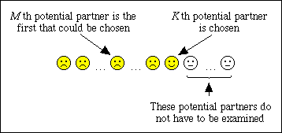

## Table of Contents

## What is Optimal Stopping Theory?

Optimal Stopping Theory is a way to make the best choice when you have to decide at the right moment. Imagine you're trying to pick the best apple from a tree, but you can only take one, and once you pick it, you can't go back. The theory helps you figure out when to stop looking and pick an apple, so you get a good one without wasting time looking at all of them.

This theory is used in many real-life situations, like hiring the best employee or buying a house. You look at some options first without choosing, to get an idea of what's out there. Then, you start deciding if the next option is better than what you've seen so far. It's all about balancing the risk of missing out on something better with the need to make a decision and move forward.

## Can you provide a simple example of an optimal stopping problem?

Imagine you're at a job fair, and you want to find the best job offer. You can only accept one offer, and once you accept, you can't go back to the other offers. You have a total of 10 job offers to look at. The challenge is to decide when to stop looking and accept an offer, so you get the best one possible.

A simple strategy is to first look at the first 3 or 4 offers without accepting any. This helps you understand what kind of offers are out there. After that, you start accepting an offer if it's better than any of the first 3 or 4 offers you saw. This way, you have a good chance of getting a great job without looking at all 10 offers, which would take too much time.

## What are the key components of an optimal stopping problem?

The first key component of an optimal stopping problem is the sequence of options. You need to have a set of choices that you can look at one by one. For example, if you're trying to find the best apple from a tree, each apple you look at is part of this sequence. The order in which you see the options can matter, and you need to decide whether to stop at any point and pick the current option or keep looking.

The second key component is the decision rule. This is the strategy you use to decide when to stop looking and choose an option. A common rule is to look at some options first without choosing any, to get an idea of what's out there. Then, you start deciding if the next option is better than what you've seen so far. The goal is to balance the risk of missing out on something better with the need to make a decision and move forward.

The third key component is the payoff or reward. This is what you gain or lose by making your choice. In our apple example, the payoff is the quality of the apple you end up picking. The optimal stopping problem aims to maximize this payoff, helping you find the best possible outcome within the constraints of the problem.

## How does the Secretary Problem relate to Optimal Stopping Theory?

The Secretary Problem is a famous example of Optimal Stopping Theory. Imagine you're trying to hire the best secretary out of 100 applicants. You can interview them one by one, and you have to decide after each interview whether to hire that person or move on to the next one. Once you pass on someone, you can't go back. The goal is to find the best secretary, but you don't know who that is until you've seen them all. This problem shows how Optimal Stopping Theory works because it's all about deciding when to stop looking and make a choice.

In the Secretary Problem, a common strategy is to look at the first few applicants without hiring any of them. This helps you get an idea of what kind of applicants are out there. After that, you start hiring the first applicant who is better than any of the ones you've seen so far. This strategy balances the risk of missing out on the best applicant with the need to make a decision and hire someone. The Secretary Problem is a simple way to understand Optimal Stopping Theory because it shows how to make the best choice when you have to decide at the right moment.

## What are some common strategies used in optimal stopping?

One common strategy in optimal stopping is the "look-then-leap" approach. This means you look at some options first without choosing any of them. This helps you understand what kind of options are out there. After you've looked at enough options, you start deciding if the next option is better than any of the ones you've seen so far. If it is, you choose it. This strategy is used in problems like the Secretary Problem, where you want to hire the best person but can only interview them one at a time.

Another strategy is the "threshold rule." In this approach, you set a certain level or threshold that an option needs to meet before you choose it. You keep looking until you find an option that meets or beats this threshold. For example, if you're buying a house, you might set a threshold for the minimum size or quality you're willing to accept. You keep looking at houses until you find one that meets your threshold, then you buy it. This strategy helps you make sure you're getting at least a certain level of quality or value.

## How do you mathematically formulate an optimal stopping problem?

To mathematically formulate an optimal stopping problem, you need to define a sequence of random variables that represent the options you're looking at. For example, if you're picking apples from a tree, each apple's quality can be a random variable. You also need to decide on a stopping rule, which is a mathematical function that tells you when to stop looking and choose an option. This rule often depends on the values of the random variables you've seen so far. The goal is to maximize the expected value of the reward you get from your choice.

In the Secretary Problem, you can use a mathematical formula to find the best strategy. You can prove that the optimal strategy is to look at the first 1/e (about 37%) of the applicants without hiring any, and then hire the first applicant who is better than any of the ones you've seen so far. This strategy maximizes the chance of hiring the best applicant. The math behind this involves calculating the probability of picking the best option given the values of the random variables you've observed.

## What is the role of the expected value in optimal stopping decisions?

The expected value is really important in optimal stopping decisions. It's like a guess of how good your choice will be on average. When you're trying to decide when to stop looking and pick something, you want to pick the option that gives you the highest expected value. This means you're trying to make the best choice you can, even though you don't know for sure what will happen.

In the Secretary Problem, for example, you use the expected value to figure out the best time to stop looking at applicants and hire someone. You want to hire the best person, but you can't see all the applicants at once. By using the expected value, you can decide to look at the first few applicants without hiring anyone, and then hire the first person who's better than any of those first few. This way, you're trying to make the best choice you can based on what you've seen so far.

## Can you explain the concept of a stopping rule in the context of Optimal Stopping Theory?

A stopping rule in Optimal Stopping Theory is like a guide that tells you when to stop looking and make a choice. Imagine you're trying to find the best apple on a tree. You can't look at all the apples at once, so you need a rule to help you decide when to stop looking and pick one. The stopping rule uses the information you've gathered so far to tell you if the current apple is good enough to pick or if you should keep looking. It's all about balancing the chance of finding a better apple with the need to make a decision and move on.

In math terms, a stopping rule is a function that looks at the values of the options you've seen and decides if you should stop or keep going. For example, in the Secretary Problem, a good stopping rule might be to look at the first few applicants without hiring anyone, and then hire the first person who's better than any of those first few. This rule helps you make the best choice you can based on what you've seen so far, without knowing everything in advance. By using a stopping rule, you can increase your chances of making a good decision even when you don't have all the information.

## What are some advanced techniques for solving optimal stopping problems?

One advanced technique for solving optimal stopping problems is using dynamic programming. This method breaks down the problem into smaller pieces and solves them step by step. Imagine you're picking apples from a tree. Instead of trying to decide which apple to pick all at once, you look at each apple one by one and decide if it's better than the ones you've seen so far. Dynamic programming helps you figure out the best way to make these decisions by looking at all the possible choices and figuring out which one gives you the highest expected value. This technique is really useful when you have a lot of options and need to make sure you're making the best choice possible.

Another advanced technique is using simulations. This means you create a computer model of the problem and run it many times to see what happens. For example, if you're trying to hire the best secretary, you could create a computer program that mimics the hiring process. You run the program over and over with different sets of applicants to see how often you pick the best one using different strategies. This helps you find the best stopping rule because you can see which one works the best on average. Simulations are great for testing different strategies without having to actually go through the process in real life, which can save a lot of time and effort.

## How does Optimal Stopping Theory apply to real-world scenarios like job hunting or investment?

Optimal Stopping Theory can help you make better choices when you're looking for a job. Imagine you're at a job fair with many companies to talk to. You can't talk to all of them at once, so you need to decide when to stop looking and accept a job offer. A good strategy might be to talk to the first few companies without accepting any offers. This helps you get an idea of what kind of jobs are out there. After that, you can start accepting the first offer that's better than any of the first few you saw. This way, you increase your chances of getting a good job without spending too much time looking at all the options.

In the world of investments, Optimal Stopping Theory can guide you in deciding when to buy or sell stocks. Let's say you're looking at different stocks to invest in. You can't see all the future prices at once, so you need a rule to help you decide when to stop looking and make a purchase. A common approach might be to watch the stock prices for a while without buying anything. This gives you a sense of how the prices are moving. Then, you can buy the first stock that looks like a better deal than any of the ones you've seen so far. This strategy helps you make a smart investment decision by balancing the risk of missing out on a better opportunity with the need to act and invest your money.

## What are the limitations and challenges of applying Optimal Stopping Theory?

One big challenge of using Optimal Stopping Theory is that it often assumes you know things you might not really know. For example, when you're trying to pick the best apple from a tree, the theory might say to look at the first few apples without picking any. But in real life, you might not know how many apples are on the tree or how good the apples will be. This makes it hard to use the theory because you don't have all the information you need to make the best choice.

Another limitation is that the theory can be too simple for real-world problems. Life is complicated, and things like emotions, other people's opinions, and unexpected events can affect your decisions. For instance, when you're looking for a job, you might really like a company because of its culture or the people you meet there. Optimal Stopping Theory doesn't always take these things into account, so it might tell you to pick a job that looks good on paper but doesn't feel right to you. So, while the theory can help, it's important to think about all the other factors that matter in real life.

## Can you discuss any recent developments or research in the field of Optimal Stopping Theory?

Recent research in Optimal Stopping Theory has been looking at how to use it in new ways, like in online platforms and machine learning. For example, some researchers are trying to figure out how to use the theory to help people find the best deals on websites like Amazon. They're creating algorithms that can look at prices over time and decide when to buy something to get the best price. This is a bit like the Secretary Problem, but instead of picking the best person, you're picking the best time to buy something. These new ideas are helping to make the theory more useful in everyday life.

Another area of recent development is in understanding how people actually make decisions, not just how they should make them. Some studies are looking at how emotions and other factors affect our choices. For example, researchers might study how people feel about different job offers and how that influences their decisions. This kind of research is helping to make Optimal Stopping Theory more realistic because it takes into account the messy parts of real life. By understanding these factors, we can create better strategies that work well in the real world, not just in theory.

## What is Understanding Optimal Stopping Theory?

Optimal Stopping Theory tackles the problem of determining the most advantageous time to undertake actions in order to either maximize gains or minimize expenditures. This theory is grounded in the principles of probability and statistical decision-making. A crucial aspect of optimal stopping involves evaluating trade-offs between immediate rewards and future potential outcomes.

At its core, Optimal Stopping Theory involves the derivation of a strategy that yields the maximum expected payoff. This is achieved through the application of various mathematical tools. The theory consists of a few key components, including the stopping rule and the optimal stopping time.

**Stopping Rule:** This criterion specifies the conditions under which a decision-maker should execute or defer an action to achieve a defined objective, such as maximizing profit or minimizing cost. The stopping rule serves as a guideline for whether to continue observing the current system's state or to make a decision based on current information.

**Optimal Stopping Time:** This is the specific point in time at which the expected rewards from taking an action are maximized. Identifying the optimal stopping time is essential to ensuring that actions are taken at the most beneficial moment, thus optimizing the outcome.

**Mathematical Formulation:** The problem is typically framed as an optimization task involving an objective function. This function may represent the expected reward or cost associated with different actions over time. Mathematically, the solution to the optimization problem often involves the Bellman equation, which is central to dynamic programming and encapsulates the trade-offs between current decisions and future possibilities. The Bellman equation can be represented as follows:

$$
V(x) = \max\{f(x), \mathbb{E}[V(\text{next state})]\}
$$

where $V(x)$ indicates the value function at state $x$, $f(x)$ represents the immediate payoff, and $\mathbb{E}[V(\text{next state})]$ denotes the expected value function of the next state.

In practical terms, this equation helps in calculating the value of different strategies, providing a mechanism for identifying the point at which continuing the current process no longer yields additional benefits compared to stopping.

Through this theoretical framework, Optimal Stopping Theory aids in making informed, strategic decisions, particularly in situations where timing plays a crucial role in the outcome. This discipline finds applications in numerous fields, notably in financial trading, where determining the optimal timing for transactions can significantly impact the profitability of trading strategies.

## What are the key concepts?

Optimal Stopping Theory is central to strategies involving timed decision-making, where the timing of an action is crucial to achieving a specific objective. This involves several key concepts, primarily focusing on the stopping rule, optimal stopping time, and the mathematical formulation of these problems.

The stopping rule is pivotal in determining when an action should be performed to meet particular objectives, such as maximizing profits in financial trades or minimizing costs in various operations. This criterion defines the conditions under which a decision-maker should cease observing and take action. For example, in financial markets, a trader might set a stopping rule to sell an asset once its value reaches a pre-determined threshold, thus ensuring profit maximization or loss minimization.

Optimal stopping time refers to the precise moment when executing an action yields the maximum expected value. Determining this moment requires an understanding of the underlying process and probabilistic forecasting. The challenge is to identify when to act in order to optimize the benefits, be it in monetary terms, resource allocation, or strategic positioning.

Mathematically, an optimal stopping problem is typically framed in terms of optimizing an objective function over time. This involves state processes and can be effectively addressed using the Bellman equation, a fundamental component in dynamic programming. The general formulation of an optimal stopping problem can be expressed as finding a stopping time $\tau$ that maximizes the expected value of a stochastic process. Mathematically, it can be represented as:

$$
V(x) = \sup_{\tau} \mathbb{E}_x \left[ g(X_{\tau}) \right]
$$

where $X_t$ is a stochastic process, $g$ is the gain function, $\tau$ is a stopping time, and $V(x)$ is the value function representing the maximum expected gain starting from state $x$.

In solving these problems, the Bellman equation becomes a tool for backward induction, allowing decision-makers to evaluate the potential rewards of different actions from any given point. The solution often involves iteratively computing value functions from the end of the decision timeframe back to the present, ensuring that all available information is utilized to make an optimal choice at each possible decision point. This computational approach is frequently implemented within algorithmic frameworks using programming languages such as Python, which provides powerful libraries for numerical optimization and stochastic simulation.

## References & Further Reading

[1]: Chow, Y. S., Robbins, H., & Siegmund, D. (1971). ["Great Expectations: The Theory of Optimal Stopping"](https://archive.org/details/greatexpectation0000chow). Houghton Mifflin.

[2]: Peskir, G., & Shiryaev, A. (2006). ["Optimal Stopping and Free-Boundary Problems"](https://link.springer.com/book/10.1007/978-3-7643-7390-0). Birkhäuser.

[3]: Shiryaev, A. N. (2007). ["Optimal Stopping Rules"](https://link.springer.com/book/10.1007/978-3-540-74011-7). Springer.

[4]: Karatzas, I. (2020). ["Elements of Mathematical Theory of Optimal Stopping"](https://scholar.google.com/citations?user=mG07_6kAAAAJ&hl=en). CRC Press.

[5]: Glasserman, P. (2004). ["Monte Carlo Methods in Financial Engineering"](https://link.springer.com/book/10.1007/978-0-387-21617-1). Springer.